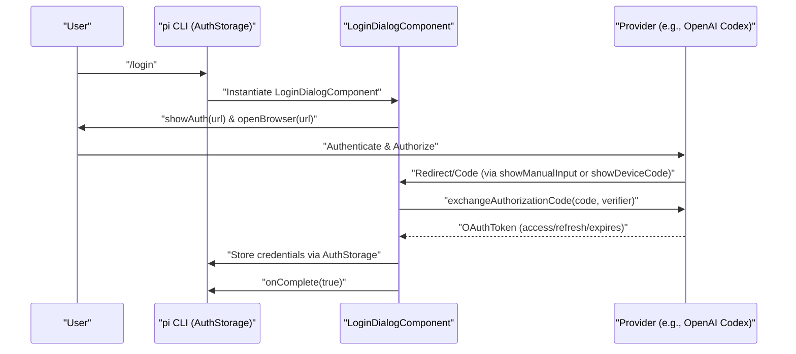
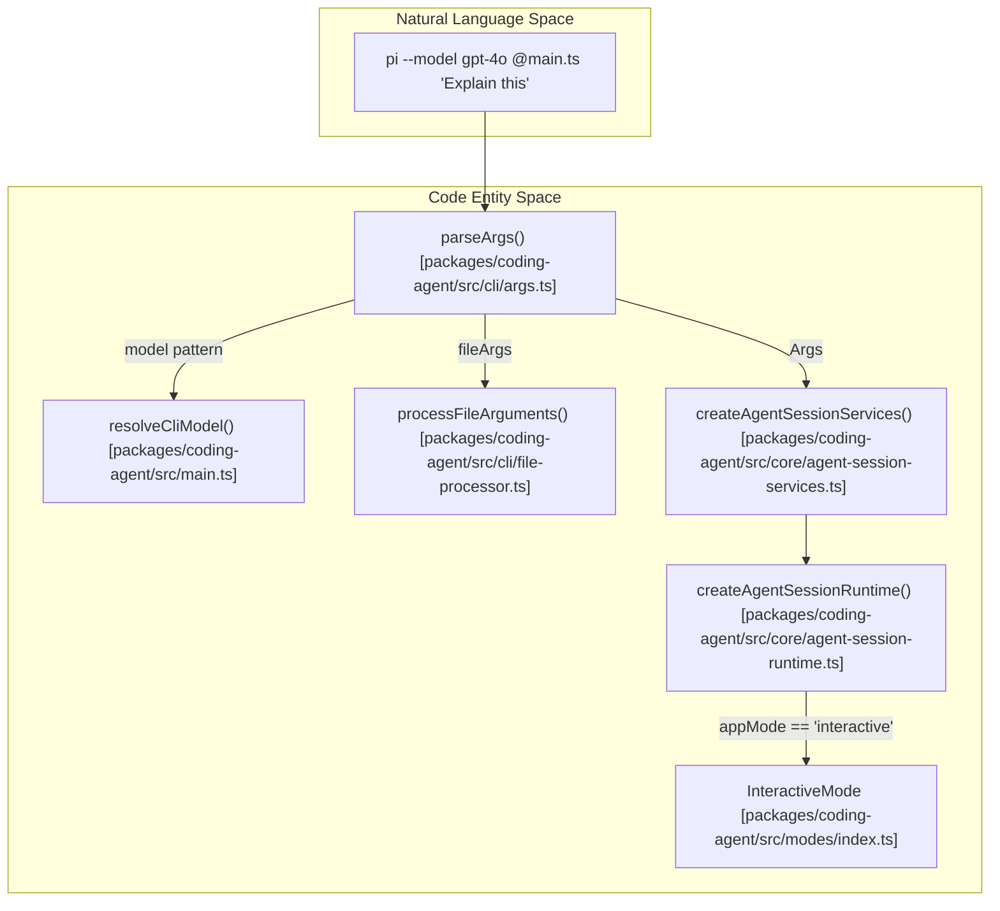

# Getting Started

<details>
<summary>Relevant source files</summary>

The following files were used as context for generating this wiki page:

- [AGENTS.md](AGENTS.md)
- [README.md](README.md)
- [package.json](package.json)
- [packages/ai/src/cli.ts](packages/ai/src/cli.ts)
- [packages/ai/src/utils/oauth/anthropic.ts](packages/ai/src/utils/oauth/anthropic.ts)
- [packages/ai/src/utils/oauth/device-code.ts](packages/ai/src/utils/oauth/device-code.ts)
- [packages/ai/src/utils/oauth/github-copilot.ts](packages/ai/src/utils/oauth/github-copilot.ts)
- [packages/ai/src/utils/oauth/index.ts](packages/ai/src/utils/oauth/index.ts)
- [packages/ai/src/utils/oauth/openai-codex.ts](packages/ai/src/utils/oauth/openai-codex.ts)
- [packages/ai/src/utils/oauth/types.ts](packages/ai/src/utils/oauth/types.ts)
- [packages/ai/test/github-copilot-oauth.test.ts](packages/ai/test/github-copilot-oauth.test.ts)
- [packages/ai/test/oauth-device-code.test.ts](packages/ai/test/oauth-device-code.test.ts)
- [packages/ai/test/openai-codex-oauth.test.ts](packages/ai/test/openai-codex-oauth.test.ts)
- [packages/coding-agent/README.md](packages/coding-agent/README.md)
- [packages/coding-agent/docs/containerization.md](packages/coding-agent/docs/containerization.md)
- [packages/coding-agent/docs/docs.json](packages/coding-agent/docs/docs.json)
- [packages/coding-agent/docs/index.md](packages/coding-agent/docs/index.md)
- [packages/coding-agent/docs/quickstart.md](packages/coding-agent/docs/quickstart.md)
- [packages/coding-agent/docs/security.md](packages/coding-agent/docs/security.md)
- [packages/coding-agent/docs/session-format.md](packages/coding-agent/docs/session-format.md)
- [packages/coding-agent/docs/sessions.md](packages/coding-agent/docs/sessions.md)
- [packages/coding-agent/docs/termux.md](packages/coding-agent/docs/termux.md)
- [packages/coding-agent/docs/usage.md](packages/coding-agent/docs/usage.md)
- [packages/coding-agent/examples/extensions/gondolin/.gitignore](packages/coding-agent/examples/extensions/gondolin/.gitignore)
- [packages/coding-agent/src/cli/args.ts](packages/coding-agent/src/cli/args.ts)
- [packages/coding-agent/src/cli/project-trust.ts](packages/coding-agent/src/cli/project-trust.ts)
- [packages/coding-agent/src/core/project-trust.ts](packages/coding-agent/src/core/project-trust.ts)
- [packages/coding-agent/src/main.ts](packages/coding-agent/src/main.ts)
- [packages/coding-agent/src/modes/interactive/components/login-dialog.ts](packages/coding-agent/src/modes/interactive/components/login-dialog.ts)
- [packages/coding-agent/src/utils/tools-manager.ts](packages/coding-agent/src/utils/tools-manager.ts)
- [packages/coding-agent/test/args.test.ts](packages/coding-agent/test/args.test.ts)
- [packages/coding-agent/test/startup-session-name.test.ts](packages/coding-agent/test/startup-session-name.test.ts)

</details>


This page covers the installation, authentication, and first-run configuration of the `pi` coding agent. It details the transition from initial setup to running the interactive terminal environment, including the implementation of credential management and session initialization.

## Installation

The `pi` coding agent is distributed as an npm package and can be installed globally or via a standalone script.

```bash
# Standalone installation script
curl -fsSL https://pi.dev/install.sh | sh

# Global installation via npm
npm install -g --ignore-scripts @earendil-works/pi-coding-agent
```
The `--ignore-scripts` flag is used to disable dependency lifecycle scripts during installation, as `pi` does not require them for normal npm installs [packages/coding-agent/README.md:71-74]().

### Platform-Specific Tools
During the first run or when needed, `pi` may attempt to download optimized native binaries for `ripgrep` (`rg`) and `fd`. The `getToolPath` function in `tools-manager.ts` checks the local `~/.pi/bin` directory (retrieved via `getBinDir()`) before falling back to checking the system PATH using `commandExists` [packages/coding-agent/src/utils/tools-manager.ts:85-104]().

Sources: [packages/coding-agent/README.md:68-80](), [packages/coding-agent/src/utils/tools-manager.ts:29-71](), [packages/coding-agent/src/utils/tools-manager.ts:8-10]()

## Authentication

Pi supports two primary methods of authentication: **API Keys** and **OAuth Subscriptions**.

### 1. API Keys (Environment Variables)
For direct API access, pi looks for standard environment variables. This is the quickest way to start if you already have provider keys.

```bash
export ANTHROPIC_API_KEY=sk-ant-...
export OPENAI_API_KEY=sk-...
pi
```
Key resolution is handled by the `pi-ai` package, which maps provider IDs to specific environment variables like `GEMINI_API_KEY` or `DEEPSEEK_API_KEY` [packages/coding-agent/README.md:111-126]().

Sources: [packages/coding-agent/README.md:81-87](), [packages/coding-agent/src/main.ts:9-10]()

### 2. Interactive Login (/login)
Users with subscriptions (Claude Pro/Max, ChatGPT Plus, GitHub Copilot) or those who prefer to store keys on disk can authenticate via the `/login` slash command within the TUI [packages/coding-agent/README.md:106-109]().

```bash
pi
/login  # Then select provider
```

Sources: [packages/coding-agent/README.md:89-94](), [packages/coding-agent/docs/usage.md:38-38]()

### Credential Storage and Resolution
Credentials can be managed via the `AuthStorage` class [packages/coding-agent/src/main.ts:26-26](). 

**Resolution Order:**
1.  **CLI Flags**: Explicit overrides like `--api-key` parsed in `Args` [packages/coding-agent/src/cli/args.ts:91-92]().
2.  **Auth File**: Stored credentials in the agent configuration directory [packages/coding-agent/src/main.ts:18-18]().
3.  **Environment Variables**: Standard keys checked at runtime [packages/coding-agent/README.md:81-85]().

### OAuth Flow Architecture
Pi implements local callback servers or device code flows to handle OAuth for CLI environments via `LoginDialogComponent` [packages/coding-agent/src/modes/interactive/components/login-dialog.ts:11-11]().

| Provider | Implementation Module | Default Method |
| :--- | :--- | :--- |
| **OpenAI Codex** | `openai-codex.ts` | Browser Callback (`localhost:1455`) |
| **GitHub Copilot**| `github-copilot.ts` | Device Code Flow |

**Data Flow: OAuth Authentication**

Sources: [packages/coding-agent/src/modes/interactive/components/login-dialog.ts:11-43](), [packages/ai/src/utils/oauth/openai-codex.ts:31-40](), [packages/ai/src/utils/oauth/openai-codex.ts:154-174](), [packages/coding-agent/src/main.ts:26-26]()

## First-Run and CLI Usage

The `main.ts` entry point handles CLI argument parsing and translates them into session options [packages/coding-agent/src/main.ts:1-6]().

### CLI Argument Structure
The `parseArgs` function processes flags into an `Args` object [packages/coding-agent/src/cli/args.ts:63-69]().
*   **App Mode**: Resolved in `resolveAppMode`. Can be `interactive` (default), `print` (`-p`), `json`, or `rpc` [packages/coding-agent/src/main.ts:98-109]().
*   **Model Selection**: Supports fuzzy matching and thinking levels via `--thinking` [packages/coding-agent/src/cli/args.ts:130-139]().
*   **Context**: `@filename` syntax in `fileArgs` attaches files to the initial prompt [packages/coding-agent/src/cli/args.ts:186-187]().

### Initializing the Session
The startup sequence bridges CLI arguments to the `AgentSessionRuntime`.

**Code Entity Mapping: CLI to Runtime**

Sources: [packages/coding-agent/src/main.ts:31-33](), [packages/coding-agent/src/cli/args.ts:63-69](), [packages/coding-agent/src/main.ts:119-138](), [packages/coding-agent/src/core/agent-session-runtime.ts:19-19]()

### Interactive Environment
Once started, the TUI provides a structured terminal interface:
1.  **Startup Header**: Shows shortcuts, loaded `AGENTS.md` files, and extensions [packages/coding-agent/README.md:155-155]().
2.  **Messages**: Conversation history, including `read`, `write`, `edit`, and `bash` tool executions [packages/coding-agent/README.md:156-156]().
3.  **Editor**: Multi-line input with support for `@` fuzzy-search and `!` bash execution [packages/coding-agent/README.md:162-171]().
4.  **Footer**: Displays working directory, session name, token usage, and active model [packages/coding-agent/README.md:158-158]().

### Project Trust
Pi implements a project trust system to prevent execution of malicious project-local extensions or settings [packages/coding-agent/docs/usage.md:113-117]().
*   **Interactive**: Prompts the user to trust the folder [packages/coding-agent/src/cli/project-trust.ts:15-15]().
*   **Non-interactive**: Controlled by `defaultProjectTrust` in settings or `--approve`/`-a` CLI flags [packages/coding-agent/src/cli/args.ts:180-181]().

Sources: [packages/coding-agent/README.md:149-180](), [packages/coding-agent/docs/usage.md:32-56](), [packages/coding-agent/docs/usage.md:113-126]()
