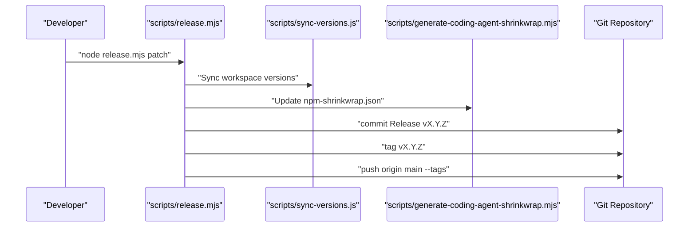

# CI/CD and Binary Distribution

<details>
<summary>Relevant source files</summary>

The following files were used as context for generating this wiki page:

- [.github/workflows/build-binaries.yml](.github/workflows/build-binaries.yml)
- [.github/workflows/ci.yml](.github/workflows/ci.yml)
- [.github/workflows/npm-audit.yml](.github/workflows/npm-audit.yml)
- [.husky/pre-commit](.husky/pre-commit)
- [.npmrc](.npmrc)
- [LICENSE](LICENSE)
- [packages/coding-agent/src/utils/changelog.ts](packages/coding-agent/src/utils/changelog.ts)
- [packages/coding-agent/test/changelog.test.ts](packages/coding-agent/test/changelog.test.ts)
- [packages/tui/native/win32/prebuilds/win32-arm64/win32-console-mode.node](packages/tui/native/win32/prebuilds/win32-arm64/win32-console-mode.node)
- [packages/tui/native/win32/prebuilds/win32-x64/win32-console-mode.node](packages/tui/native/win32/prebuilds/win32-x64/win32-console-mode.node)
- [packages/tui/native/win32/src/win32-console-mode.c](packages/tui/native/win32/src/win32-console-mode.c)
- [scripts/build-binaries.sh](scripts/build-binaries.sh)
- [scripts/check-pinned-deps.mjs](scripts/check-pinned-deps.mjs)
- [scripts/check-ts-relative-imports.mjs](scripts/check-ts-relative-imports.mjs)
- [scripts/generate-coding-agent-shrinkwrap.mjs](scripts/generate-coding-agent-shrinkwrap.mjs)
- [scripts/local-release.mjs](scripts/local-release.mjs)
- [scripts/publish.mjs](scripts/publish.mjs)
- [scripts/release-notes.mjs](scripts/release-notes.mjs)
- [scripts/release.mjs](scripts/release.mjs)

</details>


This page documents the automated infrastructure and scripts used for continuous integration, continuous delivery, and distribution of the `pi` CLI binaries. It details the GitHub Actions workflows (`ci.yml`, `build-binaries.yml`), the cross-platform build process using `bun compile`, the structure of platform-specific release archives, key utility scripts in the `scripts/` directory, and the lockstep versioning policy.

---

## Overview of CI/CD Workflows

The project utilizes two main GitHub Actions workflows to maintain quality and handle production releases.

### Continuous Integration (`ci.yml`)

- **Triggers:** On every push or pull request against the `main` branch [[.github/workflows/ci.yml:3-7]]().
- **Concurrency:** Automatically cancels in-progress runs for the same ref to save resources [[.github/workflows/ci.yml:9-11]]().
- **Steps:**
  1. **Checkout Code:** Uses `actions/checkout@v4` [[.github/workflows/ci.yml:17-18]]().
  2. **Setup Node.js:** Installs Node.js v22 with caching enabled for npm dependencies [[.github/workflows/ci.yml:20-24]]().
  3. **Install System Dependencies:** Installs Linux packages required for image processing and terminal UI support (`libcairo2-dev`, `libpango1.0-dev`, `libjpeg-dev`, `libgif-dev`, `librsvg2-dev`, `fd-find`, `ripgrep`) [[.github/workflows/ci.yml:26-30]]().
  4. **Install NPM Dependencies:** Runs `npm ci --ignore-scripts` to ensure a clean, reproducible environment [[.github/workflows/ci.yml:33]]().
  5. **Build & Check:** Executes `npm run build`, `npm run check` (linting/types), and `npm test` [[.github/workflows/ci.yml:35-42]]().

### Binary Distribution (`build-binaries.yml`)

- **Triggers:** On push of a version tag matching `v*` or via manual `workflow_dispatch` [[.github/workflows/build-binaries.yml:3-16]]().
- **Build Job:** 
  - Uses Bun v1.3.10 to execute the cross-platform compilation [[.github/workflows/build-binaries.yml:35-38]]().
  - Invokes `./scripts/build-binaries.sh` to generate executables [[.github/workflows/build-binaries.yml:46-47]]().
  - Extracts version-specific release notes from `packages/coding-agent/CHANGELOG.md` using `scripts/release-notes.mjs` [[.github/workflows/build-binaries.yml:49-55]]().
  - Creates a GitHub Release and uploads `.tar.gz` (macOS/Linux) and `.zip` (Windows) archives [[.github/workflows/build-binaries.yml:56-84]]().
- **Publish NPM Job:** 
  - Runs after a successful build [[.github/workflows/build-binaries.yml:86-88]]().
  - Verifies that all release artifacts (like generated models) are committed by checking `git diff --exit-code` [[.github/workflows/build-binaries.yml:128-129]]().
  - Executes `node scripts/publish.mjs` for trusted publishing to the npm registry [[.github/workflows/build-binaries.yml:136-137]]().

**Release Workflow Data Flow**

```mermaid
graph TD
    ["Push v* Tag"] --> ["actions/checkout"]
    ["actions/checkout"] --> ["Setup Node.js & Bun"]
    ["Setup Node.js & Bun"] --> ["Run build-binaries.sh"]
    ["Run build-binaries.sh"] --> ["bun build --compile"]
    ["bun build --compile"] --> ["Create .tar.gz / .zip archives"]
    ["Create .tar.gz / .zip archives"] --> ["release-notes.mjs extract"]
    ["release-notes.mjs extract"] --> ["GitHub Release create/upload"]
    ["GitHub Release create/upload"] --> ["node scripts/publish.mjs"]

    subgraph "Binary Creation"
        ["Run build-binaries.sh"]
        ["bun build --compile"]
        ["Create .tar.gz / .zip archives"]
    end
```

Sources: [[.github/workflows/ci.yml:1-43]](), [[.github/workflows/build-binaries.yml:1-138]]()

---

## Binary Build Process and Packaging

### `build-binaries.sh` Script

The `scripts/build-binaries.sh` shell script orchestrates the local and CI cross-platform building of the `pi` CLI [[scripts/build-binaries.sh:1-5]]().

#### Native Dependency Management
Because `npm ci` only installs optional dependencies for the host platform, the script manually forces the installation of all platform-specific `@mariozechner/clipboard` bindings using `--force --ignore-scripts` [[scripts/build-binaries.sh:91-105]](). This ensures all required native libraries are available for packaging into cross-platform archives.

#### Compilation with Bun
The script uses `bun build --compile` to produce self-contained executables.
- **Entrypoints:** It passes both the main CLI entry `./dist/bun/cli.js` and the `./src/utils/image-resize-worker.ts` as entrypoints. This is required for Bun to embed the worker script within the final binary [[scripts/build-binaries.sh:137-140]]().
- **Targets:** It targets `darwin-arm64`, `darwin-x64`, `linux-x64`, `linux-arm64`, `windows-x64`, and `windows-arm64` [[scripts/build-binaries.sh:128]]().

#### Archive Composition
Release archives include the compiled binary and essential runtime assets that cannot be embedded:
- **WASM:** `photon_rs_bg.wasm` for image processing [[scripts/build-binaries.sh:150]]().
- **TUI Assets:** Theme JSON files and UI assets [[scripts/build-binaries.sh:151-154]]().
- **Native Bindings:** Platform-specific `.node` helpers for terminal modifiers (macOS) and console modes (Windows) [[scripts/build-binaries.sh:183-195]]().
- **Sub-systems:** The `export-html` templates and logic [[scripts/build-binaries.sh:155]]().

**Binary and Runtime Entity Map**

```mermaid
graph LR
    subgraph "Source Space"
        ["dist/bun/cli.js"]
        ["src/utils/image-resize-worker.ts"]
        ["native/win32/src/win32-console-mode.c"]
    end

    subgraph "Build Entity Space"
        ["pi executable (Bun Compiled)"]
        ["@mariozechner/clipboard-win32-x64-msvc"]
        ["win32-console-mode.node"]
        ["photon_rs_bg.wasm"]
    end

    ["dist/bun/cli.js"] & ["src/utils/image-resize-worker.ts"] --> ["pi executable (Bun Compiled)"]
    ["native/win32/src/win32-console-mode.c"] --> ["win32-console-mode.node"]
    ["pi executable (Bun Compiled)"] -.->|loads at runtime| ["photon_rs_bg.wasm"]
    ["pi executable (Bun Compiled)"] -.->|requires| ["@mariozechner/clipboard-win32-x64-msvc"]
    ["pi executable (Bun Compiled)"] -.->|requires| ["win32-console-mode.node"]
```

Sources: [[scripts/build-binaries.sh:1-195]]()

---

## Lockstep Versioning and Release Management

The monorepo enforces a lockstep versioning policy: all publishable packages must share the exact same version number.

### `release.mjs`

The `scripts/release.mjs` script automates the production release cycle [[scripts/release.mjs:1-19]]():
1. **Cleanliness Check:** Aborts if uncommitted changes exist via `git status --porcelain` [[scripts/release.mjs:148-155]]().
2. **Version Bump:** Updates versions across all workspaces using `npm version` and runs `scripts/sync-versions.js` [[scripts/release.mjs:80-97]]().
3. **Changelog Promotion:** Replaces `## [Unreleased]` with the new version and current date in all `CHANGELOG.md` files [[scripts/release.mjs:107-126]]().
4. **Artifact Regeneration:** Runs `generate-models`, `generate-image-models`, and `shrinkwrap:coding-agent` [[scripts/release.mjs:168-172]]().
5. **Tagging:** Commits changes and creates a git tag (e.g., `v0.78.0`) [[scripts/release.mjs:180-184]]().
6. **Next Cycle Prep:** Adds a fresh `[Unreleased]` section to changelogs for future work via `addUnreleasedSection()` [[scripts/release.mjs:128-143]]().

### `npm-shrinkwrap.json` Generation

The `scripts/generate-coding-agent-shrinkwrap.mjs` utility generates a production-ready lockfile for the `pi-coding-agent` package. It:
- Filters out development dependencies [[scripts/generate-coding-agent-shrinkwrap.mjs:79-82]]().
- Resolves internal workspace dependencies (like `@earendil-works/pi-ai`) to their registry tarball URLs [[scripts/generate-coding-agent-shrinkwrap.mjs:195-202]]().
- Validates that no local file/link paths remain in the `resolved` fields [[scripts/generate-coding-agent-shrinkwrap.mjs:238-240]]().

### `release-notes.mjs` and `changelog.ts`

The project includes utilities for parsing and normalizing changelogs for distribution.
- **`normalizeChangelogLinks`:** Rewrites package-relative Markdown links to tag-pinned GitHub source links [[packages/coding-agent/src/utils/changelog.ts:100-105]]().
- **`extractChangelogSection`:** Used by `release-notes.mjs` to isolate notes for a specific version from `CHANGELOG.md` [[scripts/release-notes.mjs:134-147]]().

**Versioning and Release Coordination**



Sources: [[scripts/release.mjs:1-204]](), [[scripts/generate-coding-agent-shrinkwrap.mjs:1-240]](), [[packages/coding-agent/src/utils/changelog.ts:1-197]](), [[scripts/release-notes.mjs:1-147]]()

---

## Local Release Testing (`local-release.mjs`)

To verify the distribution process without pushing to npm, developers use `scripts/local-release.mjs`.

- **Isolation:** It creates a temporary directory outside the repository to simulate a clean user environment [[scripts/local-release.mjs:105-118]]().
- **Tarball Creation:** Runs `npm pack` on all packages to generate `.tgz` files via `packPackage()` [[scripts/local-release.mjs:171-183]]().
- **Binary Simulation:** Invokes `build-binaries.sh` for the current platform and sets up a `pi` shim or symlink to the local build [[scripts/local-release.mjs:134-169]]().

Sources: [[scripts/local-release.mjs:1-209]]()

---

## Pre-commit Infrastructure

The project uses Husky to enforce quality gates before code is committed.

- **`check-lockfile-commit.mjs`:** Prevents accidental commits of `package-lock.json` without corresponding `package.json` changes [[.husky/pre-commit:6]]().
- **`npm run check`:** Runs formatting, linting, and type checking [[.husky/pre-commit:13]]().
- **Browser Smoke Check:** If files in `packages/ai` or `packages/web-ui` are modified, it triggers a browser environment smoke test via `npm run check:browser-smoke` [[.husky/pre-commit:19-36]]().
- **Relative Imports:** `scripts/check-ts-relative-imports.mjs` forbids `.js` extensions in TypeScript relative imports to maintain compatibility with the build system [[scripts/check-ts-relative-imports.mjs:70-74]]().

Sources: [[.husky/pre-commit:1-46]](), [[scripts/check-ts-relative-imports.mjs:1-75]]()
