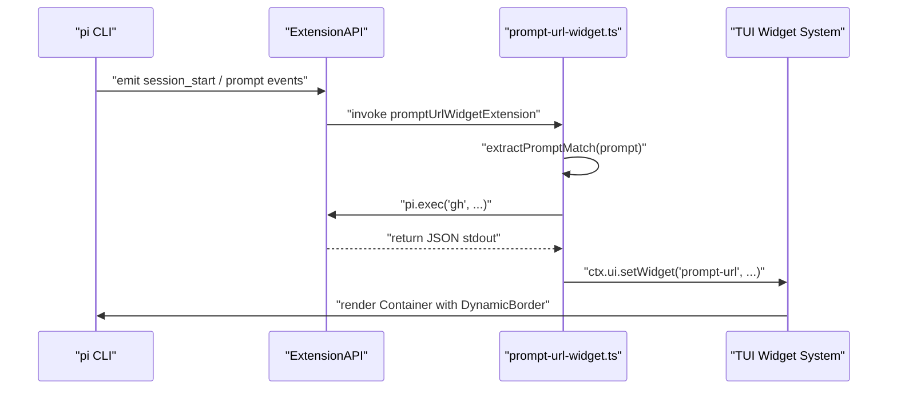

# Testing Infrastructure

<details>
<summary>Relevant source files</summary>

The following files were used as context for generating this wiki page:

- [.pi/extensions/prompt-url-widget.ts](.pi/extensions/prompt-url-widget.ts)
- [packages/ai/test/abort.test.ts](packages/ai/test/abort.test.ts)
- [packages/ai/test/context-overflow.test.ts](packages/ai/test/context-overflow.test.ts)
- [packages/ai/test/empty.test.ts](packages/ai/test/empty.test.ts)
- [packages/ai/test/image-tool-result.test.ts](packages/ai/test/image-tool-result.test.ts)
- [packages/ai/test/stream.test.ts](packages/ai/test/stream.test.ts)
- [packages/ai/test/tokens.test.ts](packages/ai/test/tokens.test.ts)
- [packages/ai/test/tool-call-without-result.test.ts](packages/ai/test/tool-call-without-result.test.ts)
- [packages/ai/test/total-tokens.test.ts](packages/ai/test/total-tokens.test.ts)
- [packages/ai/test/unicode-surrogate.test.ts](packages/ai/test/unicode-surrogate.test.ts)
- [packages/coding-agent/docs/development.md](packages/coding-agent/docs/development.md)
- [packages/coding-agent/docs/images/doom-extension.png](packages/coding-agent/docs/images/doom-extension.png)
- [packages/coding-agent/docs/images/tree-view.png](packages/coding-agent/docs/images/tree-view.png)
- [packages/coding-agent/docs/json.md](packages/coding-agent/docs/json.md)
- [packages/coding-agent/test/agent-session-auto-compaction-queue.test.ts](packages/coding-agent/test/agent-session-auto-compaction-queue.test.ts)
- [packages/coding-agent/test/suite/agent-session-bash-persistence.test.ts](packages/coding-agent/test/suite/agent-session-bash-persistence.test.ts)
- [packages/coding-agent/test/suite/agent-session-compaction.test.ts](packages/coding-agent/test/suite/agent-session-compaction.test.ts)
- [packages/coding-agent/test/suite/agent-session-model-extension.test.ts](packages/coding-agent/test/suite/agent-session-model-extension.test.ts)
- [packages/coding-agent/test/suite/agent-session-prompt.test.ts](packages/coding-agent/test/suite/agent-session-prompt.test.ts)
- [packages/coding-agent/test/suite/agent-session-retry-events.test.ts](packages/coding-agent/test/suite/agent-session-retry-events.test.ts)
- [packages/coding-agent/test/suite/regressions/1717-2113-agent-session-event-settlement.test.ts](packages/coding-agent/test/suite/regressions/1717-2113-agent-session-event-settlement.test.ts)
- [packages/coding-agent/test/suite/regressions/2023-queued-slash-command-followup.test.ts](packages/coding-agent/test/suite/regressions/2023-queued-slash-command-followup.test.ts)
- [pi-test.sh](pi-test.sh)
- [test.sh](test.sh)

</details>


The `pi` monorepo employs a comprehensive testing infrastructure designed to ensure robustness across its modular packages. This infrastructure spans from granular unit tests to full end-to-end (E2E) integration tests that interact with live Large Language Model (LLM) providers. The testing framework supports a layered approach verifying AI abstraction, agent orchestration, session lifecycle, and terminal UI behaviors.

## Test Suite Organization

### Test Runner and Core Scripts

- **Vitest** is used as the primary test runner due to its rapid execution and seamless TypeScript/ESM support [packages/ai/test/stream.test.ts:6]().
- **`test.sh`**: Root-level script that runs the entire test suite across packages. It handles environment safety by backing up the local `auth.json` and unsetting sensitive API keys to ensure tests run in a controlled environment [test.sh:1-77]().
- **`pi-test.sh`**: A wrapper around the `coding-agent` CLI, enabling developers to invoke agent runs mimicking tests with options like `--no-env` to clear API keys, forcing offline/local behaviors [pi-test.sh:7-57]().

### Test Types and Locations

| Category           | Location                             | Focus                                                                                      |
|--------------------|------------------------------------|--------------------------------------------------------------------------------------------|
| **Unit Tests**      | `packages/*/src/**/*.test.ts`      | Testing individual functions, classes, and utilities.                                     |
| **Integration Tests** | `packages/coding-agent/test/suite/` | Tests focused on `AgentSession` lifecycle, command queueing, persistence, and compaction. |
| **Provider E2E**   | `packages/ai/test/`                 | Live interaction tests against various LLM providers via the unified AI abstraction API.   |

### Agent Session Test Utilities

- Located under `packages/coding-agent/test/suite/`.
- Cover `AgentSession` behavior such as queuing, bash persistence, compaction, and regression tests for event settlement.
- **Auto-Compaction Queue**: Specifically tests that the `AgentSession` correctly resumes and retries after context overflows or threshold triggers, and that it doesn't enter infinite compaction loops [packages/coding-agent/test/agent-session-auto-compaction-queue.test.ts:56-178]().

**Diagram: Test Suite Organization and Flow**

```mermaid
graph TD
  "VitestRunner"["Vitest Runner"]
  "RootScripts"["test.sh, pi-test.sh"]

  "VitestRunner" --> "UnitTests"["Unit Tests\n(packages/*/src/**/*.test.ts)"]
  "VitestRunner" --> "IntegrationTests"["Integration Tests\n(packages/coding-agent/test/suite/)"]
  "VitestRunner" --> "ProviderE2ETests"["Provider E2E Tests\n(packages/ai/test/)"]

  "RootScripts" --> "VitestRunner"

  "IntegrationTests" --> "AgentSessionUtils"["AgentSession Test Utilities"]
  "IntegrationTests" --> "AutoCompaction"["AgentSession auto-compaction queue"]
```

Sources: [pi-test.sh:1-58](), [test.sh:1-77](), [packages/coding-agent/test/agent-session-auto-compaction-queue.test.ts:56-178](), [packages/ai/test/stream.test.ts:6]()

---

## LLM Provider E2E Tests

The `@mariozechner/pi-ai` package contains an extensive suite to validate the AI abstraction layer across multiple real-world LLM providers. These tests exercise the unified streaming API, tool call handling, prompt transformations, and cross-provider interoperability.

### Key E2E Test Files and Functions

- **`stream.test.ts`**: Core comprehensive tests for the streaming API, including `basicTextGeneration` [packages/ai/test/stream.test.ts:47-74](), `handleToolCall` [packages/ai/test/stream.test.ts:76-152](), and `handleStreaming` [packages/ai/test/stream.test.ts:154-182]().
- **`image-tool-result.test.ts`**: Verifies that tool results containing images (or mixed text/images) are correctly passed to and understood by the LLM [packages/ai/test/image-tool-result.test.ts:30-109]().
- **`total-tokens.test.ts`**: Validates that the reported token usage matches the sum of input, output, cache read/write tokens across providers [packages/ai/test/total-tokens.test.ts:96-99]().

### Provider Edge Case Tests

- **Context Overflow**: Ensure that when input length exceeds the model's context window, providers respond predictably with an error stop reason and an identifiable message pattern; validated using `isContextOverflow()` helper [packages/ai/test/context-overflow.test.ts:1-12]().
- **Abort Signal Behavior**: Tests that aborting mid-stream correctly ends generation and updates token usage accordingly [packages/ai/test/abort.test.ts:15-57](). Some providers (like Anthropic/Google) send usage early, while others only in the final chunk [packages/ai/test/tokens.test.ts:52-84]().
- **Empty Messages**: Validate stability when messages contain empty arrays, empty strings, or whitespace-only, preventing crashes [packages/ai/test/empty.test.ts:21-145]().
- **Unicode and Surrogate Pair Handling**: Prevents "no low surrogate in string" errors when tool results contain emoji or characters outside the Basic Multilingual Plane [packages/ai/test/unicode-surrogate.test.ts:25-210]().
- **Tool Calls Without Results**: Simulates scenarios where a tool call was aborted or cancelled, ensuring the provider layer filters orphaned calls to prevent API errors [packages/ai/test/tool-call-without-result.test.ts:62-92]().

### Provider E2E Test Architecture

```mermaid
graph TD
    subgraph "Test_Suite_Vitest"
        "StreamTest"["stream.test.ts"]
        "ContextOverflowTest"["context-overflow.test.ts"]
        "AbortTest"["abort.test.ts"]
        "EmptyMessageTest"["empty.test.ts"]
        "UnicodeTest"["unicode-surrogate.test.ts"]
        "ToolCallWithoutResultTest"["tool-call-without-result.test.ts"]
        "TotalTokensTest"["total-tokens.test.ts"]
        "ImageToolTest"["image-tool-result.test.ts"]
    end

    subgraph "pi_ai_Code_Entities"
        "StreamAPI"["stream() / complete()"]
        "OverflowCheck"["isContextOverflow()"]
        "TokenUsage"["usage.totalTokens"]
    end

    subgraph "External_API_Space"
        "OpenAIAPI"["OpenAI API"]
        "AnthropicAPI"["Anthropic API"]
        "GoogleGeminiAPI"["Google Gemini API"]
    end

    "StreamTest" --> "StreamAPI"
    "ContextOverflowTest" --> "OverflowCheck"
    "AbortTest" --> "StreamAPI"
    "EmptyMessageTest" --> "StreamAPI"
    "UnicodeTest" --> "StreamAPI"
    "ToolCallWithoutResultTest" --> "StreamAPI"
    "TotalTokensTest" --> "TokenUsage"
    "ImageToolTest" --> "StreamAPI"
    "StreamAPI" -.-> "OpenAIAPI"
    "StreamAPI" -.-> "AnthropicAPI"
    "StreamAPI" -.-> "GoogleGeminiAPI"
```

Sources: [packages/ai/test/context-overflow.test.ts:1-12](), [packages/ai/test/abort.test.ts:15-57](), [packages/ai/test/empty.test.ts:21-145](), [packages/ai/test/unicode-surrogate.test.ts:25-210](), [packages/ai/test/tool-call-without-result.test.ts:62-92](), [packages/ai/test/total-tokens.test.ts:1-124](), [packages/ai/test/image-tool-result.test.ts:30-109]()

---

## Agent Session Integration Tests

Integration tests emphasize the coordination of agent components, session lifecycle events, and command execution sequencing.

### AgentSession Core Tests

- **Command Queuing**: Ensures promises from `prompt()` and `steer()` calls queue and serialize correctly to avoid race conditions.
- **Auto-Compaction Logic**: Tests the `_runAutoCompaction` and `_checkCompaction` internal methods to ensure sessions remain within context limits without losing critical state [packages/coding-agent/test/agent-session-auto-compaction-queue.test.ts:114-178]().
- **Resumption**: Validates that the agent correctly resumes after threshold compaction when queued messages exist [packages/coding-agent/test/agent-session-auto-compaction-queue.test.ts:100-123]().

---

## Development Extensions and Prompts in .pi/

During active development, the `.pi/` directory provides project-local extensions and prompt templates that augment testing and debugging workflows.

### Local Extension: prompt-url-widget.ts

- **Purpose**: Detects GitHub Pull Request (PR), Issue, or Advisory URLs within user prompts using regex patterns [\.pi/extensions/prompt-url-widget.ts:7-9]().
- **Implementation**: 
  - Fetches metadata (title, author) via the external `gh` CLI [\.pi/extensions/prompt-url-widget.ts:122-160]().
  - Uses the extension API `ctx.ui.setWidget()` to render a rich TUI widget showing PR details with a `DynamicBorder` and `Text` component [\.pi/extensions/prompt-url-widget.ts:173-192]().
  - Automatically updates the session name based on the fetched metadata [\.pi/extensions/prompt-url-widget.ts:194-209]().

### Data Flow of Local Extension Event Handling



Sources: [\.pi/extensions/prompt-url-widget.ts:1-215]()

---

## Token Usage and Cost Validation

The `total-tokens.test.ts` suite verifies accurate token accounting critical for prompt caching and usage reporting:

- Asserts that `usage.totalTokens` equals the sum of component counts: `input + output + cacheRead + cacheWrite` [packages/ai/test/total-tokens.test.ts:96-99]().
- Triggers cache usage with `LONG_SYSTEM_PROMPT` and confirms providers like Anthropic and OpenAI report cache activity correctly [packages/ai/test/total-tokens.test.ts:36-85]().
- **Abort Logic**: Validates that some providers report 0 tokens when aborted mid-stream (e.g., OpenAI, Bedrock), while others report partial usage (e.g., Anthropic, Google) [packages/ai/test/tokens.test.ts:52-84]().

### Example Logging from Tests

```ts
function logUsage(label: string, usage: Usage) {
	const computed = usage.input + usage.output + usage.cacheRead + usage.cacheWrite;
	console.log(`  ${label}:`);
	console.log(`    input: ${usage.input}, output: ${usage.output}, cacheRead: ${usage.cacheRead}, cacheWrite: ${usage.cacheWrite}`);
	console.log(`    totalTokens: ${usage.totalTokens}, computed: ${computed}`);
}
```

Sources: [packages/ai/test/total-tokens.test.ts:87-94](), [packages/ai/test/tokens.test.ts:21-84]()

---

# Summary

The testing infrastructure of `pi` is organized around a multi-layered strategy:

- **Unit tests** ensure internal code correctness.
- **Integration tests** validate the `AgentSession` lifecycle and auto-compaction recovery.
- **Provider E2E tests** verify real-world streaming, tool calls, image handling, and token accounting across multiple external LLM APIs.
- **Local Extensions** in `.pi/` demonstrate how to use the `ExtensionAPI` and TUI system to enhance the developer experience during development.

This robust approach enables confidence in adapting to evolving LLM provider APIs and complex agent state transitions.

Sources: [packages/ai/test/context-overflow.test.ts:1-12](), [packages/coding-agent/test/agent-session-auto-compaction-queue.test.ts:56-123](), [\.pi/extensions/prompt-url-widget.ts:173-192]()
