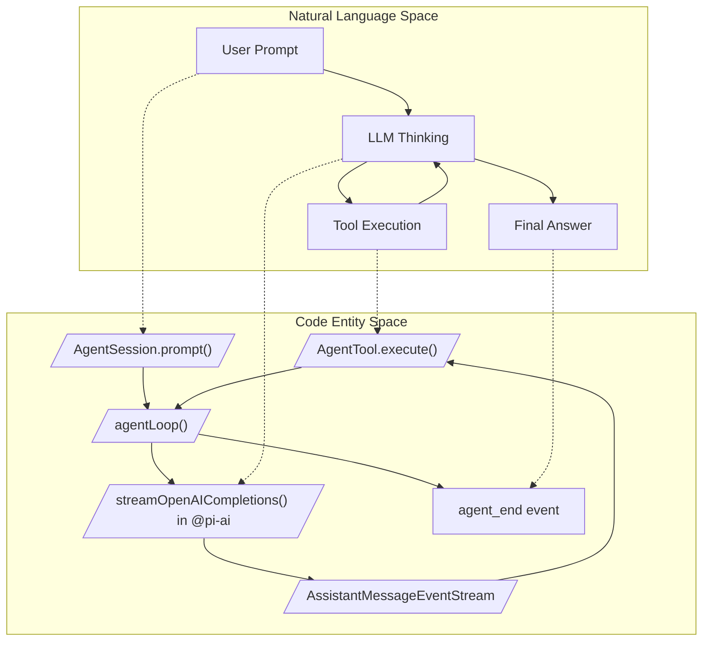
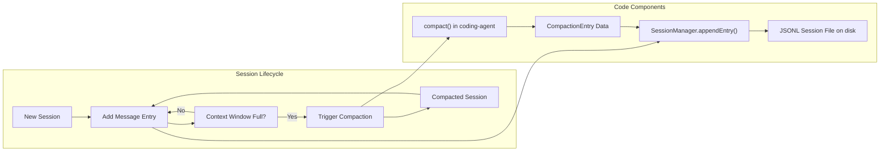

# Glossary

Relevant source files

The following files were used as context for generating this wiki page:

- [AGENTS.md](AGENTS.md)
- [README.md](README.md)
- [package.json](package.json)
- [packages/agent/CHANGELOG.md](packages/agent/CHANGELOG.md)
- [packages/ai/CHANGELOG.md](packages/ai/CHANGELOG.md)
- [packages/ai/scripts/generate-models.ts](packages/ai/scripts/generate-models.ts)
- [packages/ai/src/env-api-keys.ts](packages/ai/src/env-api-keys.ts)
- [packages/ai/src/models.generated.ts](packages/ai/src/models.generated.ts)
- [packages/coding-agent/CHANGELOG.md](packages/coding-agent/CHANGELOG.md)
- [packages/coding-agent/README.md](packages/coding-agent/README.md)
- [packages/coding-agent/docs/extensions.md](packages/coding-agent/docs/extensions.md)
- [packages/coding-agent/docs/providers.md](packages/coding-agent/docs/providers.md)
- [packages/coding-agent/examples/extensions/README.md](packages/coding-agent/examples/extensions/README.md)
- [packages/coding-agent/src/cli/args.ts](packages/coding-agent/src/cli/args.ts)
- [packages/coding-agent/src/core/extensions/index.ts](packages/coding-agent/src/core/extensions/index.ts)
- [packages/coding-agent/src/core/extensions/loader.ts](packages/coding-agent/src/core/extensions/loader.ts)
- [packages/coding-agent/src/core/extensions/runner.ts](packages/coding-agent/src/core/extensions/runner.ts)
- [packages/coding-agent/src/core/extensions/types.ts](packages/coding-agent/src/core/extensions/types.ts)
- [packages/coding-agent/src/core/model-resolver.ts](packages/coding-agent/src/core/model-resolver.ts)
- [packages/coding-agent/src/index.ts](packages/coding-agent/src/index.ts)
- [packages/coding-agent/src/main.ts](packages/coding-agent/src/main.ts)
- [packages/coding-agent/test/args.test.ts](packages/coding-agent/test/args.test.ts)
- [packages/coding-agent/test/extensions-runner.test.ts](packages/coding-agent/test/extensions-runner.test.ts)
- [packages/coding-agent/test/model-resolver.test.ts](packages/coding-agent/test/model-resolver.test.ts)
- [packages/tui/CHANGELOG.md](packages/tui/CHANGELOG.md)
- [packages/tui/src/components/editor.ts](packages/tui/src/components/editor.ts)
- [packages/tui/src/components/input.ts](packages/tui/src/components/input.ts)
- [packages/tui/src/kill-ring.ts](packages/tui/src/kill-ring.ts)
- [packages/tui/src/undo-stack.ts](packages/tui/src/undo-stack.ts)
- [packages/tui/src/word-navigation.ts](packages/tui/src/word-navigation.ts)
- [packages/tui/test/editor.test.ts](packages/tui/test/editor.test.ts)
- [packages/tui/test/input.test.ts](packages/tui/test/input.test.ts)
- [packages/tui/test/word-navigation.test.ts](packages/tui/test/word-navigation.test.ts)

This page provides definitions for codebase-specific terms, abbreviations, and domain concepts used throughout the `pi` monorepo. It serves as a technical reference for onboarding engineers to understand the relationship between natural language concepts and their implementation in code.

---

## Core Domain Concepts

### Agent Loop
The fundamental execution cycle where the LLM (Large Large Model) is polled for responses and tool calls. The loop manages the conversation turn, alternating between assistant thinking and invoking external tools to complete tasks.

- **Implementation Details**:  
  The `agentLoop` function orchestrates the lifecycle, managing `AgentState` updates as the conversation progresses. It supports both sequential and parallel tool execution modes. Upon completion of tool execution, the loop collects results and continues streaming new assistant messages.  
- **Key Classes & Functions**:  
  - `Agent`: Core class representing the LLM agent, encapsulating state and execution logic [packages/agent/src/agent.ts:1-100]().  
  - `agentLoop`: Main asynchronous loop controlling interaction with the LLM and tools [packages/agent/src/agent-loop.ts:1-100]().  
  - Events such as `agent_end`, `tool_execution_start`, and `tool_execution_end` signal various lifecycle phases [packages/agent/src/types.ts:10-50]().  
- **Graceful Exits**:  
  The loop configuration supports `shouldStopAfterTurn` to allow for graceful exits before polling queued messages [packages/agent/CHANGELOG.md:77-79]().

### AgentSession
High-level abstraction managing the entire interactive session lifecycle. It wraps the low-level `Agent` and integrates session persistence, tool sets, extended thinking (reasoning effort), branching, and extension bindings.

- **Role**:  
  `AgentSession` coordinates user prompts, agent turns, tool invocation, state persistence to JSONL session files, and compaction to limit conversation size [packages/coding-agent/src/core/agent-session.ts:1-15](). It exposes methods like `prompt()`, `steer()`, and `followUp()` [packages/coding-agent/src/core/agent-session.ts:157-187]().  
- **Key Features**:  
  - Maintains the session tree structure (messages, branches, parents) [packages/coding-agent/src/core/session-manager.ts:80-100]().  
  - Manages model and thinking level changes [packages/coding-agent/src/core/agent-session.ts:137-138]().  
  - Supports bash command execution within the session via `executeBash` [packages/coding-agent/src/core/agent-session.ts:41-41]().  
- **Code References**:  
  - Core class and session lifecycle: [packages/coding-agent/src/core/agent-session.ts:1-185]()  
  - Related types and event definitions: [packages/coding-agent/src/core/agent-session.ts:124-149]()  

### Compaction
Process to summarize or remove older parts of the conversation session to fit within the LLM's context window constraints.

- **Implementation**:  
  `AgentSession` detects when the session message history grows too large and triggers compaction [packages/coding-agent/src/core/agent-session.ts:136-146](). The system uses summarization and pruning strategies to reduce context size while preserving important information [packages/coding-agent/src/core/compaction/index.ts:42-51]().  
- **Key Components**:  
  - `compact()` performs the summarization and compaction work [packages/coding-agent/src/core/compaction/index.ts:46-46]().  
  - `SessionManager` persists compaction entries and manages the session file structure [packages/coding-agent/src/core/session-manager.ts:86-87]().  
- **Sources**: [packages/coding-agent/src/core/agent-session.ts:130-155](), [packages/coding-agent/src/core/compaction/index.ts:1-51](), [packages/coding-agent/src/core/session-manager.ts:80-100]()

### Extension System
Extension modules add custom functionality by reacting to lifecycle events, registering tools and commands, and interacting with the UI.

- **Lifecycle & API**:  
  Extensions register event handlers via the `ExtensionAPI` (`pi.on()`), tools (`pi.registerTool()`), commands (`pi.registerCommand()`), and UI components [packages/coding-agent/docs/extensions.md:10-17](). They receive contexts (`ExtensionContext`, `ExtensionCommandContext`) to interact with the session and user [packages/coding-agent/docs/extensions.md:45-46]().  
- **Loading & Discovery**:  
  Extensions are discovered from multiple locations: global (`~/.pi/agent/extensions/`), project-local (`.pi/extensions/`), or configured paths in settings [packages/coding-agent/docs/extensions.md:108-134](). They are loaded at runtime using `jiti` with hot-reload support via the `/reload` command [packages/coding-agent/docs/extensions.md:7-7]().  
- **Sources**: [packages/coding-agent/src/core/extensions/index.ts:1-100](), [packages/coding-agent/src/core/extensions/runner.ts:1-50](), [packages/coding-agent/docs/extensions.md:1-100]()

### Session Persistence and JSONL Format
Session history is stored persistently in JSON Lines (JSONL) files, allowing recovery and branching.

- **Structure**:  
  Each line is a JSON object representing an entry (message, compaction summary, etc.) with fields like `id`, `parentId`, and metadata for branching and compaction [packages/coding-agent/src/core/session-manager.ts:80-100]().  
- **SessionManager**:  
  Maintains the session file, appends new entries, loads from disk, and handles compacted sessions [packages/coding-agent/src/core/session-manager.ts:1-100]().  
- **Sources**: [packages/coding-agent/src/core/session-manager.ts:1-100](), [packages/coding-agent/src/index.ts:198-220]()

### Thinking Level
An abstraction for controlling the reasoning effort and output reasoning content of the LLM.

- **Levels**:  
  `off`, `minimal`, `low`, `medium` (default), `high`, `xhigh` [packages/ai/src/types.ts:79-80]().  
- **Adaptive Thinking**:  
  Used by models like Claude Opus 4.8 and Sonnet 4.6 to adjust reasoning effort dynamically [packages/ai/scripts/generate-models.ts:227-238]().  
- **Thinking Level Map**:  
  Models define maps (e.g., `thinkingLevelMap: {"xhigh":"max"}`) to translate semantic levels to provider-specific parameters [packages/ai/src/models.generated.ts:134-134]().  
- **Sources**: [packages/ai/src/types.ts:78-85](), [packages/ai/src/models.generated.ts:134-152](), [packages/coding-agent/src/core/agent-session.ts:138-138]()

---

## Technical Abbreviations & Terms

| Term                    | Definition                                                                                 | Primary Code Location                                  |
|-------------------------|--------------------------------------------------------------------------------------------|-------------------------------------------------------|
| **Agent**               | Core LLM interface managing conversation state and tool integration                        | [packages/agent/src/agent.ts:1-100]()                 |
| **AgentSession**        | High-level session lifecycle manager wrapping `Agent` + persistence + extensions          | [packages/coding-agent/src/core/agent-session.ts:1-185]() |
| **TUI**                 | Terminal User Interface; renders interactive UI components with differential updates       | [packages/tui/src/tui.ts:1-100]()                      |
| **JSONL**               | JSON Lines format for storing session events sequentially in session files                | [packages/coding-agent/src/core/session-manager.ts:1-100]() |
| **Slash Command**       | Commands in interactive UI starting with `/` prefix, e.g. `/model`, `/compact`             | [packages/coding-agent/src/core/slash-commands.ts:1-82]() |
| **Thinking Level**      | Model reasoning effort abstraction; affects LLM output richness and latency               | [packages/ai/src/types.ts:78-85](), [packages/coding-agent/src/core/agent-session.ts:20-50]() |
| **Skill Block**         | XML-like block `<skill name="" location="">` in user messages indicating on-demand skills | [packages/coding-agent/src/core/agent-session.ts:97-121]() |
| **Project Trust**       | Security mechanism gating project-local settings, resources, and packages                  | [packages/coding-agent/src/main.ts:15-50]()            |
| **ExtensionAPI**        | API surface exposed to extensions for event subscription, tool and command registration    | [packages/coding-agent/src/core/extensions/index.ts:1-100]() |
| **CompactionEntry**     | Data structure representing a compaction summary in session history                       | [packages/coding-agent/src/core/session-manager.ts:86-87]() |
| **BashExecutor**        | Component that executes shell commands asynchronously, used by the `bash` tool            | [packages/coding-agent/src/core/bash-executor.ts:41-41]() |

---

## Architecture Diagrams

### From Concept to Code: The Agent Loop
Bridges the conceptual "Thinking/Acting" cycle to corresponding code entities within the pi agent system.

*Sources*: [packages/agent/src/agent.ts:10-200](), [packages/coding-agent/src/core/agent-session.ts:157-185]()

---

### Session Persistence and Compaction Flow
Illustrates how conversational session data flows from user input to session file persistence and compaction.

*Sources*: [packages/coding-agent/src/core/session-manager.ts:20-100](), [packages/coding-agent/src/core/compaction/index.ts:10-60](), [packages/coding-agent/src/core/agent-session.ts:120-165]()

---

## System Symbols Glossary

### `AgentSession`
The central session manager integrating agent interaction, persistence, tools, and extensions. It maintains the session tree, thinking level, and tool invocation state.

- **Key Methods**:  
  - `prompt(input)`: Sends user input to the agent [packages/coding-agent/src/core/agent-session.ts:157-187]().  
  - `steer(text)`: Issues steering prompts to influence agent behavior mid-stream [packages/coding-agent/src/core/agent-session.ts:10-10]().  
  - `executeBash(command)`: Runs shell commands asynchronously [packages/coding-agent/src/core/agent-session.ts:41-41]().  
  - `compact(reason)`: Manually trigger compaction [packages/coding-agent/src/core/agent-session.ts:46-46]().  

- **Code Reference**: [packages/coding-agent/src/core/agent-session.ts:1-185]()  

---

### `ModelRegistry`
Resolves model identifiers to specific provider models with metadata, including authentication handling and capabilities.

- **Role**:  
  Provides model lookups, default models per provider, and API key resolution. It supports exact and fuzzy matching of IDs via `resolveCliModel` [packages/coding-agent/src/main.ts:31-31]().  
- **Code Reference**:  
  - Registry implementation: [packages/coding-agent/src/core/model-registry.ts:1-50]()  
  - Model metadata generated: [packages/ai/src/models.generated.ts:1-50]()

---

### `ResourceLoader`
Discovers and loads external resources such as skills (`SKILL.md`), prompt templates, and context files.

- **Responsibilities**:  
  - Scans configured directories and package paths [packages/coding-agent/src/core/resource-loader.ts:1-80]().  
  - Loads markdown files for skills and prompts [packages/coding-agent/src/core/sdk.ts:152-157]().  
- **Code Reference**: [packages/coding-agent/src/core/resource-loader.ts:1-80]()  

---

### `TUI` Class
Terminal User Interface class responsible for the interactive visual experience.

- **Features**:  
  - Differential rendering to update only changed terminal regions [packages/tui/src/tui.ts:1-100]().  
  - Composable component model with support for keyboard input and focus management.  
  - Inline image rendering via Kitty and iTerm2 protocols [packages/tui/CHANGELOG.md:99-101]().  
- **Code Reference**: [packages/tui/src/tui.ts:1-100]()  

---

### `Editor` & `Input` Components
Interactive terminal UI components for text entry.

- **Editor**: Multi-line text editor supporting undo/redo, kill-ring, and word navigation [packages/tui/src/components/editor.ts:1-100](). It uses `Intl.Segmenter` for grapheme-aware editing and handles atomic "paste markers" [packages/tui/src/components/editor.ts:39-50]().  
- **Input**: Single-line text input supporting keybindings and autocomplete [packages/tui/src/components/input.ts:1-100]().  
- **Code Reference**: [packages/tui/src/components/editor.ts:1-100]()  

---

### `ExtensionAPI`
The runtime interface exposed to extension authors for interacting with the core system.

- **Capabilities**:  
  - Register tools (`registerTool`) and commands (`registerCommand`) [packages/coding-agent/docs/extensions.md:10-14]().  
  - Subscribe to lifecycle events via `pi.on()` [packages/coding-agent/docs/extensions.md:65-65]().  
  - Interact with UI through `ctx.ui` prompts and notifications [packages/coding-agent/docs/extensions.md:66-71]().  
- **Code Reference**: [packages/coding-agent/src/core/extensions/index.ts:1-100]()  

---

### `BashExecutor`
Executes bash or shell commands for the `bash` tool, handling asynchronous process execution and output capture.

- **Capabilities**:  
  - Executes shell commands with timeout and cancellation support [packages/coding-agent/src/core/bash-executor.ts:41-41]().  
  - Captures stdout, stderr, and exit codes.  
- **Code Reference**: [packages/coding-agent/src/core/bash-executor.ts:1-60]()  

---

**Sources**:  
- [packages/agent/src/agent.ts:1-200]()  
- [packages/agent/src/agent-loop.ts:1-120]()  
- [packages/coding-agent/src/core/agent-session.ts:1-185]()  
- [packages/coding-agent/src/core/compaction/index.ts:1-51]()  
- [packages/coding-agent/src/core/session-manager.ts:1-110]()  
- [packages/coding-agent/src/core/extensions/index.ts:1-100]()  
- [packages/coding-agent/docs/extensions.md:1-134]()  
- [packages/ai/src/types.ts:70-90]()  
- [packages/tui/src/tui.ts:1-100]()  
- [packages/coding-agent/src/core/slash-commands.ts:1-82]()  
- [packages/coding-agent/src/core/sdk.ts:1-185]()  
- [packages/coding-agent/src/core/resource-loader.ts:1-80]()  
- [packages/coding-agent/src/core/bash-executor.ts:1-60]()  
- [packages/ai/src/models.generated.ts:1-200]()  
- [packages/ai/scripts/generate-models.ts:227-238]()  
- [packages/tui/src/components/editor.ts:1-100]()  
- [packages/coding-agent/src/main.ts:1-100]()
