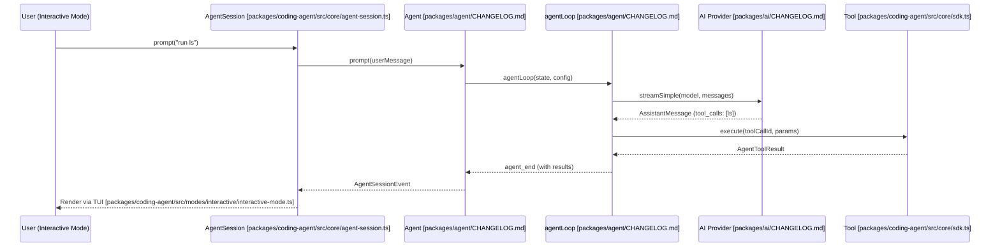

# Core Architecture

<details>
<summary>Relevant source files</summary>

The following files were used as context for generating this wiki page:

- [packages/agent/CHANGELOG.md](packages/agent/CHANGELOG.md)
- [packages/ai/CHANGELOG.md](packages/ai/CHANGELOG.md)
- [packages/coding-agent/CHANGELOG.md](packages/coding-agent/CHANGELOG.md)
- [packages/coding-agent/src/core/agent-session.ts](packages/coding-agent/src/core/agent-session.ts)
- [packages/coding-agent/src/core/sdk.ts](packages/coding-agent/src/core/sdk.ts)
- [packages/coding-agent/src/modes/interactive/interactive-mode.ts](packages/coding-agent/src/modes/interactive/interactive-mode.ts)
- [packages/coding-agent/src/modes/print-mode.ts](packages/coding-agent/src/modes/print-mode.ts)
- [packages/coding-agent/src/modes/rpc/rpc-mode.ts](packages/coding-agent/src/modes/rpc/rpc-mode.ts)
- [packages/tui/CHANGELOG.md](packages/tui/CHANGELOG.md)

</details>


The `pi` codebase follows a layered architecture that separates low-level AI provider communication, agentic reasoning loops, session state management, and user interface concerns. This separation allows the system to remain provider-agnostic while providing a robust framework for complex coding tasks.

### Layered Architecture Overview

The system is organized into several distinct layers, each building upon the previous one:

1.  **AI Abstraction Layer (`pi-ai`)**: Provides a unified streaming API for multiple LLM providers (OpenAI, Anthropic, Google, etc.). It handles model registries, credential resolution, and cross-provider context normalization [packages/ai/CHANGELOG.md:13-33]().
2.  **Agent Core Layer (`pi-agent-core`)**: Implements the fundamental `Agent` class and the `agentLoop`. This layer manages the lifecycle of a "turn" (LLM call + tool execution) and emits a rich stream of events [packages/agent/CHANGELOG.md:155-184]().
3.  **Coding Agent Layer (`pi-coding-agent`)**: Extends the core agent with domain-specific logic for software engineering. It manages persistent `AgentSession` objects, handles session tree branching, and implements the suite of built-in coding tools [packages/coding-agent/src/core/agent-session.ts:1-14]().
4.  **Interface Layer (`pi-tui`, `pi-web-ui`, and RPC)**: Provides the user-facing components. The TUI (Terminal UI) is the primary interface for local development [packages/tui/CHANGELOG.md:130-140](), while RPC mode allows headless embedding in other applications [packages/coding-agent/src/modes/rpc/rpc-mode.ts:1-12]().

### System Component Diagram

The following diagram illustrates how the core entities across different packages interact during a standard user prompt.

```mermaid
graph TD
    subgraph "Interface_Space"
        ["InteractiveMode packages/coding-agent/src/modes/interactive/interactive-mode.ts"] -- "delegates to" --> ["AgentSession packages/coding-agent/src/core/agent-session.ts"]
        ["RpcMode packages/coding-agent/src/modes/rpc/rpc-mode.ts"] -- "delegates to" --> ["AgentSession packages/coding-agent/src/core/agent-session.ts"]
        ["PrintMode packages/coding-agent/src/modes/print-mode.ts"] -- "delegates to" --> ["AgentSession packages/coding-agent/src/core/agent-session.ts"]
    end

    subgraph "Coding_Agent_Space_(pi-coding-agent)"
        ["AgentSession packages/coding-agent/src/core/agent-session.ts"]
        ["SessionManager packages/coding-agent/src/core/session-manager.ts"]
        ["ExtensionRunner packages/coding-agent/src/core/extensions/index.ts"]
        ["AgentSessionRuntime packages/coding-agent/src/core/agent-session-runtime.ts"]
        ["ResourceLoader packages/coding-agent/src/core/resource-loader.ts"]
    end

    subgraph "Agent_Core_Space_(pi-agent-core)"
        ["Agent packages/agent/CHANGELOG.md"]
        ["agentLoop packages/agent/CHANGELOG.md"]
    end

    subgraph "AI_Space_(pi-ai)"
        ["streamSimple packages/ai/CHANGELOG.md"]
        ["ModelRegistry packages/coding-agent/src/core/model-registry.ts"]
    end

    ["AgentSession packages/coding-agent/src/core/agent-session.ts"] --> ["SessionManager packages/coding-agent/src/core/session-manager.ts"]
    ["AgentSession packages/coding-agent/src/core/agent-session.ts"] --> ["Agent packages/agent/CHANGELOG.md"]
    ["AgentSession packages/coding-agent/src/core/agent-session.ts"] --> ["ExtensionRunner packages/coding-agent/src/core/extensions/index.ts"]
    ["AgentSession packages/coding-agent/src/core/agent-session.ts"] --> ["ResourceLoader packages/coding-agent/src/core/resource-loader.ts"]
    ["Agent packages/agent/CHANGELOG.md"] --> ["agentLoop packages/agent/CHANGELOG.md"]
    ["agentLoop packages/agent/CHANGELOG.md"] --> ["streamSimple packages/ai/CHANGELOG.md"]
```
**Sources:** [packages/coding-agent/src/core/agent-session.ts:157-187](), [packages/coding-agent/src/modes/interactive/interactive-mode.ts:1-4](), [packages/coding-agent/src/modes/rpc/rpc-mode.ts:53-55](), [packages/agent/CHANGELOG.md:155-184]()

---

### Core Subsystems

#### [Agent Loop (pi-agent-core)](#2.1)
The `pi-agent-core` package defines the stateful `Agent` class and the `agentLoop`. It manages the conversion of messages into LLM-compatible formats. It handles parallel tool execution, ensuring that `tool_execution_end` is emitted as soon as each tool is finalized [packages/agent/CHANGELOG.md:113-114]().

For details, see [Agent Loop (pi-agent-core)](#2.1).

#### [AgentSession and Session Lifecycle](#2.2)
Located in `pi-coding-agent`, the `AgentSession` is the high-level coordinator for coding tasks. It encapsulates agent state access, event subscription with automatic persistence, and model/thinking level management [packages/coding-agent/src/core/agent-session.ts:1-14](). It manages the lifecycle through `AgentSessionEvent` types, including compaction and auto-retry cycles [packages/coding-agent/src/core/agent-session.ts:124-148]().

For details, see [AgentSession and Session Lifecycle](#2.2).

#### [Session Management and Compaction](#2.3)
The `SessionManager` handles the persistence of conversation history using a JSONL format and supports branching/forking [packages/coding-agent/src/core/agent-session.ts:86-87](). To prevent context window overflow, it implements compaction logic that can be triggered manually or automatically based on token thresholds [packages/coding-agent/src/core/agent-session.ts:42-51]().

For details, see [Session Management and Compaction](#2.3).

#### [Built-in Tools](#2.4)
The coding agent comes with a suite of built-in tools designed for repository manipulation: `read`, `bash`, `edit`, `write`, `find`, `grep`, and `ls`. These tools are synthesized into `AgentTool` objects for use by the core runtime [packages/coding-agent/src/core/sdk.ts:20-32]().

For details, see [Built-in Tools](#2.4).

---

### Data Flow: Natural Language to Tool Execution

This diagram tracks the flow of a user's request through the system's code entities, showing how a natural language prompt results in a concrete code change.


**Sources:** [packages/coding-agent/src/core/agent-session.ts:1-14](), [packages/coding-agent/src/modes/interactive/interactive-mode.ts:1-4](), [packages/agent/CHANGELOG.md:155-184]()

### Key Interfaces and Types

| Entity | Package | Description |
| :--- | :--- | :--- |
| `Agent` | `pi-agent-core` | Stateful wrapper managing transcripts and event emission [packages/agent/CHANGELOG.md:162-184](). |
| `AgentState` | `pi-agent-core` | Readonly state interface containing messages, tools, and model info [packages/agent/CHANGELOG.md:155-160](). |
| `AgentTool` | `pi-agent-core` | Interface for defining executable tools with schemas [packages/coding-agent/src/core/agent-session.ts:23](). |
| `AgentSession` | `pi-coding-agent` | High-level coordinator for the coding environment [packages/coding-agent/src/core/agent-session.ts:1-14](). |
| `SessionManager` | `pi-coding-agent` | Handles session persistence and tree navigation [packages/coding-agent/src/core/session-manager.ts:86-87](). |
| `ResourceLoader` | `pi-coding-agent` | Discovers skills, prompts, and context files [packages/coding-agent/src/core/resource-loader.ts:85](). |

**Sources:** [packages/agent/CHANGELOG.md:155-184](), [packages/coding-agent/src/core/agent-session.ts:1-25](), [packages/coding-agent/src/core/resource-loader.ts:85]()
