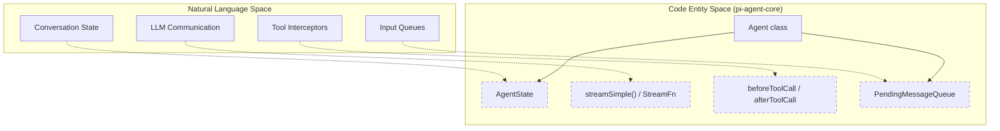
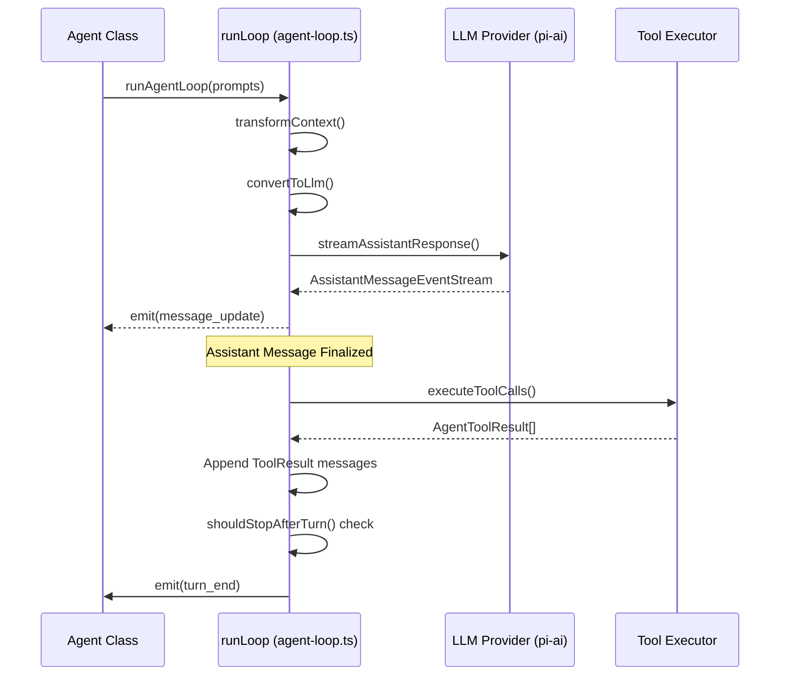
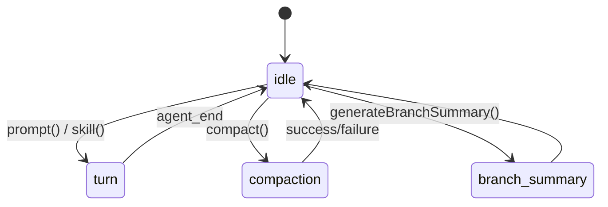

# Agent Loop (pi-agent-core)

Relevant source files

The following files were used as context for generating this wiki page:

- [packages/agent/CHANGELOG.md](packages/agent/CHANGELOG.md)
- [packages/agent/README.md](packages/agent/README.md)
- [packages/agent/docs/agent-harness.md](packages/agent/docs/agent-harness.md)
- [packages/agent/src/agent-loop.ts](packages/agent/src/agent-loop.ts)
- [packages/agent/src/agent.ts](packages/agent/src/agent.ts)
- [packages/agent/src/harness/agent-harness.ts](packages/agent/src/harness/agent-harness.ts)
- [packages/agent/src/harness/compaction/branch-summarization.ts](packages/agent/src/harness/compaction/branch-summarization.ts)
- [packages/agent/src/harness/compaction/compaction.ts](packages/agent/src/harness/compaction/compaction.ts)
- [packages/agent/src/harness/session/session.ts](packages/agent/src/harness/session/session.ts)
- [packages/agent/src/harness/types.ts](packages/agent/src/harness/types.ts)
- [packages/agent/src/index.ts](packages/agent/src/index.ts)
- [packages/agent/src/types.ts](packages/agent/src/types.ts)
- [packages/agent/test/agent-loop.test.ts](packages/agent/test/agent-loop.test.ts)
- [packages/agent/test/harness/agent-harness.test.ts](packages/agent/test/harness/agent-harness.test.ts)
- [packages/ai/CHANGELOG.md](packages/ai/CHANGELOG.md)
- [packages/coding-agent/CHANGELOG.md](packages/coding-agent/CHANGELOG.md)
- [packages/coding-agent/src/core/tools/tool-definition-wrapper.ts](packages/coding-agent/src/core/tools/tool-definition-wrapper.ts)
- [packages/tui/CHANGELOG.md](packages/tui/CHANGELOG.md)

The `@earendil-works/pi-agent-core` package provides a stateful, event-driven agent implementation built on top of the `pi-ai` abstraction [packages/agent/README.md:1-3](). It manages the conversation transcript, executes tools, handles parallel execution strategies, and emits a rich stream of lifecycle events.

## The Agent Class

The `Agent` class is the primary entry point for programmatic usage. It maintains an internal `AgentState` and manages queues for steering and follow-up messages [packages/agent/src/agent.ts:166-170]().

### AgentState
The state represents the current configuration and transcript of the agent. Key properties include:
*   `systemPrompt`: The instructions provided to the LLM [packages/agent/src/agent.ts:73]().
*   `model`: The `Model` object defining the LLM to use [packages/agent/src/agent.ts:74]().
*   `thinkingLevel`: The configured reasoning depth ("off", "minimal", etc.) [packages/agent/src/agent.ts:75]().
*   `messages`: The full transcript of `AgentMessage` objects [packages/agent/src/agent.ts:82-83]().
*   `isStreaming`: A boolean indicating if the agent is currently processing a run [packages/agent/src/agent.ts:88]().
*   `pendingToolCalls`: A `ReadonlySet<string>` of tool call IDs currently being executed [packages/agent/src/agent.ts:90]().
*   `errorMessage`: Stores the error if the last turn failed [packages/agent/src/agent.ts:91]().

### Configuration and Hooks
The `Agent` is configured via `AgentOptions` [packages/agent/src/agent.ts:96-116]().
*   `convertToLlm`: A mandatory function that filters and transforms `AgentMessage` (which may contain custom app types) into standard LLM roles (`user`, `assistant`, `toolResult`) [packages/agent/src/agent.ts:31-35](), [packages/agent/README.md:42-43]().
*   `transformContext`: An optional hook to prune or modify the message history (e.g., for context window management) before it is sent to the LLM [packages/agent/src/agent.ts:99](), [packages/agent/README.md:51]().
*   `beforeToolCall` / `afterToolCall`: Interceptors that allow blocking tool execution or mutating tool results [packages/agent/src/agent.ts:104-105]().
*   `toolExecution`: Configures the strategy for multiple tool calls, defaulting to `"parallel"` [packages/agent/src/agent.ts:199](), [packages/agent/README.md:104]().

### Natural Language to Code Entity Mapping: Agent Architecture
The following diagram bridges the high-level concepts of the agent's operation to the specific classes and functions in the codebase.

Title: Agent Architecture Mapping

Sources: [packages/agent/src/agent.ts:166-218](), [packages/agent/src/types.ts:24-26](), [packages/agent/src/types.ts:83-109]()

---

## The Agent Loop Lifecycle

The core logic resides in `runLoop` within `agent-loop.ts` [packages/agent/src/agent-loop.ts:155](). This function manages the iterative process of sending messages to the LLM and processing tool calls until the agent reaches a terminal state.

### Turn Lifecycle
A single "turn" consists of:
1.  **Context Transformation**: Applying `transformContext` and `convertToLlm` to prepare the message payload [packages/agent/src/agent-loop.ts:254-261]().
2.  **LLM Streaming**: Calling the `streamFn` (usually `streamSimple`) to get a response from the provider [packages/agent/src/agent-loop.ts:193]().
3.  **Tool Execution**: If the assistant generates tool calls, the loop executes them and appends `toolResult` messages [packages/agent/src/agent-loop.ts:203-216]().
4.  **Steering Check**: The loop checks if new user messages were queued while the LLM was responding [packages/agent/src/agent-loop.ts:167]().
5.  **Graceful Stop**: If `shouldStopAfterTurn` returns true, the loop exits after `turn_end` but before the next LLM call [packages/agent/src/agent-loop.ts:242-248]().

### Event Stream
During a `prompt()` call, the agent emits an `EventStream<AgentEvent, AgentMessage[]>` [packages/agent/src/agent-loop.ts:31-37]().

| Event Type | Trigger Point |
| :--- | :--- |
| `agent_start` | When the run begins [packages/agent/src/agent-loop.ts:109](). |
| `turn_start` | At the beginning of each LLM request cycle [packages/agent/src/agent-loop.ts:110](). |
| `message_start` | When any message (user, assistant, tool) is initiated [packages/agent/src/agent-loop.ts:112](). |
| `message_update` | **Assistant only.** Includes `assistantMessageEvent` with delta [packages/agent/README.md:151](). |
| `message_end` | When a message is complete [packages/agent/README.md:152](). |
| `tool_execution_start` | Before a tool implementation is called [packages/agent/README.md:153](). |
| `tool_execution_update` | If a tool streams progress (e.g. bash output) [packages/agent/README.md:154](). |
| `tool_execution_end` | After a tool completes and results are finalized [packages/agent/README.md:155](). |
| `turn_end` | Turn completes with assistant message and tool results [packages/agent/README.md:149](). |
| `agent_end` | The final event of the run [packages/agent/src/agent-loop.ts:147](). |

### Turn Execution Flow
The following diagram illustrates the data flow through a single agent turn.

Title: Turn Execution Data Flow

Sources: [packages/agent/src/agent-loop.ts:155-246](), [packages/agent/README.md:58-74]()

---

## Tool Execution Modes

The agent supports two execution modes for assistant messages containing multiple tool calls, configurable via `toolExecution` [packages/agent/src/types.ts:29-36]().

### Parallel Execution (Default)
In `parallel` mode:
*   Tool calls are prepared sequentially (validating arguments and running `beforeToolCall`) [packages/agent/README.md:104]().
*   Tools that are allowed to run execute concurrently [packages/agent/README.md:104]().
*   `tool_execution_end` events are emitted as soon as each tool is finalized [packages/agent/README.md:104]().
*   **Crucially**, the resulting `toolResult` messages are appended to the transcript in the original order requested by the assistant [packages/agent/README.md:104]().

### Sequential Execution
In `sequential` mode, each tool is prepared, executed, and finalized before the next one starts [packages/agent/src/types.ts:31](). This is forced if any tool in a batch has `executionMode: "sequential"` [packages/agent/README.md:109]().

### Early Termination
Tools can return a `terminate: true` hint in their `AfterToolCallResult` [packages/agent/src/types.ts:77-81](). The agent loop will skip the automatic follow-up LLM call only if **every** tool in a parallel batch requests termination [packages/agent/README.md:113]().

---

## Steering vs. Follow-up

The `Agent` class provides two distinct mechanisms for injecting messages into the loop while it is running.

### Steering
Steering messages are injected **before** the next assistant response [packages/agent/src/agent-loop.ts:182-190](). If a user types while the agent is executing tools, that message is "steered" into the context so the LLM sees it in the next turn [packages/agent/src/agent.ts:212](). The `steeringMode` can be `"all"` or `"one-at-a-time"` [packages/agent/src/agent.ts:212]().

### Follow-up
Follow-up messages are processed after the agent would otherwise have stopped (i.e., no more tool calls and no steering messages) [packages/agent/src/agent-loop.ts:251-253](). This allows extensions or system processes to trigger a new turn once the agent becomes idle [packages/agent/src/agent.ts:213]().

| Feature | Steering | Follow-up |
| :--- | :--- | :--- |
| **Queue Type** | `steeringQueue` [packages/agent/src/agent.ts:212]() | `followUpQueue` [packages/agent/src/agent.ts:213]() |
| **Injection Point** | Before the next LLM call in current loop [packages/agent/src/agent-loop.ts:182]() | After loop would exit [packages/agent/src/agent-loop.ts:251]() |
| **Primary Use** | User interruptions/corrections | Automated system triggers / compaction |

Sources: [packages/agent/src/agent.ts:118-152](), [packages/agent/src/agent-loop.ts:155-253]()

---

## AgentHarness Orchestration

While `Agent` provides the stateful loop, `AgentHarness` serves as the higher-level orchestration layer [packages/agent/docs/agent-harness.md:1-3](). It manages:
*   **Session Persistence**: Interfacing with `Session` and storage backends [packages/agent/src/harness/agent-harness.ts:180]().
*   **Resource Resolution**: Loading `Skill` and `PromptTemplate` objects from the environment [packages/agent/src/harness/agent-harness.ts:190]().
*   **System Prompt Generation**: Resolving dynamic system prompts based on current resources [packages/agent/src/harness/agent-harness.ts:187]().
*   **Phase Management**: Tracking whether the harness is `idle`, in a `turn`, or performing `compaction` [packages/agent/docs/agent-harness.md:94-98]().

### Harness Phase Transition
Title: AgentHarness Phase Transitions

Sources: [packages/agent/docs/agent-harness.md:94-108](), [packages/agent/src/harness/agent-harness.ts:181]()
