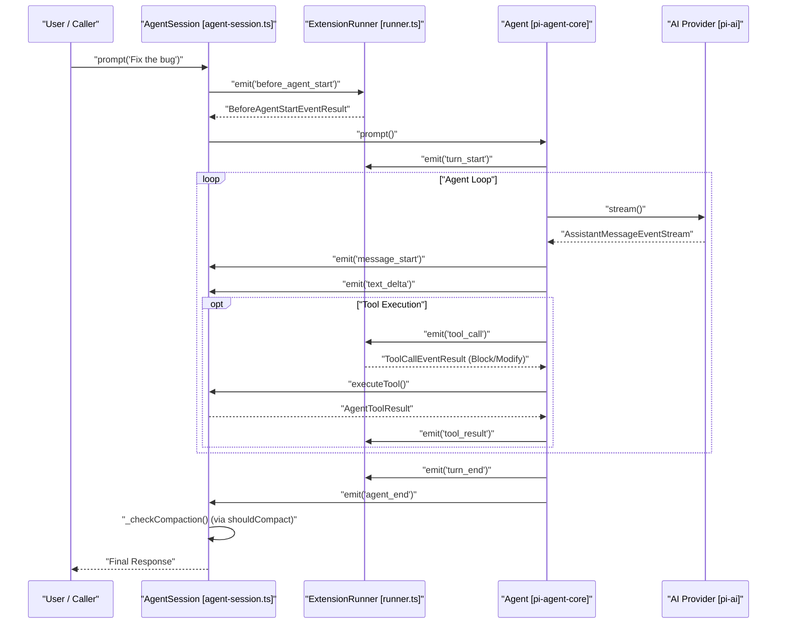
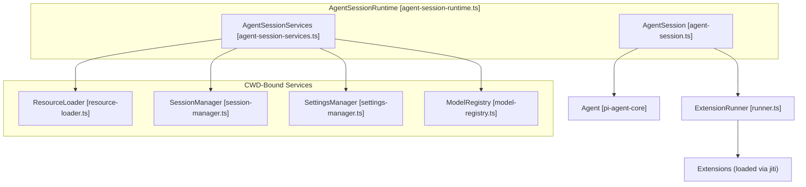

# AgentSession and Session Lifecycle

Relevant source files

The following files were used as context for generating this wiki page:

- [packages/coding-agent/src/core/agent-session-runtime.ts](packages/coding-agent/src/core/agent-session-runtime.ts)
- [packages/coding-agent/src/core/agent-session-services.ts](packages/coding-agent/src/core/agent-session-services.ts)
- [packages/coding-agent/src/core/agent-session.ts](packages/coding-agent/src/core/agent-session.ts)
- [packages/coding-agent/src/core/sdk.ts](packages/coding-agent/src/core/sdk.ts)
- [packages/coding-agent/src/modes/interactive/interactive-mode.ts](packages/coding-agent/src/modes/interactive/interactive-mode.ts)
- [packages/coding-agent/src/modes/print-mode.ts](packages/coding-agent/src/modes/print-mode.ts)
- [packages/coding-agent/src/modes/rpc/rpc-mode.ts](packages/coding-agent/src/modes/rpc/rpc-mode.ts)
- [packages/coding-agent/test/agent-session-auto-compaction-queue.test.ts](packages/coding-agent/test/agent-session-auto-compaction-queue.test.ts)
- [packages/coding-agent/test/agent-session-runtime-events.test.ts](packages/coding-agent/test/agent-session-runtime-events.test.ts)
- [packages/coding-agent/test/suite/agent-session-bash-persistence.test.ts](packages/coding-agent/test/suite/agent-session-bash-persistence.test.ts)
- [packages/coding-agent/test/suite/agent-session-compaction.test.ts](packages/coding-agent/test/suite/agent-session-compaction.test.ts)
- [packages/coding-agent/test/suite/agent-session-model-extension.test.ts](packages/coding-agent/test/suite/agent-session-model-extension.test.ts)
- [packages/coding-agent/test/suite/agent-session-prompt.test.ts](packages/coding-agent/test/suite/agent-session-prompt.test.ts)
- [packages/coding-agent/test/suite/agent-session-retry-events.test.ts](packages/coding-agent/test/suite/agent-session-retry-events.test.ts)
- [packages/coding-agent/test/suite/agent-session-runtime.test.ts](packages/coding-agent/test/suite/agent-session-runtime.test.ts)
- [packages/coding-agent/test/suite/regressions/1717-2113-agent-session-event-settlement.test.ts](packages/coding-agent/test/suite/regressions/1717-2113-agent-session-event-settlement.test.ts)
- [packages/coding-agent/test/suite/regressions/2023-queued-slash-command-followup.test.ts](packages/coding-agent/test/suite/regressions/2023-queued-slash-command-followup.test.ts)

The `AgentSession` class is the central orchestrator for the `coding-agent` package. It bridges the low-level `Agent` loop from `@earendil-works/pi-agent-core` with high-level session management, tool execution, and the extension system [packages/coding-agent/src/core/agent-session.ts:2-14]().

## Core Abstraction: AgentSession

`AgentSession` encapsulates the state and lifecycle of a single conversation thread. It is used across all execution modes: Interactive (TUI), RPC, and Print [packages/coding-agent/src/core/agent-session.ts:13-14](). It manages model selection, thinking levels, and provides the interface for persistence via the `SessionManager` [packages/coding-agent/src/core/agent-session.ts:5-12]().

### Key Functions
- `prompt(text, options)`: The primary entry point for user input. It handles prompt template expansion, skill block parsing, and initiates the agent loop [packages/coding-agent/src/core/agent-session.ts:310-348]().
- `steer(text)`: Injects a message into the current turn without waiting for the agent to finish, allowing the user to "steer" the model during long outputs [packages/coding-agent/src/core/agent-session.ts:400-410]().
- `followUp(text)`: Queues a message to be processed immediately after the current turn completes [packages/coding-agent/src/core/agent-session.ts:412-422]().
- `subscribe(listener)`: Allows external components to listen to a unified stream of events, including core agent events and session-specific events like `compaction_start`, `queue_update`, or `auto_retry_start` [packages/coding-agent/src/core/agent-session.ts:124-151]().
- `executeBash(command)`: Provides a direct interface for running shell commands within the session's context and working directory using `executeBashWithOperations` [packages/coding-agent/src/core/agent-session.ts:1003-1011]().
- `compact(options)`: Manually triggers the compaction process to reduce context window usage [packages/coding-agent/src/core/agent-session.ts:741-755]().

**Sources:** [packages/coding-agent/src/core/agent-session.ts:1-151](), [packages/coding-agent/src/core/agent-session.ts:310-348](), [packages/coding-agent/src/core/agent-session.ts:1003-1011]()

---

## Session Lifecycle and Event Flow

The lifecycle of a session turn is event-driven. When `prompt()` is called, it triggers a sequence of events that flow from the `AgentSession` to subscribers (like the TUI or RPC host).

### Natural Language to Code Entity Space: Lifecycle Mapping

The following diagram maps high-level user actions to the specific code entities and events triggered during a turn.

Title: Agent Session Turn Lifecycle

**Sources:** [packages/coding-agent/src/core/agent-session.ts:124-151](), [packages/coding-agent/src/core/agent-session.ts:310-348](), [packages/coding-agent/test/agent-session-auto-compaction-queue.test.ts:49-53](), [packages/coding-agent/test/agent-session-auto-compaction-queue.test.ts:162-168]()

---

## AgentSessionRuntime and Services

The `AgentSessionRuntime` owns the current `AgentSession` plus its cwd-bound services. It is responsible for session replacement operations like switching branches, forking, or resuming sessions [packages/coding-agent/src/core/agent-session-runtime.ts:68-77](). It ensures that when a session is replaced, the old session is disposed of and `session_shutdown` events are emitted [packages/coding-agent/src/core/agent-session-runtime.ts:167-175]().

### Runtime Architecture
- **AgentSessionServices**: A container for objects bound to the current Working Directory (CWD), such as the `ResourceLoader`, `SettingsManager`, and `ModelRegistry` [packages/coding-agent/src/core/agent-session-services.ts:74-82]().
- **Session Replacement**: Methods like `switchSession`, `newSession`, and `fork` tear down the current runtime first, then create and apply the next runtime using a `CreateAgentSessionRuntimeFactory` [packages/coding-agent/src/core/agent-session-runtime.ts:35-41](), [packages/coding-agent/src/core/agent-session-runtime.ts:193-210]().
- **Shutdown Hooks**: `setBeforeSessionInvalidate` allows host-owned UI teardown (like detaching TUI components) to run after `session_shutdown` handlers but before the session object becomes stale [packages/coding-agent/src/core/agent-session-runtime.ts:129-131]().

Title: Runtime and Service Association

**Sources:** [packages/coding-agent/src/core/agent-session-runtime.ts:74-95](), [packages/coding-agent/src/core/agent-session-services.ts:74-82](), [packages/coding-agent/src/core/agent-session-runtime.ts:193-210](), [packages/coding-agent/src/core/agent-session-runtime.ts:129-131]()

---

## Creating a Session (SDK)

The `createAgentSession` factory is the primary way to instantiate the system. It resolves credentials, loads settings, discovers extensions, and wires up the `AgentSession` [packages/coding-agent/src/core/sdk.ts:166-184]().

### Configuration Options
The `CreateAgentSessionOptions` interface allows customizing the session:
- `cwd`: The project directory for file discovery [packages/coding-agent/src/core/sdk.ts:36-36]().
- `model`: The specific LLM to use, often resolved via `findInitialModel` [packages/coding-agent/src/core/sdk.ts:46-46](), [packages/coding-agent/src/core/sdk.ts:13-13]().
- `tools`: An allowlist of tool names to enable [packages/coding-agent/src/core/sdk.ts:67-67]().
- `noTools`: Suppression mode for built-in tools ("all" or "builtin") [packages/coding-agent/src/core/sdk.ts:59-59]().
- `resourceLoader`: Custom loader for skills, prompts, and themes [packages/coding-agent/src/core/sdk.ts:74-74]().

**Sources:** [packages/coding-agent/src/core/sdk.ts:34-83](), [packages/coding-agent/src/core/sdk.ts:166-184]()

---

## Mode Integration

Extensions and modes interact with the `AgentSession` lifecycle through specialized contexts.

1. **Interactive Mode**: Handles TUI rendering and user interaction, delegating logic to `AgentSession` [packages/coding-agent/src/modes/interactive/interactive-mode.ts:1-4]().
2. **RPC Mode**: Implements a headless JSON-RPC protocol. It maps extension UI requests (like `select` or `confirm`) to `RpcExtensionUIRequest` objects sent over stdout [packages/coding-agent/src/modes/rpc/rpc-mode.ts:59-61](), [packages/coding-agent/src/modes/rpc/rpc-mode.ts:135-150]().
3. **Print Mode**: A single-shot execution mode that sends a prompt, waits for the final assistant response, and outputs it to stdout before exiting [packages/coding-agent/src/modes/print-mode.ts:2-7](), [packages/coding-agent/src/modes/print-mode.ts:129-146]().
4. **Extension UI Context**: Each mode provides its own implementation of `ExtensionUIContext` to handle interactions requested by extensions [packages/coding-agent/src/modes/rpc/rpc-mode.ts:135-135]().

**Sources:** [packages/coding-agent/src/modes/interactive/interactive-mode.ts:1-4](), [packages/coding-agent/src/modes/rpc/rpc-mode.ts:1-12](), [packages/coding-agent/src/modes/rpc/rpc-mode.ts:135-150](), [packages/coding-agent/src/modes/print-mode.ts:1-7](), [packages/coding-agent/src/modes/print-mode.ts:129-146]()
