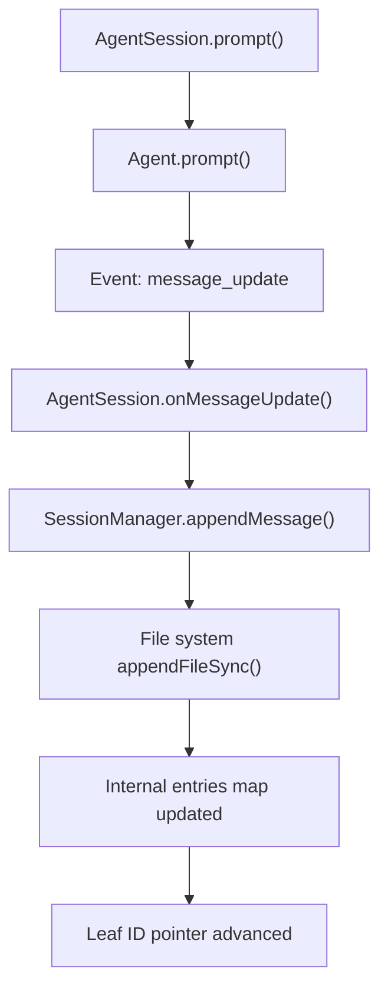
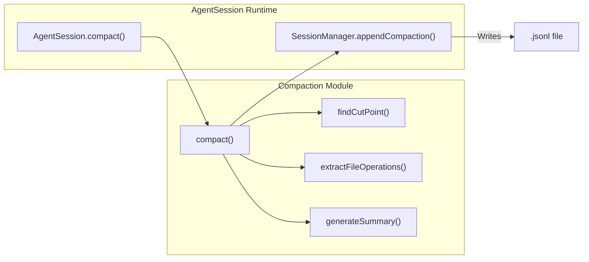

# Session Management and Compaction

<details>
<summary>Relevant source files</summary>

The following files were used as context for generating this wiki page:

- [packages/agent/test/harness/compaction.test.ts](packages/agent/test/harness/compaction.test.ts)
- [packages/coding-agent/docs/compaction.md](packages/coding-agent/docs/compaction.md)
- [packages/coding-agent/src/cli/session-picker.ts](packages/coding-agent/src/cli/session-picker.ts)
- [packages/coding-agent/src/core/compaction/branch-summarization.ts](packages/coding-agent/src/core/compaction/branch-summarization.ts)
- [packages/coding-agent/src/core/compaction/compaction.ts](packages/coding-agent/src/core/compaction/compaction.ts)
- [packages/coding-agent/src/core/compaction/index.ts](packages/coding-agent/src/core/compaction/index.ts)
- [packages/coding-agent/src/core/compaction/utils.ts](packages/coding-agent/src/core/compaction/utils.ts)
- [packages/coding-agent/src/core/session-manager.ts](packages/coding-agent/src/core/session-manager.ts)
- [packages/coding-agent/src/modes/interactive/components/session-selector-search.ts](packages/coding-agent/src/modes/interactive/components/session-selector-search.ts)
- [packages/coding-agent/src/modes/interactive/components/session-selector.ts](packages/coding-agent/src/modes/interactive/components/session-selector.ts)
- [packages/coding-agent/test/agent-session-branching.test.ts](packages/coding-agent/test/agent-session-branching.test.ts)
- [packages/coding-agent/test/agent-session-compaction.test.ts](packages/coding-agent/test/agent-session-compaction.test.ts)
- [packages/coding-agent/test/compaction-serialization.test.ts](packages/coding-agent/test/compaction-serialization.test.ts)
- [packages/coding-agent/test/compaction-summary-reasoning.test.ts](packages/coding-agent/test/compaction-summary-reasoning.test.ts)
- [packages/coding-agent/test/compaction.test.ts](packages/coding-agent/test/compaction.test.ts)
- [packages/coding-agent/test/session-selector-path-delete.test.ts](packages/coding-agent/test/session-selector-path-delete.test.ts)
- [packages/coding-agent/test/session-selector-search.test.ts](packages/coding-agent/test/session-selector-search.test.ts)

</details>


This page details the technical implementation of session persistence, tree-based history management, and the context compaction system within the `pi` codebase.

## JSONL Session Format and Tree Structure

Sessions in `pi` are stored as **JSONL (JSON Lines)** files. Each line is a standalone JSON object, allowing efficient appending without rewriting the entire file. The current session format version is 3, reflecting migrations from simple linear lists to complex tree structures supporting branching and metadata entries [packages/coding-agent/src/core/session-manager.ts:30-30](), [packages/coding-agent/src/core/session-manager.ts:139-152](), [packages/coding-agent/src/core/session-manager.ts:225-243]().

### Session Entry Types

Every entry in a session file extends `SessionEntryBase`, which provides the core fields necessary for maintaining a non-linear history tree:

- **id**: A unique entry identifier, typically a short 8-character hex string or UUIDv7, collision-checked and generated to maintain tree integrity [packages/coding-agent/src/core/session-manager.ts:48-48](), [packages/coding-agent/src/core/session-manager.ts:216-223]().
- **parentId**: The ID of the preceding entry; `null` for root entries [packages/coding-agent/src/core/session-manager.ts:49-49]().

Each entry also has a `timestamp` string in ISO-8601 format representing when it was recorded [packages/coding-agent/src/core/session-manager.ts:50-50]().

| Entry Type          | Purpose                                                  | Key Fields                                                     |
|---------------------|----------------------------------------------------------|----------------------------------------------------------------|
| `session`           | Session header (first line)                              | `version`, `id`, `timestamp`, `cwd`, `parentSession`           |
| `message`           | LLM conversation messages                               | `message` (of type `AgentMessage`)                             |
| `compaction`        | Summarized history for context compaction               | `summary`, `firstKeptEntryId`, `tokensBefore`, `details?`      |
| `branch_summary`    | Summaries for other session branches (branch navigation) | `summary`, `fromId`, `details?`                                |
| `model_change`      | Track provider/model changes                             | `provider`, `modelId`                                           |
| `thinking_level_change` | Changes in reasoning or thinking level                 | `thinkingLevel`                                                |
| `custom`            | Extension-specific state persistence                     | `customType`, `data?`                                          |
| `custom_message`    | Extension-injected content that participates in LLM context | `content`, `display`, `details?`                               |
| `label`             | User-defined bookmark labels                             | `targetId`, `label`                                            |
| `session_info`      | Session metadata, like display name                      | `name?`                                                       |

See [packages/coding-agent/src/core/session-manager.ts:32-149]() for all interface definitions.

### Tree Navigation Logic

The `SessionManager` models the session as a directed acyclic graph (DAG), enabling non-linear branching via `parentId` references. This supports branching/forking/cloning behaviors.

- **`getBranch(id)`** reconstructs a linear path back from a specified node to the root by recursively following `parentId`s [packages/coding-agent/src/core/session-manager.ts:195-195]().
- **`getTree()`** builds a recursive tree structure (`SessionTreeNode`), where each node contains an entry and its children entries, representing all branches of the session [packages/coding-agent/src/core/session-manager.ts:155-162](), [packages/coding-agent/src/core/session-manager.ts:199-199]().

Session entries are connected via their `id` and `parentId` properties; the `leafId` tracks the current focus point in the session tree, which advances as new entries are appended [packages/coding-agent/src/core/session-manager.ts:46-51](), [packages/coding-agent/src/core/session-manager.ts:192-192]().

**Data Flow: Session Persistence**

Title: Session Persistence Flow

Sources: [packages/coding-agent/src/core/session-manager.ts:4-15](), [packages/coding-agent/src/core/session-manager.ts:46-51](), [packages/coding-agent/src/core/session-manager.ts:155-162]()

## SessionManager API

The `SessionManager` is the central class managing session I/O, entry storage, tree traversal, and mutation. It supports two modes:

- **File-backed session**: Reads/writes JSONL files on disk.
- **In-memory session**: Stores entries in memory, useful for transient sessions or testing.

### Creation Methods

- `SessionManager.create(agentDir: string, sessionsDir?: string)`: Initializes or loads a file-backed session manager [packages/coding-agent/src/core/session-manager.ts:275-285]().
- `SessionManager.inMemory(cwd?: string)`: Creates an ephemeral in-memory session manager with an optional current working directory [packages/coding-agent/src/core/session-manager.ts:287-293]().

### Important SessionManager Methods

| Method                    | Description                               |
|---------------------------|-------------------------------------------|
| `appendMessage(message)`  | Adds a new `message` entry linked to leaf, persists it, advances leaf pointer [packages/coding-agent/src/core/session-manager.ts:53-56]() |
| `appendCompaction(summary, firstKeptId, tokensBefore, details?, fromHook?)` | Appends a `compaction` entry after context compaction, linking to leaf [packages/coding-agent/src/core/session-manager.ts:69-78]() |
| `appendBranchSummary(summary, fromId, details?, fromHook?)` | Adds a `branch_summary` entry for keeping context summaries of other branches [packages/coding-agent/src/core/session-manager.ts:80-88]() |
| `appendCustomEntry(customType, data?)` | Stores extension state data without impacting LLM context [packages/coding-agent/src/core/session-manager.ts:100-104]() |
| `fork(entryId)`            | Creates a new session file with history truncated to `entryId` for branching [packages/coding-agent/src/core/session-manager.ts:391-410]() |
| `getEntries()`            | Returns all session entries in append order [packages/coding-agent/src/core/session-manager.ts:198-198]() |
| `getBranch(entryId)`      | Returns array of entries forming path from root to specified leaf [packages/coding-agent/src/core/session-manager.ts:195-195]() |
| `getTree()`               | Returns tree of all entries as `SessionTreeNode[]` [packages/coding-agent/src/core/session-manager.ts:199-199]() |
| `getLeafId()`             | Gets the current leaf entry id (last appended) [packages/coding-agent/src/core/session-manager.ts:192-192]() |

Sources: [packages/coding-agent/src/core/session-manager.ts:53-104](), [packages/coding-agent/src/core/session-manager.ts:186-201]()

## Compaction System

To handle the limited context window of LLMs, pi introduces **Context Compaction** which summarizes older conversation history into compressed summaries, preserving essential context while freeing token space for new interactions [packages/coding-agent/docs/compaction.md:1-24]().

### Auto-Compaction Triggers

Before every prompt, pi evaluates if compaction is required by comparing the estimated context token count to the LLM context window minus a reserved margin:

```text
Trigger if: contextTokens > contextWindow - reserveTokens
```

- `reserveTokens` defaults to **16384 tokens**.
- `keepRecentTokens` defaults to **20000 tokens**, controlling how many recent tokens remain un-compacted.

These settings can be configured in `~/.pi/agent/settings.json` or the project-local `.pi/settings.json` [packages/coding-agent/src/core/compaction/compaction.ts:115-125](), [packages/coding-agent/src/core/compaction/compaction.ts:219-222]().

### Compaction Workflow

1. **Find Cut Point**: The `findCutPoint()` algorithm walks backwards from the newest message, accumulating estimated tokens until the `keepRecentTokens` threshold is reached. It attempts to cut at natural message boundaries such as user or assistant messages, avoiding tool results [packages/coding-agent/src/core/compaction/compaction.ts:335-410]().

2. **Message Extraction**: It then collects messages from the previous compaction boundary (or session start) up to the cut point to form the "compacted" range [packages/coding-agent/src/core/compaction/compaction.ts:141-210]().

3. **Summary Generation**: An LLM call is issued using a system prompt designed for summarization (`SUMMARIZATION_SYSTEM_PROMPT`), passing the relevant message span along with any prior summary for iterative refinement [packages/coding-agent/src/core/compaction/utils.ts:168-171]().

4. **File Tracking**: File operations (read, edited, modified files) are extracted from tool calls in the summarized messages via `extractFileOpsFromMessage()`, recorded in the `details` field of the `CompactionEntry` for cumulative tracking [packages/coding-agent/src/core/compaction/utils.ts:29-56](), [packages/coding-agent/src/core/compaction/compaction.ts:32-36]().

5. **Entry Appending**: The generated summary is appended as a `CompactionEntry` to the session file, specifying the `firstKeptEntryId` from which un-compacted messages continue [packages/coding-agent/docs/compaction.md:59-77]().

6. **Session Reload**: The session is reloaded, so active LLM context uses the summary instead of all older messages.

### Split Turns

When a single turn (user message + associated assistant and tool messages) exceeds `keepRecentTokens`, compaction cuts mid-turn, generating separate summaries for:

- Historical conversation before the turn.
- The prefix part of the split turn.

These are merged to ensure context integrity despite partial turn cutting [packages/coding-agent/docs/compaction.md:81-108]().

### CompactionEntry Format

The `CompactionEntry` is defined as:

```typescript
export interface CompactionEntry<T = unknown> extends SessionEntryBase {
	type: "compaction";
	summary: string;
	firstKeptEntryId: string;
	tokensBefore: number;
	/** Extension-specific data (e.g., ArtifactIndex, version markers for structured compaction) */
	details?: T;
	/** True if generated by an extension, undefined/false if pi-generated (backward compatible) */
	fromHook?: boolean;
}
```

The default `details` shape tracks:

```typescript
export interface CompactionDetails {
	readFiles: string[];
	modifiedFiles: string[];
}
```

Extensions may define custom structures here to store additional metadata [packages/coding-agent/src/core/session-manager.ts:69-78](), [packages/coding-agent/src/core/compaction/compaction.ts:33-36]().

**Code Entity Space: Compaction Logic**

Title: Compaction Logic and Data Flow

Sources: [packages/coding-agent/src/core/compaction/compaction.ts:103-109](), [packages/coding-agent/src/core/compaction/compaction.ts:335-340](), [packages/coding-agent/src/core/compaction/compaction.ts:420-430](), [packages/coding-agent/src/core/session-manager.ts:69-78]()

## Branch Summarization

When switching focus among branches in the session tree (e.g., navigating via `/tree`), pi generates **Branch Summaries** to preserve context from branches being left behind, preventing loss of context when changing conversation path [packages/coding-agent/src/core/compaction/branch-summarization.ts:1-6]().

### Summary Collection

The `collectEntriesForBranchSummary()` function identifies the entries from the current leaf back to the common ancestor with the target branch. It collects entries including compactions and summaries, ignoring compaction boundaries so that summaries remain coherent [packages/coding-agent/src/core/compaction/branch-summarization.ts:100-138]().

### Summary Generation

Like compaction, an LLM call is performed against the collected entries with summarization prompts to produce a summarized text representation [packages/coding-agent/src/core/compaction/branch-summarization.ts:241-280](). File operations in the branch are extracted cumulatively via `prepareBranchEntries()` to track changes [packages/coding-agent/src/core/compaction/branch-summarization.ts:187-210]().

### Integration with LLM Context

In `buildSessionContext()`, `branch_summary` entries are converted into special `branchSummary` message roles via `createBranchSummaryMessage()`. The LLM treats them as condensed context from other branches, maintaining continuity in conversation despite navigation [packages/coding-agent/src/core/session-manager.ts:25-28](), [packages/coding-agent/src/core/compaction/branch-summarization.ts:148-172]().

### BranchSummaryEntry Format

```typescript
export interface BranchSummaryEntry<T = unknown> extends SessionEntryBase {
	type: "branch_summary";
	fromId: string;
	summary: string;
	/** Extension-specific data (not sent to LLM) */
	details?: T;
	/** True if generated by an extension, false if pi-generated */
	fromHook?: boolean;
}
```

Sources: [packages/coding-agent/src/core/session-manager.ts:80-88](), [packages/coding-agent/src/core/compaction/branch-summarization.ts:42-45]()

## Branching, Forking, and Cloning

The session tree allows:

- **Branching**: Adding divergent histories via entries whose `parentId` is not the latest leaf.
- **Forking**: Creating a new session file truncated at a specified entry, allowing exploratory divergent histories [packages/coding-agent/src/core/session-manager.ts:391-410]().

The `SessionManager.fork(entryId)` method handles this by copying the branch history up to the fork point into a new session file, starting a new session tree from there.

Cloning is similar but preserves the entire history.

## Extension Integration

Extensions integrate tightly into session and compaction mechanisms:

- **Custom Entries** (`custom` type) store extension state that persists across restarts but does not contribute to LLM context [packages/coding-agent/src/core/session-manager.ts:100-104]().

- **Custom Messages** (`custom_message` type) allow extensions to inject messages into the LLM context, with control over display and metadata [packages/coding-agent/src/core/session-manager.ts:131-137]().

- Extensions may trigger compaction manually or listen for events relating to compaction and session changes.

- The `fromHook` field on compaction and branch summary entries distinguishes extension-generated entries from built-in ones, enabling custom handling [packages/coding-agent/src/core/session-manager.ts:77-77](), [packages/coding-agent/src/core/session-manager.ts:87-87]().

## Summary of Key Data Structures

| Concept                   | Code Entity / Interface                          | Purpose                                      |
|---------------------------|-------------------------------------------------|----------------------------------------------|
| Session Entry             | `SessionEntry` [packages/coding-agent/src/core/session-manager.ts:140-149]() | JSONL lines representing session events     |
| Session Tree Node         | `SessionTreeNode` [packages/coding-agent/src/core/session-manager.ts:155-162]() | Recursive node representing tree with children |
| Compaction Entry          | `CompactionEntry` [packages/coding-agent/src/core/session-manager.ts:69-78]()   | Summary replacing older conversation tokens  |
| Branch Summary Entry      | `BranchSummaryEntry` [packages/coding-agent/src/core/session-manager.ts:80-88]()| Summary of abandoned branch during tree navigation |
| Session Manager           | `SessionManager` class [packages/coding-agent/src/core/session-manager.ts:186-201]() | Manages session persistence, tree, compaction |
| Compaction Logic          | `compact()`, `findCutPoint()` [packages/coding-agent/src/core/compaction/compaction.ts:335-430]() | Core functions to generate summaries         |

Sources: [packages/coding-agent/src/core/session-manager.ts:1-201](), [packages/coding-agent/src/core/compaction/compaction.ts:1-430](), [packages/coding-agent/src/core/compaction/branch-summarization.ts:1-280](), [packages/coding-agent/docs/compaction.md:1-141]()
