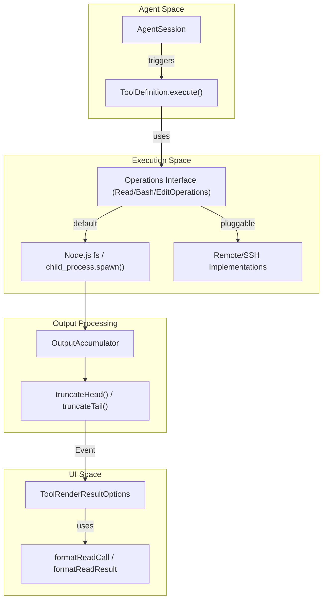
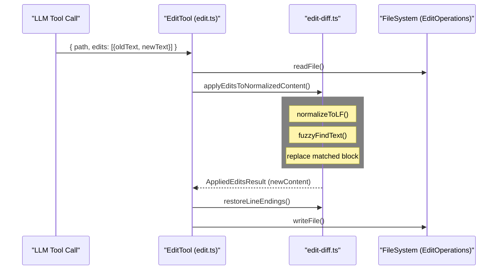

# Built-in Tools

Relevant source files

The following files were used as context for generating this wiki page:

- [packages/coding-agent/examples/extensions/dynamic-tools.ts](packages/coding-agent/examples/extensions/dynamic-tools.ts)
- [packages/coding-agent/src/core/bash-executor.ts](packages/coding-agent/src/core/bash-executor.ts)
- [packages/coding-agent/src/core/index.ts](packages/coding-agent/src/core/index.ts)
- [packages/coding-agent/src/core/system-prompt.ts](packages/coding-agent/src/core/system-prompt.ts)
- [packages/coding-agent/src/core/tools/bash.ts](packages/coding-agent/src/core/tools/bash.ts)
- [packages/coding-agent/src/core/tools/edit-diff.ts](packages/coding-agent/src/core/tools/edit-diff.ts)
- [packages/coding-agent/src/core/tools/edit.ts](packages/coding-agent/src/core/tools/edit.ts)
- [packages/coding-agent/src/core/tools/file-mutation-queue.ts](packages/coding-agent/src/core/tools/file-mutation-queue.ts)
- [packages/coding-agent/src/core/tools/find.ts](packages/coding-agent/src/core/tools/find.ts)
- [packages/coding-agent/src/core/tools/grep.ts](packages/coding-agent/src/core/tools/grep.ts)
- [packages/coding-agent/src/core/tools/index.ts](packages/coding-agent/src/core/tools/index.ts)
- [packages/coding-agent/src/core/tools/ls.ts](packages/coding-agent/src/core/tools/ls.ts)
- [packages/coding-agent/src/core/tools/output-accumulator.ts](packages/coding-agent/src/core/tools/output-accumulator.ts)
- [packages/coding-agent/src/core/tools/path-utils.ts](packages/coding-agent/src/core/tools/path-utils.ts)
- [packages/coding-agent/src/core/tools/read.ts](packages/coding-agent/src/core/tools/read.ts)
- [packages/coding-agent/src/core/tools/truncate.ts](packages/coding-agent/src/core/tools/truncate.ts)
- [packages/coding-agent/src/core/tools/write.ts](packages/coding-agent/src/core/tools/write.ts)
- [packages/coding-agent/test/agent-session-dynamic-tools.test.ts](packages/coding-agent/test/agent-session-dynamic-tools.test.ts)
- [packages/coding-agent/test/file-mutation-queue.test.ts](packages/coding-agent/test/file-mutation-queue.test.ts)
- [packages/coding-agent/test/path-utils.test.ts](packages/coding-agent/test/path-utils.test.ts)
- [packages/coding-agent/test/session-info-modified-timestamp.test.ts](packages/coding-agent/test/session-info-modified-timestamp.test.ts)
- [packages/coding-agent/test/system-prompt.test.ts](packages/coding-agent/test/system-prompt.test.ts)
- [packages/coding-agent/test/tools.test.ts](packages/coding-agent/test/tools.test.ts)

The `pi` coding agent provides a suite of core tools designed for filesystem interaction and command execution. These tools are implemented in the `@mariozechner/pi-coding-agent` package and are optimized for LLM usage through specialized schemas, output truncation, and TUI-friendly rendering.

## Overview and Tool Registry

The system defines seven primary built-in tools: `read`, `bash`, `edit`, `write`, `find`, `grep`, and `ls`. These tools are instantiated via factories such as `createReadTool`, `createBashTool`, and `createEditTool` [packages/coding-agent/test/tools.test.ts:19-25](). They are managed via `ToolDefinition` objects which encapsulate the JSON schema for the LLM, the execution logic, and custom TUI rendering components [packages/coding-agent/src/core/tools/edit.ts:8-25](), [packages/coding-agent/src/core/tools/find.ts:109-113]().

### Core Tool Set
| Tool | Purpose | Key Implementation File |
| :--- | :--- | :--- |
| `read` | Reads file content with auto-truncation and image support. | [packages/coding-agent/src/core/tools/read.ts:20-24]() |
| `bash` | Executes shell commands with streaming output. | [packages/coding-agent/src/core/tools/bash.ts:24-28]() |
| `edit` | Applies precise search-and-replace edits to files. | [packages/coding-agent/src/core/tools/edit.ts:33-53]() |
| `write` | Creates or overwrites files entirely. | [packages/coding-agent/src/core/tools/write.ts:14-17]() |
| `find` | Locates files using glob patterns (via `fd` if available). | [packages/coding-agent/src/core/tools/find.ts:20-26]() |
| `grep` | Searches for text patterns within files (via `ripgrep`). | [packages/coding-agent/src/core/tools/grep.ts:24-36]() |
| `ls` | Lists directory contents with metadata. | [packages/coding-agent/src/core/tools/ls.ts:1-44]() |

**Sources:** [packages/coding-agent/src/core/index.ts:1-78](), [packages/coding-agent/test/tools.test.ts:19-25](), [packages/coding-agent/src/core/tools/read.ts:20-24](), [packages/coding-agent/src/core/tools/bash.ts:24-28](), [packages/coding-agent/src/core/tools/edit.ts:33-53]()

---

## Tool Execution Architecture

The execution of built-in tools follows a standardized flow from the `AgentSession` through the `ToolDefinition.execute` method. Each tool supports "Pluggable Operations" (e.g., `ReadOperations`, `BashOperations`), allowing the logic to be delegated to remote systems like SSH or containers [packages/coding-agent/src/core/tools/read.ts:43-50](), [packages/coding-agent/src/core/tools/bash.ts:40-58]().

### Tool Execution Data Flow
This diagram illustrates how a tool call moves from the Agent to the filesystem and back to the TUI, mapping code entities to the flow.

**Sources:** [packages/coding-agent/src/core/tools/read.ts:43-56](), [packages/coding-agent/src/core/tools/bash.ts:40-58](), [packages/coding-agent/src/core/tools/truncate.ts:1-22](), [packages/coding-agent/src/core/agent-session.ts:1-13]()

---

## The Bash Executor

The `bash` tool utilizes a specialized `executeBashWithOperations` function to handle long-running processes, streaming output, and resource management [packages/coding-agent/src/core/bash-executor.ts:50-55]().

### Implementation Details
- **Streaming & Sanitization:** As data arrives from `stdout` or `stderr`, it is processed by `sanitizeBinaryOutput` to remove ANSI escape codes and binary garbage [packages/coding-agent/src/core/bash-executor.ts:81-82]().
- **Output Accumulation:** It maintains a rolling buffer of output chunks. If the output exceeds `DEFAULT_MAX_BYTES`, it begins writing to a temporary log file via `ensureTempFile` in the system's `tmpdir` [packages/coding-agent/src/core/bash-executor.ts:64-74]().
- **Process Management:** Uses `killProcessTree` to ensure that child processes and their descendants are cleaned up on abort or timeout [packages/coding-agent/src/core/tools/bash.ts:90-98]().
- **Local Operations:** The `createLocalBashOperations` factory sets up the standard `spawn` environment, tracking detached PIDs for cleanup via `trackDetachedChildPid` [packages/coding-agent/src/core/tools/bash.ts:66-127]().

**Sources:** [packages/coding-agent/src/core/bash-executor.ts:1-157](), [packages/coding-agent/src/core/tools/bash.ts:66-127](), [packages/coding-agent/src/core/tools/output-accumulator.ts:1-19]()

---

## Edit-Diff Algorithm

The `edit` tool implements a robust search-and-replace mechanism that avoids the overhead of sending full file contents back and forth.

### Fuzzy Matching & Normalization
The algorithm in `edit-diff.ts` handles minor formatting discrepancies that LLMs often introduce:
1. **Normalization:** It converts text to LF line endings via `normalizeToLF` [packages/coding-agent/src/core/tools/edit-diff.ts:19-21]().
2. **Fuzzy Search:** If an exact match for `oldText` fails, `fuzzyFindText` attempts a match by normalizing Unicode "smart" quotes, dashes, and special spaces to their ASCII equivalents via `normalizeForFuzzyMatch` [packages/coding-agent/src/core/tools/edit-diff.ts:34-55](), [packages/coding-agent/src/core/tools/edit-diff.ts:96-134]().
3. **Safety:** It ensures that the `oldText` is unique within the file to prevent ambiguous edits by counting occurrences via `countOccurrences` in normalized space [packages/coding-agent/src/core/tools/edit-diff.ts:141-145]().

### Edit Execution Flow

**Sources:** [packages/coding-agent/src/core/tools/edit.ts:120-125](), [packages/coding-agent/src/core/tools/edit-diff.ts:96-134](), [packages/coding-agent/src/core/tools/edit-diff.ts:193-210]()

---

## File Mutation Queue

To prevent race conditions when multiple edits or writes occur in rapid succession, the agent uses `withFileMutationQueue`. This utility ensures that file operations are serialized per file path, preventing concurrent write operations from corrupting files [packages/coding-agent/src/core/tools/edit.ts:22](). It is applied to both the `edit` and `write` tools to maintain filesystem integrity during parallel tool execution [packages/coding-agent/src/core/tools/write.ts:9]().

**Sources:** [packages/coding-agent/src/core/tools/edit.ts:22](), [packages/coding-agent/src/core/tools/write.ts:9](), [packages/coding-agent/src/core/tools/file-mutation-queue.ts:1-10]()

---

## Truncation and Path Utilities

To manage LLM context limits, all reading and execution tools implement strict truncation logic.

### Truncation Logic (`truncate.ts`)
- **`DEFAULT_MAX_BYTES`**: 50KB limit (51,200 bytes) for standard tool outputs [packages/coding-agent/src/core/tools/truncate.ts:18]().
- **`DEFAULT_MAX_LINES`**: 2000 line limit [packages/coding-agent/src/core/tools/truncate.ts:18]().
- **`truncateHead` vs `truncateTail`**: `read` uses `truncateHead` (keeping the beginning of the file and providing an offset hint), while `bash` uses `truncateTail` (keeping the most recent output) [packages/coding-agent/src/core/tools/read.ts:18](), [packages/coding-agent/src/core/bash-executor.ts:114]().

### Path Resolution (`path-utils.ts`)
The `resolveToCwd` and `resolveReadPathAsync` functions ensure that the agent cannot escape the intended working directory. They handle path normalization, `~` expansion, and macOS-specific filename variations (NFD vs NFC normalization, AM/PM variants in screenshots) for the underlying Node.js `fs` calls [packages/coding-agent/src/core/tools/path-utils.ts:48-118]().

**Sources:** [packages/coding-agent/src/core/tools/read.ts:15-18](), [packages/coding-agent/src/core/tools/truncate.ts:1-22](), [packages/coding-agent/src/core/tools/path-utils.ts:48-118]()

---

## Tool Rendering in TUI

The built-in tools provide custom formatting functions for both the tool call (arguments) and the result (output) to be rendered in the Terminal UI.

- **Compact Rendering**: The `read` tool supports a compact classification for project resources like `AGENTS.md` or `SKILL.md`, allowing the UI to show a labeled summary instead of raw paths [packages/coding-agent/src/core/tools/read.ts:117-138]().
- **Syntax Highlighting**: Both `read` and `write` tools utilize `highlightCode` to provide syntax-colored previews of file contents based on the file extension [packages/coding-agent/src/core/tools/read.ts:179-181](), [packages/coding-agent/src/core/tools/write.ts:146-149]().
- **Image Support**: The `read` tool detects image MIME types via `detectImageMimeType`. If a vision-capable model is used, it returns an `ImageContent` block; otherwise, it provides a text placeholder [packages/coding-agent/src/core/tools/read.ts:87-92](), [packages/coding-agent/test/tools.test.ts:171-182]().
- **Incremental Rendering**: The `write` tool uses a `WriteHighlightCache` to incrementally update syntax highlighting as the agent streams large file writes, maintaining performance [packages/coding-agent/src/core/tools/write.ts:90-121]().

**Sources:** [packages/coding-agent/src/core/tools/read.ts:117-181](), [packages/coding-agent/src/core/tools/write.ts:90-162](), [packages/coding-agent/src/core/tools/edit.ts:195-215]()
