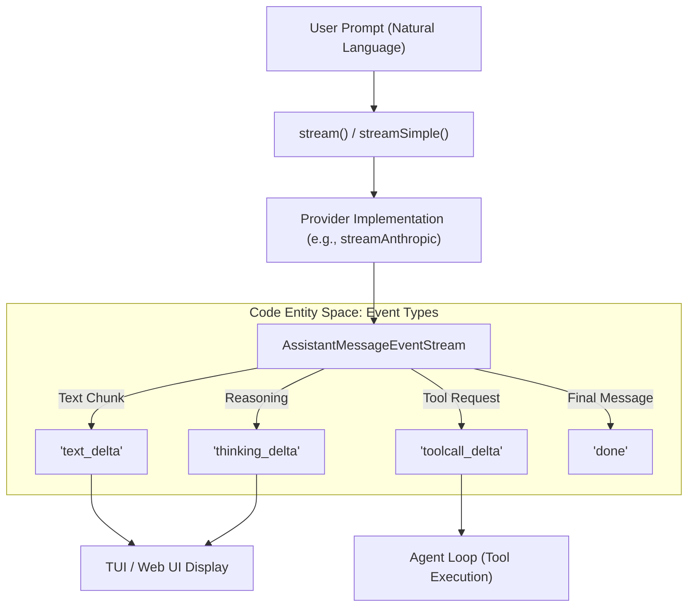
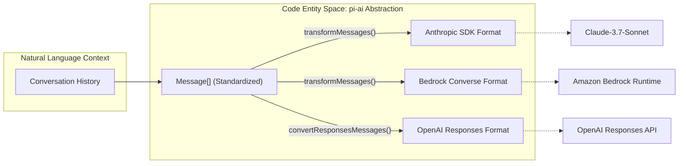

# LLM Provider Abstraction (pi-ai)

Relevant source files

The following files were used as context for generating this wiki page:

- [packages/ai/README.md](packages/ai/README.md)
- [packages/ai/src/index.ts](packages/ai/src/index.ts)
- [packages/ai/src/models.ts](packages/ai/src/models.ts)
- [packages/ai/src/providers/amazon-bedrock.ts](packages/ai/src/providers/amazon-bedrock.ts)
- [packages/ai/src/providers/anthropic.ts](packages/ai/src/providers/anthropic.ts)
- [packages/ai/src/providers/google.ts](packages/ai/src/providers/google.ts)
- [packages/ai/src/providers/openai-completions.ts](packages/ai/src/providers/openai-completions.ts)
- [packages/ai/src/providers/openai-responses.ts](packages/ai/src/providers/openai-responses.ts)
- [packages/ai/src/stream.ts](packages/ai/src/stream.ts)
- [packages/ai/src/types.ts](packages/ai/src/types.ts)
- [packages/ai/test/anthropic-adaptive-thinking-models.test.ts](packages/ai/test/anthropic-adaptive-thinking-models.test.ts)
- [packages/ai/test/anthropic-eager-tool-input-compat.test.ts](packages/ai/test/anthropic-eager-tool-input-compat.test.ts)
- [packages/ai/test/anthropic-force-adaptive-thinking.test.ts](packages/ai/test/anthropic-force-adaptive-thinking.test.ts)
- [packages/ai/test/anthropic-opus-4-8-smoke.test.ts](packages/ai/test/anthropic-opus-4-8-smoke.test.ts)
- [packages/ai/test/anthropic-thinking-disable.test.ts](packages/ai/test/anthropic-thinking-disable.test.ts)
- [packages/ai/test/bedrock-endpoint-resolution.test.ts](packages/ai/test/bedrock-endpoint-resolution.test.ts)
- [packages/ai/test/bedrock-thinking-payload.test.ts](packages/ai/test/bedrock-thinking-payload.test.ts)
- [packages/ai/test/openai-completions-tool-choice.test.ts](packages/ai/test/openai-completions-tool-choice.test.ts)
- [packages/ai/test/supports-xhigh.test.ts](packages/ai/test/supports-xhigh.test.ts)

The `@mariozechner/pi-ai` package provides a unified, streaming interface for interacting with diverse Large Language Model (LLM) providers. It abstracts away provider-specific SDK complexities, offering a consistent API for text generation, tool calling, and advanced features like "thinking" (reasoning) and prompt caching.

## Purpose and Scope

The core goal of `pi-ai` is to enable agentic workflows that are model-agnostic. It achieves this through:
- **Unified Streaming API**: A single protocol for handling real-time model output across all supported providers, including OpenAI, Anthropic, Google (Gemini/Vertex), Amazon Bedrock, and Mistral [packages/ai/src/stream.ts:40-74]().
- **Automatic Model Discovery**: A registry of model metadata including pricing, context limits, and capability flags [packages/ai/src/models.ts:1-13]().
- **Context Persistence**: A standardized `Context` format that allows seamless hand-off of conversation history between different models and providers [packages/ai/src/types.ts:253-258]().
- **Token and Cost Tracking**: Integrated calculation of input, output, and cache-related tokens and costs based on model-specific pricing [packages/ai/src/models.ts:39-46]().

Sources: [packages/ai/src/stream.ts:1-74](), [packages/ai/src/types.ts:1-260](), [packages/ai/src/models.ts:1-93]().

## Unified Streaming API

The abstraction layer exposes two primary interaction patterns: `stream()` and `complete()`. Both operate on a standardized `AssistantMessageEventStream`, which emits events for text deltas, tool call updates, and thinking/reasoning blocks.

### System Flow: Stream Event Lifecycle

This diagram bridges the Natural Language space (User Prompt) to the Code Entity space (Event Stream).

Sources: [packages/ai/src/stream.ts:40-74](), [packages/ai/src/utils/event-stream.ts:1-100](), [packages/ai/src/types.ts:147-159](), [packages/ai/src/providers/anthropic.ts:215-260]().

For details on the event protocol and specific provider logic (OpenAI, Anthropic, Google, Azure, Bedrock, etc.), see **[Streaming API and Provider Implementations](#3.1)**.

## Model Registry and Discovery

The package includes a comprehensive registry of known models and their capabilities. This metadata allows the system to automatically handle features like vision support, tool calling constraints, and pricing calculations without hardcoding logic for every model in the agent core.

| Feature | Description | Code Reference |
| :--- | :--- | :--- |
| **Model Registry** | Generated list of models with context limits and pricing. | `MODELS` [packages/ai/src/models.ts:1-13]() |
| **Cost Calculation** | Logic to calculate total cost from `Usage` and model rates. | `calculateCost()` [packages/ai/src/models.ts:39-46]() |
| **Credential Resolution** | Discovery of API keys from environment variables or config. | `getEnvApiKey()` [packages/ai/src/env-api-keys.ts:1-50]() |

Sources: [packages/ai/src/types.ts:228-251](), [packages/ai/src/env-api-keys.ts:1-50](), [packages/ai/src/models.ts:1-93]().

For details on how models are resolved and how API keys are managed, see **[Model Registry and Credential Resolution](#3.2)**.

## Cross-Provider Concerns

A significant challenge in LLM abstraction is maintaining session continuity when switching providers. `pi-ai` handles this through message transformation and standardized feature mapping.

### Feature Mapping: Thinking and Caching

The system maps high-level intents (like "high reasoning effort") to provider-specific parameters:
- **Thinking Levels**: Maps `minimal` to `xhigh` levels to specific provider flags like Anthropic's `effort` [packages/ai/src/providers/anthropic.ts:184-211]() or Bedrock's `reasoning` [packages/ai/src/providers/amazon-bedrock.ts:59-62]().
- **Prompt Caching**: Normalizes `cache_control` markers and session affinity headers across providers like Anthropic [packages/ai/src/providers/anthropic.ts:43-66]() and OpenAI Responses [packages/ai/src/providers/openai-responses.ts:47-52]().

### Context Migration Logic

Sources: [packages/ai/src/providers/transform-messages.ts:1-100](), [packages/ai/src/providers/anthropic.ts:37-39](), [packages/ai/src/providers/amazon-bedrock.ts:51-51](), [packages/ai/src/providers/openai-responses.ts:21-22]().

For details on message transformation, adaptive thinking, and prompt caching strategies, see **[Prompt Caching, Thinking, and Cross-Provider Handoff](#3.3)**.

***

**Child Pages:**
- [Streaming API and Provider Implementations](#3.1)
- [Model Registry and Credential Resolution](#3.2)
- [Prompt Caching, Thinking, and Cross-Provider Handoff](#3.3)
