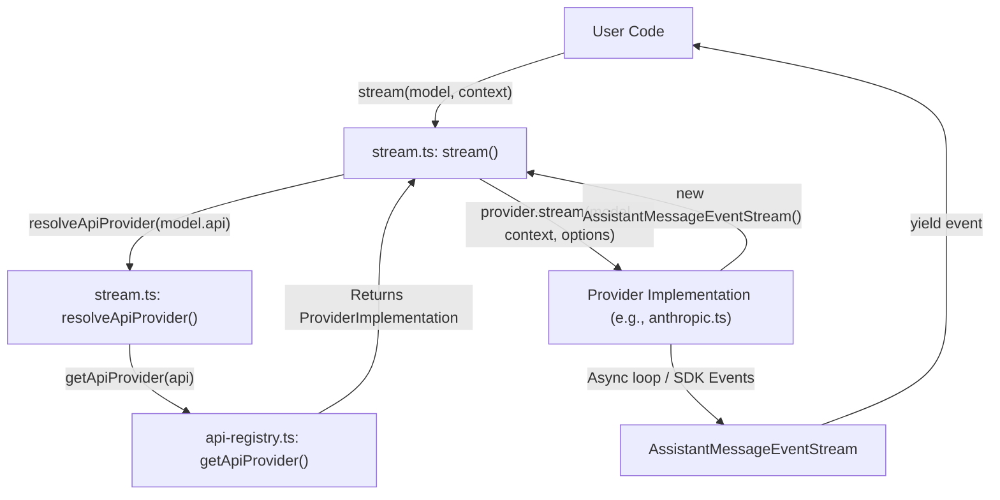
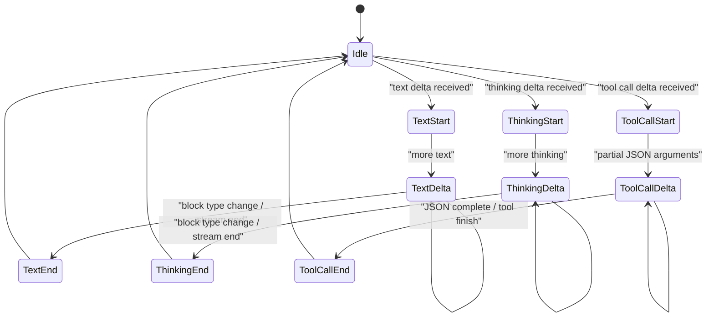

# Streaming API and Provider Implementations

Relevant source files

The following files were used as context for generating this wiki page:

- [packages/ai/README.md](packages/ai/README.md)
- [packages/ai/src/index.ts](packages/ai/src/index.ts)
- [packages/ai/src/models.ts](packages/ai/src/models.ts)
- [packages/ai/src/providers/amazon-bedrock.ts](packages/ai/src/providers/amazon-bedrock.ts)
- [packages/ai/src/providers/anthropic.ts](packages/ai/src/providers/anthropic.ts)
- [packages/ai/src/providers/azure-openai-responses.ts](packages/ai/src/providers/azure-openai-responses.ts)
- [packages/ai/src/providers/google-shared.ts](packages/ai/src/providers/google-shared.ts)
- [packages/ai/src/providers/google-vertex.ts](packages/ai/src/providers/google-vertex.ts)
- [packages/ai/src/providers/google.ts](packages/ai/src/providers/google.ts)
- [packages/ai/src/providers/mistral.ts](packages/ai/src/providers/mistral.ts)
- [packages/ai/src/providers/openai-codex-responses.ts](packages/ai/src/providers/openai-codex-responses.ts)
- [packages/ai/src/providers/openai-completions.ts](packages/ai/src/providers/openai-completions.ts)
- [packages/ai/src/providers/openai-prompt-cache.ts](packages/ai/src/providers/openai-prompt-cache.ts)
- [packages/ai/src/providers/openai-responses-shared.ts](packages/ai/src/providers/openai-responses-shared.ts)
- [packages/ai/src/providers/openai-responses.ts](packages/ai/src/providers/openai-responses.ts)
- [packages/ai/src/stream.ts](packages/ai/src/stream.ts)
- [packages/ai/src/types.ts](packages/ai/src/types.ts)
- [packages/ai/test/abort.test.ts](packages/ai/test/abort.test.ts)
- [packages/ai/test/anthropic-adaptive-thinking-models.test.ts](packages/ai/test/anthropic-adaptive-thinking-models.test.ts)
- [packages/ai/test/anthropic-eager-tool-input-compat.test.ts](packages/ai/test/anthropic-eager-tool-input-compat.test.ts)
- [packages/ai/test/anthropic-force-adaptive-thinking.test.ts](packages/ai/test/anthropic-force-adaptive-thinking.test.ts)
- [packages/ai/test/anthropic-opus-4-8-smoke.test.ts](packages/ai/test/anthropic-opus-4-8-smoke.test.ts)
- [packages/ai/test/anthropic-thinking-disable.test.ts](packages/ai/test/anthropic-thinking-disable.test.ts)
- [packages/ai/test/anthropic-tool-name-normalization.test.ts](packages/ai/test/anthropic-tool-name-normalization.test.ts)
- [packages/ai/test/azure-openai-base-url.test.ts](packages/ai/test/azure-openai-base-url.test.ts)
- [packages/ai/test/bedrock-endpoint-resolution.test.ts](packages/ai/test/bedrock-endpoint-resolution.test.ts)
- [packages/ai/test/bedrock-thinking-payload.test.ts](packages/ai/test/bedrock-thinking-payload.test.ts)
- [packages/ai/test/context-overflow.test.ts](packages/ai/test/context-overflow.test.ts)
- [packages/ai/test/empty.test.ts](packages/ai/test/empty.test.ts)
- [packages/ai/test/google-shared-gemini3-unsigned-tool-call.test.ts](packages/ai/test/google-shared-gemini3-unsigned-tool-call.test.ts)
- [packages/ai/test/google-vertex-api-key-resolution.test.ts](packages/ai/test/google-vertex-api-key-resolution.test.ts)
- [packages/ai/test/image-tool-result.test.ts](packages/ai/test/image-tool-result.test.ts)
- [packages/ai/test/lazy-module-load.test.ts](packages/ai/test/lazy-module-load.test.ts)
- [packages/ai/test/openai-codex-stream.test.ts](packages/ai/test/openai-codex-stream.test.ts)
- [packages/ai/test/openai-completions-prompt-cache.test.ts](packages/ai/test/openai-completions-prompt-cache.test.ts)
- [packages/ai/test/openai-completions-tool-choice.test.ts](packages/ai/test/openai-completions-tool-choice.test.ts)
- [packages/ai/test/openai-responses-copilot-provider.test.ts](packages/ai/test/openai-responses-copilot-provider.test.ts)
- [packages/ai/test/openai-responses-message-id.test.ts](packages/ai/test/openai-responses-message-id.test.ts)
- [packages/ai/test/stream.test.ts](packages/ai/test/stream.test.ts)
- [packages/ai/test/supports-xhigh.test.ts](packages/ai/test/supports-xhigh.test.ts)
- [packages/ai/test/tokens.test.ts](packages/ai/test/tokens.test.ts)
- [packages/ai/test/tool-call-without-result.test.ts](packages/ai/test/tool-call-without-result.test.ts)
- [packages/ai/test/total-tokens.test.ts](packages/ai/test/total-tokens.test.ts)
- [packages/ai/test/unicode-surrogate.test.ts](packages/ai/test/unicode-surrogate.test.ts)
- [packages/coding-agent/test/clipboard.test.ts](packages/coding-agent/test/clipboard.test.ts)

This page details the unified streaming interface provided by the `@mariozechner/pi-ai` package and the specific implementations for various LLM providers. The architecture abstracts provider-specific SDK differences while maintaining high-fidelity access to advanced features like tool calling, extended thinking, and prompt caching.

## Unified Streaming API

The core of the `pi-ai` package is a set of functions that provide a consistent interface for interacting with different LLM APIs by resolving providers from a central registry [packages/ai/src/stream.ts:32-38]().

### Core Functions
*   **`stream(model, context, options)`**: The primary entry point for streaming responses. It resolves the appropriate provider via the registry and initiates a stream of `AssistantMessageEvent` objects [packages/ai/src/stream.ts:40-47]().
*   **`complete(model, context, options)`**: A convenience wrapper around `stream()` that accumulates all events and returns a single `Promise<AssistantMessage>` [packages/ai/src/stream.ts:49-56]().
*   **`streamSimple(model, context, options)`**: Similar to `stream()`, but accepts `SimpleStreamOptions` which includes a unified `reasoning` (`ThinkingLevel`) parameter [packages/ai/src/stream.ts:58-65]().
*   **`completeSimple(model, context, options)`**: The non-streaming version of `streamSimple()` [packages/ai/src/stream.ts:67-74]().

### AssistantMessageEventStream
All streaming functions return an `AssistantMessageEventStream`, which is an async iterable of events [packages/ai/src/utils/event-stream.ts:1-50](). This stream emits fine-grained updates about the model's progress.

| Event Type | Description | Key Data |
| :--- | :--- | :--- |
| `start` | Emitted when the request begins. | `partial`: Initial `AssistantMessage` |
| `text_start` | Emitted when the first text chunk is received. | `contentIndex`: Index in the message content array |
| `text_delta` | Emitted for every chunk of text generated. | `delta`: The new string fragment |
| `text_end` | Emitted when a text block is completed. | `content`: Final text string |
| `thinking_start` | Emitted when reasoning/thinking begins. | `contentIndex`: Index in content array |
| `thinking_delta` | Emitted for reasoning/thinking chunks. | `delta`: The thinking fragment |
| `thinking_end` | Emitted when reasoning is completed. | `content`: Final thinking string |
| `toolcall_start` | Emitted when a tool call block begins. | `contentIndex`: Index in content array |
| `toolcall_delta` | Emitted for partial tool argument JSON. | `delta`: JSON fragment |
| `toolcall_end` | Emitted when a tool call is fully parsed. | `toolCall`: Completed `ToolCall` object |
| `done` | Emitted when the stream finishes successfully. | `message`: The final `AssistantMessage` |
| `error` | Emitted when a terminal error occurs. | `error`: `AssistantMessage` with error details |

**Sources:** [packages/ai/src/stream.ts:40-74](), [packages/ai/src/types.ts:2-4](), [packages/ai/src/utils/event-stream.ts:1-50]()

## Data Flow: From Call to Stream

The following diagram illustrates how a call to `stream()` is routed through the registry to a specific provider implementation.

### Code Entity Mapping: API Routing

**Sources:** [packages/ai/src/stream.ts:32-47](), [packages/ai/src/api-registry.ts:1-20](), [packages/ai/src/utils/event-stream.ts:1-50]()

## Provider Implementations

Each provider implementation is responsible for credential resolution via `getEnvApiKey` [packages/ai/src/env-api-keys.ts:4-29](), message transformation using `transformMessages` [packages/ai/src/providers/transform-messages.ts:1-50](), and mapping provider-specific SDK events to normalized `pi-ai` events.

### OpenAI (Completions & Responses)
*   **`openai-completions`**: Handles the standard chat completions API. It tracks tool call blocks by index and ID, parsing streaming JSON arguments via `parseStreamingJson` [packages/ai/src/providers/openai-completions.ts:162-208]().
*   **`openai-responses`**: Newer Responses API. It utilizes `processResponsesStream` for mapping events and handles reasoning effort [packages/ai/src/providers/openai-responses.ts:130-134]().
*   **Shared Logic**: Both standard and Codex implementations share `convertResponsesMessages` and `convertResponsesTools` to ensure consistent ID normalization and tool schema mapping [packages/ai/src/providers/openai-responses-shared.ts:1-100]().

### Anthropic
The Anthropic implementation [packages/ai/src/providers/anthropic.ts]() includes specific logic for:
*   **Claude Code Stealth Mode**: Normalizes tool names to match "Claude Code" canonical casing (e.g., `bash` -> `Bash`) to mimic official client behavior [packages/ai/src/providers/anthropic.ts:74-105]().
*   **Adaptive Thinking**: Maps `ThinkingLevel` to adaptive `effort` levels (e.g., `max`, `xhigh`, `high`, `medium`, `low`) for Claude 3.7+ models [packages/ai/src/providers/anthropic.ts:159-211]().
*   **Cache Control**: Supports ephemeral cache control with optional TTL for long retention [packages/ai/src/providers/anthropic.ts:53-66]().

### Google (Generative AI & Vertex)
*   **Thought Signatures**: Uses `retainThoughtSignature` to preserve reasoning context across chunks [packages/ai/src/providers/google.ts:133-136]().
*   **Tool ID Generation**: Generates unique IDs for tool calls if the API doesn't provide them, ensuring compatibility with the session manager [packages/ai/src/providers/google.ts:179-184]().

### Amazon Bedrock
Uses `BedrockRuntimeClient` and `ConverseStreamCommand` [packages/ai/src/providers/amazon-bedrock.ts:1-23]().
*   **Authentication**: Supports both standard SigV4 and `bearerToken` authentication for Bedrock API keys [packages/ai/src/providers/amazon-bedrock.ts:141-142]().
*   **Thinking**: Handles `thinking` blocks via the Bedrock content block structure and supports `thinkingDisplay` (summarized vs omitted) [packages/ai/src/providers/amazon-bedrock.ts:65-75]().

### OpenAI Codex (WebSocket & SSE)
A specialized implementation for the `openai-codex-responses` API [packages/ai/src/providers/openai-codex-responses.ts]().
*   **Transport Flexibility**: Supports both WebSocket and SSE transports, with specific error handling for WebSocket-specific issues like "Message Too Big" (code 1009) [packages/ai/src/providers/openai-codex-responses.ts:59-74]().
*   **Retry Logic**: Implements robust retry mechanisms for rate limits and service unavailability [packages/ai/src/providers/openai-codex-responses.ts:112-120]().

## Event Mapping Logic

Providers map internal deltas to unified event types by tracking the lifecycle of content blocks.

### Implementation: Block Lifecycle

**Sources:** [packages/ai/src/providers/google.ts:90-155](), [packages/ai/src/providers/openai-completions.ts:162-208](), [packages/ai/src/providers/anthropic.ts:31-37]()

## Summary of Provider Features

| Provider | API Key Env | Thinking Support | Tool Support | Caching Support |
| :--- | :--- | :--- | :--- | :--- |
| **OpenAI** | `OPENAI_API_KEY` | Yes (Reasoning Effort) | Yes | Yes (Metadata/Session) |
| **Anthropic** | `ANTHROPIC_API_KEY` | Yes (Adaptive Effort) | Yes | Yes (Ephemeral/TTL) |
| **Google** | `GOOGLE_API_KEY` | Yes (Thinking blocks) | Yes | Yes (Context) |
| **Bedrock** | `AWS_ACCESS_KEY_ID` | Yes (Claude 3.7+) | Yes | No |
| **Mistral** | `MISTRAL_API_KEY` | Yes | Yes | No |

**Sources:** [packages/ai/src/providers/openai-responses.ts:109-115](), [packages/ai/src/providers/anthropic.ts:53-66](), [packages/ai/src/providers/google.ts:74-78](), [packages/ai/src/providers/amazon-bedrock.ts:141-142]()
