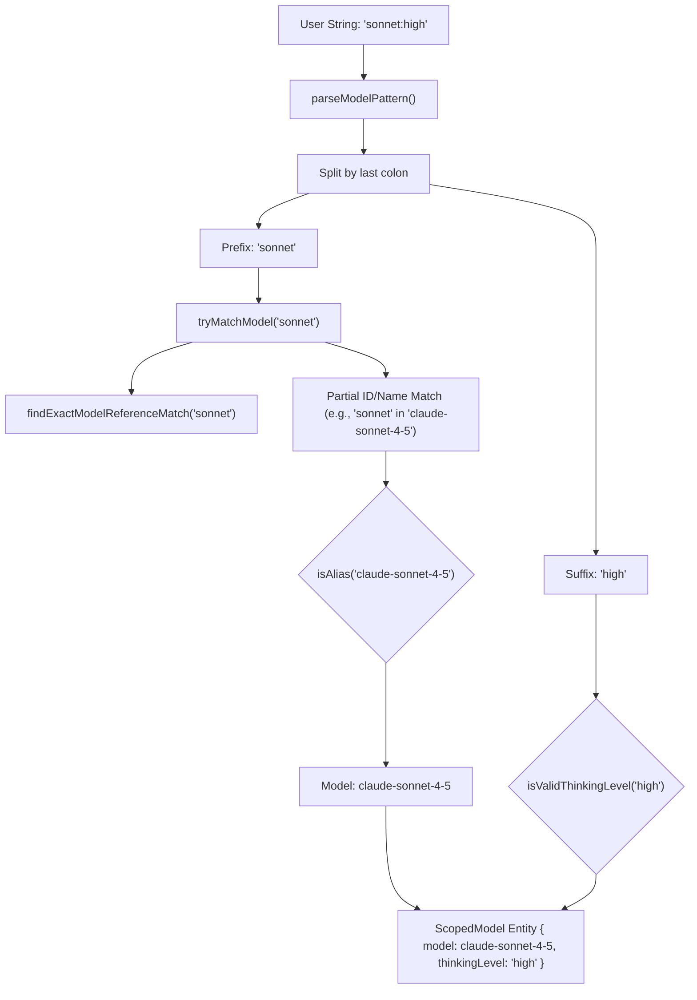
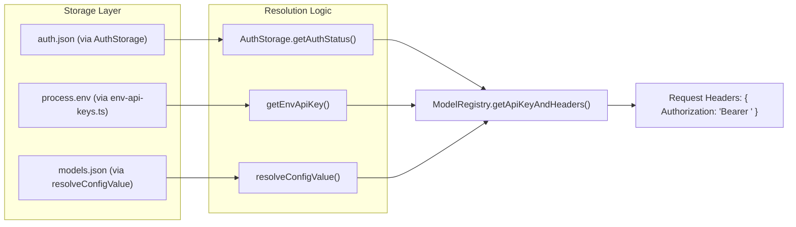

# Model Registry and Credential Resolution

Relevant source files

The following files were used as context for generating this wiki page:

- [packages/ai/scripts/generate-models.ts](packages/ai/scripts/generate-models.ts)
- [packages/ai/src/env-api-keys.ts](packages/ai/src/env-api-keys.ts)
- [packages/ai/src/models.generated.ts](packages/ai/src/models.generated.ts)
- [packages/ai/src/providers/simple-options.ts](packages/ai/src/providers/simple-options.ts)
- [packages/coding-agent/docs/custom-provider.md](packages/coding-agent/docs/custom-provider.md)
- [packages/coding-agent/docs/models.md](packages/coding-agent/docs/models.md)
- [packages/coding-agent/docs/providers.md](packages/coding-agent/docs/providers.md)
- [packages/coding-agent/src/core/auth-storage.ts](packages/coding-agent/src/core/auth-storage.ts)
- [packages/coding-agent/src/core/model-registry.ts](packages/coding-agent/src/core/model-registry.ts)
- [packages/coding-agent/src/core/model-resolver.ts](packages/coding-agent/src/core/model-resolver.ts)
- [packages/coding-agent/src/core/resolve-config-value.ts](packages/coding-agent/src/core/resolve-config-value.ts)
- [packages/coding-agent/test/auth-storage.test.ts](packages/coding-agent/test/auth-storage.test.ts)
- [packages/coding-agent/test/model-registry.test.ts](packages/coding-agent/test/model-registry.test.ts)
- [packages/coding-agent/test/model-resolver.test.ts](packages/coding-agent/test/model-resolver.test.ts)

The model registry and credential resolution system provides a unified interface for discovering LLMs across multiple providers, resolving their technical capabilities (reasoning, vision, context windows), and securely fetching the necessary authentication tokens.

## Model Registry

The model registry manages the lifecycle of model metadata, from build-time generation to runtime discovery and user-defined overrides.

### Build-time Generation (`generate-models.ts`)

To maintain an up-to-date list of models without manual maintenance, the system uses a build script `generate-models.ts` [packages/ai/scripts/generate-models.ts:1-2]() which aggregates data from various sources:
1.  **Dynamic Discovery:** Fetches model data from sources like the OpenRouter API [packages/ai/scripts/generate-models.ts:122-123]() and NVIDIA NIM [packages/ai/scripts/generate-models.ts:124-127]().
2.  **Normalization:** Normalizes provider-specific pricing (e.g., input/output/cache costs) and metadata [packages/ai/scripts/generate-models.ts:27-32]().
3.  **Thinking Level Mapping:** Defines how pi's abstract levels (minimal, high, etc.) map to provider-specific strings or values, such as OpenAI's `reasoning_effort` or Anthropic's adaptive thinking [packages/ai/scripts/generate-models.ts:163-178]().
4.  **Output:** Generates the static `MODELS` registry in `models.generated.ts` [packages/ai/src/models.generated.ts:1-6](). This file contains thousands of lines of metadata for models from Bedrock, Anthropic, OpenAI, Google, and others [packages/ai/src/models.generated.ts:7-241]().

### Runtime Registry (`ModelRegistry`)

The `ModelRegistry` class in `pi-coding-agent` is the primary entry point for model discovery at runtime [packages/coding-agent/src/core/model-registry.ts:1-20]().

*   **Custom Models:** It loads user-defined models and overrides from `~/.pi/agent/models.json` [packages/coding-agent/src/core/model-registry.ts:22-27]().
*   **Validation:** Custom models are validated against the `ModelDefinitionSchema` using TypeBox [packages/coding-agent/src/core/model-registry.ts:151-171]().
*   **API Compatibility:** It handles compatibility settings for providers that emulate standard APIs, such as `OpenAICompletionsCompat` [packages/coding-agent/src/core/model-registry.ts:101-127]().

**Sources:** [packages/ai/scripts/generate-models.ts](), [packages/ai/src/models.generated.ts](), [packages/coding-agent/src/core/model-registry.ts](), [packages/coding-agent/docs/models.md]()

---

## Model Resolution Algorithm

Model resolution transforms a user-provided string (e.g., from the `--model` flag or `/model` command) into a concrete `Model` object and an optional `ThinkingLevel`.

### Resolution Flow

The `parseModelPattern` function implements a matching algorithm [packages/coding-agent/src/core/model-resolver.ts:192-215]():

1.  **Exact Match:** Checks if the pattern matches a `provider/modelId` or a bare `modelId` exactly via `findExactModelReferenceMatch()` [packages/coding-agent/src/core/model-resolver.ts:76-118]().
2.  **Thinking Suffix:** If no match is found and the pattern contains a colon (e.g., `sonnet:high`), it checks if the suffix is a valid `ThinkingLevel` using `isValidThinkingLevel()` [packages/coding-agent/src/core/model-resolver.ts:211-215](). If valid, it strips the suffix and recurses on the prefix.
3.  **Fuzzy/Glob Match:** If still no match, `tryMatchModel()` performs a partial case-insensitive search on model IDs and names [packages/coding-agent/src/core/model-resolver.ts:124-135]().
4.  **Alias Preference:** When multiple models match (e.g., `claude-3-5-sonnet` vs `claude-3-5-sonnet-20241022`), the algorithm prefers "aliases" (IDs without date suffixes) via `isAlias()` [packages/coding-agent/src/core/model-resolver.ts:62-69]().

### Initial Model Selection

The system determines the starting model for a session by checking:
1.  The `--model` CLI argument.
2.  The `PI_MODEL` environment variable.
3.  A hardcoded default per provider via `defaultModelPerProvider` [packages/coding-agent/src/core/model-resolver.ts:14-50]().

### Model Mapping: Natural Language to Code Entity

Title: Model Resolution Data Flow

**Sources:** [packages/coding-agent/src/core/model-resolver.ts](), [packages/coding-agent/test/model-resolver.test.ts]()

---

## Credential Resolution

Credentials (API keys and OAuth tokens) are resolved through a tiered priority system managed by `AuthStorage` and `env-api-keys.ts`.

### Resolution Priority

When a request is made, `ModelRegistry` resolves credentials in the following order:

1.  **CLI Overrides:** Provided via `--api-key` and set via `setRuntimeApiKey()` [packages/coding-agent/src/core/auth-storage.ts:229-231]().
2.  **Auth File (`auth.json`):** Stored in `~/.pi/agent/auth.json`. Managed by `AuthStorage` [packages/coding-agent/src/core/auth-storage.ts:24-35]().
3.  **Environment Variables:** Standard variables like `OPENAI_API_KEY` or `ANTHROPIC_API_KEY` mapped in `env-api-keys.ts` [packages/ai/src/env-api-keys.ts:91-133]().
4.  **Custom Resolvers:** Shell commands defined in `models.json` (e.g., `"apiKey": "!op read ..."`).

### Dynamic Value Resolution

The `resolveConfigValue` function handles the supported formats for keys and headers [packages/coding-agent/src/core/resolve-config-value.ts:39-42]():
*   **Literal:** String used as-is.
*   **Shell Command:** Strings starting with `!` are executed via `child_process`, and their `stdout` is used as the value [packages/coding-agent/src/core/resolve-config-value.ts:36-36]().
*   **Environment Interpolation:** Strings containing `$ENV_VAR` or `${ENV_VAR}` are expanded using current process environment [packages/coding-agent/docs/providers.md:113-121]().

### OAuth Flow Implementation

For subscription-based providers like GitHub Copilot or OpenAI Codex, the system implements OAuth flows.
1.  Users initiate via the `/login` command [packages/coding-agent/docs/providers.md:14-22]().
2.  Credentials are managed by `AuthStorage`, which uses file locking (`proper-lockfile`) to prevent race conditions when multiple instances attempt to refresh tokens [packages/coding-agent/src/core/auth-storage.ts:7-22]().
3.  The `withLockAsync` method ensures atomic updates to `auth.json` [packages/coding-agent/src/core/auth-storage.ts:124-172]().

### Credential Entity Mapping

Title: Credential Discovery and Resolution

**Sources:** [packages/coding-agent/src/core/auth-storage.ts](), [packages/coding-agent/src/core/model-registry.ts](), [packages/ai/src/env-api-keys.ts](), [packages/coding-agent/src/core/resolve-config-value.ts]()

---

## File Summary Table

| File | Role |
| :--- | :--- |
| `packages/ai/src/models.generated.ts` | The auto-generated source of truth for all built-in model metadata [packages/ai/src/models.generated.ts:1-6](). |
| `packages/ai/scripts/generate-models.ts` | Script that aggregates data from providers to build the registry [packages/ai/scripts/generate-models.ts:1-23](). |
| `packages/coding-agent/src/core/model-registry.ts` | Manages the runtime collection of models and validates `models.json` [packages/coding-agent/src/core/model-registry.ts:1-20](). |
| `packages/coding-agent/src/core/model-resolver.ts` | Implements fuzzy matching, thinking level parsing, and default selection logic [packages/coding-agent/src/core/model-resolver.ts:1-12](). |
| `packages/coding-agent/src/core/auth-storage.ts` | Thread-safe storage for `auth.json` credentials using file locks [packages/coding-agent/src/core/auth-storage.ts:1-22](). |
| `packages/ai/src/env-api-keys.ts` | Maps providers to their standard environment variable names [packages/ai/src/env-api-keys.ts:91-133](). |

**Sources:** [packages/ai/src/models.generated.ts](), [packages/ai/scripts/generate-models.ts](), [packages/coding-agent/src/core/model-registry.ts](), [packages/coding-agent/src/core/model-resolver.ts](), [packages/coding-agent/src/core/auth-storage.ts](), [packages/ai/src/env-api-keys.ts]()
