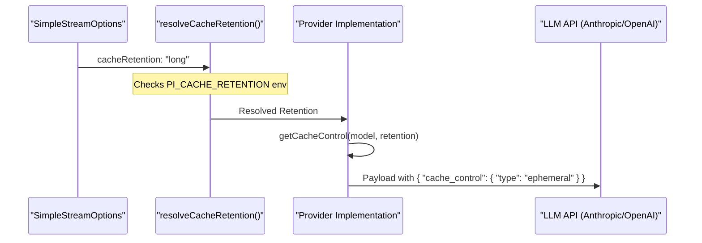
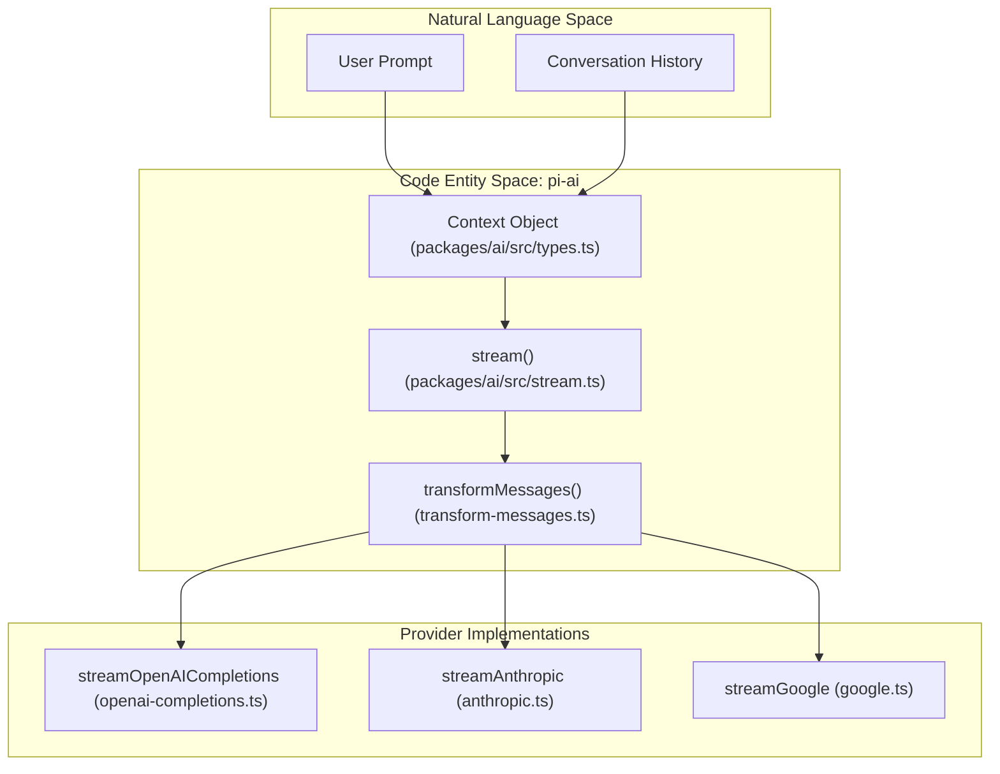
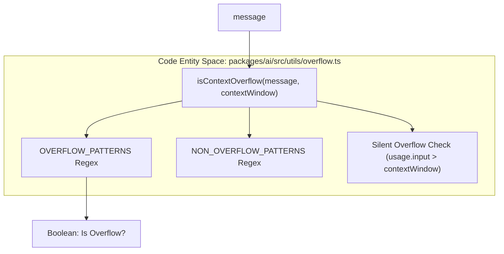

# Prompt Caching, Thinking, and Cross-Provider Handoff

Relevant source files

The following files were used as context for generating this wiki page:

- [packages/ai/src/providers/transform-messages.ts](packages/ai/src/providers/transform-messages.ts)
- [packages/ai/src/utils/json-parse.ts](packages/ai/src/utils/json-parse.ts)
- [packages/ai/src/utils/overflow.ts](packages/ai/src/utils/overflow.ts)
- [packages/ai/test/anthropic-sse-parsing.test.ts](packages/ai/test/anthropic-sse-parsing.test.ts)
- [packages/ai/test/cache-retention.test.ts](packages/ai/test/cache-retention.test.ts)
- [packages/ai/test/cross-provider-handoff.test.ts](packages/ai/test/cross-provider-handoff.test.ts)
- [packages/ai/test/github-copilot-anthropic.test.ts](packages/ai/test/github-copilot-anthropic.test.ts)
- [packages/ai/test/overflow.test.ts](packages/ai/test/overflow.test.ts)
- [packages/ai/test/transform-messages-copilot-openai-to-anthropic.test.ts](packages/ai/test/transform-messages-copilot-openai-to-anthropic.test.ts)

This page details the advanced capabilities of the `@mariozechner/pi-ai` package, focusing on how it manages stateful LLM features like prompt caching and internal reasoning (thinking), and how it facilitates seamless context migration between different model providers.

## Prompt Caching

Prompt caching reduces latency and cost by reusing prefix computations for long contexts. The system implements a unified interface for caching across different provider implementations.

### Cache Retention and Control
The `CacheRetention` type defines the preferred persistence level for a cached prompt: `none`, `short`, or `long` [packages/ai/src/types.ts:75-75]().

*   **OpenAI (Completions/Responses):** For direct OpenAI requests, `long` retention maps to a `24h` duration via the `prompt_cache_retention` field [packages/ai/src/providers/openai-prompt-cache.ts:51-53](). It also supports setting a `prompt_cache_key` based on the `sessionId`, clamped to 64 characters [packages/ai/src/providers/openai-prompt-cache.ts:46-49]().
*   **Anthropic:** Uses `cache_control` with an `ephemeral` type. If `long` retention is requested and supported by the model, it adds a `ttl: "1h"` property [packages/ai/src/providers/anthropic.ts:54-67]().
*   **Session Affinity:** For providers that support session-based routing, the `sessionId` is passed via headers like `session_id`, `x-client-request-id`, or `x-session-affinity` [packages/ai/src/providers/openai-prompt-cache.ts:65-72](). This is configurable via `compat.sendSessionAffinityHeaders` [packages/ai/src/providers/openai-prompt-cache.ts:64-64]().

### Data Flow: Caching Request
The following diagram illustrates how cache preferences are resolved and applied during a request lifecycle.

**Prompt Cache Resolution Flow**

Sources: [packages/ai/src/providers/anthropic.ts:44-67](), [packages/ai/src/providers/openai-prompt-cache.ts:40-75](), [packages/ai/test/cache-retention.test.ts:23-50](), [packages/ai/test/openai-completions-prompt-cache.test.ts:114-133]()

---

## Thinking and Reasoning

"Thinking" refers to the model's internal chain-of-thought process before generating a final answer. `pi-ai` provides a unified interface for streaming and capturing these blocks.

### Thinking Levels and Budgets
The system uses a `ThinkingLevel` map (`minimal`, `low`, `medium`, `high`, `xhigh`) to abstract provider-specific reasoning efforts [packages/ai/src/types.ts:62-64]().

*   **Adaptive Thinking:** Modern models (e.g., Claude 3.7, GPT-o1) use adaptive thinking where the model determines the depth. This is controlled via `reasoningEffort` (OpenAI) or `effort` (Anthropic) [packages/ai/src/providers/openai-responses.ts:55-59](), [packages/ai/src/providers/anthropic.ts:181-203]().
*   **Budget-based Thinking:** Specific models (e.g., Google Gemini 2.0+) use a `thinkingBudgetTokens` to cap reasoning [packages/ai/src/providers/google.ts:38-43](), [packages/ai/src/types.ts:67-72]().

### Redacted Thinking and Signatures
When a model's thinking is redacted (e.g., by safety filters), the system handles the content via `ThinkingContent` blocks [packages/ai/src/types.ts:252-261](). 
*   **`thinkingSignature`**: Stores opaque, often encrypted, payloads from the provider. This signature is critical for multi-turn continuity, as it must be passed back to the provider in subsequent turns even if the thinking text is redacted or omitted from the UI [packages/ai/src/providers/google.ts:131-134](), [packages/ai/src/types.ts:258-260]().
*   **`thoughtSignature`**: Similar to the above, this is used specifically in `ToolCall` objects to maintain reasoning context during tool execution [packages/ai/src/types.ts:235-237]().

### Thinking Implementation Details
| Feature | OpenAI Implementation | Anthropic Implementation | Google Implementation |
| :--- | :--- | :--- | :--- |
| **Option Name** | `reasoningEffort` | `effort` | `thinking.budgetTokens` |
| **Content Type** | `thinking` block | `thinking` block | `thinking` block |
| **Streaming** | `thinking_delta` event | `thinking_delta` event | `thinking_delta` event |
| **Persistence** | `thinkingSignature` | Opaque signature in block | `thoughtSignature` |

Sources: [packages/ai/src/providers/openai-responses.ts:153-160](), [packages/ai/src/providers/anthropic.ts:181-212](), [packages/ai/src/providers/google.ts:36-43](), [packages/ai/src/types.ts:62-72]()

---

## Cross-Provider Context Migration

A core strength of `pi-ai` is the ability to hand off a conversation context from one provider to another mid-session. This is handled primarily by `transformMessages` [packages/ai/src/providers/transform-messages.ts:64-68]().

### `transformMessages` Logic
The `transformMessages` function performs several critical transformations to ensure cross-provider compatibility:

1.  **Image Downgrading**: If the target model does not support vision (`!model.input.includes("image")`), image blocks are replaced with placeholders like `(image omitted: model does not support images)` [packages/ai/src/providers/transform-messages.ts:12-13](), [packages/ai/src/providers/transform-messages.ts:35-57]().
2.  **Tool Call ID Normalization**: Different providers have varying ID constraints. For example, Anthropic requires `^[a-zA-Z0-9_-]+$` (max 64 chars), while OpenAI Responses can generate 450+ char IDs with pipe characters [packages/ai/src/providers/transform-messages.ts:60-63](). The function maps original IDs to normalized versions and updates corresponding `toolResult` messages [packages/ai/src/providers/transform-messages.ts:69-87]().
3.  **Thinking Block Conversion**: 
    *   **Same Model**: Keeps thinking blocks and signatures (including redacted content) for replay [packages/ai/src/providers/transform-messages.ts:98-106]().
    *   **Different Model**: Redacted thinking is dropped. Plaintext thinking is converted to standard `text` blocks so the new model can see the previous model's reasoning [packages/ai/src/providers/transform-messages.ts:101-113](). `thoughtSignature` is stripped from tool calls [packages/ai/src/providers/transform-messages.ts:128-131]().
4.  **Orphaned Tool Call Resolution**: The system identifies tool calls that lack a corresponding result (e.g., due to an error or interruption). It inserts synthetic `toolResult` messages with `isError: true` and "No result provided" text to satisfy API requirements for complete turn sequences [packages/ai/src/providers/transform-messages.ts:156-177]().

### Implementation: Context Handoff Architecture
The `stream` function acts as the entry point, resolving the correct provider and invoking the implementation which applies the transformation via `transformMessages`.

**Context Handoff Architecture**

Sources: [packages/ai/src/providers/transform-messages.ts:64-220](), [packages/ai/src/stream.ts:25-32](), [packages/ai/test/cross-provider-handoff.test.ts:1-23](), [packages/ai/test/transform-messages-copilot-openai-to-anthropic.test.ts:49-88]()

### Robustness Utilities
To handle the "messy" reality of cross-provider handoff, `pi-ai` includes:
*   **`repairJson`**: Escapes raw control characters and fixes invalid escape sequences in tool call JSON, which is common in streamed outputs [packages/ai/src/utils/json-parse.ts:32-83]().
*   **`parseStreamingJson`**: Uses `partial-json` and `repairJson` to extract as much valid data as possible from incomplete tool call streams [packages/ai/src/utils/json-parse.ts:104-124]().

### Token and Context Overflow
During handoff, `pi-ai` tracks cumulative `Usage`. The `isContextOverflow` utility detects when the combined context exceeds the target model's limits [packages/ai/src/utils/overflow.ts:125-126]().
*   **Error Detection**: Uses `OVERFLOW_PATTERNS` to match error strings from over 20 providers (Anthropic, OpenAI, Google, Groq, xAI, etc.) [packages/ai/src/utils/overflow.ts:34-58]().
*   **Silent Overflow**: Detects providers that truncate silently (like Xiaomi MiMo) by checking for `stopReason: "length"` combined with zero output tokens and a filled context window [packages/ai/src/utils/overflow.ts:104-108](), [packages/ai/test/overflow.test.ts:106-109]().

**Overflow Detection Logic**

Sources: [packages/ai/src/utils/json-parse.ts:32-124](), [packages/ai/src/utils/overflow.ts:1-126](), [packages/ai/test/overflow.test.ts:1-120]()
