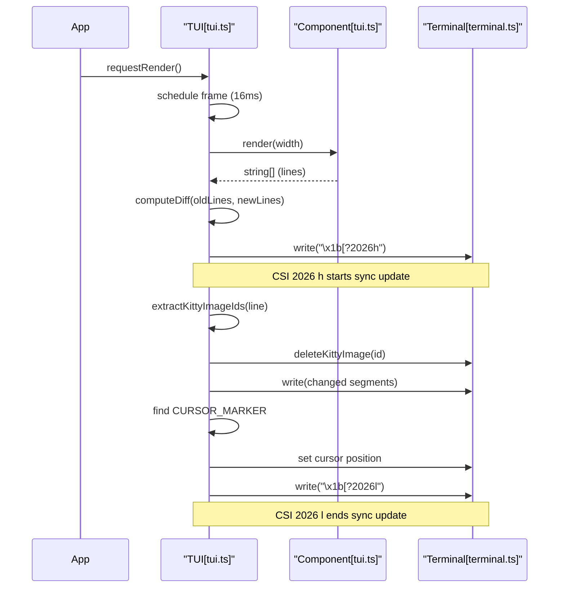

# Terminal UI (pi-tui)

<details>
<summary>Relevant source files</summary>

The following files were used as context for generating this wiki page:

- [packages/coding-agent/docs/terminal-setup.md](packages/coding-agent/docs/terminal-setup.md)
- [packages/coding-agent/docs/tui.md](packages/coding-agent/docs/tui.md)
- [packages/coding-agent/examples/extensions/overlay-qa-tests.ts](packages/coding-agent/examples/extensions/overlay-qa-tests.ts)
- [packages/tui/README.md](packages/tui/README.md)
- [packages/tui/native/darwin/prebuilds/darwin-arm64/darwin-modifiers.node](packages/tui/native/darwin/prebuilds/darwin-arm64/darwin-modifiers.node)
- [packages/tui/native/darwin/prebuilds/darwin-x64/darwin-modifiers.node](packages/tui/native/darwin/prebuilds/darwin-x64/darwin-modifiers.node)
- [packages/tui/native/darwin/src/darwin-modifiers.c](packages/tui/native/darwin/src/darwin-modifiers.c)
- [packages/tui/src/native-modifiers.ts](packages/tui/src/native-modifiers.ts)
- [packages/tui/src/terminal.ts](packages/tui/src/terminal.ts)
- [packages/tui/src/tui.ts](packages/tui/src/tui.ts)
- [packages/tui/test/chat-simple.ts](packages/tui/test/chat-simple.ts)
- [packages/tui/test/key-tester.ts](packages/tui/test/key-tester.ts)
- [packages/tui/test/overlay-non-capturing.test.ts](packages/tui/test/overlay-non-capturing.test.ts)
- [packages/tui/test/overlay-options.test.ts](packages/tui/test/overlay-options.test.ts)
- [packages/tui/test/overlay-short-content.test.ts](packages/tui/test/overlay-short-content.test.ts)
- [packages/tui/test/terminal.test.ts](packages/tui/test/terminal.test.ts)
- [packages/tui/test/tui-overlay-style-leak.test.ts](packages/tui/test/tui-overlay-style-leak.test.ts)
- [packages/tui/test/tui-render.test.ts](packages/tui/test/tui-render.test.ts)
- [packages/tui/test/virtual-terminal.ts](packages/tui/test/virtual-terminal.ts)

</details>


The `@mariozechner/pi-tui` package is a high-performance, differential rendering UI framework designed specifically for interactive CLI applications. It provides a component-based architecture, advanced terminal abstractions, and flicker-free updates using modern terminal protocols like **CSI 2026**. [packages/tui/README.md:1-15]()

## Core Concepts

The TUI is built on a "render-loop" model where components produce an array of strings (lines) representing their visual state. The core `TUI` class manages the lifecycle, input distribution, and the efficient transmission of these lines to the terminal. [packages/tui/src/tui.ts:1-12]()

### Differential Rendering
To ensure high performance and low latency, `pi-tui` employs a three-strategy rendering system that only updates what changed. [packages/tui/README.md:7-9](). It tracks the previous state of the terminal and calculates the minimal set of escape sequences needed to transform the current view into the next. This is critical for maintaining a 16ms frame budget during complex operations like streaming AI responses. [packages/tui/src/tui.ts:1-12]()

For details, see [TUI Core: Rendering and Terminal Abstraction](#4.1).

### Component Model
The system uses a simple but powerful interface for UI elements. Every visual element must implement the `Component` interface, which defines how it should be rendered given a specific viewport width. [packages/tui/src/tui.ts:39-63]()

| Interface | Responsibility |
| :--- | :--- |
| `Component` | The base interface for all UI elements. Defines `render(width)`, `handleInput(data)`, and `invalidate()`. [packages/tui/src/tui.ts:39-63]() |
| `Focusable` | An extension for components that can receive keyboard focus and need to display a hardware cursor for IME support. [packages/tui/src/tui.ts:74-77]() |
| `OverlayHandle` | A handle returned when showing an overlay, used to control visibility and focus. [packages/tui/src/tui.ts:188-201]() |

### Input and Focus
Input is handled through a centralized listener system. When a component is focused via `tui.setFocus(component)`, it becomes the primary recipient of keyboard data. [packages/tui/README.md:38-47](). The TUI uses a `StdinBuffer` to split batched input into individual sequences, ensuring that components receive single events for reliable key matching. [packages/tui/src/terminal.ts:178-182]()

For details, see [Editor, Input, and Keybindings](#4.2).

## System Architecture

The following diagram illustrates the relationship between the core `TUI` engine, the terminal abstraction, and the component library.

### TUI Entity Relationship
```mermaid
graph TD
    subgraph "Terminal Abstraction"
        "Terminal[terminal.ts]" --> "ProcessTerminal[terminal.ts]"
        "Terminal[terminal.ts]" --> "VirtualTerminal[virtual-terminal.ts]"
    end

    subgraph "Core Engine"
        "TUI[tui.ts]" -- "manages" --> "Component[tui.ts]"
        "TUI[tui.ts]" -- "writes to" --> "Terminal[terminal.ts]"
        "TUI[tui.ts]" -- "handles" --> "OverlayHandle[tui.ts]"
        "ProcessTerminal[terminal.ts]" -- "negotiates" --> "KittyProtocol[terminal.ts]"
    end

    subgraph "Component Library"
        "Component[tui.ts]" <|-- "Container[tui.ts]"
        "Component[tui.ts]" <|-- "Editor[components/editor.ts]"
        "Component[tui.ts]" <|-- "Input[components/input.ts]"
        "Component[tui.ts]" <|-- "Markdown[components/markdown.ts]"
        "Component[tui.ts]" <|-- "Loader[components/loader.ts]"
    end

    "Container[tui.ts]" -- "contains" --> "Component[tui.ts]"
    "ProcessTerminal[terminal.ts]" -- "uses" --> "StdinBuffer[stdin-buffer.ts]"
    "TUI[tui.ts]" -- "positions" --> "CURSOR_MARKER[tui.ts]"
```
Sources: [packages/tui/src/tui.ts:39-230](), [packages/tui/src/terminal.ts:53-112](), [packages/tui/README.md:53-154](), [packages/tui/src/tui.ts:90-90]()

## Key Features

### Synchronized Output
The TUI uses **CSI 2026** (Synchronized Output) to ensure that frames are rendered atomically. This prevents the "tearing" or flickering common in terminal applications when updating large sections of the screen. [packages/tui/README.md:8]()

### Overlay System
`pi-tui` supports a sophisticated overlay system for modals, dropdowns, and floating dialogs. Overlays are managed via `OverlayOptions` and can be positioned using anchors (e.g., `center`, `bottom-right`) or percentage-based coordinates. [packages/tui/src/tui.ts:95-177](). The system supports `nonCapturing` overlays that don't steal keyboard focus on creation. [packages/tui/test/overlay-non-capturing.test.ts:56-72]()

### Keyboard Protocol Negotiation
The `ProcessTerminal` class automatically negotiates the **Kitty keyboard protocol** with the terminal. This allows for reliable detection of modifier keys (like `Shift+Enter`) that are otherwise indistinguishable from standard keys in many terminal emulators. [packages/tui/src/terminal.ts:164-168](). If the terminal does not support Kitty, it falls back to `modifyOtherKeys`. [packages/tui/test/terminal.test.ts:105-130]()

### TUI Rendering Flow

Sources: [packages/tui/src/tui.ts:1-34](), [packages/tui/src/tui.ts:85-90](), [packages/tui/README.md:7-15](), [packages/tui/src/terminal.ts:68-74]()

## Child Pages

- **[TUI Core: Rendering and Terminal Abstraction](#4.1)**: Details the differential rendering strategies, synchronized output, terminal abstraction (`Terminal`/`ProcessTerminal`), and inline image protocols.
- **[Editor, Input, and Keybindings](#4.2)**: Covers the multi-line `Editor` and single-line `Input` components, grapheme-aware cursor movement, undo stack, and `KeybindingsManager`.
- **[TUI Components Library](#4.3)**: A catalog of built-in components including `Markdown`, `SelectList`, `SettingsList`, `Image`, `Box`, and the `Focusable` interface for IME support.

---
Sources:
- [packages/tui/src/tui.ts:1-230]()
- [packages/tui/src/terminal.ts:1-200]()
- [packages/tui/README.md:1-155]()
- [packages/coding-agent/docs/tui.md:9-85]()
- [packages/tui/test/terminal.test.ts:1-175]()
- [packages/tui/test/overlay-non-capturing.test.ts:1-113]()
