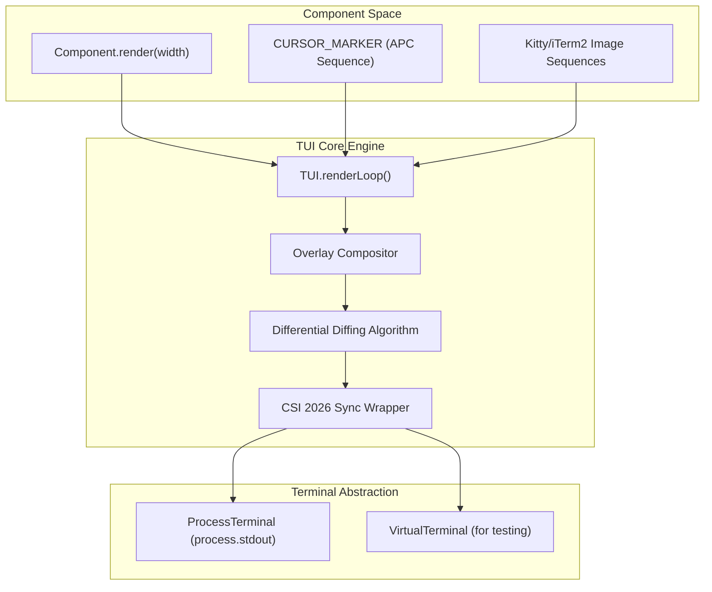
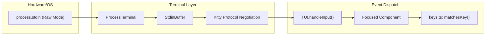

# TUI Core: Rendering and Terminal Abstraction

<details>
<summary>Relevant source files</summary>

The following files were used as context for generating this wiki page:

- [packages/coding-agent/docs/terminal-setup.md](packages/coding-agent/docs/terminal-setup.md)
- [packages/coding-agent/docs/tui.md](packages/coding-agent/docs/tui.md)
- [packages/coding-agent/examples/extensions/overlay-qa-tests.ts](packages/coding-agent/examples/extensions/overlay-qa-tests.ts)
- [packages/coding-agent/test/theme-detection.test.ts](packages/coding-agent/test/theme-detection.test.ts)
- [packages/tui/README.md](packages/tui/README.md)
- [packages/tui/native/darwin/prebuilds/darwin-arm64/darwin-modifiers.node](packages/tui/native/darwin/prebuilds/darwin-arm64/darwin-modifiers.node)
- [packages/tui/native/darwin/prebuilds/darwin-x64/darwin-modifiers.node](packages/tui/native/darwin/prebuilds/darwin-x64/darwin-modifiers.node)
- [packages/tui/native/darwin/src/darwin-modifiers.c](packages/tui/native/darwin/src/darwin-modifiers.c)
- [packages/tui/src/components/image.ts](packages/tui/src/components/image.ts)
- [packages/tui/src/native-modifiers.ts](packages/tui/src/native-modifiers.ts)
- [packages/tui/src/terminal-image.ts](packages/tui/src/terminal-image.ts)
- [packages/tui/src/terminal.ts](packages/tui/src/terminal.ts)
- [packages/tui/src/tui.ts](packages/tui/src/tui.ts)
- [packages/tui/src/utils.ts](packages/tui/src/utils.ts)
- [packages/tui/test/chat-simple.ts](packages/tui/test/chat-simple.ts)
- [packages/tui/test/key-tester.ts](packages/tui/test/key-tester.ts)
- [packages/tui/test/overlay-non-capturing.test.ts](packages/tui/test/overlay-non-capturing.test.ts)
- [packages/tui/test/overlay-options.test.ts](packages/tui/test/overlay-options.test.ts)
- [packages/tui/test/overlay-short-content.test.ts](packages/tui/test/overlay-short-content.test.ts)
- [packages/tui/test/regression-regional-indicator-width.test.ts](packages/tui/test/regression-regional-indicator-width.test.ts)
- [packages/tui/test/terminal-image.test.ts](packages/tui/test/terminal-image.test.ts)
- [packages/tui/test/terminal.test.ts](packages/tui/test/terminal.test.ts)
- [packages/tui/test/truncate-to-width.test.ts](packages/tui/test/truncate-to-width.test.ts)
- [packages/tui/test/tui-overlay-style-leak.test.ts](packages/tui/test/tui-overlay-style-leak.test.ts)
- [packages/tui/test/tui-render.test.ts](packages/tui/test/tui-render.test.ts)
- [packages/tui/test/virtual-terminal.ts](packages/tui/test/virtual-terminal.ts)
- [packages/tui/test/wrap-ansi.test.ts](packages/tui/test/wrap-ansi.test.ts)
- [packages/tui/vitest.config.ts](packages/tui/vitest.config.ts)

</details>


The `@earendil-works/pi-tui` package delivers a minimal yet powerful terminal user interface (TUI) framework. It features a component model with differential rendering and terminal abstraction layers that enable high-performance, flicker-free interactive CLI applications. This page details the implementation and workings of the core `TUI` class, the differential rendering strategies it employs, the CSI 2026 synchronized output for atomic screen updates, the `Terminal`/`ProcessTerminal` abstraction, inline image rendering support via Kitty and iTerm2 protocols, the overlay compositing system, and the enforcement of a 16ms frame rendering budget.

---

## The TUI Class: Core Rendering Engine

The `TUI` class in [packages/tui/src/tui.ts:214]() acts as the central orchestrator of terminal rendering. It manages child components, processes input events, handles terminal resizing, and efficiently renders UI updates.

### Key Responsibilities
- Manage a tree of components implementing the `Component` interface [packages/tui/src/tui.ts:39-63]().
- Provide differential rendering by computing diffs between frames to minimize redraws [packages/tui/src/tui.ts:1335-1440]().
- Support overlays for modal or floating UI elements via `showOverlay` [packages/tui/src/tui.ts:468-525]().
- Handle cursor positioning and IME-friendly hardware cursor support using `CURSOR_MARKER` [packages/tui/src/tui.ts:90]().
- Maintain a fixed frame budget (~16ms) to ensure responsive UI updates [packages/tui/src/tui.ts:1310-1330]().

### Component Interface
Components adhere to a minimal interface defined in [packages/tui/src/tui.ts:39-63]():

```typescript
export interface Component {
    render(width: number): string[];
    handleInput?(data: string): void;
    wantsKeyRelease?: boolean;
    invalidate(): void;
}
```

Focusable components implement the `Focusable` interface [packages/tui/src/tui.ts:74-77]():

```typescript
export interface Focusable {
    focused: boolean;
}
```

The `CURSOR_MARKER` (`\x1b_pi:c\x07`) is a zero-width Application Program Command (APC) escape sequence [packages/tui/src/tui.ts:90](). Focused components emit this in their `render` output. The `TUI` scans for this marker, removes it, and positions the hardware terminal cursor at that location to support IME candidate window positioning [packages/tui/src/tui.ts:1400-1420]().

### Differential Rendering Strategy

The `TUI` employs a sophisticated rendering loop [packages/tui/src/tui.ts:1335-1440]() that minimizes terminal writes:

1.  **Frame Comparison**: It maintains a `lastLines` buffer and compares it with the new output from `renderChildren()` [packages/tui/src/tui.ts:1348]().
2.  **Image-aware Diffing**: If a line contains an image (detected via `isImageLine`), the TUI tracks the Kitty image ID. If the image moves or changes, it issues a `deleteKittyImage` command before redrawing [packages/tui/src/tui.ts:1375-1390]().
3.  **Synchronized Updates**: If the terminal supports CSI 2026, the entire frame update is wrapped in `\x1b[?2026h` (begin) and `\x1b[?2026l` (end) to ensure atomic screen updates [packages/tui/src/tui.ts:1358-1438]().

### 16ms Frame Budget
To ensure responsiveness, `TUI.requestRender()` [packages/tui/src/tui.ts:1310]() coalesces render calls. It uses a `renderTimeout` to ensure that even under high load, the UI does not exceed a ~60fps refresh rate, maintaining a smooth interactive experience.

**Sources:** [packages/tui/src/tui.ts:39-1440](), [packages/tui/src/terminal-image.ts:141-148](), [packages/tui/README.md:169-185]()

---

## Terminal Abstraction and ProcessTerminal

The `Terminal` interface [packages/tui/src/terminal.ts:53-95]() decouples the TUI from the underlying environment, facilitating testing via `VirtualTerminal`.

### ProcessTerminal Implementation
`ProcessTerminal` [packages/tui/src/terminal.ts:99]() manages the real `process.stdin` and `process.stdout`:

-   **Raw Mode**: It enables raw mode via `process.stdin.setRawMode(true)` [packages/tui/src/terminal.ts:141]().
-   **Keyboard Protocol**: It performs an active query to enable the **Kitty keyboard protocol** [packages/tui/src/terminal.ts:167](). This allows for reliable detection of modifier keys (Shift, Alt, Ctrl) and key release events [packages/tui/src/terminal.ts:18-35]().
-   **Input Normalization**: It handles platform-specific quirks, such as rewriting Apple Terminal's Return key to Shift+Enter sequences when the physical Shift key is pressed [packages/tui/src/terminal.ts:45-48]().
-   **StdinBuffer**: It uses a `StdinBuffer` [packages/tui/src/stdin-buffer.ts:10]() to split batched terminal input into discrete escape sequences, ensuring that `matchesKey()` functions correctly [packages/tui/src/terminal.ts:178-185]().

**Sources:** [packages/tui/src/terminal.ts:1-200](), [packages/tui/src/stdin-buffer.ts:1-50]()

---

## Inline Image Rendering

The TUI supports high-fidelity image rendering using the Kitty and iTerm2 protocols.

### Capability Detection
`detectCapabilities()` [packages/tui/src/terminal-image.ts:65-120]() inspects environment variables (`TERM_PROGRAM`, `KITTY_WINDOW_ID`, `ITERM_SESSION_ID`) to determine which protocol to use. It specifically handles `tmux` by probing if the client forwards OSC 8 hyperlinks [packages/tui/src/terminal-image.ts:49-63]().

### Rendering Logic
The `Image` component [packages/tui/src/components/image.ts:24]() uses `renderImage()` to generate the appropriate escape sequences:

-   **Kitty Protocol**: Uses `\x1b_G` sequences [packages/tui/src/terminal-image.ts:160](). It supports chunked base64 data and image IDs for efficient updates.
-   **iTerm2 Protocol**: Uses `\x1b]1337;File=` sequences [packages/tui/src/terminal-image.ts:222]().
-   **Space Reservation**: Since images are rendered "over" cells, the TUI emits empty lines to reserve vertical space, ensuring the terminal's scrollback doesn't overwrite the image [packages/tui/src/components/image.ts:95-111]().

**Sources:** [packages/tui/src/terminal-image.ts:1-230](), [packages/tui/src/components/image.ts:1-126]()

---

## Overlay Compositing System

Overlays allow rendering UI elements (like dialogs or menus) on top of the base component tree.

-   **Positioning**: Managed via `OverlayOptions` [packages/tui/src/tui.ts:141-177](), supporting `anchor` points (e.g., `center`, `bottom-right`) or absolute `row`/`col` coordinates.
-   **Sizing**: Supports `SizeValue` (numbers or percentage strings like `"50%"`) [packages/tui/src/tui.ts:119]().
-   **Focus Management**: The `OverlayHandle` [packages/tui/src/tui.ts:188]() allows programmatic control. When an overlay is shown, it typically captures focus unless `nonCapturing` is set [packages/tui/src/tui.ts:176]().
-   **Compositing**: During the render cycle, overlays are "painted" over the base lines using `sliceByColumn` and `visibleWidth` to ensure they don't exceed terminal bounds [packages/tui/src/tui.ts:1180-1250]().

**Sources:** [packages/tui/src/tui.ts:97-209](), [packages/tui/src/tui.ts:1180-1250]()

---

## System Architecture Diagrams

### Rendering Pipeline: From Component to Terminal
This diagram shows how high-level `Component` output is transformed into optimized terminal sequences.



**Sources:** [packages/tui/src/tui.ts:1335-1440](), [packages/tui/src/terminal.ts:53-95]()

### Input Handling: From Hardware to Component
This diagram tracks the flow of raw bytes from the terminal device into structured events.



**Sources:** [packages/tui/src/terminal.ts:100-185](), [packages/tui/src/stdin-buffer.ts:10-40](), [packages/tui/src/tui.ts:850-890]()

---

## Summary Table: Core TUI Features

| Feature | Implementation Entity | Purpose |
| :--- | :--- | :--- |
| **Atomic Updates** | `CSI 2026` sequences | Prevents screen flickering during complex redraws. |
| **Enhanced Input** | `Kitty Keyboard Protocol` | Enables detection of Shift+Enter, Ctrl+Backspace, and key releases. |
| **IME Support** | `CURSOR_MARKER` + `Focusable` | Positions hardware cursor for CJK candidate windows. |
| **Graphics** | `Kitty` / `iTerm2` Protocols | Renders high-resolution images directly in the terminal. |
| **Performance** | `Differential Diffing` | Only writes changed characters/lines to the terminal. |
| **Layout** | `Overlay Compositor` | Allows modal dialogs and floating UI elements with z-indexing. |

**Sources:** [packages/tui/src/tui.ts:1-200](), [packages/tui/src/terminal.ts:100-150](), [packages/tui/README.md:1-50]()
