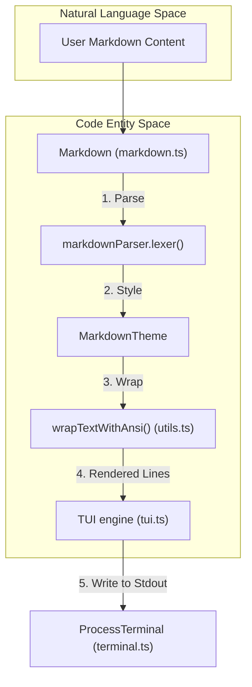
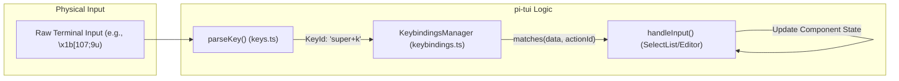

# TUI Components Library

Relevant source files

The following files were used as context for generating this wiki page:

- [packages/coding-agent/docs/tmux.md](packages/coding-agent/docs/tmux.md)
- [packages/coding-agent/src/modes/interactive/components/custom-editor.ts](packages/coding-agent/src/modes/interactive/components/custom-editor.ts)
- [packages/coding-agent/src/modes/interactive/components/user-message-selector.ts](packages/coding-agent/src/modes/interactive/components/user-message-selector.ts)
- [packages/coding-agent/test/theme-detection.test.ts](packages/coding-agent/test/theme-detection.test.ts)
- [packages/tui/src/components/image.ts](packages/tui/src/components/image.ts)
- [packages/tui/src/components/markdown.ts](packages/tui/src/components/markdown.ts)
- [packages/tui/src/components/select-list.ts](packages/tui/src/components/select-list.ts)
- [packages/tui/src/components/text.ts](packages/tui/src/components/text.ts)
- [packages/tui/src/index.ts](packages/tui/src/index.ts)
- [packages/tui/src/keys.ts](packages/tui/src/keys.ts)
- [packages/tui/src/terminal-image.ts](packages/tui/src/terminal-image.ts)
- [packages/tui/test/keys.test.ts](packages/tui/test/keys.test.ts)
- [packages/tui/test/markdown.test.ts](packages/tui/test/markdown.test.ts)
- [packages/tui/test/terminal-image.test.ts](packages/tui/test/terminal-image.test.ts)

The `pi-tui` package provides a robust library of terminal components designed for high-performance, differential rendering. These components handle the complexities of ANSI styling, Unicode grapheme widths (including Emojis and East Asian characters), and terminal-specific protocols like Kitty images.

## Core Interfaces

All TUI elements interact through two primary interfaces defined in [packages/tui/src/tui.ts:93-97]().

### `Component`
The base interface for any renderable element.
*   `render(width: number): string[]`: Returns an array of strings representing the component's visual state at a specific width. Lines must handle their own internal ANSI styling [packages/tui/src/tui.ts:93-95]().
*   `invalidate(): void`: Signals that the component's internal state has changed and its cache should be cleared [packages/tui/src/tui.ts:110-114]().

### `Focusable`
An extension of `Component` for elements that accept user input.
*   `handleInput(keyData: string): void`: Processes raw terminal input strings (including escape sequences) [packages/tui/src/tui.ts:96-97]().
*   `isFocusable(comp: any)`: A type guard to check if a component implements the focusable interface [packages/tui/src/tui.ts:97-101]().

Sources: [packages/tui/src/tui.ts:93-114]()

## Layout and Structure Components

### Box and Container
`Container` manages a vertical stack of child components. It calculates the available width and collects rendered lines from all children into a single stream for the `TUI` engine [packages/tui/src/tui.ts:94](). `Box` (exported in [packages/tui/src/index.ts:12]()) provides layout constraints and padding via a custom background function [packages/tui/src/components/box.ts:10-14]().

### Text and TruncatedText
*   **Text**: Displays multi-line text with word wrapping and optional background styling. It uses a caching mechanism to avoid re-wrapping unless the text or width changes [packages/tui/src/components/text.ts:7-106]().
*   **TruncatedText**: Specifically handles long strings by clipping them to the available terminal width and appending an ellipsis (e.g., `…`), ensuring that ANSI escape codes are properly closed to prevent style "bleeding" into the rest of the terminal [packages/tui/src/components/truncated-text.ts:1-50]().

### Spacer
Provides vertical whitespace (empty lines) between components [packages/tui/src/components/spacer.ts:1-25]().

Sources: [packages/tui/src/components/text.ts:7-106](), [packages/tui/src/components/truncated-text.ts:1-50](), [packages/tui/src/tui.ts:94](), [packages/tui/src/index.ts:12-29]()

## Content Components

### Markdown Renderer
The `Markdown` component uses the `marked` library to parse Markdown into terminal-ready output. It supports:
*   **Theming**: Custom functions for headings, links, code blocks, and text decorations (bold, italic, etc.) defined in the `MarkdownTheme` interface [packages/tui/src/components/markdown.ts:53-71]().
*   **Indentation**: Automatic handling of nested lists and ordered list numbering. It specifically preserves original numbering even when LLMs output non-indented code blocks between items [packages/tui/test/markdown.test.ts:191-223]().
*   **Task Lists**: Renders task list markers like `[ ]` and `[x]` [packages/tui/test/markdown.test.ts:183-189]().
*   **Image Integration**: Detects image lines using `isImageLine` and prevents standard word-wrapping to allow protocol-specific rendering [packages/tui/src/components/markdown.ts:164-182]().
*   **Strict Strikethrough**: Uses a custom `StrictStrikethroughTokenizer` to ensure strikethrough parsing is consistent with terminal expectations [packages/tui/src/components/markdown.ts:8-28]().

### Image
The `Image` component renders graphics using the best available terminal protocol (Kitty, iTerm2, or Sixel).
*   **Protocol Detection**: Automatically queries terminal capabilities to choose between `encodeKitty` or `encodeITerm2` [packages/tui/src/terminal-image.ts:65-120]().
*   **Fallback**: If the terminal does not support graphics, it renders a placeholder or fallback text [packages/tui/src/components/image.ts:112-119]().
*   **ID Allocation**: For Kitty, it generates unique random IDs to avoid collisions between main app and extensions [packages/tui/src/terminal-image.ts:150-158]().

### Loader
`Loader` and `CancellableLoader` provide visual feedback for asynchronous operations. They use a frame-based animation system that integrates with the TUI's render loop [packages/tui/src/components/loader.ts:1-60]().

Sources: [packages/tui/src/components/markdown.ts:1-214](), [packages/tui/src/terminal-image.ts:65-158](), [packages/tui/src/components/loader.ts:1-60](), [packages/tui/test/markdown.test.ts:183-223](), [packages/tui/src/components/image.ts:1-126]()

## Interactive Components

### SelectList
A vertical list for choosing from a set of options.
*   **Filtering**: Supports real-time filtering via `setFilter(string)` [packages/tui/src/components/select-list.ts:60-64]().
*   **Fuzzy Matching**: While `SelectList` uses prefix matching, the library provides `fuzzyFilter` for more complex search scenarios [packages/tui/src/fuzzy.ts:99-137]().
*   **Scrolling**: Automatically handles lists longer than `maxVisible` items, adding scroll indicators with selection counts [packages/tui/src/components/select-list.ts:85-109]().
*   **Layout**: Configurable primary column width and custom truncation via `SelectListLayoutOptions` [packages/tui/src/components/select-list.ts:34-38]().

### SettingsList
A specialized list for editing configuration. It maps `SettingItem` objects to UI toggles or value selectors, often used in the `/settings` dialog [packages/tui/src/components/settings-list.ts:1-50]().

### Editor and Input
The `Editor` component provides a full-featured multi-line text area. `CustomEditor` extends this to handle application-level keybindings like interrupts (Ctrl+C), image pasting, and extension-registered shortcuts [packages/coding-agent/src/modes/interactive/components/custom-editor.ts:7-80]().

Sources: [packages/tui/src/components/select-list.ts:1-137](), [packages/tui/src/fuzzy.ts:99-137](), [packages/coding-agent/src/modes/interactive/components/custom-editor.ts:7-80]()

## System Integration Diagrams

### Component Rendering Flow
This diagram illustrates how a component's state is transformed into terminal-ready ANSI strings.

Sources: [packages/tui/src/components/markdown.ts:147-170](), [packages/tui/src/tui.ts:104](), [packages/tui/src/index.ts:107]()

### Input Handling Architecture
This diagram shows how raw terminal sequences are mapped to component actions, including support for the Kitty keyboard protocol.

Sources: [packages/tui/src/keys.ts:15](), [packages/tui/src/keybindings.ts:43](), [packages/tui/src/components/select-list.ts:112-137]()

## ANSI and Unicode Utilities

The library relies on `packages/tui/src/utils.ts` to solve common terminal rendering artifacts.

| Function | Purpose |
| :--- | :--- |
| `visibleWidth(str)` | Calculates column width, correctly handling ZWJ, Emojis (width 2), and ignoring ANSI codes [packages/tui/src/index.ts:107](). |
| `wrapTextWithAnsi(text, width)` | Wraps text while preserving styling (e.g., if a line is blue, the next wrapped line starts with the blue ANSI code) [packages/tui/src/index.ts:107](). |
| `truncateToWidth(text, width, ellipsis)` | Safely clips a string to a specific width and ensures all ANSI styles are reset at the boundary [packages/tui/src/index.ts:107](). |
| `applyBackgroundToLine(line, width, bgFn)` | Extends a background color to the full terminal width, even if the text is shorter [packages/tui/src/components/markdown.ts:188](). |

### Kitty Keyboard Protocol
The `keys.ts` module implements the Kitty keyboard protocol. This allows `pi` to distinguish between `Ctrl+Enter` and `Enter`, and provides support for non-Latin layouts by mapping base layout keys (e.g., matching `ctrl+c` even if a Cyrillic layout is active via flag 4 "Report alternate keys") [packages/tui/src/keys.ts:4-19](), [packages/tui/test/keys.test.ts:47-54]().

Sources: [packages/tui/src/keys.ts:1-19](), [packages/tui/src/index.ts:107](), [packages/tui/src/components/markdown.ts:188](), [packages/tui/test/keys.test.ts:42-80]()

## Theme Integration
The `pi` interactive mode uses a centralized theme system. Components apply theme tokens for foreground and background colors.

*   **Markdown Theming**: The `MarkdownTheme` interface allows providing custom ANSI styling functions for every element type [packages/tui/src/components/markdown.ts:53-71]().
*   **Background Application**: `applyBackgroundToLine` is used within `render` methods of `Text` and `Markdown` to ensure background colors fill the entire component width [packages/tui/src/components/markdown.ts:188](), [packages/tui/src/components/text.ts:79-81]().

Sources: [packages/tui/src/components/markdown.ts:53-71](), [packages/tui/src/components/text.ts:79-81](), [packages/tui/src/components/markdown.ts:180-195]()
