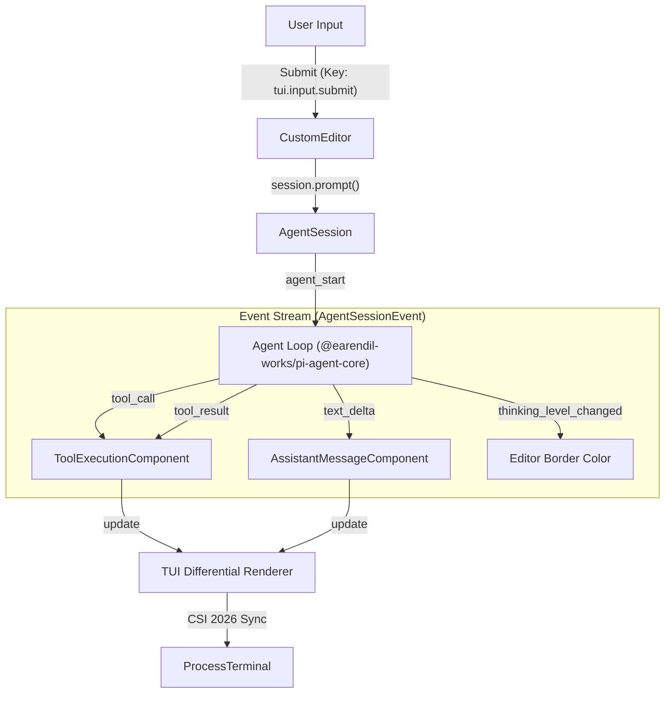

# Interactive Mode (CLI)

Relevant source files

The following files were used as context for generating this wiki page:

- [packages/coding-agent/src/core/agent-session.ts](packages/coding-agent/src/core/agent-session.ts)
- [packages/coding-agent/src/core/sdk.ts](packages/coding-agent/src/core/sdk.ts)
- [packages/coding-agent/src/modes/index.ts](packages/coding-agent/src/modes/index.ts)
- [packages/coding-agent/src/modes/interactive/interactive-mode.ts](packages/coding-agent/src/modes/interactive/interactive-mode.ts)
- [packages/coding-agent/src/modes/print-mode.ts](packages/coding-agent/src/modes/print-mode.ts)
- [packages/coding-agent/src/modes/rpc/rpc-mode.ts](packages/coding-agent/src/modes/rpc/rpc-mode.ts)

The **Interactive Mode** is the primary way users interact with the `pi` coding agent. It provides a full-featured Terminal User Interface (TUI) that manages the agent lifecycle, session history, and real-time tool execution feedback.

The interactive mode is implemented in the `InteractiveMode` class within [packages/coding-agent/src/modes/interactive/interactive-mode.ts:5](). It leverages the `AgentSession` abstraction to bridge the gap between the user's terminal and the underlying LLM providers [packages/coding-agent/src/core/agent-session.ts:13-14]().

## Component Hierarchy and Layout

The TUI is built using a component-based architecture provided by the `@earendil-works/pi-tui` package. The layout is organized vertically to provide a consistent conversational flow.

### Visual Structure
1.  **Startup Header**: Displays loaded resources, including `AGENTS.md` rules, active prompt templates, skills, and extensions.
2.  **Messages**: A scrollable list containing `UserMessageComponent`, `AssistantMessageComponent`, and specialized tool execution blocks [packages/coding-agent/src/modes/interactive/interactive-mode.ts:100-126]().
3.  **Working/Thinking Indicator**: A dynamic row that appears during LLM generation or tool execution, represented by the `BorderedLoader` [packages/coding-agent/src/modes/interactive/interactive-mode.ts:102]().
4.  **Editor**: A multi-line input area (`CustomEditor`) with syntax highlighting for file references and slash commands [packages/coding-agent/src/modes/interactive/components/custom-editor.ts:102](). Border color indicates the current `ThinkingLevel` [packages/coding-agent/src/core/agent-session.ts:138]().
5.  **Footer**: A status bar showing the current working directory, session ID, total token/cache usage, cost, and active model [packages/coding-agent/src/modes/interactive/components/footer.ts:112]().

### Component Mapping

| Code Entity | UI Role |
| :--- | :--- |
| `ChatContainer` | Main scrollable area for conversation history [packages/coding-agent/src/modes/interactive/interactive-mode.ts:34]() |
| `CustomEditor` | Multi-line input with `@` file search and autocomplete [packages/coding-agent/src/modes/interactive/components/custom-editor.ts:102]() |
| `ToolExecutionComponent` | Visualizes tool calls (read, write, edit) and results [packages/coding-agent/src/modes/interactive/components/tool-execution.ts:121]() |
| `BashExecutionComponent` | Specialized renderer for terminal command output [packages/coding-agent/src/modes/interactive/components/bash-execution.ts:99]() |
| `FooterComponent` | Displays session metadata and system status [packages/coding-agent/src/modes/interactive/components/footer.ts:112]() |
| `LoginDialogComponent` | Handles OAuth provider selection and authentication [packages/coding-agent/src/modes/interactive/components/login-dialog.ts:116]() |

For details on individual components, see [Interactive Mode Components](#5.1).

## Interactive Loop

The interactive mode operates on an event-driven loop centered around the `AgentSession`. It translates low-level `AgentEvent` and `AgentSessionEvent` instances into TUI updates.

### System Flow: Input to Render

*Sources: [packages/coding-agent/src/core/agent-session.ts:124-149](), [packages/coding-agent/src/modes/interactive/interactive-mode.ts:1-4]()*

The `InteractiveMode` subscribes to `AgentSessionEvent` types to update the UI in real-time. Key events include:
*   `text_delta`: Streams assistant response text into the chat.
*   `tool_call`: Triggers the display of a tool execution block.
*   `thinking_level_changed`: Updates the editor border color to reflect the model's reasoning state [packages/coding-agent/src/core/agent-session.ts:138-138]().

## Slash Commands and Navigation

Interactive mode supports "Slash Commands" for session management and configuration without leaving the TUI. These are registered in the `BUILTIN_SLASH_COMMANDS` registry [packages/coding-agent/src/core/slash-commands.ts:85]().

*   **Session Navigation**: Commands like `/tree`, `/fork`, and `/clone` allow users to navigate and branch the conversation history [packages/coding-agent/src/core/agent-session.ts:11-11]().
*   **Model Management**: `/model` opens a `ModelSelectorComponent` to switch providers or models mid-session [packages/coding-agent/src/modes/interactive/interactive-mode.ts:117]().
*   **System Configuration**: `/settings` opens an interactive `SettingsSelectorComponent` to modify global or project-local configuration [packages/coding-agent/src/modes/interactive/components/settings-selector.ts:121]().

For a complete list of commands and how to create them, see [Slash Commands and Prompt Templates](#5.3).

## Configuration and Theming

The TUI's appearance and behavior are highly configurable:
*   **Keybindings**: Mapped via `KeybindingsManager`. Users can override default actions like `app.interrupt` or `tui.input.submit` in `keybindings.json` [packages/coding-agent/src/core/keybindings.ts:77]().
*   **Themes**: The `Theme` class handles color tokens and markdown styles. The TUI supports live theme switching via `initTheme` and `onThemeChange` [packages/coding-agent/src/modes/interactive/theme/theme.ts:134-135]().

For details on customizing the interface, see [Settings, Themes, and Keybindings](#5.2).

## Alternative Execution Modes

While Interactive Mode is the default, `pi` can be run in non-interactive modes for automation and integration:
*   **Print Mode**: Runs via `runPrintMode`. Outputs the session to `stdout` once and exits. Supports both plain text and JSON event streams [packages/coding-agent/src/modes/print-mode.ts:32]().
*   **RPC Mode**: Runs via `runRpcMode`. Provides a JSON-RPC 2.0 interface over `stdin`/`stdout` for embedding `pi` in other applications [packages/coding-agent/src/modes/rpc/rpc-mode.ts:53-55]().

For details, see [Alternative Execution Modes: Print and RPC](#5.4).

Sources: [packages/coding-agent/src/modes/interactive/interactive-mode.ts](), [packages/coding-agent/src/core/agent-session.ts](), [packages/coding-agent/src/modes/rpc/rpc-mode.ts](), [packages/coding-agent/src/modes/print-mode.ts](), [packages/coding-agent/src/core/keybindings.ts](), [packages/coding-agent/src/modes/interactive/theme/theme.ts]()
