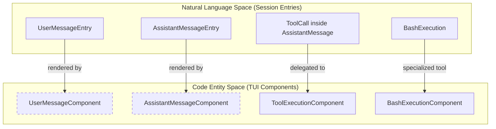
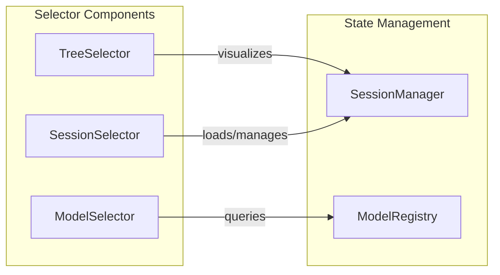
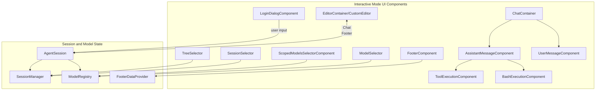

# Interactive Mode Components

Relevant source files

The following files were used as context for generating this wiki page:

- [packages/coding-agent/src/cli/startup-ui.ts](packages/coding-agent/src/cli/startup-ui.ts)
- [packages/coding-agent/src/core/footer-data-provider.ts](packages/coding-agent/src/core/footer-data-provider.ts)
- [packages/coding-agent/src/core/tools/render-utils.ts](packages/coding-agent/src/core/tools/render-utils.ts)
- [packages/coding-agent/src/modes/interactive/components/assistant-message.ts](packages/coding-agent/src/modes/interactive/components/assistant-message.ts)
- [packages/coding-agent/src/modes/interactive/components/bash-execution.ts](packages/coding-agent/src/modes/interactive/components/bash-execution.ts)
- [packages/coding-agent/src/modes/interactive/components/bordered-loader.ts](packages/coding-agent/src/modes/interactive/components/bordered-loader.ts)
- [packages/coding-agent/src/modes/interactive/components/branch-summary-message.ts](packages/coding-agent/src/modes/interactive/components/branch-summary-message.ts)
- [packages/coding-agent/src/modes/interactive/components/compaction-summary-message.ts](packages/coding-agent/src/modes/interactive/components/compaction-summary-message.ts)
- [packages/coding-agent/src/modes/interactive/components/custom-message.ts](packages/coding-agent/src/modes/interactive/components/custom-message.ts)
- [packages/coding-agent/src/modes/interactive/components/dynamic-border.ts](packages/coding-agent/src/modes/interactive/components/dynamic-border.ts)
- [packages/coding-agent/src/modes/interactive/components/extension-input.ts](packages/coding-agent/src/modes/interactive/components/extension-input.ts)
- [packages/coding-agent/src/modes/interactive/components/extension-selector.ts](packages/coding-agent/src/modes/interactive/components/extension-selector.ts)
- [packages/coding-agent/src/modes/interactive/components/first-time-setup.ts](packages/coding-agent/src/modes/interactive/components/first-time-setup.ts)
- [packages/coding-agent/src/modes/interactive/components/footer.ts](packages/coding-agent/src/modes/interactive/components/footer.ts)
- [packages/coding-agent/src/modes/interactive/components/index.ts](packages/coding-agent/src/modes/interactive/components/index.ts)
- [packages/coding-agent/src/modes/interactive/components/model-selector.ts](packages/coding-agent/src/modes/interactive/components/model-selector.ts)
- [packages/coding-agent/src/modes/interactive/components/oauth-selector.ts](packages/coding-agent/src/modes/interactive/components/oauth-selector.ts)
- [packages/coding-agent/src/modes/interactive/components/scoped-models-selector.ts](packages/coding-agent/src/modes/interactive/components/scoped-models-selector.ts)
- [packages/coding-agent/src/modes/interactive/components/tool-execution.ts](packages/coding-agent/src/modes/interactive/components/tool-execution.ts)
- [packages/coding-agent/src/modes/interactive/components/user-message.ts](packages/coding-agent/src/modes/interactive/components/user-message.ts)
- [packages/coding-agent/src/utils/fs-watch.ts](packages/coding-agent/src/utils/fs-watch.ts)
- [packages/coding-agent/test/assistant-message.test.ts](packages/coding-agent/test/assistant-message.test.ts)
- [packages/coding-agent/test/first-time-setup.test.ts](packages/coding-agent/test/first-time-setup.test.ts)
- [packages/coding-agent/test/footer-data-provider.test.ts](packages/coding-agent/test/footer-data-provider.test.ts)
- [packages/coding-agent/test/footer-width.test.ts](packages/coding-agent/test/footer-width.test.ts)
- [packages/coding-agent/test/suite/regressions/3217-scoped-model-order.test.ts](packages/coding-agent/test/suite/regressions/3217-scoped-model-order.test.ts)
- [packages/coding-agent/test/tool-execution-component.test.ts](packages/coding-agent/test/tool-execution-component.test.ts)
- [packages/coding-agent/test/user-message.test.ts](packages/coding-agent/test/user-message.test.ts)

The Interactive Mode of the `pi` CLI is built with a comprehensive Terminal UI (TUI) component hierarchy. These components orchestrate agent sessions, handling user input, model selection, session navigation, tool execution rendering, and session history visualization.

---

## Component Hierarchy and Data Flow

The UI components communicate tightly with the `AgentSession` data model, reflecting session states and commands dynamically.

### Core Interactive Mode UI Structure

| Component | Function |
| --------- | -------- |
| `ChatContainer` | Root component rendering scrollable chat messages and managing layout and focus shifts. |
| `EditorContainer` | Hosts the `CustomEditor`, presenting input for prompt and command editing. |
| `FooterComponent` | Shows the current working directory (CWD), git branch, token usage, cost estimates, and active model info dynamically [packages/coding-agent/src/modes/interactive/components/footer.ts:48-195](). |
| `SessionSelector` | Provides session browsing, searching, and management, with scope filtering for current folder or all sessions and rename/delete capabilities [packages/coding-agent/src/modes/interactive/components/session-selector.ts:56-187](). |
| `TreeSelector` | Visualizes session history with branching and folding support, flattening a session tree into a navigable ASCII-art list [packages/coding-agent/src/modes/interactive/components/tree-selector.ts:50-193](). |
| `ModelSelector` | UI for switching or filtering available LLM models with real-time fuzzy search and scoped views [packages/coding-agent/src/modes/interactive/components/model-selector.ts:34-135](). |
| `ScopedModelsSelectorComponent` | Specialized component to manage quick-cycling model lists with session-only state and reorder functionality [packages/coding-agent/src/modes/interactive/components/scoped-models-selector.ts:90-151](). |
| `LoginDialogComponent` | OAuth login dialog supporting multiple flows (device code, URL prompt, manual input), rendering interactive links, and managing user inputs [packages/coding-agent/src/modes/interactive/components/login-dialog.ts:11-194](). |

---

### Message Rendering Flow Mapping

This diagram highlights how different types of session messages correspond to concrete UI components rendering the conversation and tool outputs.

Sources: [packages/coding-agent/src/modes/interactive/components/assistant-message.ts:12-147](), [packages/coding-agent/src/modes/interactive/components/user-message.ts:1-50](), [packages/coding-agent/src/modes/interactive/components/tool-execution.ts:13-79](), [packages/coding-agent/src/modes/interactive/components/bash-execution.ts:21-65]()

---

## Core Message Components

### AssistantMessageComponent

The `AssistantMessageComponent` handles rendering of LLM assistant messages, including:

- **Thinking Blocks**: Supports toggleable visibility of reasoning or "thinking" blocks. When hidden, shows a subdued "Thinking..." label [packages/coding-agent/src/modes/interactive/components/assistant-message.ts:101-105]().
- **Markdown Rendering**: Renders message content with markdown styling using a tailored Markdown component and theme [packages/coding-agent/src/modes/interactive/components/assistant-message.ts:93]().
- **Terminal Integration**: Inserts OSC 133 shell sequences (`\x1b]133;A\x07`) to delineate message boundaries, facilitating advanced terminal features like semantic scrollback [packages/coding-agent/src/modes/interactive/components/assistant-message.ts:5-70]().
- **Error and Abort Display**: Shows LLM provider errors or user-initiated aborts inline when tool results are absent [packages/coding-agent/src/modes/interactive/components/assistant-message.ts:128-145]().

### ToolExecutionComponent

This component dynamically renders tool execution lifecycles:

- **Renderer Resolution**: Uses `ToolDefinition` to obtain tool-specific `renderCall` and `renderResult` methods, preferring built-in definitions if no extension override is provided [packages/coding-agent/src/modes/interactive/components/tool-execution.ts:81-99]().
- **Rendering Shell Variants**: Supports two rendering shells:
  - `default`: Output wrapped in a themed `Box` [packages/coding-agent/src/modes/interactive/components/tool-execution.ts:68]().
  - `self`: Tool manages its own UI framing, rendering inside `selfRenderContainer` [packages/coding-agent/src/modes/interactive/components/tool-execution.ts:70-73]().
- **Image Support**: Detects image data returned by tools and converts incompatible images (e.g., non-PNG) to PNG format for inline rendering in Kitty-compatible terminals [packages/coding-agent/src/modes/interactive/components/tool-execution.ts:178-198]().
- **State Flags**: Tracks execution status (started/completed), argument completeness, partial updates, and expansion toggle state [packages/coding-agent/src/modes/interactive/components/tool-execution.ts:147-220]().

### BashExecutionComponent

A specialized rendering component for executing bash commands interactively:

- **Streaming Output**: Appends chunks of output in real-time, stripping ANSI codes and normalizing line endings [packages/coding-agent/src/modes/interactive/components/bash-execution.ts:80-96]().
- **Visual Truncation**: Implements width-aware visual truncation to limit output to a `PREVIEW_LINES` window (default 20) when collapsed [packages/coding-agent/src/modes/interactive/components/bash-execution.ts:147-167]().
- **Context Awareness**: Distinguishes between standard commands and those excluded from context (prefixed with `!!`), adjusting border colors to "dim" [packages/coding-agent/src/modes/interactive/components/bash-execution.ts:32-38]().

Sources: [packages/coding-agent/src/modes/interactive/components/assistant-message.ts:73-146](), [packages/coding-agent/src/modes/interactive/components/tool-execution.ts:13-226](), [packages/coding-agent/src/modes/interactive/components/bash-execution.ts:21-218]()

---

## Selectors and Navigation Components

### TreeSelector

`TreeSelector` visualizes session branches as a navigable, foldable ASCII tree:

- **Flattening & Indentation**: Converts recursive session trees into a flat list, calculating indentation and ASCII connectors for visual hierarchy [packages/coding-agent/src/modes/interactive/components/tree-selector.ts:143-193]().
- **Filter Modes**: Supports multiple filter modes such as `no-tools`, `user-only`, and `labeled-only` [packages/coding-agent/src/modes/interactive/components/tree-selector.ts:39]().

### ModelSelector

Component for selecting models with search and scope filtering:

- **Scope Management**: Toggles between `all` (all available models) and `scoped` (configured providers) [packages/coding-agent/src/modes/interactive/components/model-selector.ts:197-216]().
- **Dynamic Search**: Uses `fuzzyFilter` to filter models by user input in real-time [packages/coding-agent/src/modes/interactive/components/model-selector.ts:218-228]().

### ScopedModelsSelectorComponent

Specializes in managing enabled models for quick cycling (Ctrl+P):

- **Reordering**: Supports moving models up and down in the list [packages/coding-agent/src/modes/interactive/components/scoped-models-selector.ts:49-59]().
- **Persistence**: Changes are session-only until explicitly saved to settings via `onPersist` [packages/coding-agent/src/modes/interactive/components/scoped-models-selector.ts:129-132]().

### SessionSelector

Selects and manages sessions with advanced filtering and sorting:

- **Hierarchical Display**: Builds a tree structure for sessions to show branching history [packages/coding-agent/src/modes/interactive/components/session-selector.ts:189-202]().
- **Management Operations**: Supports renaming sessions and deleting session files directly from the TUI [packages/coding-agent/src/modes/interactive/components/session-selector.ts:102-108]().

---

### Navigation and State Management Overview

Sources: [packages/coding-agent/src/modes/interactive/components/tree-selector.ts:50-90](), [packages/coding-agent/src/modes/interactive/components/model-selector.ts:34-135](), [packages/coding-agent/src/modes/interactive/components/session-selector.ts:56-187](), [packages/coding-agent/src/modes/interactive/components/scoped-models-selector.ts:90-151]()

---

## FooterComponent: Status Display

The `FooterComponent` provides a single-line status bar with:

- **Token Statistics**: Cumulative usage (Input, Output, Cache Read/Write) across all session entries [packages/coding-agent/src/modes/interactive/components/footer.ts:86-100]().
- **Cache Performance**: Calculates the `latestCacheHitRate` based on prompt tokens and cache reads [packages/coding-agent/src/modes/interactive/components/footer.ts:101-104]().
- **Context Window Utilization**: Shows current context window usage with color-coded warnings [packages/coding-agent/src/modes/interactive/components/footer.ts:145-151]().
- **Environment Info**: Displays CWD (shortened via `formatCwdForFooter`), git branch (via `FooterDataProvider`), and session name [packages/coding-agent/src/modes/interactive/components/footer.ts:110-123]().
- **Cost and Subscription**: Shows total session cost and indicates if using an OAuth subscription [packages/coding-agent/src/modes/interactive/components/footer.ts:132-136]().

Sources: [packages/coding-agent/src/modes/interactive/components/footer.ts:48-195](), [packages/coding-agent/src/core/footer-data-provider.ts:99-132]()

---

## LoginDialogComponent: Authentication

A focused dialog component used during login flows:

- **Flow Support**: Handles `showAuth` (URL-based), `showDeviceCode` (polling), and `showPrompt` (manual input) [packages/coding-agent/src/modes/interactive/components/login-dialog.ts:89-169]().
- **Terminal UX**: Renders clickable hyperlinks using OSC 8 escape sequences where supported [packages/coding-agent/src/modes/interactive/components/login-dialog.ts:92-97]().
- **Browser Integration**: Automatically invokes `openBrowser` to launch authentication pages [packages/coding-agent/src/modes/interactive/components/login-dialog.ts:104]().

Sources: [packages/coding-agent/src/modes/interactive/components/login-dialog.ts:11-194]()

---

## CustomEditor with Autocomplete

The main prompt input area extends the base TUI `Editor` component:

- Integrated autocomplete features for slash commands and file path completions.
- Interacts with the `KeybindingsManager` from the core to resolve actions like message follow-up and external editor invocation.
- Supports multiline editing and semantic keybindings [packages/coding-agent/src/modes/interactive/components/custom-editor.ts:1-50]().

---

# Summary Mermaid Diagram

Sources: [packages/coding-agent/src/modes/interactive/components/footer.ts:48-56](), [packages/coding-agent/src/core/footer-data-provider.ts:99-124](), [packages/coding-agent/src/modes/interactive/components/tool-execution.ts:13-79](), [packages/coding-agent/src/modes/interactive/components/login-dialog.ts:30-70]()
