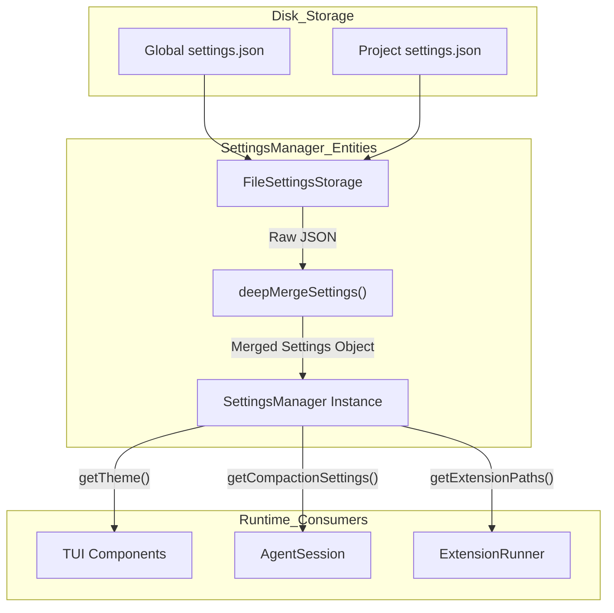
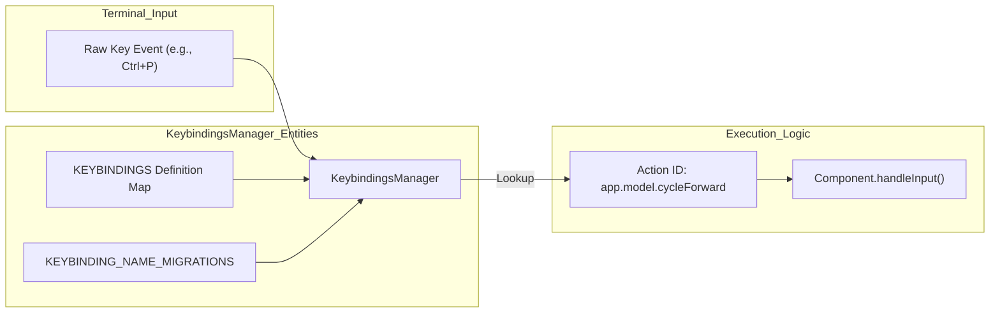

# Settings, Themes, and Keybindings

Relevant source files

The following files were used as context for generating this wiki page:

- [packages/coding-agent/docs/keybindings.md](packages/coding-agent/docs/keybindings.md)
- [packages/coding-agent/docs/settings.md](packages/coding-agent/docs/settings.md)
- [packages/coding-agent/docs/themes.md](packages/coding-agent/docs/themes.md)
- [packages/coding-agent/examples/extensions/dynamic-resources/SKILL.md](packages/coding-agent/examples/extensions/dynamic-resources/SKILL.md)
- [packages/coding-agent/examples/extensions/dynamic-resources/dynamic.json](packages/coding-agent/examples/extensions/dynamic-resources/dynamic.json)
- [packages/coding-agent/examples/extensions/dynamic-resources/dynamic.md](packages/coding-agent/examples/extensions/dynamic-resources/dynamic.md)
- [packages/coding-agent/examples/extensions/dynamic-resources/index.ts](packages/coding-agent/examples/extensions/dynamic-resources/index.ts)
- [packages/coding-agent/src/config.ts](packages/coding-agent/src/config.ts)
- [packages/coding-agent/src/core/keybindings.ts](packages/coding-agent/src/core/keybindings.ts)
- [packages/coding-agent/src/core/settings-manager.ts](packages/coding-agent/src/core/settings-manager.ts)
- [packages/coding-agent/src/modes/interactive/components/settings-selector.ts](packages/coding-agent/src/modes/interactive/components/settings-selector.ts)
- [packages/coding-agent/src/modes/interactive/components/tree-selector.ts](packages/coding-agent/src/modes/interactive/components/tree-selector.ts)
- [packages/coding-agent/src/modes/interactive/theme/dark.json](packages/coding-agent/src/modes/interactive/theme/dark.json)
- [packages/coding-agent/src/modes/interactive/theme/light.json](packages/coding-agent/src/modes/interactive/theme/light.json)
- [packages/coding-agent/src/modes/interactive/theme/theme-schema.json](packages/coding-agent/src/modes/interactive/theme/theme-schema.json)
- [packages/coding-agent/src/modes/interactive/theme/theme.ts](packages/coding-agent/src/modes/interactive/theme/theme.ts)
- [packages/coding-agent/src/package-manager-cli.ts](packages/coding-agent/src/package-manager-cli.ts)
- [packages/coding-agent/src/utils/child-process.ts](packages/coding-agent/src/utils/child-process.ts)
- [packages/coding-agent/src/utils/pi-user-agent.ts](packages/coding-agent/src/utils/pi-user-agent.ts)
- [packages/coding-agent/src/utils/version-check.ts](packages/coding-agent/src/utils/version-check.ts)
- [packages/coding-agent/test/config.test.ts](packages/coding-agent/test/config.test.ts)
- [packages/coding-agent/test/package-command-paths.test.ts](packages/coding-agent/test/package-command-paths.test.ts)
- [packages/coding-agent/test/pi-user-agent.test.ts](packages/coding-agent/test/pi-user-agent.test.ts)
- [packages/coding-agent/test/session-selector-rename.test.ts](packages/coding-agent/test/session-selector-rename.test.ts)
- [packages/coding-agent/test/settings-manager.test.ts](packages/coding-agent/test/settings-manager.test.ts)
- [packages/coding-agent/test/test-theme-colors.ts](packages/coding-agent/test/test-theme-colors.ts)
- [packages/coding-agent/test/tree-selector.test.ts](packages/coding-agent/test/tree-selector.test.ts)
- [packages/coding-agent/test/version-check.test.ts](packages/coding-agent/test/version-check.test.ts)
- [packages/tui/src/components/settings-list.ts](packages/tui/src/components/settings-list.ts)
- [packages/tui/src/keybindings.ts](packages/tui/src/keybindings.ts)

This page details the configuration systems of the `pi` CLI, covering how user preferences are managed, how the TUI is styled via JSON themes, and how keyboard shortcuts are mapped to namespaced actions.

## Settings Management

The `SettingsManager` handles the loading, merging, and persistence of user preferences. It supports a hierarchical configuration model where project-specific settings override global defaults [packages/coding-agent/src/core/settings-manager.ts:125-153]().

### Configuration Scopes
| Scope | File Path | Description |
|-------|-----------|-------------|
| **Global** | `~/.pi/agent/settings.json` | Applied to all projects for the user [packages/coding-agent/docs/settings.md:7-7](). |
| **Project** | `.pi/settings.json` | Applied only when running `pi` within that directory [packages/coding-agent/docs/settings.md:8-8](). |

### Implementation Details
- **Deep Merging**: Settings are merged recursively using `deepMergeSettings`. Primitives and arrays in project settings (the `overrides`) overwrite global values (the `base`), while nested objects (like `compaction`, `retry`, or `warnings`) are merged [packages/coding-agent/src/core/settings-manager.ts:125-153]().
- **Concurrency**: The `FileSettingsStorage` class uses `proper-lockfile` to ensure atomic writes and prevent corruption when multiple instances modify the JSON files [packages/coding-agent/src/core/settings-manager.ts:5-5]().
- **Persistence**: Changes made via the TUI `/settings` menu are flushed to disk. The manager preserves unknown or externally added JSON keys to avoid data loss during programmatic updates [packages/coding-agent/test/settings-manager.test.ts:28-58]().
- **Packages and Extensions**: Settings allow defining `packages` (npm/git sources) and local `extensions`, `skills`, `prompts`, or `themes` paths [packages/coding-agent/src/core/settings-manager.ts:102-106]().
- **Model Budgets**: Custom token budgets for different reasoning levels can be configured via `thinkingBudgets` [packages/coding-agent/src/core/settings-manager.ts:46-51](), [packages/coding-agent/docs/settings.md:36-48]().

### Settings Data Flow
The following diagram illustrates how settings are resolved from disk into the runtime state.

**Settings Resolution Logic**

Sources: [packages/coding-agent/src/core/settings-manager.ts:125-153](), [packages/coding-agent/test/settings-manager.test.ts:41-41]()

---

## Theme System

The theme system allows full customization of the TUI appearance via JSON files. Themes define color tokens for UI elements, Markdown rendering, and syntax highlighting [packages/coding-agent/src/modes/interactive/theme/theme.ts:29-100]().

### Color Tokens and Schema
Themes are validated against a strict schema defined using TypeBox [packages/coding-agent/src/modes/interactive/theme/theme.ts:29-104](). Key token categories include:
- **Core UI**: `accent`, `border`, `success`, `error`, `muted`, `dim`, `thinkingText` [packages/coding-agent/src/modes/interactive/theme/theme.ts:35-45]().
- **Messages**: `userMessageBg`, `toolSuccessBg`, `customMessageLabel`, `toolOutput` [packages/coding-agent/src/modes/interactive/theme/theme.ts:47-57]().
- **Markdown**: `mdHeading`, `mdCodeBlock`, `mdLink`, `mdListBullet` [packages/coding-agent/src/modes/interactive/theme/theme.ts:59-68]().
- **Syntax**: `syntaxKeyword`, `syntaxString`, `syntaxFunction`, `syntaxOperator` [packages/coding-agent/src/modes/interactive/theme/theme.ts:74-82]().
- **Thinking Levels**: Specific border colors for different reasoning intensities: `thinkingOff`, `thinkingMinimal`, `thinkingLow`, `thinkingMedium`, `thinkingHigh`, `thinkingXhigh` [packages/coding-agent/src/modes/interactive/theme/theme.ts:84-89]().

### Theme Components
- **SettingsSelectorComponent**: A TUI component that provides a GUI for toggling settings and switching themes in real-time [packages/coding-agent/src/modes/interactive/components/settings-selector.ts:216-221]().
- **SettingsList**: A specialized `pi-tui` component for rendering key-value pairs with descriptions and selectable values or submenus [packages/coding-agent/src/modes/interactive/components/settings-selector.ts:126-140]().
- **DynamicBorder**: Used in selectors (like `TreeSelector` or `SettingsSelector`) to render themed borders around active UI elements [packages/coding-agent/src/modes/interactive/components/tree-selector.ts:14-14](), [packages/coding-agent/src/modes/interactive/components/settings-selector.ts:17-17]().
- **TreeSelector**: Visualizes the session history as an ASCII tree, using theme colors for nodes and active paths [packages/coding-agent/src/modes/interactive/components/tree-selector.ts:50-90]().

Sources: [packages/coding-agent/src/modes/interactive/theme/theme.ts:29-104](), [packages/coding-agent/src/modes/interactive/components/settings-selector.ts:216-221](), [packages/coding-agent/src/modes/interactive/components/tree-selector.ts:50-90]()

---

## Keybindings Configuration

Keybindings map physical keystrokes to semantic **Action IDs**. This allows users to rebind any command without changing the underlying TUI logic.

### Namespaced Action IDs
Actions are grouped by namespace to prevent collisions and improve discoverability:
- `tui.editor.*`: Movement and deletion within the text editor [packages/tui/src/keybindings.ts:8-29]().
- `tui.input.*`: Input submission and line handling [packages/tui/src/keybindings.ts:31-34]().
- `app.session.*`: Session management (fork, tree, rename, delete) [packages/coding-agent/src/core/keybindings.ts:29-32]().
- `app.tree.*`: Navigation and filtering within the `/tree` component [packages/coding-agent/src/core/keybindings.ts:33-36]().
- `app.models.*`: Management within the scoped models selector [packages/coding-agent/src/core/keybindings.ts:42-47]().

### Keybindings Manager
The `KeybindingsManager` handles:
1. **Loading**: Reads `keybindings.json` from the agent directory [packages/coding-agent/src/core/keybindings.ts:9-11]().
2. **Migration**: Automatically migrates legacy non-namespaced IDs (e.g., `cursorUp`, `newLine`) to the new namespaced format [packages/coding-agent/src/core/keybindings.ts:204-230]().
3. **Conflict Detection**: Tracks key combinations claimed by multiple actions [packages/tui/src/keybindings.ts:159-159]().

### Input Mapping Logic
The following diagram shows how a raw key event is transformed into an application action.

**Keyboard Event to Action Mapping**

Sources: [packages/coding-agent/src/core/keybindings.ts:63-202](), [packages/coding-agent/src/core/keybindings.ts:204-226](), [packages/tui/src/keybindings.ts:155-165]()

### Common Default Keybindings
| Action ID | Default Key | Description |
|-----------|-------------|-------------|
| `app.interrupt` | `escape` | Cancel current agent loop or close dialog [packages/coding-agent/src/core/keybindings.ts:65-65](). |
| `app.model.select` | `ctrl+l` | Open the model selection UI [packages/coding-agent/src/core/keybindings.ts:84-84](). |
| `app.thinking.cycle` | `shift+tab` | Cycle through reasoning intensities [packages/coding-agent/src/core/keybindings.ts:72-75](). |
| `tui.editor.yank` | `ctrl+y` | Emacs-style paste from the kill ring [packages/tui/src/keybindings.ts:115-115](). |
| `app.message.followUp` | `alt+enter` | Queue a message to be sent after the current response [packages/coding-agent/src/core/keybindings.ts:98-98](). |
| `app.tree.foldOrUp` | `ctrl+left` | Fold current branch segment in tree navigator [packages/coding-agent/src/core/keybindings.ts:114-117](). |

Sources: [packages/coding-agent/src/core/keybindings.ts:63-202](), [packages/tui/src/keybindings.ts:54-134](), [packages/coding-agent/docs/keybindings.md:1-140]()
