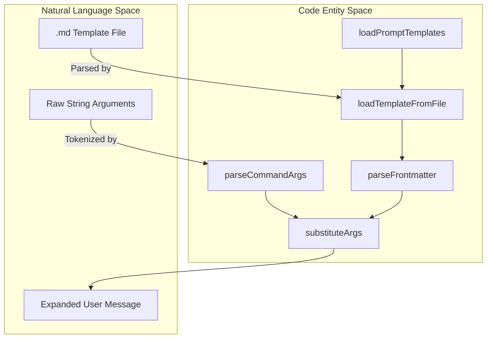
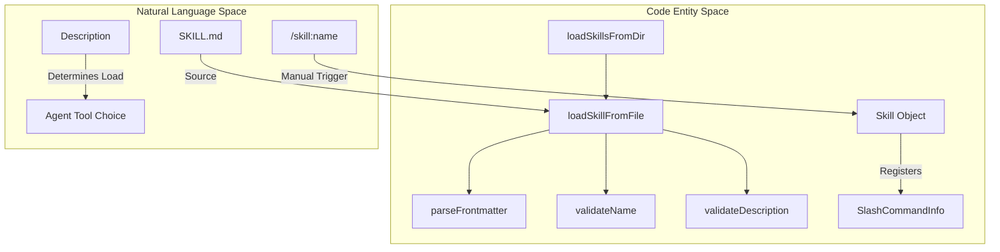

# Slash Commands and Prompt Templates

<details>
<summary>Relevant source files</summary>

The following files were used as context for generating this wiki page:

- [.pi/prompts/is.md](.pi/prompts/is.md)
- [.pi/prompts/pr.md](.pi/prompts/pr.md)
- [.pi/prompts/wr.md](.pi/prompts/wr.md)
- [packages/coding-agent/docs/prompt-templates.md](packages/coding-agent/docs/prompt-templates.md)
- [packages/coding-agent/docs/skills.md](packages/coding-agent/docs/skills.md)
- [packages/coding-agent/src/core/prompt-templates.ts](packages/coding-agent/src/core/prompt-templates.ts)
- [packages/coding-agent/src/core/skills.ts](packages/coding-agent/src/core/skills.ts)
- [packages/coding-agent/src/core/slash-commands.ts](packages/coding-agent/src/core/slash-commands.ts)
- [packages/coding-agent/test/fixtures/skills/root-skill-preferred/SKILL.md](packages/coding-agent/test/fixtures/skills/root-skill-preferred/SKILL.md)
- [packages/coding-agent/test/fixtures/skills/root-skill-preferred/nested-child/SKILL.md](packages/coding-agent/test/fixtures/skills/root-skill-preferred/nested-child/SKILL.md)
- [packages/coding-agent/test/prompt-templates.test.ts](packages/coding-agent/test/prompt-templates.test.ts)
- [packages/coding-agent/test/skills.test.ts](packages/coding-agent/test/skills.test.ts)

</details>


This page documents the interactive command system in `pi`, covering both hard-coded slash commands and the dynamic prompt template system. These mechanisms allow users to control session state, navigate the conversation tree, and expand complex workflows from short snippets.

## Slash Commands

Slash commands are special inputs starting with `/` that trigger internal functions rather than being sent to the LLM. They are managed via a central registry and can be provided by the core system, extensions, or loaded skills.

### Built-in Commands
The core functionality of the TUI is exposed through a set of built-in commands defined in the `BUILTIN_SLASH_COMMANDS` registry [packages/coding-agent/src/core/slash-commands.ts:18-41]().

| Command | Description |
| :--- | :--- |
| `/settings` | Open settings menu [packages/coding-agent/src/core/slash-commands.ts:19-19](). |
| `/model` | Select model (opens selector UI) [packages/coding-agent/src/core/slash-commands.ts:20-20](). |
| `/scoped-models` | Enable/disable models for Ctrl+P cycling [packages/coding-agent/src/core/slash-commands.ts:21-21](). |
| `/export` | Export session (HTML default, or specify path: .html/.jsonl) [packages/coding-agent/src/core/slash-commands.ts:22-22](). |
| `/import` | Import and resume a session from a JSONL file [packages/coding-agent/src/core/slash-commands.ts:23-23](). |
| `/share` | Share session as a secret GitHub gist [packages/coding-agent/src/core/slash-commands.ts:24-24](). |
| `/copy` | Copy last agent message to clipboard [packages/coding-agent/src/core/slash-commands.ts:25-25](). |
| `/name` | Set session display name [packages/coding-agent/src/core/slash-commands.ts:26-26](). |
| `/session` | Show session info and stats [packages/coding-agent/src/core/slash-commands.ts:27-27](). |
| `/changelog` | Show changelog entries [packages/coding-agent/src/core/slash-commands.ts:28-28](). |
| `/hotkeys` | Show all keyboard shortcuts [packages/coding-agent/src/core/slash-commands.ts:29-29](). |
| `/fork` | Create a new fork from a previous user message [packages/coding-agent/src/core/slash-commands.ts:30-30](). |
| `/clone` | Duplicate the current session at the current position [packages/coding-agent/src/core/slash-commands.ts:31-31](). |
| `/tree` | Navigate session tree (switch branches) [packages/coding-agent/src/core/slash-commands.ts:32-32](). |
| `/trust` | Save project trust decision for future sessions [packages/coding-agent/src/core/slash-commands.ts:33-33](). |
| `/login` | Configure provider authentication [packages/coding-agent/src/core/slash-commands.ts:34-34](). |
| `/logout` | Remove provider authentication [packages/coding-agent/src/core/slash-commands.ts:35-35](). |
| `/new` | Start a new session [packages/coding-agent/src/core/slash-commands.ts:36-36](). |
| `/compact` | Manually compact the session context [packages/coding-agent/src/core/slash-commands.ts:37-37](). |
| `/resume` | Resume a different session [packages/coding-agent/src/core/slash-commands.ts:38-38](). |
| `/reload` | Reload keybindings, extensions, skills, prompts, and themes [packages/coding-agent/src/core/slash-commands.ts:39-39](). |
| `/quit` | Quit the application [packages/coding-agent/src/core/slash-commands.ts:40-41](). |

### Command Registration and Sources
Commands are categorized by their `SlashCommandSource` [packages/coding-agent/src/core/slash-commands.ts:4-11]():
1.  **Built-in**: Hard-coded in the core registry [packages/coding-agent/src/core/slash-commands.ts:18-41]().
2.  **Extension**: Registered dynamically via `ExtensionAPI.registerCommand()`.
3.  **Skill**: Automatically generated for each loaded skill as `/skill:name` [packages/coding-agent/docs/skills.md:75-80]().
4.  **Prompt**: Created from `.md` files discovered in prompt directories [packages/coding-agent/src/core/prompt-templates.ts:188-237]().

Sources:
- [packages/coding-agent/src/core/slash-commands.ts:4-41]()
- [packages/coding-agent/docs/skills.md:75-80]()
- [packages/coding-agent/src/core/prompt-templates.ts:188-237]()

---

## Prompt Templates

Prompt templates are Markdown files that expand into longer text prompts when invoked via a slash command (e.g., `/pr` expanding to complex PR review instructions).

### Template Structure
Templates use YAML frontmatter to define metadata and the Markdown body for the prompt content [packages/coding-agent/src/core/prompt-templates.ts:103-132]().

*   **Name**: Derived from the filename (e.g., `pr.md` becomes `/pr`) [packages/coding-agent/src/core/prompt-templates.ts:108-108]().
*   **Description**: Used in autocomplete; taken from `frontmatter.description` or the first non-empty line of the body [packages/coding-agent/src/core/prompt-templates.ts:111-119]().
*   **Argument Hint**: Displayed in the TUI autocomplete (e.g., `"<PR-URL>"`). Defined via `argument-hint` in frontmatter [packages/coding-agent/src/core/prompt-templates.ts:124-124]().

Example `pr.md` template:
```markdown
---
description: Review PRs from URLs with structured issue and code analysis
argument-hint: "<PR-URL>"
---
You are given one or more GitHub PR URLs: $@
...
```
[./.pi/prompts/pr.md:1-6]()

### Argument Substitution
The `substituteArgs` function supports sophisticated argument parsing and substitution using a bash-like syntax [packages/coding-agent/src/core/prompt-templates.ts:69-101]().

| Syntax | Description |
| :--- | :--- |
| `$1`, `$2` | Positional arguments [packages/coding-agent/src/core/prompt-templates.ts:97-98](). |
| `$@` or `$ARGUMENTS` | All arguments joined by a space [packages/coding-agent/src/core/prompt-templates.ts:93-95](). |
| `${N:-default}` | Positional arg `N` with a default value if missing [packages/coding-agent/src/core/prompt-templates.ts:75-79](). |
| `${@:N}` | Arguments starting from index `N` (1-indexed) [packages/coding-agent/src/core/prompt-templates.ts:81-91](). |
| `${@:N:L}` | `L` arguments starting from index `N` [packages/coding-agent/src/core/prompt-templates.ts:87-89](). |

The `parseCommandArgs` function handles quoted strings (e.g., `/cmd "arg with spaces"`) to ensure arguments with spaces are treated as single tokens [packages/coding-agent/src/core/prompt-templates.ts:24-55]().

Sources:
- [packages/coding-agent/src/core/prompt-templates.ts:24-101]()
- [packages/coding-agent/src/core/prompt-templates.ts:103-132]()
- [./.pi/prompts/pr.md:1-6]()

### Data Flow: Template to Prompt
The following diagram shows how a template file is transformed into a final prompt string.

"Prompt Template Expansion Flow"

Sources:
- [packages/coding-agent/src/core/prompt-templates.ts:24-101]()
- [packages/coding-agent/src/core/prompt-templates.ts:103-132]()
- [packages/coding-agent/src/core/prompt-templates.ts:193-237]()

---

## Agent Skills

Skills are specialized workflows loaded on-demand. Unlike prompt templates, skills are intended for the agent to read and follow as instructions, though they also register as slash commands.

### Skill Discovery and Validation
Skills are loaded from multiple locations including `~/.pi/agent/skills/` and project-local `.pi/skills/` [packages/coding-agent/src/core/skills.ts:168-171](). A skill is defined by a directory containing a `SKILL.md` file [packages/coding-agent/docs/skills.md:97-105]().

Pi validates skills against the [Agent Skills standard](https://agentskills.io/specification), checking:
*   **Name**: Max 64 chars, lowercase a-z, 0-9, and hyphens [packages/coding-agent/src/core/skills.ts:92-112]().
*   **Description**: Required, max 1024 chars [packages/coding-agent/src/core/skills.ts:117-127]().
*   **Invocation**: Skills can be hidden from the system prompt using `disable-model-invocation: true` in frontmatter [packages/coding-agent/src/core/skills.ts:67-72]().

"Skill Loading and Command Registration"

Sources:
- [packages/coding-agent/src/core/skills.ts:88-127]()
- [packages/coding-agent/src/core/skills.ts:168-221]()
- [packages/coding-agent/docs/skills.md:75-80]()

### Configuration and Discovery Rules
The `loadPromptTemplates` and `loadSkills` functions define the search order:
1.  **Global**: `agentDir/prompts/` or `agentDir/skills/` [packages/coding-agent/src/core/prompt-templates.ts:201-201](), [packages/coding-agent/docs/skills.md:26-28]().
2.  **Project**: `[cwd]/.pi/prompts/` or `[cwd]/.pi/skills/` [packages/coding-agent/src/core/prompt-templates.ts:202-202](), [packages/coding-agent/docs/skills.md:29-31]().
3.  **Explicit**: Paths provided via CLI or settings [packages/coding-agent/src/core/prompt-templates.ts:240-245](), [packages/coding-agent/docs/skills.md:34-34]().

The `/reload` command triggers a full refresh of keybindings, extensions, skills, prompts, and themes [packages/coding-agent/src/core/slash-commands.ts:39-39]().

Sources:
- [packages/coding-agent/src/core/prompt-templates.ts:193-245]()
- [packages/coding-agent/src/core/skills.ts:168-185]()
- [packages/coding-agent/src/core/slash-commands.ts:39-39]()
