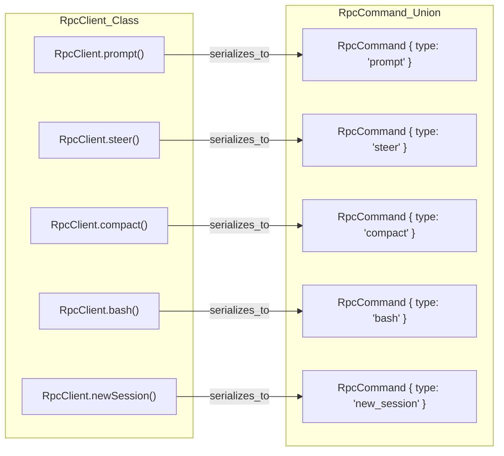

# Alternative Execution Modes: Print and RPC

<details>
<summary>Relevant source files</summary>

The following files were used as context for generating this wiki page:

- [packages/coding-agent/docs/rpc.md](packages/coding-agent/docs/rpc.md)
- [packages/coding-agent/docs/sdk.md](packages/coding-agent/docs/sdk.md)
- [packages/coding-agent/examples/extensions/trigger-compact.ts](packages/coding-agent/examples/extensions/trigger-compact.ts)
- [packages/coding-agent/src/core/output-guard.ts](packages/coding-agent/src/core/output-guard.ts)
- [packages/coding-agent/src/modes/rpc/rpc-client.ts](packages/coding-agent/src/modes/rpc/rpc-client.ts)
- [packages/coding-agent/src/modes/rpc/rpc-types.ts](packages/coding-agent/src/modes/rpc/rpc-types.ts)
- [packages/coding-agent/test/interactive-mode-clone-command.test.ts](packages/coding-agent/test/interactive-mode-clone-command.test.ts)
- [packages/coding-agent/test/interactive-mode-compaction.test.ts](packages/coding-agent/test/interactive-mode-compaction.test.ts)
- [packages/coding-agent/test/print-mode.test.ts](packages/coding-agent/test/print-mode.test.ts)
- [packages/coding-agent/test/rpc-client-process-exit.test.ts](packages/coding-agent/test/rpc-client-process-exit.test.ts)
- [packages/coding-agent/test/rpc-prompt-response-semantics.test.ts](packages/coding-agent/test/rpc-prompt-response-semantics.test.ts)
- [packages/coding-agent/test/rpc.test.ts](packages/coding-agent/test/rpc.test.ts)
- [packages/coding-agent/test/stdout-cleanliness.test.ts](packages/coding-agent/test/stdout-cleanliness.test.ts)
- [packages/coding-agent/test/trigger-compact-extension.test.ts](packages/coding-agent/test/trigger-compact-extension.test.ts)

</details>


Beyond the standard interactive Terminal UI, the `pi` coding agent supports alternative execution modes designed for scripting, automation, and deep integration into other environments like IDEs or custom dashboards. These modes leverage the same underlying `AgentSession` logic but expose different interfaces for input and output.

## 1. Print Mode (`runPrintMode`)

Print mode is a "single-shot" execution mode. It is designed for CLI users who want to run a prompt and see the output directly in their terminal without entering a full TUI session. It supports both human-readable stdout and a machine-readable JSON event stream.

### Implementation and Data Flow
The entry point for this mode is `runPrintMode` in `packages/coding-agent/src/modes/print-mode.ts` [packages/coding-agent/test/print-mode.test.ts:4-4](). It initializes an `AgentSession` and immediately invokes the user's prompt.

- **Stdout Output**: By default, it prints assistant text deltas and tool execution status to `stdout` [packages/coding-agent/docs/sdk.md:31-35]().
- **JSON Event Stream**: When enabled (typically via flags like `--json`), it outputs the raw `AgentSessionEvent` stream as JSONL, allowing external tools to parse the agent's progress in real-time.
- **Lifecycle**: The process exits once the agent reaches an "idle" state (no more tool calls or pending turns). The mode returns an exit code of `0` on success or `1` if an assistant error occurs [packages/coding-agent/test/print-mode.test.ts:126-141]().

**Sources:** [packages/coding-agent/docs/sdk.md:31-35](), [packages/coding-agent/test/print-mode.test.ts:4-4](), [packages/coding-agent/test/print-mode.test.ts:93-142]()

---

## 2. RPC Mode (`runRpcMode`)

RPC mode enables headless operation of the coding agent via a JSON protocol over `stdin` and `stdout`. This is the primary mechanism for embedding `pi` into IDE extensions or external UIs [packages/coding-agent/docs/rpc.md:2-5]().

### Protocol Specifications
- **Framing**: Uses strict JSONL (JSON Lines) semantics with `\n` as the record delimiter [packages/coding-agent/docs/rpc.md:27-30](). Node.js `readline` is specifically noted as non-compliant because it splits on Unicode separators like `U+2028` and `U+2029`, which are valid inside JSON strings [packages/coding-agent/docs/rpc.md:36-37]().
- **Commands (stdin)**: Clients send JSON objects representing actions (e.g., `prompt`, `get_state`, `compact`) [packages/coding-agent/src/modes/rpc/rpc-types.ts:19-69]().
- **Responses (stdout)**: The agent replies with a response object containing a `success` boolean and optional `data`. A `success: true` indicates the prompt was accepted or queued [packages/coding-agent/src/modes/rpc/rpc-types.ts:111-120](), [packages/coding-agent/docs/rpc.md:71-76]().
- **Events (stdout)**: Asynchronous `AgentEvent` objects are streamed as JSON lines, representing the real-time progress of the agent [packages/coding-agent/docs/rpc.md:23-23]().

### Command/Event Lifecycle
The RPC mode uses `AgentSessionRuntime` to manage the lifecycle, allowing commands like `new_session` or `switch_session` to swap the active `AgentSession` without restarting the process [packages/coding-agent/docs/sdk.md:120-125]().

#### RPC Execution Flow
This diagram illustrates how a command moves from `stdin` through the RPC handler to the core `AgentSession`.

"RPC Execution Flow"
```mermaid
graph TD
    subgraph "ExternalProcess"
        [Client] -- "JSONL_Command" --> [stdin]
    end

    subgraph "piProcess_runRpcMode"
        [stdin] --> attachJsonlLineReader["attachJsonlLineReader (jsonl.ts)"]
        attachJsonlLineReader --> RpcHandler["RpcHandler (rpc-mode.ts)"]
        RpcHandler -- "execute" --> AgentSessionRuntime["AgentSessionRuntime (agent-session-runtime.ts)"]
        AgentSessionRuntime -- "call" --> AgentSession["AgentSession (agent-session.ts)"]
        
        AgentSession -- "AgentEvent" --> serializeJsonLine["serializeJsonLine (jsonl.ts)"]
        serializeJsonLine -- "JSONL_Event" --> [stdout]
        
        RpcHandler -- "RpcResponse" --> serializeJsonLine
    end

    subgraph "AgentCore"
        AgentSession -- "loop" --> AgentLoop["AgentLoop (pi-agent-core)"]
    end
```
**Sources:** [packages/coding-agent/docs/rpc.md:19-37](), [packages/coding-agent/src/modes/rpc/rpc-types.ts:111-120](), [packages/coding-agent/src/modes/rpc/rpc-client.ts:126-128](), [packages/coding-agent/docs/sdk.md:120-125]()

---

## 3. The TypeScript RPC Client (`RpcClient`)

For Node.js applications that wish to spawn `pi` as a subprocess rather than linking the library directly, the package provides a high-level `RpcClient` [packages/coding-agent/src/modes/rpc/rpc-client.ts:54-54]().

### Key Functions
- `start()`: Spawns the `pi` binary with the `--mode rpc` flag and attaches a JSONL line reader to `stdout` [packages/coding-agent/src/modes/rpc/rpc-client.ts:72-138]().
- `prompt(message, images)`: Sends a user prompt and returns immediately after sending; clients use `onEvent` to receive the stream [packages/coding-agent/src/modes/rpc/rpc-client.ts:196-198]().
- `onEvent(listener)`: Registers a callback for the asynchronous `AgentEvent` stream [packages/coding-agent/src/modes/rpc/rpc-client.ts:170-178]().
- `getState()`: Retrieves the current `RpcSessionState`, including model info and message counts [packages/coding-agent/src/modes/rpc/rpc-client.ts:251-254]().

### Code Entity Mapping: Client to Protocol
This diagram maps `RpcClient` methods to the `RpcCommand` types they generate and send over the wire.

"RpcClient to RpcCommand Mapping"

**Sources:** [packages/coding-agent/src/modes/rpc/rpc-client.ts:191-249](), [packages/coding-agent/src/modes/rpc/rpc-types.ts:19-69]()

---

## 4. Advanced RPC Features

### Steering and Follow-ups
RPC mode allows interacting with the agent while it is streaming by specifying a `streamingBehavior` [packages/coding-agent/docs/rpc.md:55-59]():
- **Steer**: Interrupts the agent mid-turn. Delivered after the current assistant turn finishes executing its tool calls, but before the next LLM call [packages/coding-agent/docs/rpc.md:61-62]().
- **Follow-up**: Queues a message to be processed only after the agent has completely finished its current task and stopped [packages/coding-agent/docs/rpc.md:62-63]().

### Bash Execution
The RPC protocol allows direct execution of shell commands through the agent's internal `bash-executor`, returning a `BashResult` containing `output`, `exitCode`, and `cancelled` status [packages/coding-agent/src/modes/rpc/rpc-types.ts:52-53](), [packages/coding-agent/src/modes/rpc/rpc-types.ts:168-168]().

### Session State and Statistics
The `get_state` and `get_session_stats` commands provide deep visibility into the current session, including token usage and auto-compaction status [packages/coding-agent/src/modes/rpc/rpc-types.ts:91-104]().

| Command | Return Data | Purpose |
| :--- | :--- | :--- |
| `get_state` | `RpcSessionState` | Current model, thinking level, and streaming status [packages/coding-agent/src/modes/rpc/rpc-types.ts:120-120](). |
| `get_messages` | `AgentMessage[]` | The full conversation history [packages/coding-agent/src/modes/rpc/rpc-types.ts:194-194](). |
| `get_available_models` | `ModelInfo[]` | List of LLM models supported by the current provider [packages/coding-agent/src/modes/rpc/rpc-types.ts:140-143](). |
| `export_html` | `{ path: string }` | Generates a static HTML transcript of the session [packages/coding-agent/src/modes/rpc/rpc-types.ts:173-173](). |
| `compact` | `CompactionResult` | Manually triggers the compaction process [packages/coding-agent/src/modes/rpc/rpc-types.ts:160-160](). |

### Output Guard and Stdout Cleanliness
To ensure protocol integrity, `pi` uses an `output-guard.ts` to prevent internal logs or unexpected tool output from corrupting the JSONL stream [packages/coding-agent/src/core/output-guard.ts:45-70](). In non-interactive modes, trusted startup information is routed to `stderr` while `stdout` remains reserved for the primary data stream [packages/coding-agent/test/stdout-cleanliness.test.ts:99-107]().

**Sources:** [packages/coding-agent/src/modes/rpc/rpc-types.ts:19-196](), [packages/coding-agent/docs/rpc.md:79-121](), [packages/coding-agent/test/rpc.test.ts:36-45](), [packages/coding-agent/src/core/output-guard.ts:45-70](), [packages/coding-agent/test/stdout-cleanliness.test.ts:99-107]()
