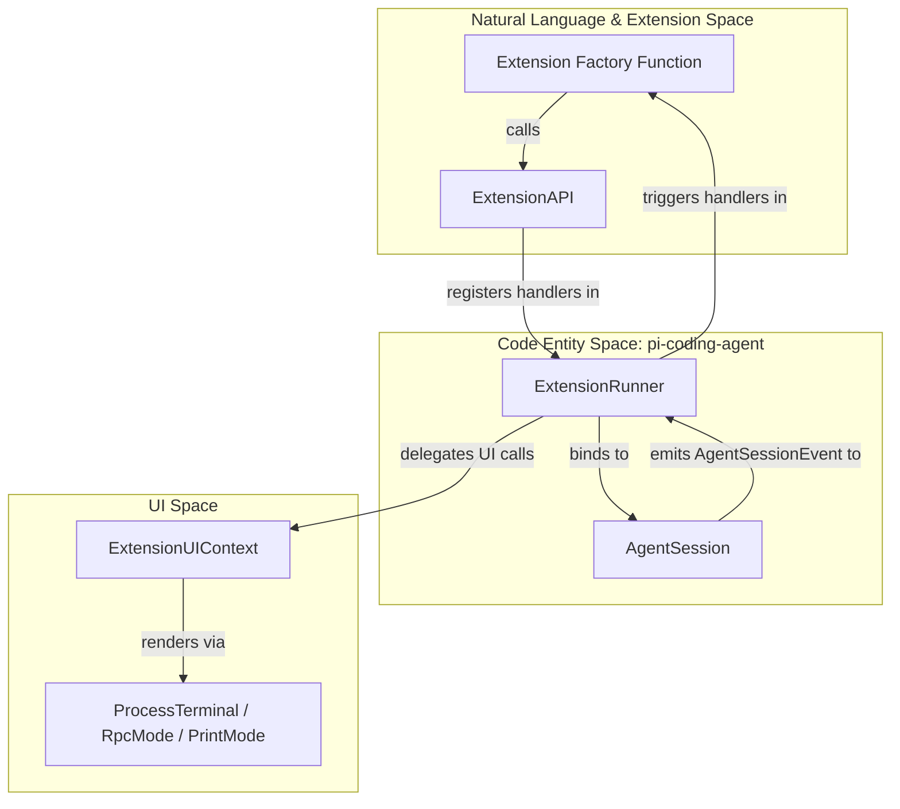
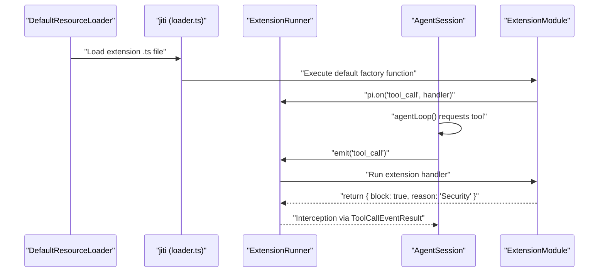

# Extension System

Relevant source files

The following files were used as context for generating this wiki page:

- [packages/coding-agent/docs/extensions.md](packages/coding-agent/docs/extensions.md)
- [packages/coding-agent/examples/extensions/README.md](packages/coding-agent/examples/extensions/README.md)
- [packages/coding-agent/src/core/extensions/index.ts](packages/coding-agent/src/core/extensions/index.ts)
- [packages/coding-agent/src/core/extensions/loader.ts](packages/coding-agent/src/core/extensions/loader.ts)
- [packages/coding-agent/src/core/extensions/runner.ts](packages/coding-agent/src/core/extensions/runner.ts)
- [packages/coding-agent/src/core/extensions/types.ts](packages/coding-agent/src/core/extensions/types.ts)
- [packages/coding-agent/src/index.ts](packages/coding-agent/src/index.ts)
- [packages/coding-agent/test/extensions-runner.test.ts](packages/coding-agent/test/extensions-runner.test.ts)

The `pi` extension system allows developers to augment the agent's behavior by subscribing to lifecycle events, registering custom tools, adding slash commands, and creating interactive UI components. Extensions are authored in TypeScript and loaded dynamically at runtime without a separate compilation step.

## Architecture Overview

The extension architecture is built around a decoupled relationship between the **Extension Runtime**, the **Extension Runner**, and the **Agent Session**.

*   **Discovery & Loading**: Extensions are discovered from global and project-local directories and loaded using `jiti` [packages/coding-agent/src/core/extensions/loader.ts:15-15]().
*   **Binding**: Once loaded, extensions are bound to an `AgentSession` via the `ExtensionRunner` [packages/coding-agent/src/core/agent-session.ts:183-186]().
*   **Interaction**: Extensions interact with the system through the `ExtensionAPI` [packages/coding-agent/src/core/extensions/types.ts:173-173](), which provides access to UI primitives, tool registration, and event subscriptions.

### System Interaction Diagram

This diagram illustrates how the `ExtensionRunner` bridges the high-level `ExtensionAPI` used by developers with the internal `AgentSession` logic.

**Sources:** [packages/coding-agent/src/core/extensions/runner.ts:225-230](), [packages/coding-agent/src/core/agent-session.ts:157-187](), [packages/coding-agent/src/core/extensions/loader.ts:124-170](), [packages/coding-agent/src/modes/interactive/interactive-mode.ts:73-73]()

## Extension API and Lifecycle Events

The `ExtensionAPI` is the primary interface for extension authors. It allows for:
*   **Event Handling**: Subscribing to events like `session_start`, `tool_call`, and `message_end` [packages/coding-agent/src/core/extensions/types.ts:227-250]().
*   **Tool Registration**: Adding new capabilities to the LLM via `pi.registerTool()` [packages/coding-agent/src/core/extensions/types.ts:261-261]().
*   **UI Interaction**: Prompting the user for input or showing notifications via `ctx.ui` [packages/coding-agent/src/core/extensions/types.ts:124-168]().

For a full catalog of events and API methods, see **[Extension API and Lifecycle Events](#6.1)**.

**Sources:** [packages/coding-agent/src/core/extensions/types.ts:1-300]()

## Loading and Discovery

`pi` uses a three-tier discovery strategy to locate extensions:
1.  **Global**: `~/.pi/agent/extensions/` [packages/coding-agent/docs/extensions.md:116-117]()
2.  **Project-local**: `.pi/extensions/` [packages/coding-agent/docs/extensions.md:118-119]()
3.  **Configured**: Paths specified in `settings.json` or via the `--extension` CLI flag [packages/coding-agent/src/core/settings-manager.ts:95-99]().

Extensions are loaded using `jiti`, which enables direct execution of TypeScript by providing a runtime that handles modern syntax and virtual module mapping [packages/coding-agent/src/core/extensions/loader.ts:44-61](). The `ExtensionRuntime` manages the "stale" state of extensions during hot-reloads (via `/reload`) to ensure that handlers from old versions of an extension do not interfere with the new session [packages/coding-agent/src/core/extensions/loader.ts:154-158]().

For details on the loading pipeline and hot-reloading, see **[Extension Loading and Discovery](#6.2)**.

**Sources:** [packages/coding-agent/src/core/extensions/loader.ts:1-40](), [packages/coding-agent/src/core/package-manager.ts:92-108](), [packages/coding-agent/src/core/settings-manager.ts:95-99]()

## Extension Runtime Flow

The following diagram maps the lifecycle of an extension from discovery to execution within the `AgentSession`.

**Sources:** [packages/coding-agent/src/core/extensions/loader.ts:124-170](), [packages/coding-agent/src/core/extensions/runner.ts:225-250](), [packages/coding-agent/src/core/agent-session.ts:53-80](), [packages/coding-agent/src/core/resource-loader.ts:163-164]()

## Examples and Patterns

The codebase includes a wide variety of reference extensions and patterns. Common patterns include:
*   **Safety Gates**: Intercepting `bash` tool calls to confirm destructive commands (e.g., checking for `rm -rf`) [packages/coding-agent/docs/extensions.md:69-74]().
*   **Stateful Tools**: Managing local data that persists across session turns using `pi.appendEntry()` [packages/coding-agent/docs/extensions.md:15-15]().
*   **Custom Providers**: Implementing entirely new LLM backends via `pi.registerProvider()` [packages/coding-agent/src/core/extensions/loader.ts:161-163]().
*   **UI Customization**: Using `ctx.ui.setWidget()` or `ctx.ui.setFooter()` to change the TUI layout [packages/coding-agent/src/core/extensions/types.ts:162-180]().
*   **Conflict Management**: The `ExtensionRunner` automatically detects and warns when extension shortcuts conflict with built-in keybindings [packages/coding-agent/src/core/extensions/runner.ts:67-108]().

For a walkthrough of these examples, see **[Extension Examples and Patterns](#6.3)**.

**Sources:** [packages/coding-agent/docs/extensions.md:1-100](), [packages/coding-agent/src/core/extensions/types.ts:124-180](), [packages/coding-agent/examples/extensions/README.md:1-130]()
