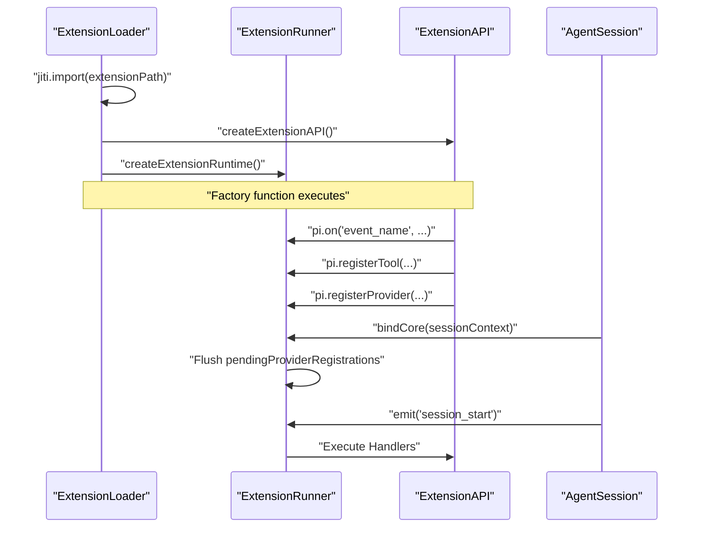
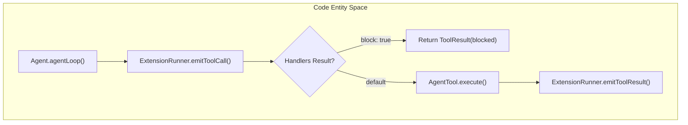
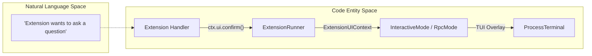

# Extension API and Lifecycle Events

Relevant source files

The following files were used as context for generating this wiki page:

- [packages/coding-agent/docs/extensions.md](packages/coding-agent/docs/extensions.md)
- [packages/coding-agent/examples/extensions/README.md](packages/coding-agent/examples/extensions/README.md)
- [packages/coding-agent/examples/extensions/dynamic-tools.ts](packages/coding-agent/examples/extensions/dynamic-tools.ts)
- [packages/coding-agent/src/core/extensions/index.ts](packages/coding-agent/src/core/extensions/index.ts)
- [packages/coding-agent/src/core/extensions/loader.ts](packages/coding-agent/src/core/extensions/loader.ts)
- [packages/coding-agent/src/core/extensions/runner.ts](packages/coding-agent/src/core/extensions/runner.ts)
- [packages/coding-agent/src/core/extensions/types.ts](packages/coding-agent/src/core/extensions/types.ts)
- [packages/coding-agent/src/core/system-prompt.ts](packages/coding-agent/src/core/system-prompt.ts)
- [packages/coding-agent/src/index.ts](packages/coding-agent/src/index.ts)
- [packages/coding-agent/test/agent-session-dynamic-tools.test.ts](packages/coding-agent/test/agent-session-dynamic-tools.test.ts)
- [packages/coding-agent/test/extensions-runner.test.ts](packages/coding-agent/test/extensions-runner.test.ts)
- [packages/coding-agent/test/system-prompt.test.ts](packages/coding-agent/test/system-prompt.test.ts)

Extensions in `pi` are TypeScript modules that allow developers to intercept agent behavior, register custom tools, and create interactive UI components. The system uses a hook-based architecture where extensions subscribe to lifecycle events emitted by the `AgentSession`.

## ExtensionAPI Interface

The `ExtensionAPI` is the primary entry point for an extension. It is passed as the first argument to the extension's default factory function [packages/coding-agent/src/core/extensions/types.ts:413-414]().

### Core Methods

| Method | Description |
| :--- | :--- |
| `pi.on(event, handler)` | Subscribes to a lifecycle event [packages/coding-agent/src/core/extensions/types.ts:416-417](). |
| `pi.registerTool(def)` | Registers a new tool that the LLM can call [packages/coding-agent/src/core/extensions/types.ts:419-420](). |
| `pi.registerCommand(name, def)` | Adds a slash command (e.g., `/my-command`) [packages/coding-agent/src/core/extensions/types.ts:422-423](). |
| `pi.appendEntry(entry)` | Persists custom data into the session's JSONL log [packages/coding-agent/src/core/extensions/types.ts:446-447](). |
| `pi.registerShortcut(key, def)` | Binds a global keyboard shortcut [packages/coding-agent/src/core/extensions/types.ts:425-426](). |
| `pi.registerFlag(name, def)` | Registers a CLI flag that can be used via `pi --flag` [packages/coding-agent/src/core/extensions/types.ts:431-432](). |
| `pi.registerProvider(name, config)` | Registers a custom LLM provider [packages/coding-agent/src/core/extensions/types.ts:434-435](). |
| `pi.unregisterProvider(name)` | Unregisters a custom LLM provider [packages/coding-agent/src/core/extensions/types.ts:437-438](). |

Sources: [packages/coding-agent/src/core/extensions/types.ts:413-447]()

### Extension Initialization Flow

The following diagram illustrates how an extension is loaded via `jiti` and bound to the `AgentSession`.

**Extension Binding Sequence**

Sources: [packages/coding-agent/src/core/extensions/loader.ts:15-61](), [packages/coding-agent/src/core/extensions/loader.ts:124-170](), [packages/coding-agent/src/core/extensions/runner.ts:224-250](), [packages/coding-agent/src/core/agent-session.ts:732-750]()

## Lifecycle Events Catalog

Extensions can hook into various stages of the agent's turn and the session's management.

### Session & Environment Events
*   `session_start`: Emitted when an extension is bound to a session [packages/coding-agent/src/core/extensions/types.ts:285-288]().
*   `resources_discover`: Triggered when the `ResourceLoader` scans for skills, prompts, or themes [packages/coding-agent/src/core/extensions/types.ts:333-336]().
*   `session_shutdown`: Emitted before the session is closed [packages/coding-agent/src/core/extensions/types.ts:328-331]().
*   `session_before_switch`: Emitted before switching to another session [packages/coding-agent/src/core/extensions/types.ts:290-293]().
*   `session_before_fork`: Emitted before forking the current session [packages/coding-agent/src/core/extensions/types.ts:295-298]().
*   `session_before_compact`: Emitted before compacting the session history [packages/coding-agent/src/core/extensions/types.ts:300-303]().
*   `session_compact`: Emitted after session compaction [packages/coding-agent/src/core/extensions/types.ts:305-308]().
*   `session_before_tree`: Emitted before navigating the session tree [packages/coding-agent/src/core/extensions/types.ts:310-313]().
*   `session_tree`: Emitted after navigating the session tree [packages/coding-agent/src/core/extensions/types.ts:315-318]().
*   `user_bash`: Emitted when the user executes a bash command [packages/coding-agent/src/core/extensions/types.ts:320-323]().
*   `input`: Emitted when the user provides input to the agent [packages/coding-agent/src/core/extensions/types.ts:325-326]().

### Agent Turn Events
*   `before_agent_start`: Allows modifying the system prompt or injecting messages before the LLM is called [packages/coding-agent/src/core/extensions/types.ts:213-217]().
*   `before_provider_request`: Intercepts the raw request to the LLM provider (e.g., OpenAI/Anthropic) [packages/coding-agent/src/core/extensions/types.ts:233-237]().
*   `turn_start` / `turn_end`: Marks the beginning and end of a single agent loop iteration [packages/coding-agent/src/core/extensions/types.ts:205-211]().
*   `message_start` / `message_update` / `message_end`: Hooks into the streaming response from the assistant [packages/coding-agent/src/core/extensions/types.ts:239-248]().
*   `context`: Emitted when the agent's context changes [packages/coding-agent/src/core/extensions/types.ts:219-222]().

### Tool Interception
Extensions can block or modify tool calls using the `tool_call` event. If a handler returns `{ block: true }`, the tool execution is skipped [packages/coding-agent/src/core/extensions/types.ts:250-255]().
*   `tool_call`: Emitted before a tool is executed [packages/coding-agent/src/core/extensions/types.ts:250-255]().
*   `tool_result`: Emitted after a tool has executed and returned a result [packages/coding-agent/src/core/extensions/types.ts:257-260]().

**Tool Execution Interception Logic**

Sources: [packages/coding-agent/src/core/extensions/runner.ts:544-580](), [packages/coding-agent/src/core/extensions/types.ts:250-260]()

## ExtensionContext Objects

When an event handler or command is executed, it receives a context object providing access to the UI and session state.

### ExtensionContext
Passed to event handlers.
*   `ctx.ui`: Access to `ExtensionUIContext` for showing dialogs, notifications, and custom components [packages/coding-agent/src/core/extensions/types.ts:124-190]().
*   `ctx.sessionManager`: Read-only access to the current session history and branching [packages/coding-agent/src/core/extensions/types.ts:403-404]().
*   `ctx.model`: Information about the active LLM [packages/coding-agent/src/core/extensions/types.ts:402-403]().
*   `ctx.modelRegistry`: Access to the `ModelRegistry` for managing LLM providers and models [packages/coding-agent/src/core/extensions/types.ts:405-406]().
*   `ctx.cwd`: The current working directory [packages/coding-agent/src/core/extensions/types.ts:407-408]().
*   `ctx.exec`: A utility for executing shell commands [packages/coding-agent/src/core/extensions/types.ts:409-410]().
*   `ctx.eventBus`: The event bus for publishing and subscribing to events [packages/coding-agent/src/core/extensions/types.ts:411-412]().

Sources: [packages/coding-agent/src/core/extensions/types.ts:399-412]()

### ExtensionCommandContext
Passed to slash command handlers. It extends `ExtensionContext` with navigation actions:
*   `ctx.newSession()`: Starts a fresh session [packages/coding-agent/src/core/extensions/types.ts:358-359]().
*   `ctx.fork(entryId)`: Creates a branch from a specific message [packages/coding-agent/src/core/extensions/types.ts:360-361]().
*   `ctx.reload()`: Hot-reloads extensions and resources [packages/coding-agent/src/core/extensions/types.ts:363-364]().
*   `ctx.navigateTree()`: Navigates the session tree [packages/coding-agent/src/core/extensions/types.ts:362-363]().
*   `ctx.switchSession()`: Switches to another session [packages/coding-agent/src/core/extensions/types.ts:365-366]().
*   `ctx.waitForIdle()`: Waits for the agent to be idle [packages/coding-agent/src/core/extensions/types.ts:357-358]().

Sources: [packages/coding-agent/src/core/extensions/types.ts:355-366]()

## UI Primitives

Extensions interact with the user through the `ExtensionUIContext`. In `interactive-mode`, these map to TUI components; in `rpc-mode`, they emit JSON messages.

| Method | Code Entity / Implementation |
| :--- | :--- |
| `confirm()` | Shows `LoginDialogComponent` style prompt [packages/coding-agent/src/modes/interactive/interactive-mode.ts:1335-1345]() |
| `select()` | Uses `SelectList` or `TreeSelectorComponent` [packages/coding-agent/src/modes/interactive/interactive-mode.ts:1316-1333]() |
| `setStatus()` | Updates the `FooterComponent` [packages/coding-agent/src/modes/interactive/interactive-mode.ts:1416-1418]() |
| `setWidget()` | Renders a `Component` above/below the editor [packages/coding-agent/src/modes/interactive/interactive-mode.ts:1451-1473]() |
| `custom()` | Mounts a raw `pi-tui` component into an `Overlay` [packages/coding-agent/src/modes/interactive/interactive-mode.ts:1532-1565]() |
| `addAutocompleteProvider()` | Wraps the editor's autocomplete logic [packages/coding-agent/src/modes/interactive/interactive-mode.ts:1612-1615]() |
| `notify()` | Displays a notification [packages/coding-agent/src/modes/interactive/interactive-mode.ts:1399-1401]() |
| `onTerminalInput()` | Registers a handler for raw terminal input [packages/coding-agent/src/modes/interactive/interactive-mode.ts:1403-1405]() |
| `setWorkingMessage()` | Sets the working/loading message [packages/coding-agent/src/modes/interactive/interactive-mode.ts:1420-1422]() |
| `setWorkingVisible()` | Shows or hides the working loader [packages/coding-agent/src/modes/interactive/interactive-mode.ts:1424-1426]() |
| `setWorkingIndicator()` | Configures the working indicator [packages/coding-agent/src/modes/interactive/interactive-mode.ts:1428-1430]() |
| `setHiddenThinkingLabel()` | Sets the label for hidden thinking blocks [packages/coding-agent/src/modes/interactive/interactive-mode.ts:1432-1434]() |
| `setFooter()` | Sets a custom footer component [packages/coding-agent/src/modes/interactive/interactive-mode.ts:1475-1480]() |
| `setHeader()` | Sets a custom header component [packages/coding-agent/src/modes/interactive/interactive-mode.ts:1482-1484]() |
| `setTitle()` | Sets the terminal window/tab title [packages/coding-agent/src/modes/interactive/interactive-mode.ts:1486-1488]() |
| `pasteToEditor()` | Pastes text to the editor [packages/coding-agent/src/modes/interactive/interactive-mode.ts:1490-1492]() |
| `setEditorText()` | Sets the editor's text content [packages/coding-agent/src/modes/interactive/interactive-mode.ts:1494-1496]() |
| `getEditorText()` | Gets the editor's text content [packages/coding-agent/src/modes/interactive/interactive-mode.ts:1498-1500]() |
| `editor()` | Shows a custom editor component [packages/coding-agent/src/modes/interactive/interactive-mode.ts:1502-1504]() |
| `setEditorComponent()` | Sets a custom editor component [packages/coding-agent/src/modes/interactive/interactive-mode.ts:1617-1619]() |
| `getEditorComponent()` | Gets the current editor component [packages/coding-agent/src/modes/interactive/interactive-mode.ts:1621-1623]() |
| `theme` | Access to the current theme [packages/coding-agent/src/modes/interactive/interactive-mode.ts:1625-1627]() |
| `getAllThemes()` | Gets all available themes [packages/coding-agent/src/modes/interactive/interactive-mode.ts:1629-1631]() |
| `getTheme()` | Gets a specific theme by name [packages/coding-agent/src/modes/interactive/interactive-mode.ts:1633-1635]() |
| `setTheme()` | Sets the current theme [packages/coding-agent/src/modes/interactive/interactive-mode.ts:1637-1639]() |
| `getToolsExpanded()` | Checks if tools are expanded [packages/coding-agent/src/modes/interactive/interactive-mode.ts:1641-1643]() |
| `setToolsExpanded()` | Sets the expanded state of tools [packages/coding-agent/src/modes/interactive/interactive-mode.ts:1645-1647]() |

**UI Request Flow (Natural Language to Code)**

Sources: [packages/coding-agent/src/core/extensions/types.ts:124-190](), [packages/coding-agent/src/modes/interactive/interactive-mode.ts:1335-1345](), [packages/coding-agent/src/modes/rpc/rpc-mode.ts:135-138]()

## Data Persistence via `appendEntry`

Extensions can store state that survives restarts by appending custom entries to the session log.
1.  Extension calls `pi.appendEntry({ type: "custom", ... })` [packages/coding-agent/src/core/extensions/types.ts:446-447]().
2.  `AgentSession` forwards this to `SessionManager.appendEntry()` [packages/coding-agent/src/core/agent-session.ts:854-856]().
3.  The entry is written to the `.jsonl` session file [packages/coding-agent/src/core/session-manager.ts:573-585]().
4.  On reload, the extension can find its data by scanning `ctx.sessionManager.getEntries()` [packages/coding-agent/src/core/extensions/types.ts:403-404]().

Sources: [packages/coding-agent/src/core/agent-session.ts:854-860](), [packages/coding-agent/src/core/session-manager.ts:573-585](), [packages/coding-agent/src/core/extensions/types.ts:446-450]()
