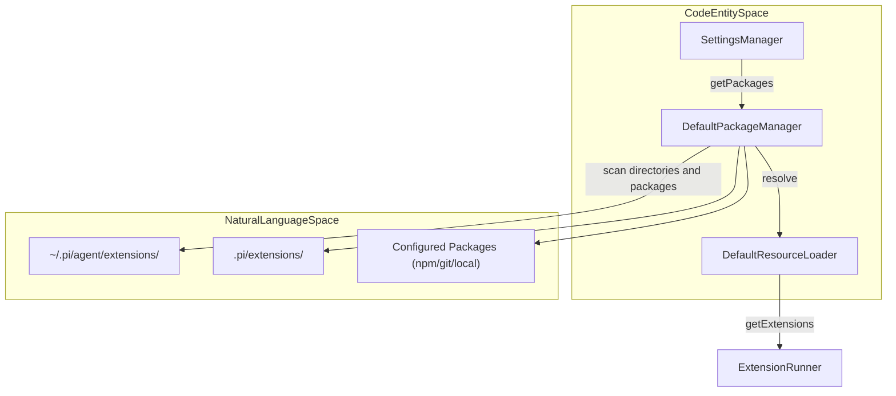
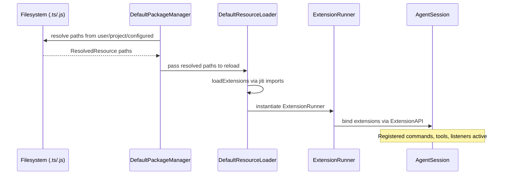

# Extension Loading and Discovery

Relevant source files

The following files were used as context for generating this wiki page:

- [packages/coding-agent/docs/packages.md](packages/coding-agent/docs/packages.md)
- [packages/coding-agent/examples/extensions/project-trust.ts](packages/coding-agent/examples/extensions/project-trust.ts)
- [packages/coding-agent/src/core/package-manager.ts](packages/coding-agent/src/core/package-manager.ts)
- [packages/coding-agent/src/core/resource-loader.ts](packages/coding-agent/src/core/resource-loader.ts)
- [packages/coding-agent/src/utils/git.ts](packages/coding-agent/src/utils/git.ts)
- [packages/coding-agent/test/extensions-discovery.test.ts](packages/coding-agent/test/extensions-discovery.test.ts)
- [packages/coding-agent/test/git-ssh-url.test.ts](packages/coding-agent/test/git-ssh-url.test.ts)
- [packages/coding-agent/test/git-update.test.ts](packages/coding-agent/test/git-update.test.ts)
- [packages/coding-agent/test/package-manager-ssh.test.ts](packages/coding-agent/test/package-manager-ssh.test.ts)
- [packages/coding-agent/test/package-manager.test.ts](packages/coding-agent/test/package-manager.test.ts)
- [packages/coding-agent/test/resource-loader.test.ts](packages/coding-agent/test/resource-loader.test.ts)

Extensions in `pi` are modular TypeScript artifacts that augment the agent by subscribing to lifecycle events, registering tools, and integrating commands or UI elements. This page details how extensions are discovered, loaded, and bound into the session, providing a robust and flexible plugin system supporting global, local, and configured sources.

---

## Discovery Mechanism

Discovery of extensions follows a layered approach and is managed primarily via the `PackageManager` and `ResourceLoader` components. This design provides a predictable precedence for resources and accommodates diverse source types: local directories, remote packages (npm/git), and explicit configuration.

### The Three-Tier Hierarchy

1. **Global (User) Scope**  
   Extensions installed globally for the user reside under `~/.pi/agent/extensions/` and are active across all projects unless overridden by project-level resources. These have a `user` scope and can be explicitly configured or auto-discovered [packages/coding-agent/src/core/package-manager.ts:112-116]().
   
2. **Project-Local Scope**  
   Extensions defined within the current project's working directory at `.pi/extensions/` apply only to that project. These project-scoped extensions take precedence over global ones and are likewise configurable or auto-discovered [packages/coding-agent/src/core/package-manager.ts:161-171]().

3. **Configured Paths**  
   Beyond convention-based discovery, explicit extension paths can be defined in `settings.json` under `extensions` or configured package sources (`npm:`, `git:` or local paths). These allow arbitrary external extensions to be included in the agent environment by installing or linking to them [packages/coding-agent/docs/packages.md:50-53]().

### Resource Precedence and Conflict Resolution

To reconcile duplicates or overlapping resource names, `resourcePrecedenceRank` assigns a rank (lower is higher precedence) based on metadata origins:

| Rank | Source                                         | Description                                       |
|-------|------------------------------------------------|-----------------------------------------------------------|
| 0     | Project + settings entry (local, explicit)      | Highest priority: explicitly configured local project resource |
| 1     | Project + auto-discovered (auto, project local) | Auto-discovered but within project folder               |
| 2     | User + settings entry (local, explicit)         | Explicitly configured global user-level resource         |
| 3     | User + auto-discovered (auto, user global)      | Auto-discovered global user-level resource               |
| 4     | Package resource (origin: "package")           | Extensions bundled inside external npm/git packages     |

This ensures project-specific customizations override user/global extensions, which in turn override third-party package contents [packages/coding-agent/src/core/package-manager.ts:173-177]().

### Discovery Pipeline Diagram

This diagram illustrates how the system components cooperate during discovery, from source directories to the final runtime extensions list.

**Legend:**  
- **SettingsManager** supplies configured package sources to  
- **DefaultPackageManager** which performs filesystem scan and installs updates [packages/coding-agent/src/core/package-manager.ts:92-108]().
- **DefaultResourceLoader** collects resolved resource paths, loading extensions [packages/coding-agent/src/core/resource-loader.ts:32-42]().
- **ExtensionRunner** manages extension lifecycles and API bindings [packages/coding-agent/test/resource-loader.test.ts:7-9]().

Sources: [packages/coding-agent/src/core/package-manager.ts:92-108](), [packages/coding-agent/src/core/resource-loader.ts:32-42](), [packages/coding-agent/src/core/resource-loader.ts:156-161]()

---

## Loading and Execution

### Jiti-Based Loading

Extensions are dynamically loaded using the `jiti` runtime loader. This allows importing `.ts` or `.js` extension files with immediate evaluation, avoiding separate build step overhead and enabling live code updates. This approach facilitates rapid iteration and supports programmatic reloads during an agent session [packages/coding-agent/src/core/resource-loader.ts:12-13]().

### ExtensionRuntime Bind Pattern

The core runtime hosting extensions is the `ExtensionRunner`. Extensions are loaded as factory functions exporting a default function that receives the `ExtensionAPI` interface.

1. **Discovery**: `DefaultPackageManager.resolve()` returns resolved and filtered extension paths [packages/coding-agent/src/core/package-manager.ts:93-103]().
2. **Loading**: `DefaultResourceLoader` invokes `loadExtensions` which uses `jiti` to import and instantiate extension factories [packages/coding-agent/src/core/extensions/loader.ts:6-14]().
3. **Binding**: Each extension factory receives an `ExtensionAPI` object (`pi`), enabling it to register commands, tools, and lifecycle event listeners [packages/coding-agent/test/extensions-discovery.test.ts:24-28]().
4. **Running**: The `ExtensionRunner` manages these instances for dispatching events and executing registered hooks.

### Reload and Hot-Reload via /reload

The `/reload` slash command invokes live extension reload:

- `DefaultResourceLoader.reload()` resets internal caches and triggers a fresh discovery through `PackageManager` [packages/coding-agent/src/core/resource-loader.ts:156-161]().
- `SettingsManager` refreshes settings from disk if changed, ensuring any new configured packages or paths are considered [packages/coding-agent/src/core/settings-manager.ts:113-114]().
- New extension instances are constructed and bound to the active `AgentSession`, replacing prior extensions without requiring agent restart [packages/coding-agent/src/core/resource-loader.ts:33-36]().

Sources: [packages/coding-agent/src/core/resource-loader.ts:12-13](), [packages/coding-agent/src/core/extensions/loader.ts:6-14](), [packages/coding-agent/src/core/resource-loader.ts:156-161]()

---

## Package Management Pipeline

Extensions and other resources distributed via the network (npm or Git repositories) are managed through an integrated package lifecycle controlled by `DefaultPackageManager`.

| Feature | Implementation Detail |
|---------|-----------------------|
| **npm Support** | Invokes `npm install` (or configurable `npmCommand`) to install packages under `.pi/npm` or `~/.pi/agent/npm` [packages/coding-agent/src/core/package-manager.ts:94-95](), [packages/coding-agent/docs/packages.md:60-64]() |
| **Git Support** | Clones and checks out pinned commits/tags; supports `git fetch`, `reset --hard`, and `clean` for update operations [packages/coding-agent/src/utils/git.ts:6-19](), [packages/coding-agent/test/git-update.test.ts:155-165]() |
| **Dependency Isolation** | Runs `npm install` within cloned package if `package.json` is present, isolating dependencies to the package context [packages/coding-agent/docs/packages.md:167-171]() |
| **Manifests** | Supports `pi` key in `package.json` for explicit resource paths, alternatively uses conventional directories like `extensions/` [packages/coding-agent/docs/packages.md:118-129]() |

### Loading Dataflow Sequence

This sequence diagram portrays the flow from extension source discovery to runtime binding:

Sources: [packages/coding-agent/src/core/package-manager.ts:93-103](), [packages/coding-agent/src/core/resource-loader.ts:156-161](), [packages/coding-agent/docs/packages.md:118-129]()

---

## Implementation Details

### Key Classes and Roles

| Class / Interface | Description |
|-------------------|-------------|
| `DefaultPackageManager` | Manages installed packages, resolves extension/skill/prompt/theme paths, and handles npm/git lifecycle [packages/coding-agent/src/core/package-manager.ts:92-108]() |
| `DefaultResourceLoader` | Coordinates resource loading by querying the `PackageManager`, loading extensions via `jiti`, and aggregating skills, prompts, themes [packages/coding-agent/src/core/resource-loader.ts:156-188]() |
| `SettingsManager` | Reads and manages user and project settings, supplying package source lists and extension paths to the `PackageManager` [packages/coding-agent/src/core/settings-manager.ts:113-114]() |

### Resource Discovery Patterns

The `PackageManager` uses regex patterns to find resources automatically when scanning directories:

- **Extensions**: Files matching `/\.(ts|js)$/` [packages/coding-agent/src/core/package-manager.ts:191]().
- **Skills and Prompts**: Files matching `/\.md$/` [packages/coding-agent/src/core/package-manager.ts:192-193]().
- **Themes**: JSON files matching `/\.json$/` [packages/coding-agent/src/core/package-manager.ts:194]().

### Resource Loader Logic

`DefaultResourceLoader` initializes with path and settings context. During `reload()`:

- It calls `PackageManager.resolve()` to produce canonical resource path lists [packages/coding-agent/src/core/package-manager.ts:93]().
- Extension factories are imported via `jiti` and instantiated.
- Context files like `AGENTS.md` and `CLAUDE.md` are discovered by walking upward from the current working directory to root, accumulating project context [packages/coding-agent/src/core/resource-loader.ts:97-112]().
- System prompts are resolved from strings or files [packages/coding-agent/src/core/resource-loader.ts:44-59]().

Sources: [packages/coding-agent/src/core/package-manager.ts:190-195](), [packages/coding-agent/src/core/resource-loader.ts:97-112](), [packages/coding-agent/src/core/resource-loader.ts:156-188]()
