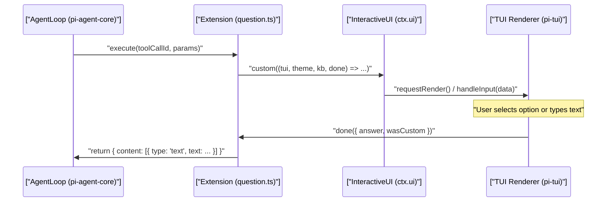
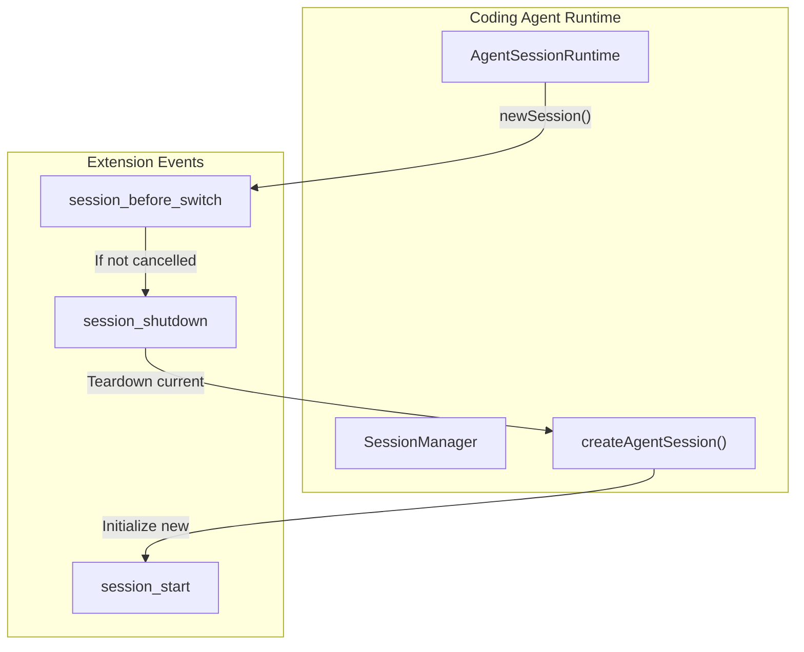

# Extension Examples and Patterns

Relevant source files

The following files were used as context for generating this wiki page:

- [packages/coding-agent/examples/README.md](packages/coding-agent/examples/README.md)
- [packages/coding-agent/examples/extensions/bash-spawn-hook.ts](packages/coding-agent/examples/extensions/bash-spawn-hook.ts)
- [packages/coding-agent/examples/extensions/built-in-tool-renderer.ts](packages/coding-agent/examples/extensions/built-in-tool-renderer.ts)
- [packages/coding-agent/examples/extensions/custom-compaction.ts](packages/coding-agent/examples/extensions/custom-compaction.ts)
- [packages/coding-agent/examples/extensions/custom-provider-anthropic/.gitignore](packages/coding-agent/examples/extensions/custom-provider-anthropic/.gitignore)
- [packages/coding-agent/examples/extensions/custom-provider-anthropic/package-lock.json](packages/coding-agent/examples/extensions/custom-provider-anthropic/package-lock.json)
- [packages/coding-agent/examples/extensions/custom-provider-anthropic/package.json](packages/coding-agent/examples/extensions/custom-provider-anthropic/package.json)
- [packages/coding-agent/examples/extensions/custom-provider-gitlab-duo/.gitignore](packages/coding-agent/examples/extensions/custom-provider-gitlab-duo/.gitignore)
- [packages/coding-agent/examples/extensions/custom-provider-gitlab-duo/package.json](packages/coding-agent/examples/extensions/custom-provider-gitlab-duo/package.json)
- [packages/coding-agent/examples/extensions/handoff.ts](packages/coding-agent/examples/extensions/handoff.ts)
- [packages/coding-agent/examples/extensions/hello.ts](packages/coding-agent/examples/extensions/hello.ts)
- [packages/coding-agent/examples/extensions/minimal-mode.ts](packages/coding-agent/examples/extensions/minimal-mode.ts)
- [packages/coding-agent/examples/extensions/qna.ts](packages/coding-agent/examples/extensions/qna.ts)
- [packages/coding-agent/examples/extensions/question.ts](packages/coding-agent/examples/extensions/question.ts)
- [packages/coding-agent/examples/extensions/questionnaire.ts](packages/coding-agent/examples/extensions/questionnaire.ts)
- [packages/coding-agent/examples/extensions/sandbox/index.ts](packages/coding-agent/examples/extensions/sandbox/index.ts)
- [packages/coding-agent/examples/extensions/shutdown-command.ts](packages/coding-agent/examples/extensions/shutdown-command.ts)
- [packages/coding-agent/examples/extensions/ssh.ts](packages/coding-agent/examples/extensions/ssh.ts)
- [packages/coding-agent/examples/extensions/subagent/README.md](packages/coding-agent/examples/extensions/subagent/README.md)
- [packages/coding-agent/examples/extensions/subagent/index.ts](packages/coding-agent/examples/extensions/subagent/index.ts)
- [packages/coding-agent/examples/extensions/summarize.ts](packages/coding-agent/examples/extensions/summarize.ts)
- [packages/coding-agent/examples/extensions/todo.ts](packages/coding-agent/examples/extensions/todo.ts)
- [packages/coding-agent/examples/extensions/tool-override.ts](packages/coding-agent/examples/extensions/tool-override.ts)
- [packages/coding-agent/examples/extensions/truncated-tool.ts](packages/coding-agent/examples/extensions/truncated-tool.ts)
- [packages/coding-agent/test/edit-tool-no-full-redraw.test.ts](packages/coding-agent/test/edit-tool-no-full-redraw.test.ts)

The `pi` extension system enables developers to customize agent behavior through lifecycle event handling, custom tools, commands, UI overlays, and integration with external services. This page walks through canonical example extensions in the `packages/coding-agent/examples/extensions/` directory, explaining their implementation, data flow, and architectural patterns.

## Overview of Examples

The example extensions cover a wide range of scenarios, organized roughly by purpose:

| Category | Key Examples | Description |
| :--- | :--- | :--- |
| **Lifecycle & Safety** | `permission-gate.ts`, `sandbox/` | Safety gates prompting before dangerous commands or protecting paths. |
| **Custom Tools** | `hello.ts`, `todo.ts`, `subagent/`, `truncated-tool.ts` | New tools or wrappers adding features to standard tools or UI. |
| **Commands & UI** | `handoff.ts`, `question.ts`, `doom-overlay/` | Slash commands, overlays, session planning, and custom UI. |
| **Integrations** | `git-checkpoint.ts`, `custom-provider-anthropic/`, `ssh.ts` | Git integration, custom LLM providers, and remote execution via SSH. |

**Sources:** [packages/coding-agent/examples/README.md:1-26]()

---

## Tool Patterns

### Minimal Tool Implementation
The simplest extension example is `hello.ts`, which shows how to define and register a tool using `pi.registerTool()`. It uses `TypeBox` schemas for parameters and provides an `execute()` method.

- Defines the tool name, description, and input parameter schema using `Type.Object`. [packages/coding-agent/examples/extensions/hello.ts:8-14]()
- Implements the asynchronous `execute` function, which receives `params` and `ctx`. [packages/coding-agent/examples/extensions/hello.ts:16-21]()
- Returns a `content` array for the agent and `details` for the UI. [packages/coding-agent/examples/extensions/hello.ts:17-20]()

**Sources:** [packages/coding-agent/examples/extensions/hello.ts:1-26]()

### Tool Override and Interception
Extensions can override built-in tools by registering tools with the same name.

- **Audit and Access Control:** The `tool-override.ts` example wraps the `read` tool to log each access to `read-access.log` and blocks access to sensitive paths like `.env` or `~/.ssh` using `isBlockedPath`. [packages/coding-agent/examples/extensions/tool-override.ts:69-92]()
- **Remote Execution via SSH:** The `ssh.ts` extension overrides core tools (`read`, `write`, `edit`, `bash`) to run remotely over SSH when a `--ssh` flag is provided. It uses `sshExec` to proxy operations. [packages/coding-agent/examples/extensions/ssh.ts:29-45](), [packages/coding-agent/examples/extensions/ssh.ts:128-182]()
- **OS Sandboxing:** The `sandbox/` extension overrides the `bash` tool to use `@anthropic-ai/sandbox-runtime`. It wraps commands with `SandboxManager.wrapWithSandbox` to enforce filesystem and network restrictions. [packages/coding-agent/examples/extensions/sandbox/index.ts:132-139](), [packages/coding-agent/examples/extensions/sandbox/index.ts:214-227]()

**Sources:** [packages/coding-agent/examples/extensions/tool-override.ts:1-145](), [packages/coding-agent/examples/extensions/ssh.ts:1-207](), [packages/coding-agent/examples/extensions/sandbox/index.ts:1-227]()

---

## Interactive UI and User Input

Extensions can present rich interactive UI via the `ctx.ui` API inside tool executions.

### The Question Tool Pattern
The `question.ts` extension implements a tool that pauses agent processing to ask the user a question with multiple options.

- Uses `ctx.ui.custom()` to render a TUI component. [packages/coding-agent/examples/extensions/question.ts:64-65]()
- Manages internal state for `optionIndex` and `editMode` (for "Type something..." custom input). [packages/coding-agent/examples/extensions/question.ts:66-67]()
- Implements `handleInput` to capture terminal keys like `Key.up`, `Key.down`, and `Key.enter`. [packages/coding-agent/examples/extensions/question.ts:98-136]()
- Renders the UI dynamically based on the terminal `width`. [packages/coding-agent/examples/extensions/question.ts:138-186]()

### Bridge: UI Interaction Flow
This diagram maps the code entities involved in a custom UI tool call to the user interaction space.

**Sources:** [packages/coding-agent/examples/extensions/question.ts:43-196](), [packages/coding-agent/examples/extensions/question.ts:98-136]()

---

## Advanced Architecture Patterns

### Subagents and Context Isolation
The `subagent/` extension delegates tasks to specialized agents running as separate processes.

- Spawns subagent processes using `node:child_process.spawn`. [packages/coding-agent/examples/extensions/subagent/index.ts:15]()
- Supports **Single**, **Parallel**, and **Chain** modes. [packages/coding-agent/examples/extensions/subagent/index.ts:7-10]()
- Captures usage statistics like `input`, `output`, `cacheRead`, and `cost`. [packages/coding-agent/examples/extensions/subagent/index.ts:133-141]()
- Uses a `Container` and `Markdown` components to show progress and results. [packages/coding-agent/examples/extensions/subagent/index.ts:23]()

**Sources:** [packages/coding-agent/examples/extensions/subagent/index.ts:1-200]()

### Context Handoff Command
The `handoff.ts` extension provides a `/handoff` slash command to transfer conversation context to a new session.

1. **Extract Context:** Uses `getHandoffMessages` to gather history from the current branch. [packages/coding-agent/examples/extensions/handoff.ts:102]()
2. **Generate Prompt:** Calls `complete()` with a `SYSTEM_PROMPT` designed for context transfer. [packages/coding-agent/examples/extensions/handoff.ts:20-40](), [packages/coding-agent/examples/extensions/handoff.ts:136-150]()
3. **Review:** Opens the generated prompt in the `ctx.ui.editor()` for user modification. [packages/coding-agent/examples/extensions/handoff.ts:168]()
4. **Switch:** Calls `ctx.newSession()` with `parentSession` tracking to start the new thread. [packages/coding-agent/examples/extensions/handoff.ts:178-184]()

**Sources:** [packages/coding-agent/examples/extensions/handoff.ts:1-191]()

### Bridge: Session Transition Lifecycle
Mapping of code entities during a session switch or handoff.

**Sources:** [packages/coding-agent/examples/extensions/handoff.ts:178-184](), [packages/coding-agent/examples/extensions/ssh.ts:184-200]()

---

## Custom Providers

`pi` extensions can register new LLM providers.

- **Anthropic (`custom-provider-anthropic/`)**: Demonstrates using the official `@anthropic-ai/sdk` within an extension. [packages/coding-agent/examples/extensions/custom-provider-anthropic/package.json:16-18]()
- **GitLab Duo (`custom-provider-gitlab-duo/`)**: Proxies streaming requests through GitLab's AI Gateway. [packages/coding-agent/examples/extensions/custom-provider-gitlab-duo/package.json:1-16]()

**Sources:** [packages/coding-agent/examples/extensions/custom-provider-anthropic/package.json:1-20](), [packages/coding-agent/examples/extensions/custom-provider-gitlab-duo/package.json:1-16]()

---

## Summary of Patterns

| Pattern | Description | Key Code Reference |
| :--- | :--- | :--- |
| **Tool Override** | Registering a tool with a built-in name (e.g., `bash`, `read`). | `tool-override.ts:70` |
| **Dynamic Tools** | Registering tools inside `session_start` based on flags or context. | `ssh.ts:128-182` |
| **UI Delegation** | Handing control to `ctx.ui.custom` for user decision-making. | `question.ts:64` |
| **Handoff** | Context extraction followed by `ctx.newSession`. | `handoff.ts:178` |
| **Process Spawning** | Running external binaries or `pi` instances as sub-tasks. | `subagent/index.ts:15` |

**Sources:** [packages/coding-agent/examples/extensions/tool-override.ts:70](), [packages/coding-agent/examples/extensions/ssh.ts:128-182](), [packages/coding-agent/examples/extensions/question.ts:64](), [packages/coding-agent/examples/extensions/handoff.ts:178](), [packages/coding-agent/examples/extensions/subagent/index.ts:15]()
