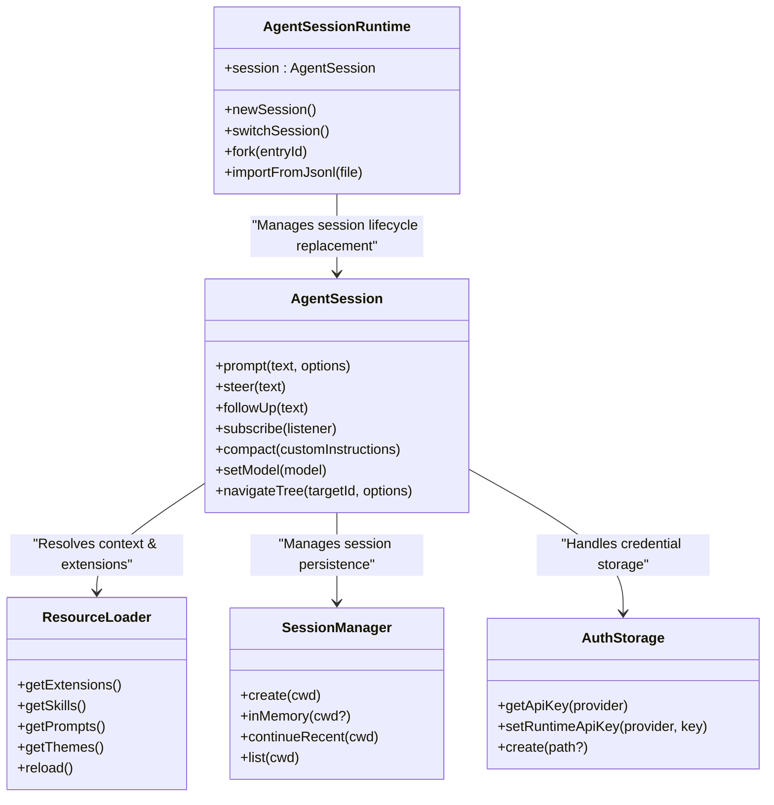
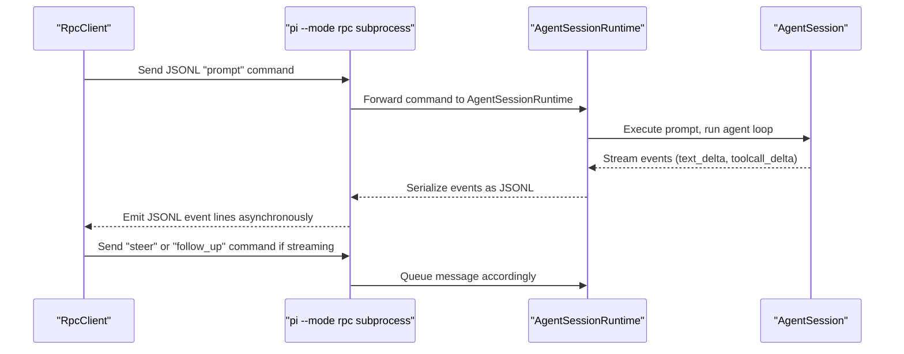

# SDK and Programmatic Usage

<details>
<summary>Relevant source files</summary>

The following files were used as context for generating this wiki page:

- [packages/coding-agent/docs/rpc.md](packages/coding-agent/docs/rpc.md)
- [packages/coding-agent/docs/sdk.md](packages/coding-agent/docs/sdk.md)
- [packages/coding-agent/examples/sdk/01-minimal.ts](packages/coding-agent/examples/sdk/01-minimal.ts)
- [packages/coding-agent/examples/sdk/02-custom-model.ts](packages/coding-agent/examples/sdk/02-custom-model.ts)
- [packages/coding-agent/examples/sdk/03-custom-prompt.ts](packages/coding-agent/examples/sdk/03-custom-prompt.ts)
- [packages/coding-agent/examples/sdk/04-skills.ts](packages/coding-agent/examples/sdk/04-skills.ts)
- [packages/coding-agent/examples/sdk/05-tools.ts](packages/coding-agent/examples/sdk/05-tools.ts)
- [packages/coding-agent/examples/sdk/07-context-files.ts](packages/coding-agent/examples/sdk/07-context-files.ts)
- [packages/coding-agent/examples/sdk/08-prompt-templates.ts](packages/coding-agent/examples/sdk/08-prompt-templates.ts)
- [packages/coding-agent/examples/sdk/09-api-keys-and-oauth.ts](packages/coding-agent/examples/sdk/09-api-keys-and-oauth.ts)
- [packages/coding-agent/examples/sdk/10-settings.ts](packages/coding-agent/examples/sdk/10-settings.ts)
- [packages/coding-agent/examples/sdk/11-sessions.ts](packages/coding-agent/examples/sdk/11-sessions.ts)
- [packages/coding-agent/examples/sdk/12-full-control.ts](packages/coding-agent/examples/sdk/12-full-control.ts)
- [packages/coding-agent/examples/sdk/README.md](packages/coding-agent/examples/sdk/README.md)
- [packages/coding-agent/src/modes/rpc/rpc-client.ts](packages/coding-agent/src/modes/rpc/rpc-client.ts)
- [packages/coding-agent/src/modes/rpc/rpc-types.ts](packages/coding-agent/src/modes/rpc/rpc-types.ts)
- [packages/coding-agent/test/rpc-client-process-exit.test.ts](packages/coding-agent/test/rpc-client-process-exit.test.ts)

</details>


The `pi` monorepo provides multiple pathways for programmatic integration with the core agent system, optimized for diverse application needs. Developers can embed the agent tightly inside Node.js apps using the SDK, interact with it remotely via an RPC subprocess interface, or build rich web-client experiences with the `pi-web-ui` package.

This section gives a high-level overview of these programmatic interfaces and how they connect to the core agent logic. For detailed API and usage guidance, follow the links to specialized child pages covering the SDK API and the web UI components.

---

### Integration Landscape

This diagram illustrates the ecosystem of programmatic entry points into the `pi` agent capabilities and their relations to core internal components:

**Programmatic Integration Overview**
```mermaid
graph TD
    subgraph "External_Application"
        [App_Logic] --> [SDK_Client]
        [App_Logic] --> [RPC_Client]
        [Web_App] --> [pi-web-ui]
    end

    subgraph "pi-coding-agent_SDK"
        [SDK_Client] --> ["createAgentSession()"]
        ["createAgentSession()"] --> [AgentSession]
    end

    subgraph "pi_CLI_Subprocess"
        [RPC_Client] -- "JSONL_over_Stdin_Stdout" --> [RPC_Mode]
        [RPC_Mode] --> [AgentSessionRuntime]
        [AgentSessionRuntime] --> [AgentSession]
    end

    subgraph "Core_Logic"
        [AgentSession] --> [Agent_Loop]
        [Agent_Loop] --> [Tool_Executor]
        [Agent_Loop] --> [pi-ai_Abstraction]
    end

    [pi-web-ui] -- "Lit_Components" --> [AgentSession]
```

- **SDK Client** in Node.js apps uses `createAgentSession()` to obtain an `AgentSession` instance tied to runtime state, sessions, and tools.
- **RPC Client** controls a separate subprocess running the agent in JSONL-over-stdin/stdout mode, suitable for language-agnostic integrations and process isolation.
- **pi-web-ui** provides reactive Web Components (built with Lit) that embed the agent functionality in browser-based UIs and connect to the same core APIs.
- All interfaces ultimately drive the **Agent Session**, which orchestrates the agent lifecycle, state, and tool execution through the core agent loop and AI abstractions.

Sources: [packages/coding-agent/docs/sdk.md:3-12](), [packages/coding-agent/docs/rpc.md:1-6](), [packages/coding-agent/src/modes/rpc/rpc-client.ts:1-5]()

---

## 7.1 pi-coding-agent SDK

The primary Node.js embedding interface is the `pi-coding-agent` SDK. It exposes the core `AgentSession` abstraction and related services for session persistence, credential management, and resource customization.

### Overview

- Use `createAgentSession()` to instantiate an agent session with default or customized options [packages/coding-agent/docs/sdk.md:50-68]().
- The returned `AgentSession` exposes methods such as:
  - `prompt(text)`: send a prompt to the agent, waiting for completion [packages/coding-agent/docs/sdk.md:77-77]().
  - `steer(text)` and `followUp(text)`: queue messages while streaming or after completion [packages/coding-agent/docs/sdk.md:80-81]().
  - Event subscription via `subscribe()` to receive streaming updates and tool usage events [packages/coding-agent/docs/sdk.md:84-84]().
  - Session file/path info and model control (e.g., `setModel()`) [packages/coding-agent/docs/sdk.md:87-91]().
  - State navigation (`navigateTree`) and session compaction (`compact`) [packages/coding-agent/docs/sdk.md:104-107]().
- For advanced control, `createAgentSessionRuntime()` manages session lifecycles supporting new session, switching, forking, and import/export flows [packages/coding-agent/docs/sdk.md:120-155]().
- The `ResourceLoader` interface and `DefaultResourceLoader` implement programmatic discovery and overriding of extensions, skills, prompt templates, context files, and themes [packages/coding-agent/docs/sdk.md:54-54]().
- Session persistence is configurable via `SessionManager`, supporting file-backed sessions or in-memory ephemeral sessions [packages/coding-agent/docs/sdk.md:66-66]().
- `AuthStorage` abstracts API keys and OAuth tokens management, integrated with `ModelRegistry` for LLM provider discovery [packages/coding-agent/docs/sdk.md:22-23]().

### SDK Architecture and Relationships



### Usage Scenarios

Typical use cases for the SDK include:
- Building custom Node.js CLIs or applications that embed agent reasoning and tool execution.
- Programmatic testing and automation of conversational workflows.
- Advanced session management with branching, forking, and retrospective navigation.
- Extending or overriding resources such as skills, prompt templates, and extensions in code.
- Controlling and switching LLM models and agent thinking levels dynamically.

For a complete, code-level exploration of the SDK, including 13 extensive examples from minimal to full configuration, see the child page: **[pi-coding-agent SDK](#7.1)**.

Sources: [packages/coding-agent/docs/sdk.md:2-115, 120-182](), [packages/coding-agent/examples/sdk/README.md:9-24]()

---

## 7.2 RPC Mode and Subprocess Usage

For integration scenarios outside Node.js or when process isolation is desired, the `pi` agent supports a JSONL-based RPC mode exposing its full functionality over `stdin`/`stdout`.

### Highlights

- Launch the agent CLI with `--mode rpc` to enter RPC mode [packages/coding-agent/docs/rpc.md:9-10]().
- All commands, state queries, and notifications are encoded as JSON lines with strict framing [packages/coding-agent/docs/rpc.md:22-30]().
- Commands include `prompt`, `steer`, `follow_up`, `abort`, session control, model and thinking level switching, compaction, and bash execution [packages/coding-agent/src/modes/rpc/rpc-types.ts:19-69]().
- The RPC protocol supports asynchronous event streaming for message updates, tool calls, and agent lifecycle events [packages/coding-agent/docs/rpc.md:24-24]().
- A TypeScript `RpcClient` class provides a convenient wrapper to launch the subprocess, send commands asynchronously, listen for events, and interpret responses with request correlation [packages/coding-agent/src/modes/rpc/rpc-client.ts:54-185]().
- Fine-grained control over message queuing behavior during streaming (`steer`, `follow_up`) and abort semantics [packages/coding-agent/docs/rpc.md:56-64]().
- Full session lifecycle commands such as `new_session`, `switch_session`, `fork`, and `clone` [packages/coding-agent/src/modes/rpc/rpc-types.ts:55-60]().

### RPC Integration Flow



For more details including the full command set, response structure, and the `RpcClient` API, see the child page **[pi-coding-agent SDK](#7.1)** (which covers RPC as part of the SDK capabilities).

Sources: [packages/coding-agent/docs/rpc.md:1-75](), [packages/coding-agent/src/modes/rpc/rpc-types.ts:1-104](), [packages/coding-agent/src/modes/rpc/rpc-client.ts:1-183]()

---

## 7.3 Web UI Package (pi-web-ui)

The `@mariozechner/pi-web-ui` package bundles Lit-based Web Components and browser storage solutions that allow embedding pi's agent capabilities in a web frontend environment.

### Core Features

- **ChatPanel**: The primary UI container that manages message flow, user input, and agent lifecycle events.
- **AgentInterface**: Handles interaction management between the user interface and the underlying `AgentSession`.
- **MessageList** and **StreamingMessageContainer**: Render full message history and real-time streaming updates respectively.
- **Tool Renderers**: Specialized components for rendering outputs of tools like Bash commands, JavaScript REPL, and artifacts.
- **Sandboxed Execution**: Supports executing code safely using sandboxed iframes.
- **IndexedDB Storage Backend**: Provides local-first persistent storage for messages and session state in the browser.

### Web UI Component Hierarchy and Data Flow

```mermaid
graph LR
    [ChatPanel] --> [AgentInterface]
    [AgentInterface] --> [MessageList]
    [AgentInterface] --> [StreamingMessageContainer]
    [MessageList] --> [AssistantMessage]
    [AssistantMessage] --> [Tool_Renderers]
    [AppStorage] --> [IndexedDBStorageBackend]
    [AgentSession] -- "Events" --> [ChatPanel]
```

- The Web UI components integrate with the same underlying `AgentSession` logic used by the SDK.
- The UI components handle event subscriptions, message rendering, and tool output visualization.

For exhaustive documentation of the UI components, tool renderers, storage integration, and the example app, see the child page: **[Web UI Package (pi-web-ui)](#7.2)**.

---

# Summary

The `pi` codebase supports a layered approach to programmatic usage enabling a spectrum of embedding strategies:

| Interface         | Description                                                     | Use Cases                                     |
|-------------------|-----------------------------------------------------------------|-----------------------------------------------|
| **SDK (Node.js)** | Direct embedding using `createAgentSession` and related APIs.  | Custom server-side apps, CLI tools, automation |
| **RPC Mode**      | Headless agent subprocess controlled via JSONL RPC protocol.    | Cross-language integrations, IDE plugins       |
| **Web UI Package**| Browser-based Lit components with local persistence and sandbox. | Web apps with rich agent interaction            |

Developers can start with the SDK for deep integration or with RPC for isolated, language-neutral control.

For full detail on APIs, patterns, and examples, follow the child pages:
- **[pi-coding-agent SDK](#7.1)**
- **[Web UI Package (pi-web-ui)](#7.2)**

Sources: [packages/coding-agent/docs/sdk.md:3-14](), [packages/coding-agent/docs/rpc.md:1-5](), [packages/coding-agent/src/modes/rpc/rpc-client.ts:1-5]()
