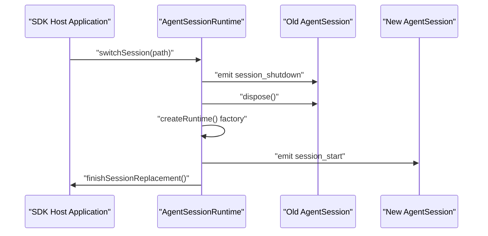
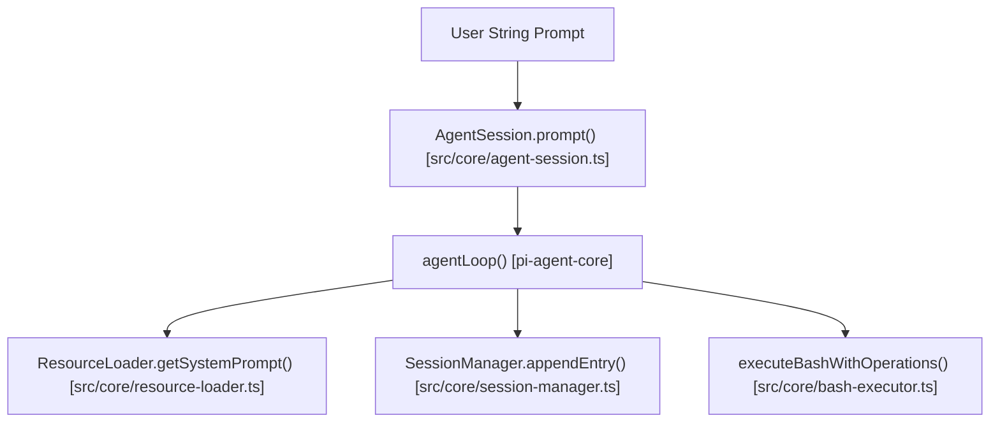
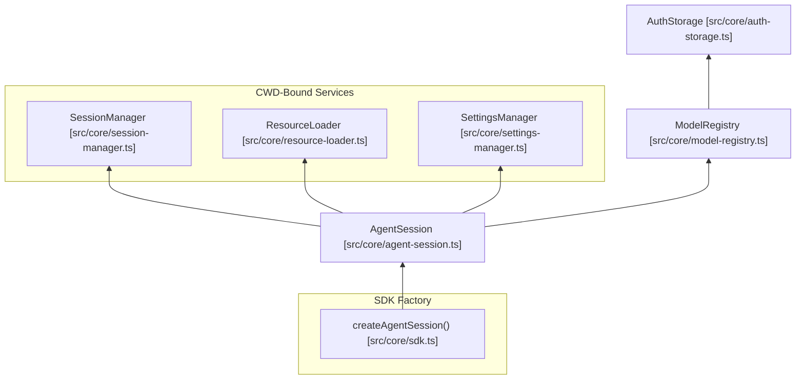

# pi-coding-agent SDK

<details>
<summary>Relevant source files</summary>

The following files were used as context for generating this wiki page:

- [packages/coding-agent/examples/sdk/01-minimal.ts](packages/coding-agent/examples/sdk/01-minimal.ts)
- [packages/coding-agent/examples/sdk/02-custom-model.ts](packages/coding-agent/examples/sdk/02-custom-model.ts)
- [packages/coding-agent/examples/sdk/03-custom-prompt.ts](packages/coding-agent/examples/sdk/03-custom-prompt.ts)
- [packages/coding-agent/examples/sdk/04-skills.ts](packages/coding-agent/examples/sdk/04-skills.ts)
- [packages/coding-agent/examples/sdk/05-tools.ts](packages/coding-agent/examples/sdk/05-tools.ts)
- [packages/coding-agent/examples/sdk/07-context-files.ts](packages/coding-agent/examples/sdk/07-context-files.ts)
- [packages/coding-agent/examples/sdk/08-prompt-templates.ts](packages/coding-agent/examples/sdk/08-prompt-templates.ts)
- [packages/coding-agent/examples/sdk/09-api-keys-and-oauth.ts](packages/coding-agent/examples/sdk/09-api-keys-and-oauth.ts)
- [packages/coding-agent/examples/sdk/10-settings.ts](packages/coding-agent/examples/sdk/10-settings.ts)
- [packages/coding-agent/examples/sdk/11-sessions.ts](packages/coding-agent/examples/sdk/11-sessions.ts)
- [packages/coding-agent/examples/sdk/12-full-control.ts](packages/coding-agent/examples/sdk/12-full-control.ts)
- [packages/coding-agent/examples/sdk/README.md](packages/coding-agent/examples/sdk/README.md)
- [packages/coding-agent/src/core/agent-session-runtime.ts](packages/coding-agent/src/core/agent-session-runtime.ts)
- [packages/coding-agent/src/core/agent-session.ts](packages/coding-agent/src/core/agent-session.ts)
- [packages/coding-agent/src/core/sdk.ts](packages/coding-agent/src/core/sdk.ts)
- [packages/coding-agent/src/modes/interactive/interactive-mode.ts](packages/coding-agent/src/modes/interactive/interactive-mode.ts)
- [packages/coding-agent/src/modes/print-mode.ts](packages/coding-agent/src/modes/print-mode.ts)
- [packages/coding-agent/src/modes/rpc/rpc-mode.ts](packages/coding-agent/src/modes/rpc/rpc-mode.ts)
- [packages/coding-agent/test/agent-session-runtime-events.test.ts](packages/coding-agent/test/agent-session-runtime-events.test.ts)
- [packages/coding-agent/test/suite/agent-session-runtime.test.ts](packages/coding-agent/test/suite/agent-session-runtime.test.ts)

</details>


The `pi-coding-agent` SDK offers a comprehensive programmatic interface to embed pi’s coding agent capabilities within Node.js applications or other TypeScript environments. This SDK simplifies managing agent lifecycle, prompt handling, session persistence, model control, resource loading (extensions, skills, prompts), and interacting with built-in or custom tools.

---

## Core API: `createAgentSession()`

The function `createAgentSession()` is the primary factory for creating an `AgentSession`. It orchestrates initialization of cwd-bound services, resource loading, authentication, model registry, session management (file-backed or memory), and tool configuration [packages/coding-agent/src/core/sdk.ts:166-234]().

```typescript
import { createAgentSession, SessionManager, AuthStorage, ModelRegistry } from "@earendil-works/pi-coding-agent";

const authStorage = AuthStorage.create();
const modelRegistry = ModelRegistry.create(authStorage);

const { session } = await createAgentSession({
  sessionManager: SessionManager.inMemory(),
  authStorage,
  modelRegistry,
});
```

If no options are provided, `createAgentSession()` uses a `DefaultResourceLoader` with conventional discovery of extensions, skills, prompt templates, and themes, typically scanning `~/.pi/agent`, current working directory `.pi/`, and other standard locations [packages/coding-agent/src/core/sdk.ts:180-184]().

### Key Configuration and Options

| Option           | Description                                                                                                         |
|------------------|---------------------------------------------------------------------------------------------------------------------|
| `cwd`            | Working directory for project-local discovery (`process.cwd()` by default) [packages/coding-agent/src/core/sdk.ts:36-36]() |
| `agentDir`       | Global config directory, defaulting to `~/.pi/agent` [packages/coding-agent/src/core/sdk.ts:38-38]()                          |
| `model`          | Specific LLM model instance to use [packages/coding-agent/src/core/sdk.ts:46-46]()                                                  |
| `thinkingLevel`  | Sets reasoning depth: off, low, medium, high [packages/coding-agent/src/core/sdk.ts:48-48]()                                         |
| `tools`          | Allowlist of tool names to enable [packages/coding-agent/src/core/sdk.ts:67-67]()                                              |
| `customTools`    | Array of additional user-defined tools [packages/coding-agent/src/core/sdk.ts:71-71]()                                               |
| `resourceLoader` | Provides extensions, skills, prompts, themes [packages/coding-agent/src/core/sdk.ts:73-73]()                                  |
| `sessionManager` | Controls session persistence [packages/coding-agent/src/core/sdk.ts:77-77]()                                  |
| `settingsManager`| Configures settings like compaction or retry [packages/coding-agent/src/core/sdk.ts:79-79]()                                                |

Sources: [packages/coding-agent/src/core/sdk.ts:34-83](), [packages/coding-agent/examples/sdk/README.md:109-122]()

---

## AgentSession API

The `AgentSession` interface encapsulates all capabilities needed for conversation management, message lifecycle, event streaming, and runtime settings control [packages/coding-agent/src/core/agent-session.ts:157-300]().

### Core Methods and Properties

*   `prompt(text, options)`: Sends a user prompt and waits for the agent to finish its turn [packages/coding-agent/src/core/agent-session.ts:358-358]().
*   `steer(text)`: Interrupts the agent loop before the next LLM call [packages/coding-agent/src/core/agent-session.ts:446-446]().
*   `followUp(text)`: Queues a message to be processed once the agent becomes idle [packages/coding-agent/src/core/agent-session.ts:451-451]().
*   `subscribe(listener)`: Subscribes to the `AgentSessionEvent` stream [packages/coding-agent/src/core/agent-session.ts:304-304]().
*   `compact(customInstructions)`: Condenses conversation history to save tokens [packages/coding-agent/src/core/agent-session.ts:571-571]().
*   `setModel(model)`: Changes the active model for the session [packages/coding-agent/src/core/agent-session.ts:503-503]().

### Event Subscription

The `subscribe()` method streams `AgentSessionEvent` objects, including `message_update` (for text deltas), `tool_execution_start/end`, and `agent_end` [packages/coding-agent/src/core/agent-session.ts:124-151]().

Sources: [packages/coding-agent/src/core/agent-session.ts:157-600](), [packages/coding-agent/examples/sdk/README.md:126-144]()

---

## ResourceLoader Configuration

The `ResourceLoader` abstraction supplies extensions, skills, prompt templates, themes, and context files [packages/coding-agent/src/core/agent-session.ts:165-165](). `DefaultResourceLoader` performs disk discovery from standard directories and caches loaded resources [packages/coding-agent/src/core/sdk.ts:181-184]().

```typescript
const resourceLoader = new DefaultResourceLoader({
  cwd: process.cwd(),
  agentDir: getAgentDir(),
  skillsOverride: (current) => ({
    skills: [...current.skills, customSkill],
    diagnostics: current.diagnostics,
  }),
});
await resourceLoader.reload();

const { session } = await createAgentSession({ resourceLoader });
```

Sources: [packages/coding-agent/examples/sdk/04-skills.ts:27-38](), [packages/coding-agent/src/core/sdk.ts:169-184]()

---

## Session Persistence and Management

### SessionManager

The `SessionManager` handles the message storage backend [packages/coding-agent/src/core/sdk.ts:17-17]().

| Method | Description |
| :--- | :--- |
| `SessionManager.create(cwd, dir)` | Creates a file-backed manager [packages/coding-agent/src/core/sdk.ts:178-178](). |
| `SessionManager.inMemory(cwd)` | Creates an ephemeral in-memory manager [packages/coding-agent/examples/sdk/12-full-control.ts:62-62](). |

### AgentSessionRuntime

`AgentSessionRuntime` owns the active `AgentSession` and manages its lifecycle, specifically session replacement (switching, forking, or starting new) [packages/coding-agent/src/core/agent-session-runtime.ts:74-95]().

*   `switchSession(path)`: Resumes a session from a JSONL file [packages/coding-agent/src/core/agent-session-runtime.ts:193-210]().
*   `newSession()`: Starts a fresh session in the same environment [packages/coding-agent/src/core/agent-session-runtime.ts:212-225]().
*   `fork(entryId)`: Branches the conversation from a specific message [packages/coding-agent/src/core/agent-session-runtime.ts:227-240]().

### Session Runtime Lifecycle



Sources: [packages/coding-agent/src/core/agent-session-runtime.ts:167-210](), [packages/coding-agent/test/agent-session-runtime-events.test.ts:92-134]()

---

## SDK Examples

The codebase provides 13 canonical SDK examples in `packages/coding-agent/examples/sdk/` [packages/coding-agent/examples/sdk/README.md:9-24]():

1.  `01-minimal.ts`: Simplest usage with all defaults.
2.  `02-custom-model.ts`: Select model and thinking level.
3.  `03-custom-prompt.ts`: Replace or modify system prompt.
4.  `04-skills.ts`: Discover, filter, or replace skills.
5.  `05-tools.ts`: Built-in tool allowlists.
6.  `06-extensions.ts`: Logging, blocking, result modification.
7.  `07-context-files.ts`: AGENTS.md context files.
8.  `08-slash-commands.ts`: File-based slash commands.
9.  `09-api-keys-and-oauth.ts`: API key resolution.
10. `10-settings.ts`: Override compaction and retry.
11. `11-sessions.ts`: In-memory vs persistent.
12. `12-full-control.ts`: Replace everything, no discovery [packages/coding-agent/examples/sdk/12-full-control.ts:1-77]().
13. `13-session-runtime.ts`: Manage runtime-backed session replacement.

Sources: [packages/coding-agent/examples/sdk/README.md:1-105](), [packages/coding-agent/examples/sdk/12-full-control.ts:1-77]()

---

## Bridging Conceptual Spaces

### Natural Language to Code: Prompt Execution



Sources: [packages/coding-agent/src/core/agent-session.ts:358-444](), [packages/coding-agent/src/core/bash-executor.ts:41-41]()

### Code Entity Relationships



Sources: [packages/coding-agent/src/core/sdk.ts:166-234](), [packages/coding-agent/src/core/agent-session.ts:157-187]()

---

# Sources
- packages/coding-agent/src/core/sdk.ts:1-234
- packages/coding-agent/src/core/agent-session.ts:1-600
- packages/coding-agent/src/core/agent-session-runtime.ts:1-252
- packages/coding-agent/examples/sdk/README.md:1-145
- packages/coding-agent/examples/sdk/12-full-control.ts:1-77
- packages/coding-agent/examples/sdk/10-settings.ts:1-54
- packages/coding-agent/examples/sdk/04-skills.ts:1-56
- packages/coding-agent/src/modes/rpc/rpc-mode.ts:1-220
- packages/coding-agent/test/agent-session-runtime-events.test.ts:1-220
- packages/coding-agent/test/suite/agent-session-runtime.test.ts:1-210
