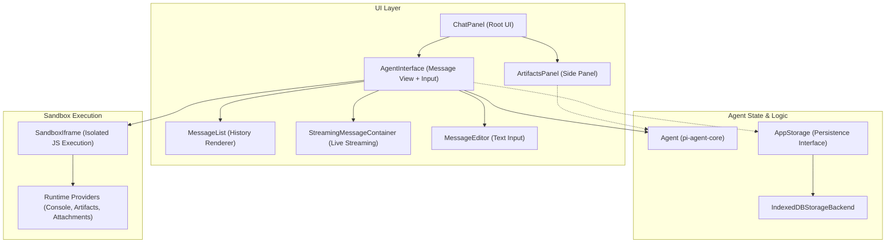
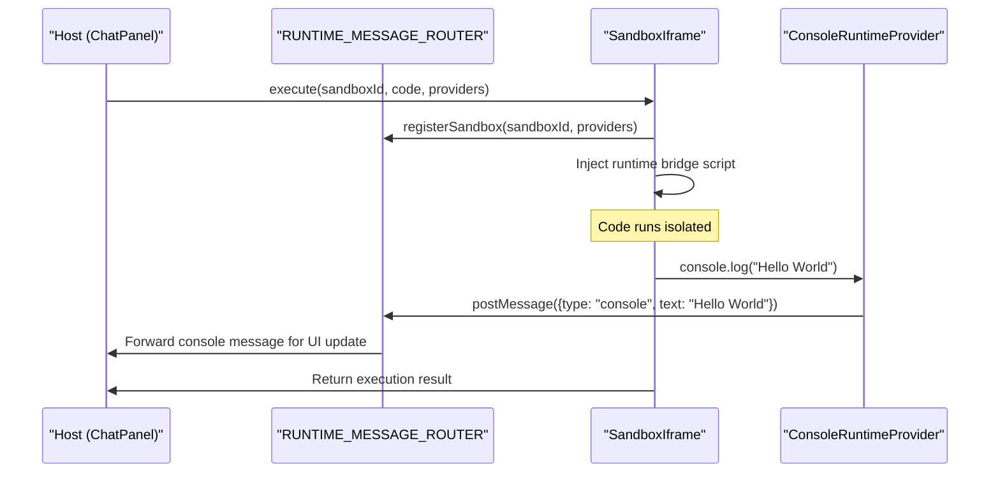
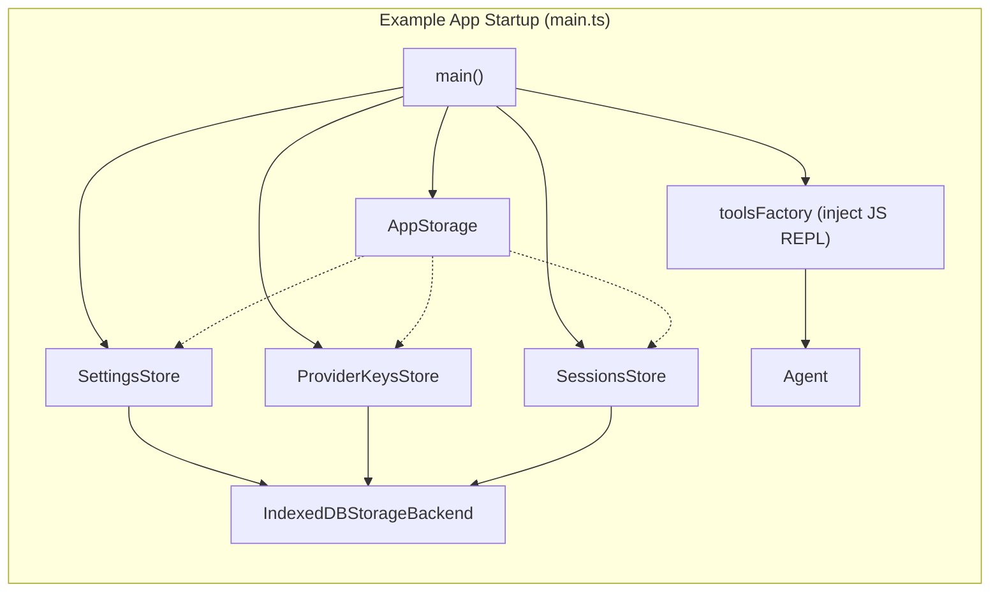

# Web UI Package (pi-web-ui)

Relevant source files

The following files were used as context for generating this wiki page:

- [package-lock.json](package-lock.json)
- [packages/agent/package.json](packages/agent/package.json)
- [packages/ai/package.json](packages/ai/package.json)
- [packages/coding-agent/docs/rpc.md](packages/coding-agent/docs/rpc.md)
- [packages/coding-agent/docs/sdk.md](packages/coding-agent/docs/sdk.md)
- [packages/coding-agent/package.json](packages/coding-agent/package.json)
- [packages/coding-agent/src/modes/rpc/rpc-client.ts](packages/coding-agent/src/modes/rpc/rpc-client.ts)
- [packages/coding-agent/src/modes/rpc/rpc-types.ts](packages/coding-agent/src/modes/rpc/rpc-types.ts)
- [packages/coding-agent/test/rpc-client-process-exit.test.ts](packages/coding-agent/test/rpc-client-process-exit.test.ts)
- [packages/tui/package.json](packages/tui/package.json)

The `@mariozechner/pi-web-ui` package provides a suite of reusable web components, runtime providers, and storage utilities designed to build web-based chat UIs integrated with the pi agent architecture. It bridges the core agent logic (`pi-agent-core`) and the AI provider abstractions (`pi-ai`) into a functional, interactive browser environment equipped with persistence and sandboxed code execution capabilities.

---

## Architecture Overview

The package employs a layered design that separates UI components, agent state management, runtime sandboxing, tool rendering, and persistent storage. This modular approach enables flexible integration and clear data flow from natural language inputs through agent state mutations, streaming updates, and back-end persistence.

### Component and Data Flow Topology

The high-level UI views (`ChatPanel`, `AgentInterface`) subscribe to agent state events and coordinate rendering the conversation, live streaming, artifacts, and user inputs. Persistence of sessions, provider keys, and settings is handled by `AppStorage` backed by IndexedDB in the browser.

Communication with the sandboxed iframe environment enables executing arbitrary JavaScript code safely with support for special runtime features such as console capturing and artifact management.

Sources: [packages/agent/package.json:2-10](), [packages/ai/package.json:2-10](), [packages/coding-agent/package.json:39-41]()

---

## Core UI Components

### ChatPanel

`ChatPanel` is the root UI element organizing the overall layout (conversation and artifacts side panel). It dynamically switches between side-by-side and overlay layouts depending on viewport width (typically using a breakpoint around 800px). The component accepts a `toolsFactory` that injects environment-aware tools, for example including the `javascript_repl` tool with access to sandbox runtime providers.

### AgentInterface

`AgentInterface` is a stateful component orchestrating the messaging UI. It subscribes to agent events to maintain message history, streaming updates, and tool invocation results.

- **MessageList**: Renders the confirmed stable conversation history with all past messages.
- **StreamingMessageContainer**: Displays the currently streaming assistant message in-progress, handling incremental updates from `AssistantMessageEventStream` [packages/ai/package.json:69-74]().
- **MessageEditor**: A multi-line input component supporting text and file attachments for user prompts.

`AgentInterface` connects directly to an `Agent` instance from `@earendil-works/pi-agent-core` [packages/agent/package.json:2-10](), reacting to its event streams and exposing controls to prompt, steer, and follow up.

Sources: [packages/agent/package.json:2-10](), [packages/coding-agent/package.json:39-41](), [packages/coding-agent/docs/sdk.md:31-35]()

---

## Sandboxed Execution System

The package includes an advanced system to run untrusted user code safely inside a sandboxed iframe, primarily for features such as the `javascript_repl` tool and artifact rendering.

### SandboxIframe and Runtime Providers

`SandboxIframe` manages a sandboxed environment for running JavaScript code securely inside an iframe. Communication between the host and the iframe is relayed via a router which multiplexes messages from different runtime providers back to UI components.

Sandbox runtimes encapsulate additional functionality:

- **ConsoleRuntimeProvider**: Intercepts `console.log`, `console.error`, and related calls inside the sandbox and sends logs back to the host UI for display.
- **ArtifactsRuntimeProvider**: Enables sandboxed code to create and update `ArtifactsPanel` state, supporting artifact pills and complex stateful elements.
- **AttachmentsRuntimeProvider**: Provides access to user-uploaded files within sandbox code execution.
- **FileDownloadRuntimeProvider**: Supports file generation and download interactions initiated in the sandbox.

#### Sandboxed Code Execution Flow

Sources: [package-lock.json:48-67](), [packages/coding-agent/package.json:15-15]()

---

## Tool Renderers

The UI package implements renderers for various agent tools, facilitating rich presentation of outputs in the browser:

| Tool Name           | Description                                                  |
|---------------------|--------------------------------------------------------------|
| `javascript_repl`   | Executes JavaScript in sandbox and displays console outputs plus returned files. |
| `artifacts`        | Updates the state of `ArtifactsPanel` and renders pills representing created/updated artifacts. |
| `extract_document` | Extracts text, metadata from PDF, DOCX, XLSX, and image files. |
| `bash`             | Renders command line output from shell executions [packages/coding-agent/src/modes/rpc/rpc-types.ts:11-11](). |

Built-in tools from `pi-coding-agent` like `read`, `bash`, and `edit` are integrated via the `AgentSession` abstraction [packages/coding-agent/docs/sdk.md:65-65]().

Sources: [packages/coding-agent/package.json:2-4](), [packages/coding-agent/src/modes/rpc/rpc-types.ts:11-12](), [packages/coding-agent/docs/sdk.md:65-65]()

---

## Storage and Persistence Layer

The package features `AppStorage`, a central persistence interface for web-based data stores. It utilizes IndexedDB under the hood and exposes several domain-specific stores to manage persistent data:

- **SettingsStore**: Manages global app preferences like proxy configuration and HTTP timeouts.
- **ProviderKeysStore**: Securely stores API keys for LLM providers (OpenAI, Anthropic, etc.) [packages/ai/package.json:69-74]().
- **SessionsStore**: Handles chat session data including messages, usage statistics, and metadata [packages/coding-agent/docs/sdk.md:26-26]().
- **CustomProvidersStore**: Persists configuration for non-standard or local LLM endpoints.

The `IndexedDBStorageBackend` abstracts IndexedDB usage details and integrates with these high-level stores, enabling robust, asynchronous data persistence within the web environment.

Sources: [packages/coding-agent/docs/sdk.md:19-29](), [packages/ai/package.json:69-74]()

---

## Example Application Integration

The example app demonstrates how to wire up the UI components, storage, and tools:

- The `IndexedDBStorageBackend` is initialized with schemas for the various stores.
- The `toolsFactory` injects the special `javascript_repl` tool with access to the `SandboxRuntimeProviders`.
- The `saveSession` function serializes the agent state and metadata, persisting via the `SessionsStore`.
- A customized `Agent` instance is created with a transport adapter that supports extended message types including attachments.

Sources: [packages/coding-agent/docs/sdk.md:19-29](), [packages/coding-agent/package.json:39-41]()

---

# Summary

The `@mariozechner/pi-web-ui` package enables building rich, interactive chat UIs leveraging pi’s agent capabilities. It provides UI components for message viewing, editing, and artifacts alongside sandboxed JavaScript execution environments. IndexedDB is used for robust data persistence. Tool renderers support common agent functionalities with specialized interactive presentations.

---

# Sources

- packages/agent/package.json:2-10
- packages/ai/package.json:2-10, 69-74
- packages/coding-agent/package.json:2-4, 15, 39-41
- packages/coding-agent/docs/sdk.md:19-29, 31-35, 65
- packages/coding-agent/src/modes/rpc/rpc-types.ts:11-12
- package-lock.json:48-67
