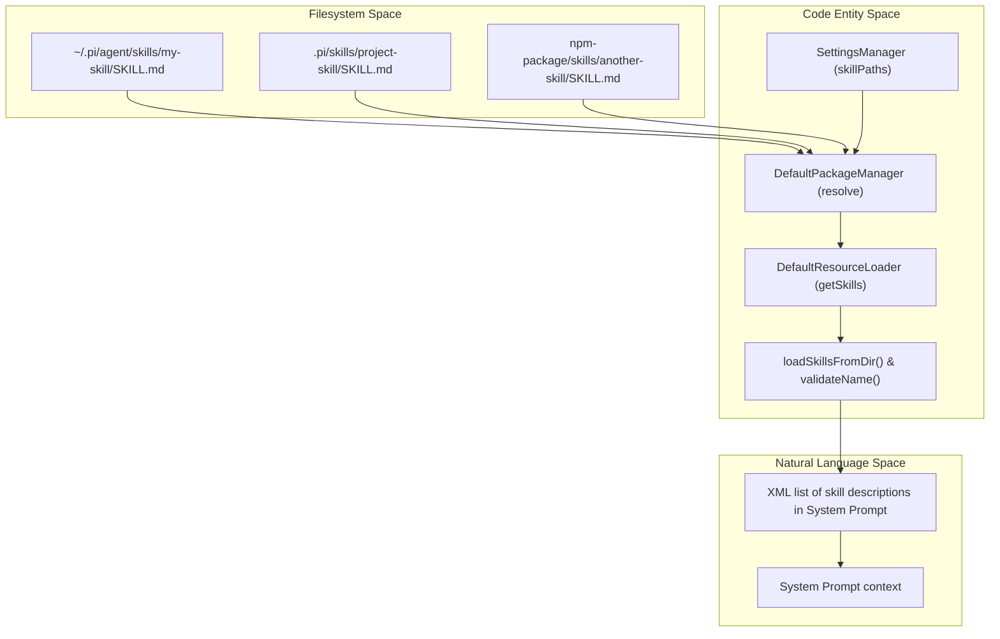
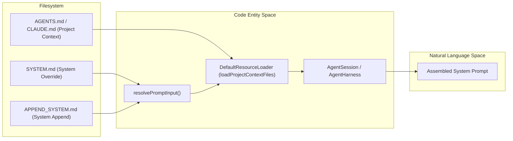

# Skills, Prompt Templates, and Context Files

Relevant source files

The following files were used as context for generating this wiki page:

- [.pi/prompts/is.md](.pi/prompts/is.md)
- [.pi/prompts/pr.md](.pi/prompts/pr.md)
- [.pi/prompts/wr.md](.pi/prompts/wr.md)
- [packages/agent/src/harness/prompt-templates.ts](packages/agent/src/harness/prompt-templates.ts)
- [packages/agent/src/harness/skills.ts](packages/agent/src/harness/skills.ts)
- [packages/agent/test/harness/prompt-templates.test.ts](packages/agent/test/harness/prompt-templates.test.ts)
- [packages/agent/test/harness/skills.test.ts](packages/agent/test/harness/skills.test.ts)
- [packages/agent/test/scratch/simple.ts](packages/agent/test/scratch/simple.ts)
- [packages/coding-agent/docs/packages.md](packages/coding-agent/docs/packages.md)
- [packages/coding-agent/docs/prompt-templates.md](packages/coding-agent/docs/prompt-templates.md)
- [packages/coding-agent/docs/skills.md](packages/coding-agent/docs/skills.md)
- [packages/coding-agent/examples/extensions/project-trust.ts](packages/coding-agent/examples/extensions/project-trust.ts)
- [packages/coding-agent/src/core/package-manager.ts](packages/coding-agent/src/core/package-manager.ts)
- [packages/coding-agent/src/core/prompt-templates.ts](packages/coding-agent/src/core/prompt-templates.ts)
- [packages/coding-agent/src/core/resource-loader.ts](packages/coding-agent/src/core/resource-loader.ts)
- [packages/coding-agent/src/core/skills.ts](packages/coding-agent/src/core/skills.ts)
- [packages/coding-agent/src/utils/git.ts](packages/coding-agent/src/utils/git.ts)
- [packages/coding-agent/test/fixtures/skills/root-skill-preferred/SKILL.md](packages/coding-agent/test/fixtures/skills/root-skill-preferred/SKILL.md)
- [packages/coding-agent/test/fixtures/skills/root-skill-preferred/nested-child/SKILL.md](packages/coding-agent/test/fixtures/skills/root-skill-preferred/nested-child/SKILL.md)
- [packages/coding-agent/test/git-ssh-url.test.ts](packages/coding-agent/test/git-ssh-url.test.ts)
- [packages/coding-agent/test/git-update.test.ts](packages/coding-agent/test/git-update.test.ts)
- [packages/coding-agent/test/package-manager-ssh.test.ts](packages/coding-agent/test/package-manager-ssh.test.ts)
- [packages/coding-agent/test/package-manager.test.ts](packages/coding-agent/test/package-manager.test.ts)
- [packages/coding-agent/test/prompt-templates.test.ts](packages/coding-agent/test/prompt-templates.test.ts)
- [packages/coding-agent/test/resource-loader.test.ts](packages/coding-agent/test/resource-loader.test.ts)
- [packages/coding-agent/test/skills.test.ts](packages/coding-agent/test/skills.test.ts)

Behavior in `pi` is shaped by three primary resource types: **Skills**, **Prompt Templates**, and **Context Files**. These resources enable on-demand capability loading, reusable command expansions, and project-specific grounding to influence agent behavior and prompt construction.

---

## Skills

Skills are self-contained capability packages adhering largely to the [Agent Skills standard](https://agentskills.io/specification). They consist of workflows, helper scripts, and reference documentation that the agent loads progressively on-demand to augment its knowledge and action set [packages/coding-agent/docs/skills.md:3-7]().

### Discovery and Loading

The `DefaultPackageManager` along with the `DefaultResourceLoader` handle skill discovery across multiple configured tiers to provide comprehensive and incremental skill loading [packages/coding-agent/docs/skills.md:24-35]().

The discovery locations prioritized by `pi` include:

1. **Global** locations such as:
   - `~/.pi/agent/skills/` [packages/coding-agent/docs/skills.md:27-27]()
   - `~/.agents/skills/` [packages/coding-agent/docs/skills.md:28-28]()
2. **Project-local** locations:
   - `.pi/skills/` [packages/coding-agent/docs/skills.md:30-30]()
   - `.agents/skills/` in the current working directory or any ancestor directory [packages/coding-agent/docs/skills.md:31-31]()
3. **Packages**, i.e. skills included as subdirectories or declared in a package's `package.json` under `pi.skills` [packages/coding-agent/docs/packages.md:118-129]().
4. **Explicit paths** given on the CLI with `--skill <path>` or set in `settings.json` [packages/coding-agent/docs/skills.md:33-34]().

Skills discovery recursively inspects directories for a `SKILL.md` file which defines the skill root, or loads root `.md` files as individual skills for specific directories [packages/coding-agent/src/core/skills.ts:163-171](), [packages/coding-agent/docs/skills.md:37-39]().

### Skill Structure and Validation

Each skill is represented by a directory containing a main `SKILL.md` file that uses YAML frontmatter to specify metadata fields including:

- `name`: stable lowercase-hyphenated name (does not have to match directory name in `pi`) [packages/coding-agent/docs/skills.md:143-143]().
- `description`: concise explanation of the skill's use [packages/coding-agent/docs/skills.md:144-144]().
- Optional fields like `license`, `compatibility`, `metadata`, `allowed-tools`, and `disable-model-invocation` [packages/coding-agent/docs/skills.md:145-149]().

The skill content includes workflows, setup instructions, code snippets, and relative references to any scripts or assets contained in the directory [packages/coding-agent/docs/skills.md:92-136]().

Skills are validated for:
- Name length (max 64 characters) [packages/coding-agent/src/core/skills.ts:11-11]().
- Name format (lowercase a-z, digits, hyphens, no leading/trailing/consecutive hyphens) [packages/coding-agent/src/core/skills.ts:99-109]().
- Description presence and length (up to 1024 chars) [packages/coding-agent/src/core/skills.ts:14-14]().
- Unknown frontmatter fields are ignored, but missing description leads to exclusion [packages/coding-agent/src/core/skills.ts:120-127]().

### Data Flow: Skill Integration

Skills are distributed as resolved resources from the filesystem via the `DefaultPackageManager` [packages/coding-agent/src/core/package-manager.ts:92-93](), and loaded by the `DefaultResourceLoader` which parses and validates them using `loadSkillsFromDir` [packages/coding-agent/src/core/resource-loader.ts:34-34](), [packages/coding-agent/src/core/skills.ts:168-171]().

The system prompt includes an XML-encoded listing of skill names and descriptions. Full skill content is loaded lazily on-demand when the agent uses the `read` tool to access the `SKILL.md` file [packages/coding-agent/docs/skills.md:67-71]().

**Skill Command Invocation:**
- Registered as `/skill:name` slash commands with argument forwarding [packages/coding-agent/docs/skills.md:75-80]().
- Arguments appended as `User: <args>` lines in the skill content [packages/coding-agent/docs/skills.md:82-82]().

### Skills Discovery and Usage Diagram

Sources: [packages/coding-agent/src/core/skills.ts:168-226](), [packages/coding-agent/docs/skills.md:24-82](), [packages/coding-agent/src/core/package-manager.ts:60-65]().

---

## Prompt Templates

Prompt Templates provide reusable text snippets with argument placeholders, enabling command expansion and parameterized prompting via slash commands.

### Template Format and Loading

Prompt templates are stored as Markdown (`.md`) files with YAML frontmatter including fields such as:
- `description`: text describing the template usage [packages/coding-agent/src/core/prompt-templates.ts:111-111]().
- `argument-hint`: hint text for expected arguments [packages/coding-agent/src/core/prompt-templates.ts:124-124]().

The template body contains the main text with argument placeholders like `$1`, `$@`, `$ARGUMENTS`, and `${@:N}`, allowing bash-style positional and slice substitutions [packages/coding-agent/src/core/prompt-templates.ts:58-68]().

Templates are discovered from:
- Global prompt templates: `<agentDir>/prompts/` [packages/coding-agent/src/core/prompt-templates.ts:201-201]().
- Project prompt templates: `<cwd>/.pi/prompts/` [packages/coding-agent/src/core/prompt-templates.ts:202-202]().
- Explicit prompt paths supplied by users/settings [packages/coding-agent/src/core/prompt-templates.ts:182-182]().

The `DefaultResourceLoader` manages loading and indexing prompt templates on start and reload [packages/coding-agent/src/core/resource-loader.ts:35-35]().

### Argument Substitution and Expansion Logic

Argument substitution supports:
- `$1`, `$2`, ... for individual positional arguments [packages/coding-agent/src/core/prompt-templates.ts:73-76]().
- `$ARGUMENTS` or `$@` for all joined arguments [packages/coding-agent/src/core/prompt-templates.ts:93-95]().
- `${@:N}` for slicing arguments from the Nth position onward [packages/coding-agent/src/core/prompt-templates.ts:81-91]().
- `${N:-default}` for positional arguments with default values [packages/coding-agent/src/core/prompt-templates.ts:75-79]().

The function `substituteArgs(content: string, args: string[])` performs these replacements safely in the template body [packages/coding-agent/src/core/prompt-templates.ts:69-101]().

### Command Expansion Flow

When the user enters a slash command that matches a prompt template name (e.g., `/pr <url>` defined in `.pi/prompts/pr.md`), the system:
1. Finds the prompt template by name [packages/coding-agent/src/core/prompt-templates.ts:108-108]().
2. Parses the argument string using `parseCommandArgs()` [packages/coding-agent/src/core/prompt-templates.ts:24-55]().
3. Applies argument substitution via `substituteArgs()` to produce a fully expanded prompt text [packages/coding-agent/src/core/prompt-templates.ts:69-101]().
4. Passes the expanded prompt to the standard agent turn logic.

Sources: [packages/coding-agent/src/core/prompt-templates.ts:24-203](), [packages/coding-agent/src/core/resource-loader.ts:35-35](), [.pi/prompts/pr.md:1-4]().

---

## Context Files

Context Files provide a mechanism for injecting project-specific or global content into the system prompt to ground the agent with relevant policies or instructions.

### Discovery Mechanism

`DefaultResourceLoader` automatically discovers context files by scanning the current working directory and its ancestors, as well as the global agent directory for specific filenames [packages/coding-agent/src/core/resource-loader.ts:79-117]():
- `AGENTS.md` / `CLAUDE.md` (and uppercase variants) [packages/coding-agent/src/core/resource-loader.ts:62-62]().
- `SYSTEM.md` (via `getSystemPrompt`) [packages/coding-agent/src/core/resource-loader.ts:38-38]().
- `APPEND_SYSTEM.md` (via `getAppendSystemPrompt`) [packages/coding-agent/src/core/resource-loader.ts:39-39]().

The discovery walks up the directory tree until the filesystem root is reached, collecting unique context files in ancestor order (from root down to CWD) [packages/coding-agent/src/core/resource-loader.ts:97-112]().

### Context Files Integration Diagram

Sources: [packages/coding-agent/src/core/resource-loader.ts:44-117]().

---

## Implementation Details

### Core Interfaces

- `Skill`: Represents a loaded skill including name, description, and file path [packages/coding-agent/src/core/skills.ts:74-81]().
- `PromptTemplate`: Represents a loaded template with name, description, and content [packages/coding-agent/src/core/prompt-templates.ts:11-18]().
- `DefaultResourceLoader`: Manages the lifecycle and discovery of all resources [packages/coding-agent/src/core/resource-loader.ts:156-213]().
- `DefaultPackageManager`: Handles the resolution of resource paths across user, project, and package scopes [packages/coding-agent/src/core/package-manager.ts:92-108]().

### Precedence and Overriding

Resource path resolution respects precedence to handle collisions. Precedence from highest to lowest is:
1. Project-local resources declared explicitly (Rank 0) [packages/coding-agent/src/core/package-manager.ts:175-175]().
2. Project-auto-discovered (Rank 1) [packages/coding-agent/src/core/package-manager.ts:175-175]().
3. User-local declared explicitly (Rank 2) [packages/coding-agent/src/core/package-manager.ts:175-175]().
4. User-auto-discovered (Rank 3) [packages/coding-agent/src/core/package-manager.ts:175-175]().
5. Package resources as fallback (Rank 4) [packages/coding-agent/src/core/package-manager.ts:174-174]().

This ranking ensures that project-specific instructions or templates take precedence over global defaults when names collide [packages/coding-agent/src/core/package-manager.ts:162-177]().

Sources:
- [packages/coding-agent/src/core/package-manager.ts:47-177]()
- [packages/coding-agent/src/core/resource-loader.ts:32-154]()
- [packages/coding-agent/src/core/skills.ts:74-112]()
- [packages/coding-agent/src/core/prompt-templates.ts:11-101]()
