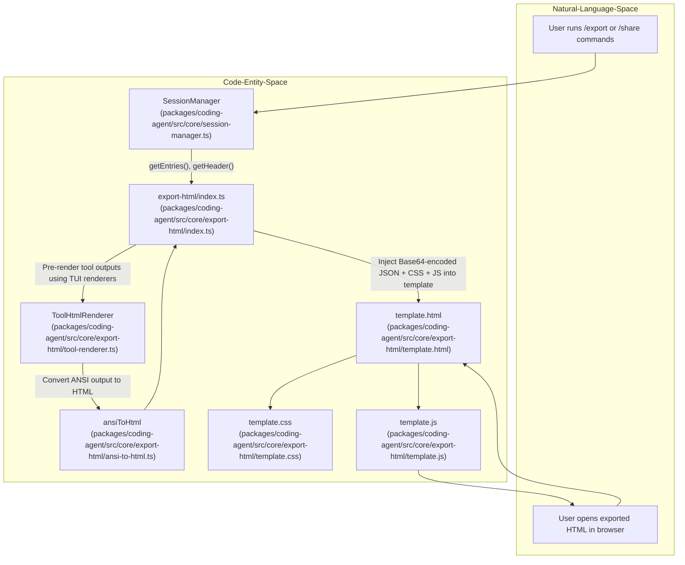

# Session Export and HTML Rendering

Relevant source files

The following files were used as context for generating this wiki page:

- [packages/coding-agent/src/core/export-html/ansi-to-html.ts](packages/coding-agent/src/core/export-html/ansi-to-html.ts)
- [packages/coding-agent/src/core/export-html/index.ts](packages/coding-agent/src/core/export-html/index.ts)
- [packages/coding-agent/src/core/export-html/template.css](packages/coding-agent/src/core/export-html/template.css)
- [packages/coding-agent/src/core/export-html/template.html](packages/coding-agent/src/core/export-html/template.html)
- [packages/coding-agent/src/core/export-html/template.js](packages/coding-agent/src/core/export-html/template.js)
- [packages/coding-agent/src/core/export-html/tool-renderer.ts](packages/coding-agent/src/core/export-html/tool-renderer.ts)
- [packages/coding-agent/src/core/export-html/vendor/highlight.min.js](packages/coding-agent/src/core/export-html/vendor/highlight.min.js)
- [packages/coding-agent/src/core/export-html/vendor/marked.min.js](packages/coding-agent/src/core/export-html/vendor/marked.min.js)
- [packages/coding-agent/test/export-html-skill-block.test.ts](packages/coding-agent/test/export-html-skill-block.test.ts)
- [packages/coding-agent/test/export-html-whitespace.test.ts](packages/coding-agent/test/export-html-whitespace.test.ts)
- [packages/coding-agent/test/export-html-xss.test.ts](packages/coding-agent/test/export-html-xss.test.ts)

The Session Export and HTML Rendering system provides a critical capability for users to share, archive, and review their agent interactions outside of the live TUI environment. It transforms the complete session data—including nested conversation structure, tool invocations, ANSI terminal output, and embedded images—into a standalone, interactive HTML document that can be opened in any browser.

This page provides a high-level overview of the export system, including the `/export` and `/share` commands, the export-html rendering stack, XSS sanitization mechanisms, and the GitHub Gist upload flow. Detailed technical information and implementation specifics appear in the linked child pages.

---

## High-Level Flow

The export process is initiated through the `/export` or `/share` slash commands in the TUI interactive mode. The system serializes the entire session tree, gathers and pre-renders tool outputs where applicable, and then injects all data into a self-contained HTML template—the latter including embedded CSS and JavaScript—to produce a portable document.

At runtime, the exported HTML file decodes the embedded session JSON and renders the conversation tree and message content dynamically in the browser, preserving interactivity such as branch navigation and expanding tool output.

### Data Flow to Code Entity Mapping

**Summary:**

- `SessionManager` supplies session entries and metadata [packages/coding-agent/src/core/export-html/index.ts:131-132]().
- The `export-html/index.ts` module orchestrates export, invoking `ToolHtmlRenderer` for any custom tool output rendering [packages/coding-agent/src/core/export-html/index.ts:183-205]().
- ANSI terminal escape sequences are converted to HTML by `ansiToHtml` [packages/coding-agent/src/core/export-html/ansi-to-html.ts:198-250]().
- The full export HTML template embeds all resources inline for portability [packages/coding-agent/src/core/export-html/template.html:42-53]().
- At runtime in the browser, `template.js` drives dynamic rendering and navigation [packages/coding-agent/src/core/export-html/template.js:1-111]().

**Sources:** [packages/coding-agent/src/core/export-html/index.ts:143-175](), [packages/coding-agent/src/core/export-html/tool-renderer.ts:25-36](), [packages/coding-agent/src/core/export-html/ansi-to-html.ts:198-250]()

---

## Export Architecture

At the core of the system is the `export-html` module, responsible for synthesizing the final HTML document. It reads a set of static template files (`template.html`, `template.css`, `template.js`), injects dynamic theme variables, and embeds Base64-encoded JSON session data.

- The main function, `generateHtml`, loads the template files and performs text substitutions to insert CSS theme variables, the encoded session snapshot, and vendor libraries for markdown and syntax highlighting [packages/coding-agent/src/core/export-html/index.ts:143-175]().
- Theme colors are normalized from the current TUI theme to produce consistent background and card colors in the exported document. This includes deriving colors if explicit export theme colors are missing [packages/coding-agent/src/core/export-html/index.ts:111-128]().
- Session data includes entries, tool metadata, labels, and optionally pre-rendered HTML of tool calls and results [packages/coding-agent/src/core/export-html/index.ts:130-138]().
- The export HTML is a fully self-contained document, not requiring external resources for rendering and interaction [packages/coding-agent/src/core/export-html/template.html:1-55]().
  
The embedded `template.js` JavaScript code is responsible for client-side parsing of the embedded session, building a navigable tree view [packages/coding-agent/src/core/export-html/template.js:73-111](), filtering messages, and safely rendering markdown content with proper sanitation and syntax highlighting.

For an in-depth explanation of the rendering pipeline, ANSI conversion, and the skill block rendering logic, see the child page [Export HTML Architecture](#9.1).

**Sources:** [packages/coding-agent/src/core/export-html/index.ts:108-128](), [packages/coding-agent/src/core/export-html/index.ts:143-175](), [packages/coding-agent/src/core/export-html/template.html:1-55](), [packages/coding-agent/src/core/export-html/template.css:1-16]()

---

## Tool Rendering and Pre-rendering

Rendering faithful representations of tool outputs is crucial for export fidelity. This is handled in two ways:

- **Native tool rendering**: Some tools with known output formats—such as `bash`, `read`, `write`, `edit`, and `ls`—are rendered directly in the HTML template at runtime using JavaScript [packages/coding-agent/src/core/export-html/index.ts:178]().

- **Custom tool pre-rendering**: For user- or extension-defined tools, the export process invokes the tool’s TUI renderers (`renderCall` and `renderResult` methods) within Node.js before generating the export HTML. The resulting outputs, which are ANSI escape-coded terminal strings, are converted to HTML using the `ansiLinesToHtml` function to preserve color and formatting [packages/coding-agent/src/core/export-html/tool-renderer.ts:58-172]().  
  These HTML snapshots are embedded inside the session data JSON under a keyed map to be used directly by the runtime HTML renderer, avoiding the need to re-render tools client-side [packages/coding-agent/src/core/export-html/index.ts:183-205]().

This pre-rendering approach enables accurate and performant rendering of complex tool outputs with collapsible details, consistent with how they appear in the live TUI.

Excess whitespace around tool outputs is carefully trimmed before HTML conversion to maintain a clean export appearance [packages/coding-agent/src/core/export-html/tool-renderer.ts:50-56](), adhering to the style conventions tested in the export whitespace tests [packages/coding-agent/test/export-html-whitespace.test.ts:9-42]().

**Sources:** [packages/coding-agent/src/core/export-html/index.ts:178-205](), [packages/coding-agent/src/core/export-html/tool-renderer.ts:58-172](), [packages/coding-agent/test/export-html-whitespace.test.ts:9-42]()

---

## Security and XSS Sanitization

Since exported sessions may include arbitrary user content, tool data, or LLM-generated text—and are rendered in a browser context—the export system implements comprehensive cross-site scripting (XSS) mitigation:

- The embedded JavaScript extends the `marked` markdown renderer with custom overrides to:
  - Block dangerous URL schemes like `javascript:` and `vbscript:` in links and images [packages/coding-agent/test/export-html-xss.test.ts:7-11]().
  - Escape all `href`, `src`, and `mimeType` attributes thoroughly to prevent attribute injection leaks [packages/coding-agent/test/export-html-xss.test.ts:23-32]().
  - Sanitize entry IDs, model names, session metadata, and tool names before inserting into DOM elements [packages/coding-agent/test/export-html-xss.test.ts:40-66]().

- The export's client-side renderer uses `escapeHtml` extensively to neutralize injection via innerHTML assignments [packages/coding-agent/src/core/export-html/ansi-to-html.ts:63-70]().

- Special treatment is applied to internal Pi skill XML blocks embedded in user messages. The export strips the wrapper tags and renders the contained skill content and user-authored prompts as distinct blocks, preserving clean presentation without exposing internal XML markup [packages/coding-agent/test/export-html-skill-block.test.ts:7-14]().

This robust sanitization is essential to ensure exported files are safe to share and view in arbitrary browsers.

**Sources:** [packages/coding-agent/test/export-html-xss.test.ts:4-67](), [packages/coding-agent/test/export-html-skill-block.test.ts:4-40](), [packages/coding-agent/src/core/export-html/ansi-to-html.ts:63-70]()

---

## Image Processing and Clipboard Support

Sessions often contain images associated with tool outputs or user data. The export system handles these as embedded Base64 data URIs within the HTML output.

- Images are preprocessed during export or session management using native `sharp` bindings or WASM-based `photon` for:
  - Resizing and format conversion to optimize size and compatibility.
  - Correcting EXIF orientation metadata to ensure correct display.
  - Converting image formats like BMP to PNG to improve cross-platform clipboard paste experience.

- Clipboard image capture and processing rely on platform-specific native bindings to integrate with the user’s environment.

For full technical details of these image operations, see the dedicated child page [Image Processing and Clipboard](#9.2).

**Sources:** (referenced in [Export HTML Architecture](#9.1) overview and planned in image-related child page [9.2])

---

## GitHub Gist Upload Flow

The `/share` command extends the export functionality by uploading the generated HTML export as a GitHub Gist:

- It authenticates the user using their stored GitHub token.
- Creates a public or unlisted Gist containing the full HTML export file.
- Returns to the user the GitHub Gist URL and a direct preview link, allowing immediate access and sharing.

This feature integrates with GitHub’s API to facilitate effortless sharing of session exports as live web documents.

**Sources:** (Implemented via CLI slash command logic; orchestration occurs in `packages/coding-agent/src/core/export-html/index.ts` for HTML generation).

---

## Summary

The Session Export and HTML Rendering system enables durable, rich export of AI agent sessions with:

- Complete session tree structure and metadata.
- Interactive conversation navigation in a web UI.
- Accurate rendering of terminal tool output with ANSI color codes converted to HTML.
- Pre-rendering support for extension tools.
- Comprehensive XSS security through sanitization of markdown, URLs, attributes, and embedded content.
- Image embedding and processing for enhanced visual fidelity.
- Integration with GitHub Gist for immediate sharing.

For comprehensive technical details and usage examples, please see the associated child pages:

- [Export HTML Architecture](#9.1) — Deep dive into the export-html module including template rendering, ANSI to HTML conversion, and skill block handling.
- [Image Processing and Clipboard](#9.2) — Details on image resize, format conversion, EXIF orientation, and clipboard capture.

---

### Child Pages
- [Export HTML Architecture](#9.1)
- [Image Processing and Clipboard](#9.2)

---

**Sources:**

- `packages/coding-agent/src/core/export-html/index.ts:1-182`  
- `packages/coding-agent/src/core/export-html/tool-renderer.ts:1-173`  
- `packages/coding-agent/src/core/export-html/ansi-to-html.ts:1-259`  
- `packages/coding-agent/src/core/export-html/template.html`  
- `packages/coding-agent/src/core/export-html/template.css`  
- `packages/coding-agent/src/core/export-html/template.js:1-176`  
- `packages/coding-agent/test/export-html-xss.test.ts`  
- `packages/coding-agent/test/export-html-whitespace.test.ts`  
- `packages/coding-agent/test/export-html-skill-block.test.ts`
