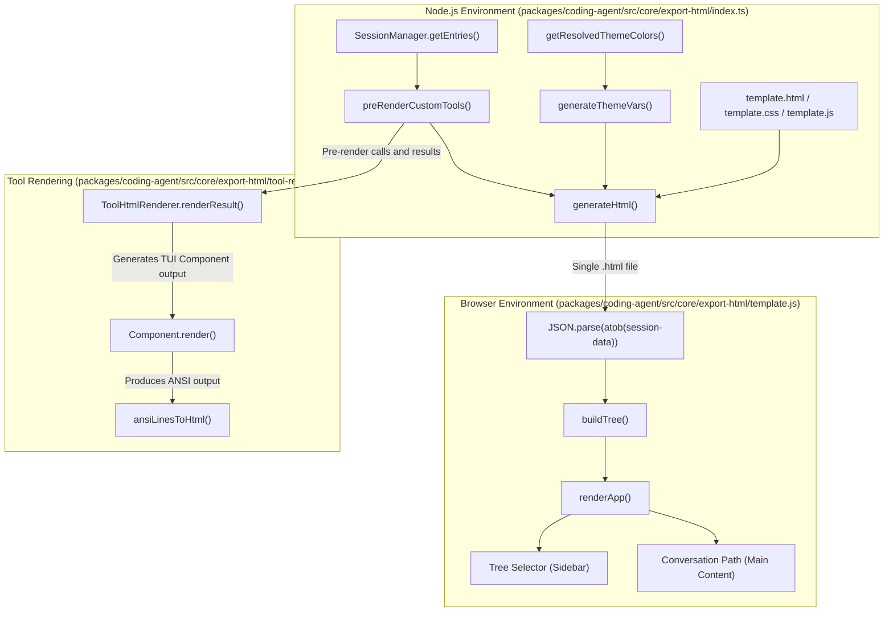
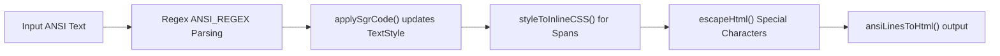
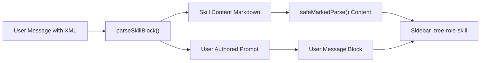

# Export HTML Architecture

<details>
<summary>Relevant source files</summary>

The following files were used as context for generating this wiki page:

- [packages/coding-agent/src/core/export-html/ansi-to-html.ts](packages/coding-agent/src/core/export-html/ansi-to-html.ts)
- [packages/coding-agent/src/core/export-html/index.ts](packages/coding-agent/src/core/export-html/index.ts)
- [packages/coding-agent/src/core/export-html/template.css](packages/coding-agent/src/core/export-html/template.css)
- [packages/coding-agent/src/core/export-html/template.html](packages/coding-agent/src/core/export-html/template.html)
- [packages/coding-agent/src/core/export-html/template.js](packages/coding-agent/src/core/export-html/template.js)
- [packages/coding-agent/src/core/export-html/tool-renderer.ts](packages/coding-agent/src/core/export-html/tool-renderer.ts)
- [packages/coding-agent/src/core/export-html/vendor/highlight.min.js](packages/coding-agent/src/core/export-html/vendor/highlight.min.js)
- [packages/coding-agent/src/core/export-html/vendor/marked.min.js](packages/coding-agent/src/core/export-html/vendor/marked.min.js)
- [packages/coding-agent/test/export-html-skill-block.test.ts](packages/coding-agent/test/export-html-skill-block.test.ts)
- [packages/coding-agent/test/export-html-whitespace.test.ts](packages/coding-agent/test/export-html-whitespace.test.ts)
- [packages/coding-agent/test/export-html-xss.test.ts](packages/coding-agent/test/export-html-xss.test.ts)

</details>


The `export-html` module of the `pi` codebase is responsible for generating a standalone, interactive HTML representation of an `AgentSession`. This export aims to faithfully reproduce the Terminal UI (TUI) experience in a browser environment, featuring branching conversation trees, secure Markdown rendering, ANSI-to-HTML conversion for tool outputs, and safe handling of images alongside other session data.

---

## Overview and Pipeline

The export pipeline transforms a session's structured data (`SessionEntry` list and metadata) into a single HTML file. This file embeds a Base64-encoded JSON payload of the session content along with the template’s CSS and JavaScript, enabling interactive navigation and rendering entirely in-browser.

### Session Export Pipeline Diagram



This diagram illustrates how session data flows from in-memory Node.js structures through custom pre-rendering and template injection to a browser-hosted interactive document.

**Sources:**
- `[packages/coding-agent/src/core/export-html/index.ts:142-174]()`
- `[packages/coding-agent/src/core/export-html/template.js:8-15]()`
- `[packages/coding-agent/src/core/export-html/tool-renderer.ts:121-171]()`

---

## Template Rendering Pipeline

The core HTML generation is handled by the function `generateHtml` which integrates session data into HTML, CSS, and JavaScript templates at export time.

### Steps in the Pipeline

1. **Reading Templates and Vendor Scripts:**
   Reads `template.html`, `template.css`, and `template.js` files along with bundled vendor scripts (`marked.min.js` for Markdown parsing and `highlight.min.js` for syntax highlighting) `[packages/coding-agent/src/core/export-html/index.ts:143-150]()`.

2. **Theme Variable Injection:**
   Theme-based CSS variables are generated by merging resolved theme colors via `getResolvedThemeColors()` and explicit export colors from `getThemeExportColors()` `[packages/coding-agent/src/core/export-html/index.ts:111-124]()`. If export-specific colors are not defined by the theme, `deriveExportColors()` derives appropriate background colors by adjusting brightness from a base user message background color.

3. **Encoding Session Data:**
   The entire session state, including metadata, entries, system prompts, tool definitions, and pre-rendered custom tool outputs, is serialized to JSON and Base64-encoded. This Base64 string is embedded into a `<script>` tag with ID `session-data` `[packages/coding-agent/src/core/export-html/index.ts:159-171]()`.

4. **Template Variable Replacement:**
   The CSS variables, encoded session data, and inline scripts are injected into `template.html` by replacing placeholder tags (`{{CSS}}`, `{{SESSION_DATA}}`, `{{JS}}`, etc.) to produce the final distributable HTML file `[packages/coding-agent/src/core/export-html/index.ts:169-174]()`.

**Explanation of Key Functions:**
- `generateThemeVars(themeName)`: Produces a block of CSS custom properties for the theme colors `[packages/coding-agent/src/core/export-html/index.ts:111-129]()`.
- `deriveExportColors(baseColor)`: Adjusts brightness and luminance to create a page background, card background, and informational section background colors `[packages/coding-agent/src/core/export-html/index.ts:81-106]()`.
- `generateHtml(sessionData, themeName)`: Orchestrates reading template files, generating theme CSS, encoding data, and assembling the final HTML string `[packages/coding-agent/src/core/export-html/index.ts:143-175]()`.

**Sources:**
- `[packages/coding-agent/src/core/export-html/index.ts:81-174]()`
- `[packages/coding-agent/src/core/export-html/template.html:42-53]()`

---

## Tool Rendering Architecture

Tools inside the agent session are rendered differently in the export, depending on whether they are built-in or custom extension tools.

### Built-in vs. Custom Tool Rendering

| Tool Type | Rendering Strategy | Location |
| :--- | :--- | :--- |
| **Built-in Tools** | Rendered client-side in the template using pure JavaScript (`template.js` logic) | `[packages/coding-agent/src/core/export-html/index.ts:178]()` |
| `bash`, `read`, `write`, `edit`, `ls` | | |
| **Custom Tools** | Pre-rendered server-side during export by rendering their TUI output to ANSI, then converting ANSI to HTML | `[packages/coding-agent/src/core/export-html/index.ts:183-186]()`, `[packages/coding-agent/src/core/export-html/tool-renderer.ts:58-172]()` |

### ToolHtmlRenderer: Custom Tool Rendering Pipeline

- Custom tools are rendered by invoking their corresponding TUI render methods (`renderCall`, `renderResult`) to obtain ANSI-encoded output `[packages/coding-agent/src/core/export-html/tool-renderer.ts:128-160]()`.
- ANSI output lines are cleaned by trimming empty padding lines (using `trimRenderedResultLines`) before conversion to HTML `[packages/coding-agent/src/core/export-html/tool-renderer.ts:50-56]()`.
- The ANSI is converted to inline-styled HTML spans by `ansiLinesToHtml` (from `ansi-to-html.ts`), allowing faithful style and color replication `[packages/coding-agent/src/core/export-html/ansi-to-html.ts:198-250]()`.

**Whitespace Handling:**
- Output container CSS styles use:
  - `.ansi-line` elements set `white-space: pre` to preserve terminal line spacing and alignment `[packages/coding-agent/test/export-html-whitespace.test.ts:16]()`.
  - `.output-preview` and `.output-full` containers use `white-space: pre-wrap` for line wrap while keeping indentation `[packages/coding-agent/test/export-html-whitespace.test.ts:13-15]()`.

**Error Handling:**
- `renderCall` and `renderResult` catch exceptions and fall back to structured or non-rendered output if a custom renderer fails `[packages/coding-agent/src/core/export-html/tool-renderer.ts:115-168]()`.

**Sources:**
- `[packages/coding-agent/src/core/export-html/index.ts:177-186]()`
- `[packages/coding-agent/src/core/export-html/tool-renderer.ts:50-172]()`
- `[packages/coding-agent/src/core/export-html/ansi-to-html.ts:1-259]()`
- `[packages/coding-agent/test/export-html-whitespace.test.ts:10-18]()`

---

## ANSI to HTML Conversion Details

The ANSI-to-HTML conversion utility parses terminal escape codes and outputs styled HTML with inline CSS:

- Supports standard text styles: bold, dim, italic, underline `[packages/coding-agent/src/core/export-html/ansi-to-html.ts:123-138]()`.
- Converts 16 standard ANSI colors, 256-color palette colors, and RGB true color foreground/background colors `[packages/coding-agent/src/core/export-html/ansi-to-html.ts:139-185]()`.
- Escapes all HTML-special characters to prevent injection `[packages/coding-agent/src/core/export-html/ansi-to-html.ts:63-70]()`.
- Wraps each line in a `<div class="ansi-line">` to maintain line structure `[packages/coding-agent/src/core/export-html/ansi-to-html.ts:256-258]()`.

### Conversion Flow



**Sources:**
- `[packages/coding-agent/src/core/export-html/ansi-to-html.ts:60-258]()`

---

## Security and Sanitization (XSS Protection)

Given that Markdown rendering and tool output may embed user input or tool data, the export applies strict security mechanisms to prevent XSS attacks.

### Sanitization Measures in `template.js`

- **Marked Renderer Overrides:** Custom overrides for links and images block dangerous URL schemes such as `javascript:`, `vbscript:`, and dangerous inline data URIs unless they represent safe images `[packages/coding-agent/test/export-html-xss.test.ts:7-16]()`.
- **HTML Attribute Escaping:** All dynamically inserted IDs, URLs, mime types, and embedded base64 image data are escaped using `escapeHtml` before injection into HTML attributes to prevent attribute injection or tag break-outs `[packages/coding-agent/test/export-html-xss.test.ts:18-41]()`.
- **Sidebar and Metadata Escaping:** Metadata fields rendered in the sidebar (model identifiers, thinking levels, roles, and tool names) are safely escaped, preventing injection via session metadata `[packages/coding-agent/test/export-html-xss.test.ts:43-61]()`.
- **Utility Function:** `escapeHtml` is shared and used throughout ANSI-to-HTML and template rendering to secure all dynamic content `[packages/coding-agent/src/core/export-html/ansi-to-html.ts:63-70]()`.

**Sources:**
- `[packages/coding-agent/test/export-html-xss.test.ts:1-62]()`
- `[packages/coding-agent/src/core/export-html/ansi-to-html.ts:63-70]()`

---

## Skill Block Rendering

Skill invocations embedded in sessions use an XML-like wrapper around the user prompt:
```xml
<skill name="..." location="...">
  ...
</skill>

actual prompt text
```

### Rendering Approach

- The embedded `<skill>...</skill>` block is parsed and stripped by `parseSkillBlock` in `template.js`, separating the skill content from the user prompt `[packages/coding-agent/test/export-html-skill-block.test.ts:7-14]()`.
- The skill content (usually markdown from `SKILL.md`) is rendered with `safeMarkedParse`, ensuring HTML safety and proper Markdown formatting `[packages/coding-agent/test/export-html-skill-block.test.ts:29-33]()`.
- The user prompt is rendered as a separate sibling block immediately following the skill invocation in the exported document, showing exactly what the user authored `[packages/coding-agent/test/export-html-skill-block.test.ts:16-27]()`.
- The sidebar contains entries for both the skill (styled with `.tree-role-skill`) and the user message, aiding navigation `[packages/coding-agent/test/export-html-skill-block.test.ts:35-39]()`.

### Skill Rendering Diagram



**Sources:**
- `[packages/coding-agent/test/export-html-skill-block.test.ts:1-41]()`

---

## Summary

The `export-html` module provides a robust, secure, and visually rich export mechanism supporting a complete `AgentSession` browsing experience on the web. Its core involves:

- **Template-based Rendering:** Combining static HTML/CSS/JS with injected session state and theme colors `[packages/coding-agent/src/core/export-html/index.ts:143-175]()`.
- **Tool Output Rendering:** Mixed strategy with built-in tools rendered dynamically on client-side, and custom tools pre-rendered server-side through a TUI ANSI pipeline `[packages/coding-agent/src/core/export-html/index.ts:177-186]()`.
- **ANSI-to-HTML Conversion:** Enables faithful rendering of terminal colors and styles in browser `[packages/coding-agent/src/core/export-html/ansi-to-html.ts:1-259]()`.
- **XSS Mitigations:** Overriding Markdown renderer methods and escaping all injected content to secure the export `[packages/coding-agent/test/export-html-xss.test.ts:1-67]()`.
- **Skill Block Parsing:** Special handling of skill invocation blocks for accurate source-level rendering `[packages/coding-agent/test/export-html-skill-block.test.ts:1-41]()`.
- **Interactive Browser UI:** Fully client-side rendering allows navigation, searching, and tree-based exploration of the session `[packages/coding-agent/src/core/export-html/template.js:1-111]()`.

**Sources:**
- `[packages/coding-agent/src/core/export-html/index.ts:11-186]()`
- `[packages/coding-agent/src/core/export-html/template.js:1-176]()`
- `[packages/coding-agent/src/core/export-html/tool-renderer.ts:38-172]()`
- `[packages/coding-agent/src/core/export-html/ansi-to-html.ts:1-259]()`
- `[packages/coding-agent/src/core/export-html/template.html:1-56]()`
- `[packages/coding-agent/test/export-html-xss.test.ts:1-67]()`
- `[packages/coding-agent/test/export-html-whitespace.test.ts:1-43]()`
- `[packages/coding-agent/test/export-html-skill-block.test.ts:1-41]()`
