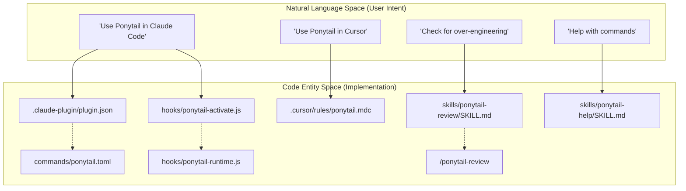

# Overview

<details>
<summary>Relevant source files</summary>

The following files were used as context for generating this wiki page:

- [AGENTS.md](AGENTS.md)
- [LICENSE](LICENSE)
- [README.md](README.md)
- [assets/logo-dark.png](assets/logo-dark.png)
- [assets/logo-dark.svg](assets/logo-dark.svg)
- [assets/logo.png](assets/logo.png)
- [docs/agent-portability.md](docs/agent-portability.md)
- [skills/ponytail-help/SKILL.md](skills/ponytail-help/SKILL.md)

</details>


Ponytail is a minimalist "lazy senior developer" ruleset for AI agents designed to combat over-engineering and code bloat. It enforces a philosophy of doing the absolute minimum required to solve a problem correctly, prioritizing existing solutions (standard libraries, native platform features) over custom implementations or new dependencies.

By applying these constraints, Ponytail typically results in significantly smaller codebases that are faster to develop and cheaper to run. Recent agentic benchmarks show a **54% reduction in lines of code (LOC)** and a **20% reduction in cost** compared to agents without the skill [README.md:57-62]().

### Core Logic: The Ladder
Before writing a single line of code, the agent is instructed to stop at the first rung of "The Ladder" that satisfies the requirement:
1.  **YAGNI**: Does this need to exist? (Skip it if no).
2.  **Standard Library**: Does the language's stdlib do it?
3.  **Native Platform**: Does the browser or OS have a built-in feature?
4.  **Installed Dependency**: Is there already a tool in the project that does this?
5.  **One Line**: Can it be a single line of logic?
6.  **Minimum Viable**: Only then, write the absolute minimum code that works.

Sources: [README.md:80-91](), [AGENTS.md:5-12]()

---

## The Ponytail Philosophy
The project is built on the belief that "the best code is the code never written" [AGENTS.md:3-3](). This philosophy is not about negligence; hard boundaries are maintained for security, data-loss prevention, input validation at trust boundaries, and accessibility [README.md:93-93](), [AGENTS.md:24-24]().

For a deep dive into the decision hierarchy, the `ponytail:` comment convention, and the three intensity levels (**lite**, **full**, **ultra**), see **[The Ponytail Philosophy](#1.1)**.

---

## System Architecture & Portability
Ponytail is distributed as a portable ruleset. It functions as a native plugin for advanced agents like Claude Code, Codex, and OpenCode, while providing static rule files for IDE-based agents.

### Code-to-Agent Mapping
The following diagram bridges the conceptual "Supported Hosts" to the specific configuration entities and files in the codebase.

**Diagram: Adapter & Command Mapping**

Sources: [docs/agent-portability.md:9-25](), [README.md:101-155](), [skills/ponytail-help/SKILL.md:24-35]()

### Distribution Model
Ponytail uses a hub-and-spoke model where `AGENTS.md` acts as the compact, always-on instruction set [docs/agent-portability.md:41-41](). Host-specific adapters point to shared logic in `skills/` and `hooks/` to ensure portable behavior across 14+ supported agents [README.md:17-17](), [docs/agent-portability.md:27-32]().

| Host | Primary Integration Files |
| :--- | :--- |
| **Claude Code** | `.claude-plugin/`, `commands/*.toml`, `hooks/` |
| **Codex** | `.codex-plugin/plugin.json`, `hooks/claude-codex-hooks.json` |
| **OpenCode** | `.opencode/plugins/ponytail.mjs`, `.opencode/command/` |
| **Pi Agent** | `pi-extension/`, `skills/` |

For details on how adapters are kept thin and how to install them, see **[Agent Portability & Supported Hosts](#1.2)**.

---

## Repository Organization
The repository is structured to separate core logic (skills) from the platform-specific glue code.

**Diagram: Repository Structure**
```mermaid
graph LR
    subgraph "Core Rules"
        "skills/ponytail/" -- "Main Logic" --> "SKILL.md"
        "skills/ponytail-review/" -- "Review Logic" --> "SKILL.md_rev"
        "AGENTS.md" -- "Compact Rule" --> "AGENTS.md_file"
    end

    subgraph "Platform Adapters"
        "hooks/" -- "Lifecycle Logic" --> "ponytail-runtime.js"
        "commands/" -- "CLI Interface" --> "ponytail.toml"
        "pi-extension/" -- "Pi Harness" --> "extension.js"
        ".opencode/" -- "OpenCode Plugin" --> "ponytail.mjs"
    end

    subgraph "Validation & Assets"
        "benchmarks/" -- "Harness & Results" --> "agentic/"
        "tests/" -- "Logic Tests" --> "hooks.test.js"
        "assets/" -- "Branding" --> "logo.png"
    end
```
Sources: [docs/agent-portability.md:33-42](), [README.md:95-155]()

---

## Quick Start
To activate Ponytail in a supported environment:

*   **Claude Code**: `/plugin marketplace add DietrichGebert/ponytail` then `/plugin install ponytail@ponytail` [README.md:103-105]().
*   **Codex**: Add via `/plugins` marketplace and trust the lifecycle hooks in `/hooks` [README.md:112-118]().
*   **Pi Agent**: `pi install git:github.com/DietrichGebert/ponytail` [README.md:146-146]().
*   **IDE Rules**: Copy the relevant rule file (e.g., `.cursor/rules/ponytail.mdc` or `.clinerules/ponytail.md`) to your project root [docs/agent-portability.md:16-18]().

For more detailed command references and skill triggers, see **[Skills & Commands](2.-Skills-&-Commands)**.
