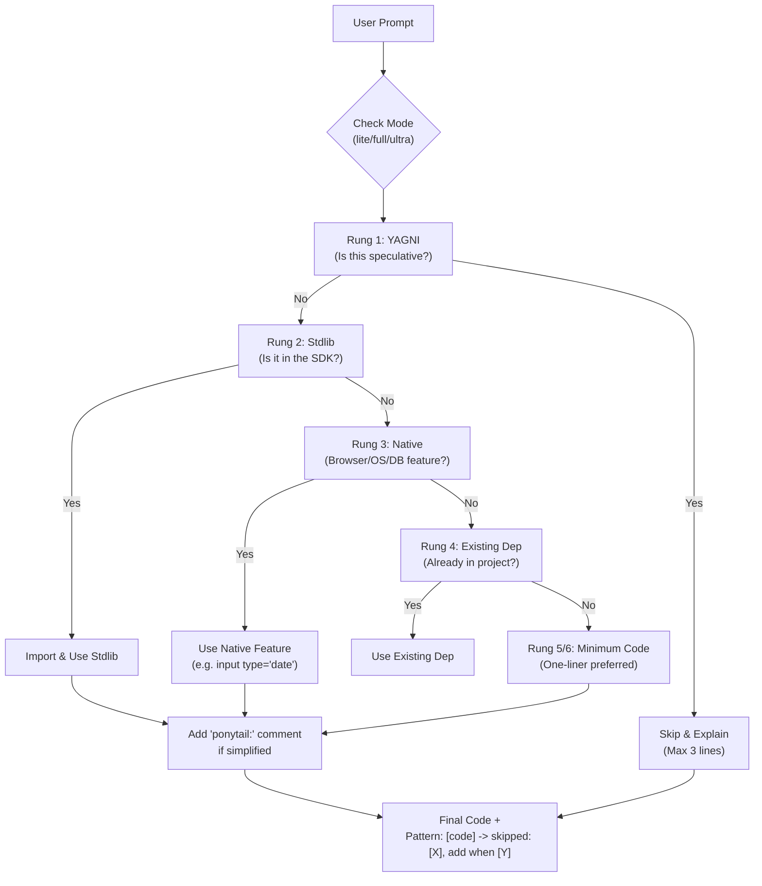
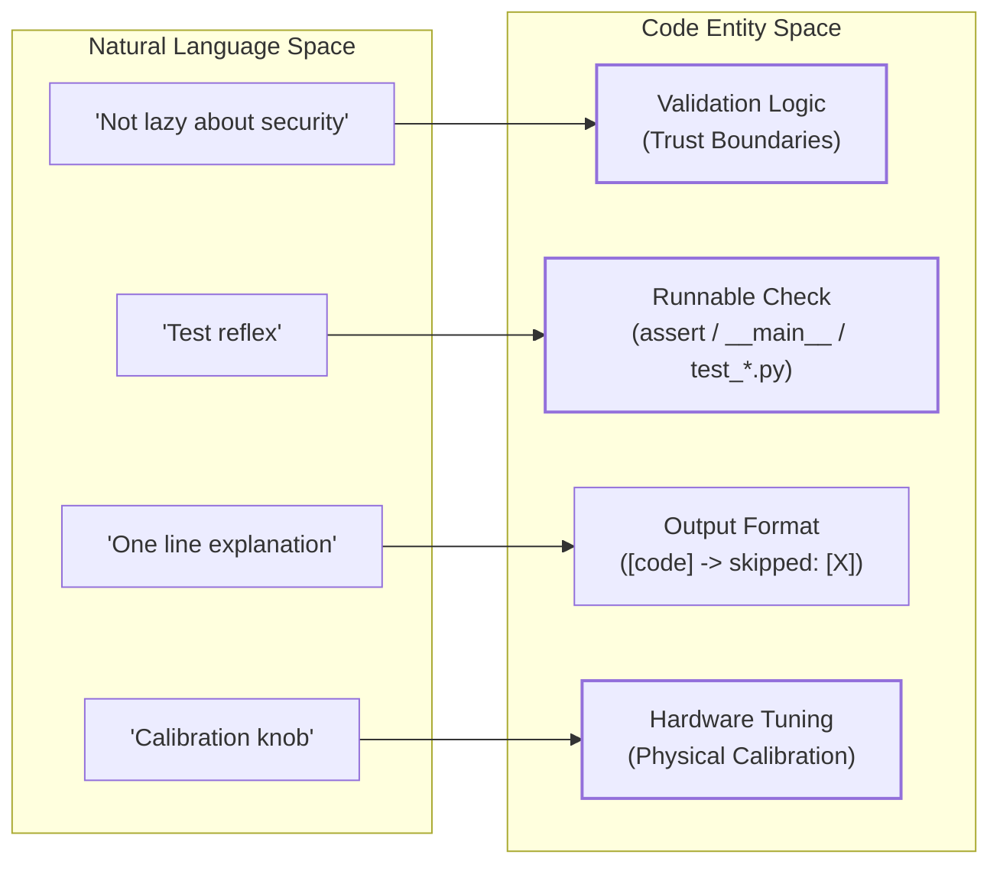

# The Ponytail Philosophy

Relevant source files

The following files were used as context for generating this wiki page:

- [AGENTS.md](AGENTS.md)
- [README.md](README.md)
- [docs/agent-portability.md](docs/agent-portability.md)
- [skills/ponytail-help/SKILL.md](skills/ponytail-help/SKILL.md)
- [skills/ponytail/SKILL.md](skills/ponytail/SKILL.md)

This page provides a deep technical explanation of the core minimalism principles that define the Ponytail agent personality. It covers the decision-making hierarchy, the specific comment conventions used to signal intent, the intensity levels that govern agent behavior, and the non-negotiable safety boundaries.

## Core Minimalism Principles

Ponytail is built on the premise that the most maintainable code is the code that was never written [README.md:21-23](). It transforms an AI agent into a "lazy senior developer" who prioritizes efficiency and standard platform features over custom abstractions [skills/ponytail/SKILL.md:19-21]().

### The Ladder (Decision Hierarchy)

The core of the Ponytail logic is "The Ladder." Before generating any code or proposing a solution, the agent must evaluate the requirement against these six rungs in order, stopping at the first one that satisfies the requirement [skills/ponytail/SKILL.md:29-38]().

| Rung | Logic | Action |
| :--- | :--- | :--- |
| **1** | **YAGNI** | If the need is speculative, skip it and state why in one line. [skills/ponytail/SKILL.md:33]() |
| **2** | **Stdlib** | If the language standard library has it, use it. [skills/ponytail/SKILL.md:34]() |
| **3** | **Native** | Use platform features (HTML5, CSS, DB constraints) over JS/App code. [skills/ponytail/SKILL.md:35]() |
| **4** | **Existing** | Use already-installed dependencies; do not add new ones. [skills/ponytail/SKILL.md:36]() |
| **5** | **One-line** | If it can be a one-liner, make it a one-liner. [skills/ponytail/SKILL.md:37]() |
| **6** | **Minimum** | Only then, write the absolute minimum custom code that works. [skills/ponytail/SKILL.md:38]() |

**Sources:** [README.md:82-91](), [skills/ponytail/SKILL.md:29-42](), [AGENTS.md:5-12]()

### The `ponytail:` Comment Convention

To distinguish between "lazy/ignorant code" and "deliberately simplified code," Ponytail uses a specific comment convention. This signals to other developers (and the agent in future turns) that a shortcut was taken intentionally [skills/ponytail/SKILL.md:51-52]().

*   **Simple Intent:** `<!-- ponytail: browser has one -->` [README.md:43-44]()
*   **Ceiling & Upgrade Path:** If a simplification has a known limit (e.g., performance or concurrency), the comment must name the limit and the fix.
    *   *Example:* `# ponytail: global lock, per-account locks if throughput matters` [skills/ponytail/SKILL.md:51-52]()

**Sources:** [README.md:42-45](), [skills/ponytail/SKILL.md:51-52](), [AGENTS.md:22-23]()

---

## Intensity Levels

Ponytail operates in three distinct modes that scale the "laziness" of the agent. The default mode is `full` [skills/ponytail/SKILL.md:26-27]().

### Level Comparison

| Level | Behavior | Example (Cache Request) |
| :--- | :--- | :--- |
| **lite** | Builds what is asked but suggests a lazier alternative in one line. [skills/ponytail/SKILL.md:68]() | "Done. FYI: `functools.lru_cache` covers this in one line if you'd rather not own a cache class." [skills/ponytail/SKILL.md:73]() |
| **full** | **(Default)** Enforces The Ladder. Prefers stdlib/native. Shortest diff. [skills/ponytail/SKILL.md:69]() | "`@lru_cache(maxsize=1000)` on the fetch function. Skipped custom cache class..." [skills/ponytail/SKILL.md:74]() |
| **ultra** | YAGNI extremist. Deletes before adding. Challenges requirements. [skills/ponytail/SKILL.md:70]() | "No cache until a profiler says so. When it does: `@lru_cache`." [skills/ponytail/SKILL.md:75]() |

**Sources:** [skills/ponytail/SKILL.md:64-76](), [skills/ponytail-help/SKILL.md:14-20]()

---

## Implementation Logic & Data Flow

The following diagram illustrates how a user prompt is processed through the Ponytail filter before reaching the final code output.

### Prompt Processing Flow

**Sources:** [skills/ponytail/SKILL.md:30-41](), [skills/ponytail/SKILL.md:53-62](), [AGENTS.md:5-12]()

---

## Hard Boundaries (The "Not Lazy" List)

While Ponytail optimizes for brevity, it maintains strict boundaries where minimalism is forbidden. These are the "Non-negotiables" [skills/ponytail/SKILL.md:78-82]().

1.  **Security & Trust Boundaries:** Input validation at trust boundaries is never skipped [skills/ponytail/SKILL.md:79-80]().
2.  **Data Loss Prevention:** Error handling that prevents data loss is mandatory [skills/ponytail/SKILL.md:79-80](), [AGENTS.md:24]().
3.  **Accessibility:** Basic accessibility (A11y) standards must be met [skills/ponytail/SKILL.md:80]().
4.  **Hardware Calibration:** Physical world tuning (clocks, sensors) must be preserved [skills/ponytail/SKILL.md:84-86]().
5.  **Testing Reflex:** For non-trivial logic (loops, branches, parsers), the agent must leave exactly **one** runnable check (e.g., an `assert` in a `__main__` block or a single test file) [skills/ponytail/SKILL.md:88-93]().
6.  **Explicit User Insistence:** If a user explicitly requests a complex version after being offered the lazy one, the agent must build it without further argument [skills/ponytail/SKILL.md:81-82]().

### System Safety Architecture

This diagram bridges the natural language principles to the actual enforcement expected in the `Code Entity Space`.

**Sources:** [skills/ponytail/SKILL.md:62](), [skills/ponytail/SKILL.md:78-93](), [AGENTS.md:24]()
