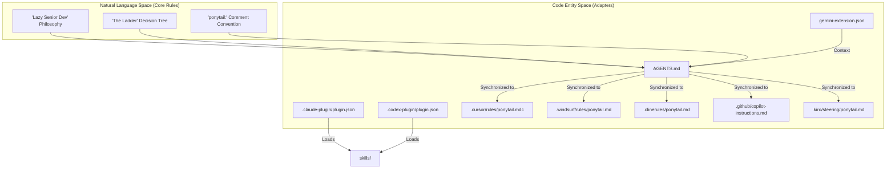
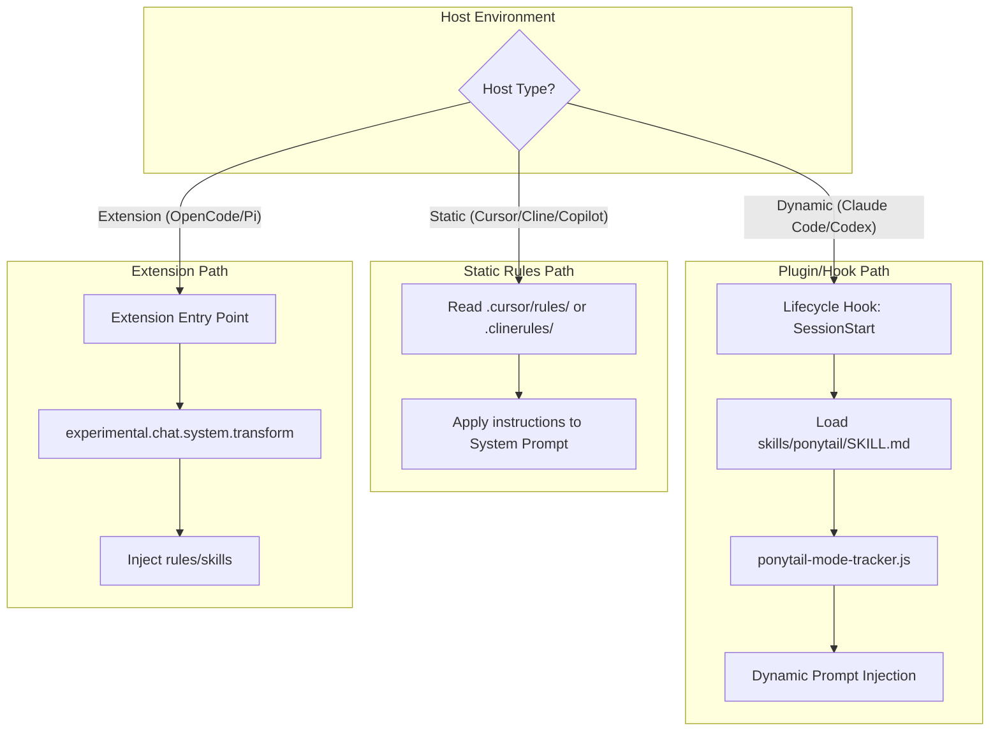

# Agent Portability & Supported Hosts

Relevant source files

The following files were used as context for generating this wiki page:

- [.claude-plugin/plugin.json](.claude-plugin/plugin.json)
- [.clinerules/ponytail.md](.clinerules/ponytail.md)
- [.codex-plugin/plugin.json](.codex-plugin/plugin.json)
- [.cursor/rules/ponytail.mdc](.cursor/rules/ponytail.mdc)
- [.github/copilot-instructions.md](.github/copilot-instructions.md)
- [.windsurf/rules/ponytail.md](.windsurf/rules/ponytail.md)
- [README.es.md](README.es.md)
- [README.md](README.md)
- [docs/agent-portability.md](docs/agent-portability.md)
- [gemini-extension.json](gemini-extension.json)
- [skills/ponytail-help/SKILL.md](skills/ponytail-help/SKILL.md)

Ponytail is designed as an agent-portable skill distribution. Its core philosophy of minimalism and "The Ladder" decision hierarchy is implemented in a central set of rules, which are then distributed via thin adapters to various AI agent environments [docs/agent-portability.md:3-5](). This architecture ensures that whether a user is using a CLI-based agent like Claude Code or an IDE-integrated agent like Cursor, the "Lazy Senior Dev" behavior remains consistent.

## Distribution Architecture

The repository follows a hub-and-spoke model for rule distribution. The "hub" consists of the core behavior definitions located in the `skills/` directory and the `AGENTS.md` file [docs/agent-portability.md:27-32](). The "spokes" are the host-specific adapters that load or wrap these instructions.

### Core Behavior Components
| Component | Role | File |
| :--- | :--- | :--- |
| **Lazy Senior Dev** | The primary instruction set for minimalist coding. | [skills/ponytail/SKILL.md]() |
| **Over-engineering Review** | Skill for identifying and deleting unnecessary code. | [skills/ponytail-review/SKILL.md]() |
| **Quick Reference** | Help documentation for the agent to explain its own modes. | [skills/ponytail-help/SKILL.md]() |
| **Compact Ruleset** | A consolidated version of instructions for generic agents. | [AGENTS.md]() |

Sources: [docs/agent-portability.md:33-42]()

### Portability Data Flow
The following diagram illustrates how the central ruleset flows from the repository into various host environments using specific adapter files.

**Natural Language Space to Code Entity Space: Rule Distribution**

Sources: [docs/agent-portability.md:1-25](), [README.md:80-91](), [gemini-extension.json:1-7]()

## Supported Hosts & Adapters

Ponytail supports multiple tiers of integration depending on the capabilities of the host agent:

1.  **Full Plugin Integration**: Supports lifecycle hooks, session activation, and dynamic mode tracking (Claude Code, Codex).
2.  **Native Agent Extensions**: Integrated via specific harness systems (Pi Agent, OpenCode, Gemini CLI).
3.  **Project/Steering Rules**: Static instruction files that the agent reads upon initialization (Cursor, Windsurf, Cline, Copilot, Kiro).

### Adapter Mapping Table

| Host | Adapter Files | Integration Level |
| :--- | :--- | :--- |
| **Claude Code** | `.claude-plugin/plugin.json`, `commands/`, `hooks/` | Full Plugin [docs/agent-portability.md:11]() |
| **Codex** | `.codex-plugin/plugin.json`, `hooks/claude-codex-hooks.json` | Full Plugin [docs/agent-portability.md:12]() |
| **OpenCode** | `.opencode/plugins/ponytail.mjs`, `.opencode/command/` | Server Plugin [docs/agent-portability.md:13]() |
| **Pi Agent** | `pi-extension/` | Package Extension [docs/agent-portability.md:14]() |
| **Gemini CLI** | `gemini-extension.json`, `AGENTS.md` | Extension [docs/agent-portability.md:15]() |
| **Cursor** | `.cursor/rules/ponytail.mdc` | Project Rule [docs/agent-portability.md:16]() |
| **Windsurf** | `.windsurf/rules/ponytail.md` | Project Rule [docs/agent-portability.md:17]() |
| **Cline** | `.clinerules/ponytail.md` | Project Rule [docs/agent-portability.md:18]() |
| **GitHub Copilot** | `.github/copilot-instructions.md` | Instruction File [docs/agent-portability.md:19]() |
| **GitHub Copilot CLI** | `.github/plugin/`, `AGENTS.md` | Plugin [docs/agent-portability.md:20]() |
| **Kiro** | `.kiro/steering/ponytail.md` | Steering Rule [docs/agent-portability.md:24]() |

Sources: [docs/agent-portability.md:9-25](), [README.md:101-155]()

## The Adapter Rule

To maintain the portability of the system, the project enforces a strict "Adapter Rule": **Keep adapters thin** [docs/agent-portability.md:29](). 

- **For Hook-capable Hosts**: Adapters must point to existing files in `skills/` and `hooks/` rather than duplicating logic [docs/agent-portability.md:29-30]().
- **For Static Rule Hosts**: The rule text must remain aligned with the canonical `AGENTS.md` file [docs/agent-portability.md:30-31]().

### Host-Specific Implementation Logic
The following diagram maps the logical flow of how different host types process the Ponytail ruleset.

**Logic Flow: Adapter Execution by Host Type**

Sources: [docs/agent-portability.md:7-25](), [README.md:82-91](), [.cursor/rules/ponytail.mdc:1-5]()

## Rule Content Consistency

Across all supported hosts, the core instruction set remains identical to ensure the "Lazy Senior Dev" persona is preserved. Every adapter file (e.g., `.clinerules/ponytail.md`, `.cursor/rules/ponytail.mdc`, `.github/copilot-instructions.md`) contains the same six-rung ladder [README.md:82-91]():

1.  **YAGNI**: Does this need to exist? [.clinerules/ponytail.md:7]()
2.  **Stdlib**: Does the standard library do it? [.clinerules/ponytail.md:8]()
3.  **Native**: Native platform feature? [.clinerules/ponytail.md:9]()
4.  **Dependencies**: Installed dependency? [.clinerules/ponytail.md:10]()
5.  **One-liner**: Can this be one line? [.clinerules/ponytail.md:11]()
6.  **Minimum**: Only then: the minimum that works. [.clinerules/ponytail.md:12]()

This consistency ensures that the performance benchmarks (e.g., ~54% less code) are reproducible regardless of the agent host used [README.md:59]().

Sources: [.clinerules/ponytail.md:1-25](), [.cursor/rules/ponytail.mdc:1-31](), [.github/copilot-instructions.md:1-25](), [.windsurf/rules/ponytail.md:1-25]()
