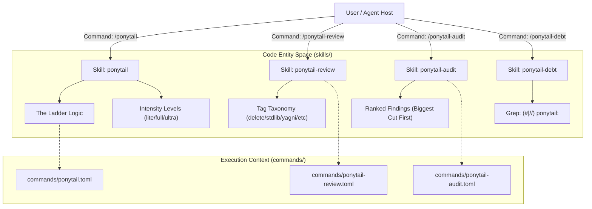
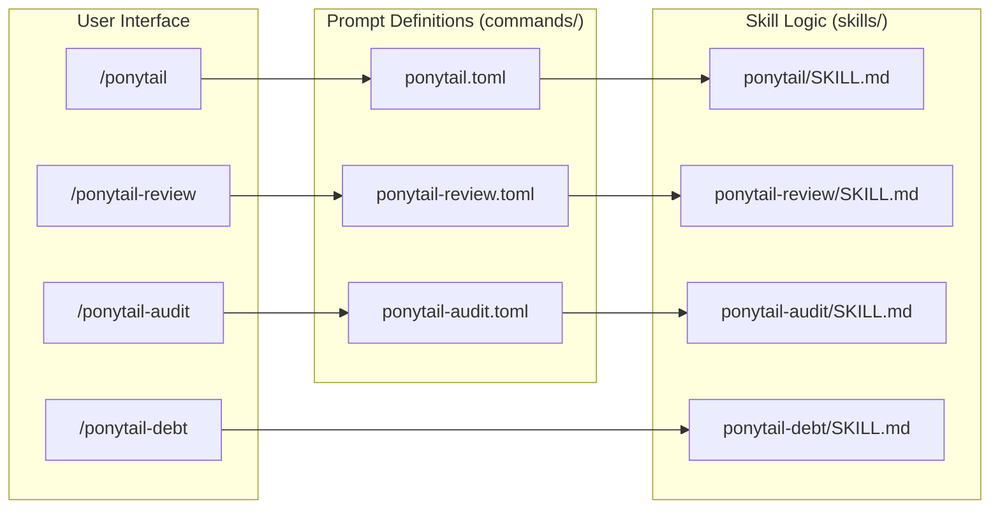

# Skills & Commands

Relevant source files

The following files were used as context for generating this wiki page:

- [.opencode/command/ponytail-audit.md](.opencode/command/ponytail-audit.md)
- [.opencode/command/ponytail-debt.md](.opencode/command/ponytail-debt.md)
- [.opencode/command/ponytail-help.md](.opencode/command/ponytail-help.md)
- [commands/ponytail-audit.toml](commands/ponytail-audit.toml)
- [commands/ponytail-help.toml](commands/ponytail-help.toml)
- [commands/ponytail-review.toml](commands/ponytail-review.toml)
- [commands/ponytail.toml](commands/ponytail.toml)
- [skills/ponytail-audit/SKILL.md](skills/ponytail-audit/SKILL.md)
- [skills/ponytail-debt/SKILL.md](skills/ponytail-debt/SKILL.md)
- [skills/ponytail-review/SKILL.md](skills/ponytail-review/SKILL.md)
- [skills/ponytail/SKILL.md](skills/ponytail/SKILL.md)
- [tests/commands.test.js](tests/commands.test.js)

The Ponytail ruleset is organized into six distinct "skills" that define the agent's behavior and constraints. These skills are exposed to the user and the agent through natural language triggers and structured slash-commands. This architecture ensures that the "Lazy Senior Dev" persona remains persistent, measurable, and easy to toggle across various AI host environments.

### Core Architecture Overview

Ponytail bridges the gap between high-level engineering philosophy and concrete code implementation by enforcing a specific decision hierarchy known as **The Ladder**.

| Skill | Primary Function | Command / Trigger |
|:---|:---|:---|
| **`ponytail`** | Core "Lazy Mode" behavior enforcement. | `/ponytail [lite\|full\|ultra]` |
| **`ponytail-review`** | Over-engineering specific code review. | `/ponytail-review` |
| **`ponytail-audit`** | Whole-repo over-engineering scan. | `/ponytail-audit` |
| **`ponytail-debt`** | Harvests `ponytail:` comments into a ledger. | `/ponytail-debt` |
| **`ponytail-gain`** | Benchmark scoreboard of measured impact. | `/ponytail-gain` |
| **`ponytail-help`** | One-shot reference and configuration guide. | `/ponytail-help` |

#### Natural Language to Code Entity Mapping

The following diagram illustrates how user intent and commands flow into the core logic entities defined in the codebase.

**Intent Flow & Skill Mapping**

Sources: [skills/ponytail/SKILL.md:2-12](), [skills/ponytail-review/SKILL.md:2-10](), [skills/ponytail-audit/SKILL.md:3-9](), [skills/ponytail-debt/SKILL.md:3-8](), [commands/ponytail.toml:1-3](), [commands/ponytail-review.toml:1-3]()

---

## 2.1 ponytail Skill (Lazy Senior Dev Mode)

The core `ponytail` skill transforms the agent into a "Lazy Senior Developer" who prioritizes efficiency and code deletion over feature accumulation [skills/ponytail/SKILL.md:18-20](). It is governed by **The Ladder**, a six-step reflex for minimizing complexity:

1.  **YAGNI**: Does it need to exist? [skills/ponytail/SKILL.md:33]()
2.  **Stdlib**: Does the standard library do it? [skills/ponytail/SKILL.md:34]()
3.  **Native**: Is there a native platform feature? [skills/ponytail/SKILL.md:35]()
4.  **Existing Deps**: Use what's already installed. [skills/ponytail/SKILL.md:36]()
5.  **One Line**: Can it be a one-liner? [skills/ponytail/SKILL.md:37]()
6.  **Minimum Code**: If all else fails, write the smallest possible logic. [skills/ponytail/SKILL.md:38]()

The skill supports three intensity levels: `lite`, `full` (default), and `ultra`, which determine how aggressively the agent challenges user requirements [skills/ponytail/SKILL.md:66-70]().

For details on The Ladder and intensity levels, see [ponytail Skill (Lazy Senior Dev Mode)](#2.1).

**Sources:** [skills/ponytail/SKILL.md:29-42](), [skills/ponytail/SKILL.md:64-76]()

---

## 2.2 ponytail-review Skill

The `ponytail-review` skill provides a specialized code review mode focused exclusively on identifying and removing over-engineering [skills/ponytail-review/SKILL.md:3-11](). Unlike standard reviews, it does not look for correctness bugs or security holes; it hunts for complexity [skills/ponytail-review/SKILL.md:51-53]().

Findings are presented in a strict one-line format using a specific tag taxonomy including `delete:`, `stdlib:`, `native:`, `yagni:`, and `shrink:` [skills/ponytail-review/SKILL.md:21-27](). The review concludes with a `net: -<N> lines possible` metric [skills/ponytail-review/SKILL.md:46]().

For details on the tag taxonomy and scoring, see [ponytail-review Skill](#2.2).

**Sources:** [skills/ponytail-review/SKILL.md:16-28](), [skills/ponytail-review/SKILL.md:44-46](), [commands/ponytail-review.toml:2]()

---

## 2.3 ponytail-help Skill & Quick Reference

The `ponytail-help` skill is a non-persistent, one-shot utility that displays a reference card for all available modes and commands [commands/ponytail-help.toml:2](). It explains how to:
*   Switch levels using `/ponytail [level]`.
*   Invoke specific utility skills like `/ponytail-audit` or `/ponytail-debt`.
*   Deactivate the mode using "stop ponytail" or "normal mode".
*   Configure the default session mode via `PONYTAIL_DEFAULT_MODE` or `config.json` [commands/ponytail-help.toml:2]().

For details on configuration and the reference table, see [ponytail-help Skill & Quick Reference](#2.3).

**Sources:** [commands/ponytail-help.toml:1-2](), [.opencode/command/ponytail-help.md:5]()

---

## 2.4 ponytail-audit, ponytail-debt & ponytail-gain Skills

These three utility skills provide repository-wide analysis and tracking:

*   **`ponytail-audit`**: Scans the entire tree (rather than just a diff) for over-engineering, ranking findings by the size of the potential cut [skills/ponytail-audit/SKILL.md:12-13]().
*   **`ponytail-debt`**: Harvests `ponytail:` comments (which mark deliberate shortcuts) into a tracked ledger, identifying "rot risk" where no upgrade path is named [skills/ponytail-debt/SKILL.md:11-14]().
*   **`ponytail-gain`**: Displays a scoreboard of measured impact from the benchmark suite (LOC, cost, speed).

For details on these utility skills, see [ponytail-audit, ponytail-debt & ponytail-gain Skills](#2.4).

**Sources:** [skills/ponytail-audit/SKILL.md:3-9](), [skills/ponytail-debt/SKILL.md:25-38](), [.opencode/command/ponytail-debt.md:5]()

---

## 2.5 Command Distribution (TOML & OpenCode MD)

To ensure portability, every skill is exposed as a file-based command for different agent hosts. This includes `commands/*.toml` files for Claude Code and Gemini CLI, and `.opencode/command/*.md` files for OpenCode [tests/commands.test.js:2-6](). A specialized test suite, `commands.test.js`, ensures that any command registered in the core extension has corresponding adapter files to prevent "command drift" [tests/commands.test.js:23-39]().

For details on the distribution system, see [Command Distribution (TOML & OpenCode MD)](#2.5).

**Sources:** [tests/commands.test.js:15-18](), [commands/ponytail.toml:1-3](), [.opencode/command/ponytail-audit.md:1-6]()

---

### Command Interface Mapping

The following diagram maps the user-facing slash commands to their internal prompt definitions and the logic they trigger.

**Command to Implementation Mapping**

Sources: [commands/ponytail.toml:1-3](), [commands/ponytail-review.toml:1-3](), [commands/ponytail-audit.toml:1-3](), [skills/ponytail/SKILL.md:1-14](), [skills/ponytail-review/SKILL.md:1-11](), [skills/ponytail-debt/SKILL.md:1-9]()
