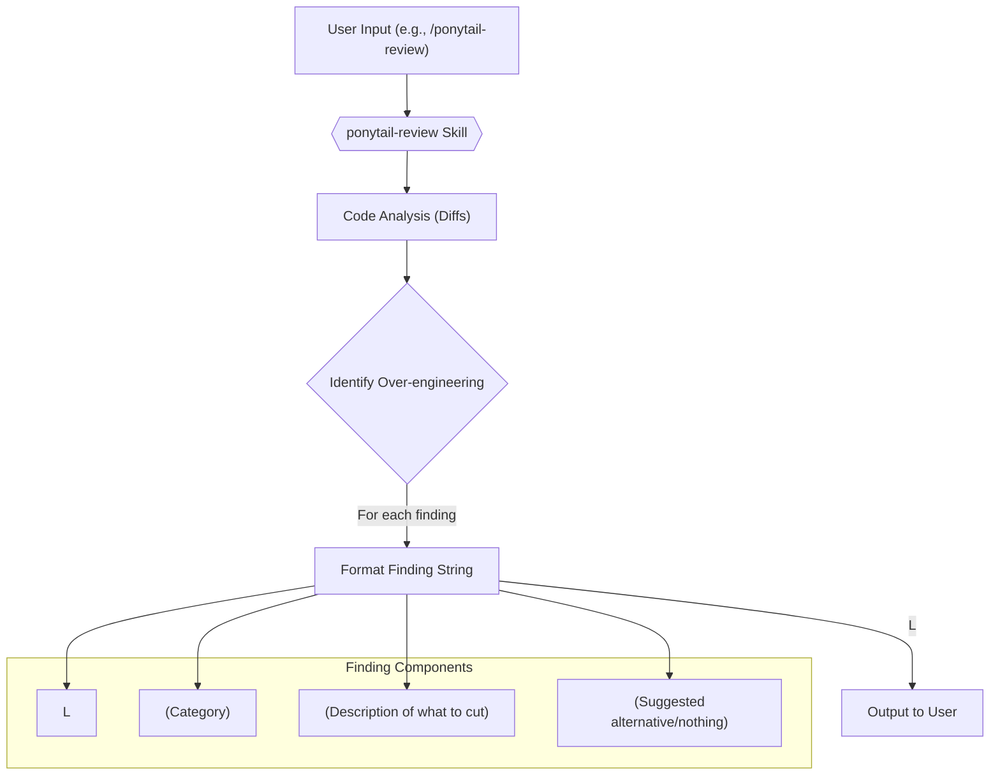
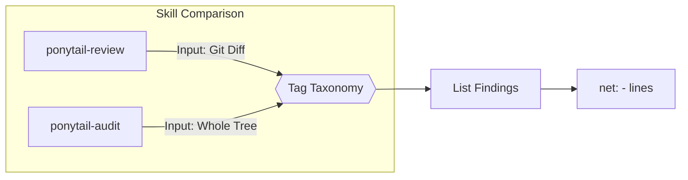

# ponytail-review Skill

Relevant source files

The following files were used as context for generating this wiki page:

- [.openclaw/skills/ponytail-audit/SKILL.md](.openclaw/skills/ponytail-audit/SKILL.md)
- [.openclaw/skills/ponytail-review/SKILL.md](.openclaw/skills/ponytail-review/SKILL.md)
- [.openclaw/skills/ponytail/SKILL.md](.openclaw/skills/ponytail/SKILL.md)
- [skills/ponytail-review/SKILL.md](skills/ponytail-review/SKILL.md)
- [tests/openclaw-skills.test.js](tests/openclaw-skills.test.js)

The `ponytail-review` skill is designed to perform a specialized code review focused exclusively on identifying and eliminating over-engineering. Its primary purpose is to find opportunities to simplify code by removing unnecessary complexity, dependencies, and abstractions. This skill complements traditional code reviews by specifically hunting for "what to delete" rather than correctness bugs or security vulnerabilities.

## Trigger Phrases and Command

Users can invoke the `ponytail-review` skill using natural language phrases or a dedicated command.

**Natural Language Triggers:**
*   "review for over-engineering"
*   "what can we delete"
*   "is this over-engineered"
*   "simplify review" [skills/ponytail-review/SKILL.md:7-9]()

**Command:**
*   `/ponytail-review`

The prompt associated with this command explicitly instructs the agent to focus on over-engineering, not correctness, and to follow the specified one-line finding format.

Sources:
*   [skills/ponytail-review/SKILL.md:4-9]()
*   [.openclaw/skills/ponytail-review/SKILL.md:2-3]()

## Finding Format

Each finding generated by the `ponytail-review` skill adheres to a strict one-line format to ensure conciseness and clarity.

`L<line>: <tag> <what>. <replacement>.` [skills/ponytail-review/SKILL.md:18]()

For multi-file diffs, the format includes the filename:

`<file>:L<line>: ...` [skills/ponytail-review/SKILL.md:18-19]()

This format ensures that each identified over-engineering instance is precisely located, categorized, and accompanied by a suggested resolution.

Sources:
*   [skills/ponytail-review/SKILL.md:16-19]()

### Finding Format Diagram

Sources:
*   [skills/ponytail-review/SKILL.md:17-19]()

## Tag Taxonomy

The `ponytail-review` skill uses a specific set of tags to categorize over-engineering findings. Each tag indicates a different type of unnecessary complexity and guides the suggested replacement.

| Tag | Description | Replacement |
| :--- | :--- | :--- |
| `delete:` | Dead code, unused flexibility, or speculative features. | `nothing` |
| `stdlib:` | Hand-rolled logic that the standard library already ships. | Name the function. |
| `native:` | Dependency or code doing what the platform already does. | Name the feature. |
| `yagni:` | Abstractions with one implementation, or layers with one caller. | Inline it. |
| `shrink:` | Same logic, but achievable in significantly fewer lines. | Shorter form. |

### `delete:`
This tag is used for dead code, unused flexibility, or speculative features that have no current use. The replacement is explicitly "nothing" [skills/ponytail-review/SKILL.md:23]().
*   **Example:** `L52-71: delete: retry wrapper around an idempotent local call. Nothing replaces it.` [skills/ponytail-review/SKILL.md:40]()

### `stdlib:`
Indicates that the code reinvents functionality already provided by the standard library. The replacement should name the standard library function [skills/ponytail-review/SKILL.md:24]().
*   **Example:** `L12-38: stdlib: 27-line validator class. "@" in email, 1 line, real validation is the confirmation mail.` [skills/ponytail-review/SKILL.md:34]()

### `native:`
Used when a dependency or custom code performs a task that the underlying platform (e.g., browser `<input type="date">`) can handle natively [skills/ponytail-review/SKILL.md:25]().
*   **Example:** `L4: native: moment.js imported for one format call. Intl.DateTimeFormat, 0 deps.` [skills/ponytail-review/SKILL.md:36]()

### `yagni:`
Stands for "You Ain't Gonna Need It." This applies to abstractions with only one implementation or config nobody sets [skills/ponytail-review/SKILL.md:26]().
*   **Example:** `repo.py:L88: yagni: AbstractRepository with one implementation. Inline it until a second one exists.` [skills/ponytail-review/SKILL.md:38]()

### `shrink:`
Identifies opportunities to achieve the same logic with fewer lines of code [skills/ponytail-review/SKILL.md:27]().
*   **Example:** `L30-44: shrink: manual loop builds dict. dict(zip(keys, values)), 1 line.` [skills/ponytail-review/SKILL.md:42]()

Sources:
*   [skills/ponytail-review/SKILL.md:21-27]()
*   [skills/ponytail-review/SKILL.md:34-43]()

## Scoring with Net Lines Metric

The ultimate metric for the `ponytail-review` skill is the net reduction in lines of code. After listing all findings, the skill concludes with a summary of the potential line savings:

`net: -<N> lines possible.` [skills/ponytail-review/SKILL.md:46]()

If no over-engineering is found, the skill outputs:

`Lean already. Ship.` [skills/ponytail-review/SKILL.md:48]()

Sources:
*   [skills/ponytail-review/SKILL.md:45-49]()

## Whole-Repo Audit (ponytail-audit)

While `ponytail-review` focuses on diffs, the `ponytail-audit` skill applies the same logic and tag taxonomy to the entire repository. It generates a ranked list of findings, placing the biggest potential cuts first [ .openclaw/skills/ponytail-audit/SKILL.md:8-9]().

Sources:
*   [.openclaw/skills/ponytail-audit/SKILL.md:8-11]()
*   [.openclaw/skills/ponytail-review/SKILL.md:8-12]()

## Boundaries

The `ponytail-review` skill has strict boundaries to maintain its focus on over-engineering.

*   **Scope:** It exclusively targets complexity. Correctness bugs, security holes, and performance are explicitly out of scope [skills/ponytail-review/SKILL.md:52-53]().
*   **Minimum Code:** Essential elements like a single smoke test or `assert`-based self-check are considered the "ponytail minimum" and are never flagged for deletion [skills/ponytail-review/SKILL.md:54-55]().
*   **Action:** The skill only lists findings; it does not apply fixes [skills/ponytail-review/SKILL.md:56]().
*   **Deactivation:** The skill can be deactivated by phrases like "stop ponytail-review" or "normal mode," which revert to a verbose review style [skills/ponytail-review/SKILL.md:57]().

Sources:
*   [skills/ponytail-review/SKILL.md:50-58]()
