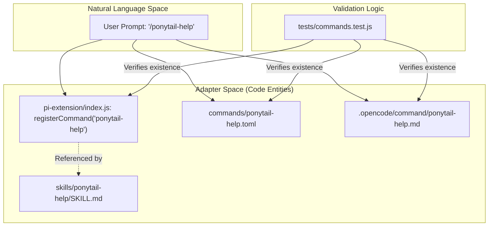
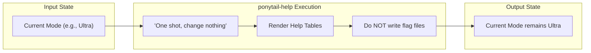

# ponytail-help Skill & Quick Reference

Relevant source files

The following files were used as context for generating this wiki page:

- [.opencode/command/ponytail-help.md](.opencode/command/ponytail-help.md)
- [README.md](README.md)
- [commands/ponytail-help.toml](commands/ponytail-help.toml)
- [docs/agent-portability.md](docs/agent-portability.md)
- [skills/ponytail-help/SKILL.md](skills/ponytail-help/SKILL.md)
- [tests/commands.test.js](tests/commands.test.js)

The `ponytail-help` skill provides a one-shot reference card for users and agents. Unlike the primary `ponytail` or `ponytail-review` skills, it is non-persistent; it displays a summary of available levels, skills, and commands without altering the current session state or writing to the file system [skills/ponytail-help/SKILL.md:9-13]().

## Trigger Phrases & Invocation

The skill is designed to be triggered by both explicit slash commands and natural language inquiries. It is registered across all major adapters to ensure the reference is always available [tests/commands.test.js:15-17]().

| Interface | Trigger Phrases |
| :--- | :--- |
| **Slash Commands** | `/ponytail-help`, `@ponytail-help` (Codex) |
| **Natural Language** | "ponytail help", "what ponytail commands", "how do I use ponytail" |

**Sources:** [skills/ponytail-help/SKILL.md:1-7](), [skills/ponytail-help/SKILL.md:33-35](), [tests/commands.test.js:2-6]()

## Reference Content

When triggered, the skill outputs three primary tables to orient the user.

### 1. Levels Reference
This table explains the intensity levels of the lazy development mode. These levels are persistent and "stick" until changed [skills/ponytail-help/SKILL.md:22-22]().

| Level | Trigger | Behavior |
| :--- | :--- | :--- |
| **Lite** | `/ponytail lite` | Build requested item; mention lazier alternative in one line. |
| **Full** | `/ponytail` | **Default.** Enforces "The Ladder": YAGNI → stdlib → native → one line → minimum. |
| **Ultra** | `/ponytail ultra` | YAGNI extremist. Prioritizes deletion; challenges requirements before building. |

**Sources:** [skills/ponytail-help/SKILL.md:16-20](), [commands/ponytail-help.toml:2-2]()

### 2. Skills Reference
This table documents the functional components of the Ponytail system. Note that `ponytail-audit`, `ponytail-debt`, and `ponytail-gain` are specialized utility skills [docs/agent-portability.md:36-40]().

| Skill | Trigger | Description |
| :--- | :--- | :--- |
| **ponytail** | `/ponytail` | Active lazy mode; focuses on the simplest working solution. |
| **ponytail-review** | `/ponytail-review` | Passive review mode; identifies over-engineering in existing code. |
| **ponytail-audit** | `/ponytail-audit` | Whole-repo over-engineering scan. |
| **ponytail-debt** | `/ponytail-debt` | Harvest `ponytail:` comments into a tracked ledger. |
| **ponytail-gain** | `/ponytail-gain` | Measured-impact scoreboard (LOC, cost, speed). |
| **ponytail-help** | `/ponytail-help` | Displays this reference card (one-shot). |

**Sources:** [skills/ponytail-help/SKILL.md:26-31](), [commands/ponytail-help.toml:2-2](), [docs/agent-portability.md:34-40]()

### 3. Deactivation
The skill informs the user that Ponytail can be deactivated by saying "stop ponytail", "normal mode", or using the command `/ponytail off` [skills/ponytail-help/SKILL.md:37-40]().

## Configuration & Default Mode

The `ponytail-help` skill documents how users can modify the system's behavior across sessions.

### Configuration Resolution Hierarchy
The system determines the `defaultMode` (the mode active at the start of a new session) using a specific priority order [skills/ponytail-help/SKILL.md:59-59]():

1.  **Environment Variable**: `PONYTAIL_DEFAULT_MODE` [skills/ponytail-help/SKILL.md:46-49]().
2.  **Config File**: A JSON file containing `{"defaultMode": "..."}` [skills/ponytail-help/SKILL.md:51-53]().
3.  **Hardcoded Default**: `full` [skills/ponytail-help/SKILL.md:44-44]().

### Configuration Locations
The configuration file location varies by platform:

| Platform | Path |
| :--- | :--- |
| **macOS / Linux** | `~/.config/ponytail/config.json` |
| **Windows** | `%APPDATA%\ponytail\config.json` |

**Sources:** [skills/ponytail-help/SKILL.md:51-53](), [commands/ponytail-help.toml:2-2]()

## Implementation Detail

The `ponytail-help` skill is implemented as a set of static instruction files across different host formats to ensure consistent behavior without requiring complex logic.

### Command Distribution & Consistency
To prevent "rule drift," the repository includes a test suite that ensures every command registered in the `pi-extension` also exists as a `.toml` (Claude/Gemini) and `.md` (OpenCode) command file [tests/commands.test.js:2-6]().

Title: Command Distribution Architecture

**Sources:** [tests/commands.test.js:15-39](), [commands/ponytail-help.toml:1-3](), [.opencode/command/ponytail-help.md:1-5]()

### One-Shot Constraint Logic
The implementation explicitly instructs the LLM to maintain "one-shot" behavior, preventing the agent from accidentally switching modes when the user only requested information.

Title: One-Shot Execution Flow

**Sources:** [skills/ponytail-help/SKILL.md:11-12](), [commands/ponytail-help.toml:2-2](), [.opencode/command/ponytail-help.md:5-5]()

## Update Mechanism
The help card also documents the update procedure for Claude Code, advising users to enable `auto-update` in the `/plugin` marketplace settings or manually trigger an update via `/plugin marketplace update ponytail` followed by `/reload-plugins` [skills/ponytail-help/SKILL.md:61-65]().

**Sources:** [skills/ponytail-help/SKILL.md:61-66]()
