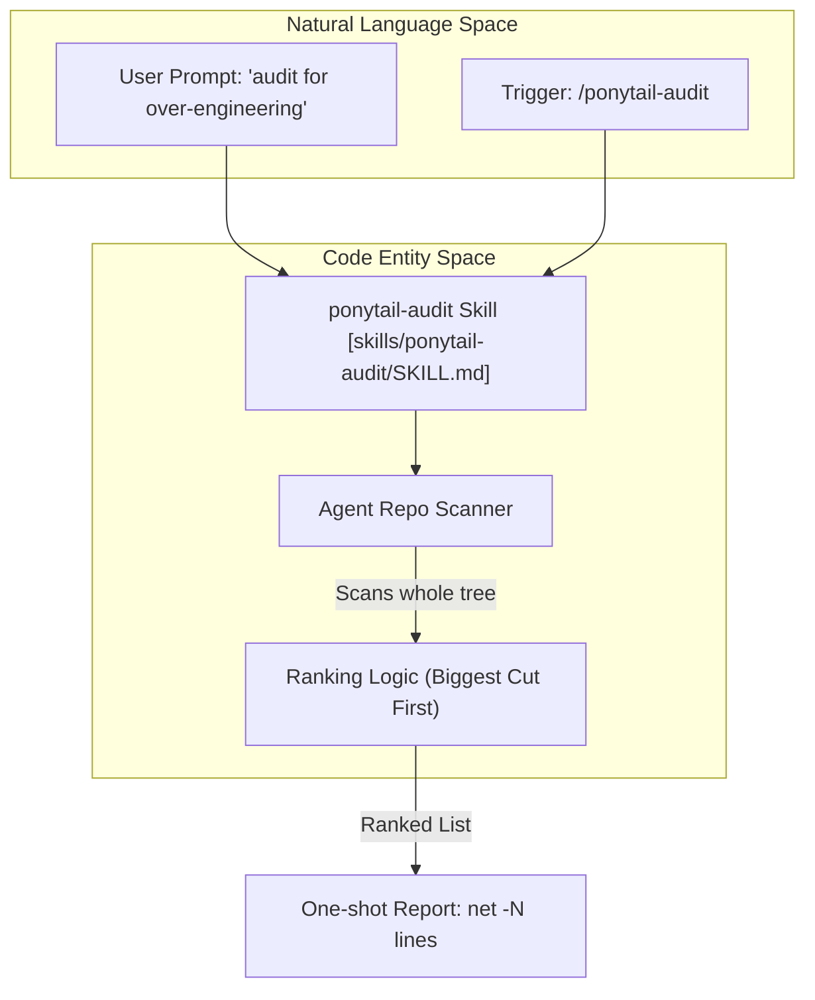
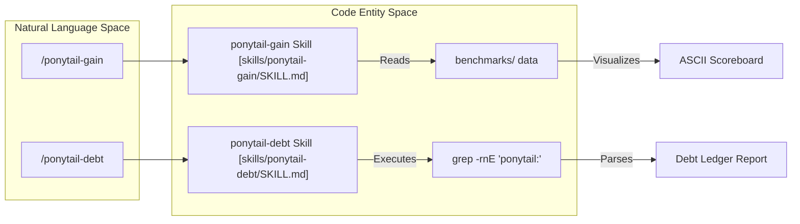

# ponytail-audit, ponytail-debt & ponytail-gain Skills

Relevant source files

The following files were used as context for generating this wiki page:

- [.openclaw/skills/ponytail-debt/SKILL.md](.openclaw/skills/ponytail-debt/SKILL.md)
- [.openclaw/skills/ponytail-gain/SKILL.md](.openclaw/skills/ponytail-gain/SKILL.md)
- [.openclaw/skills/ponytail-help/SKILL.md](.openclaw/skills/ponytail-help/SKILL.md)
- [.opencode/command/ponytail-audit.md](.opencode/command/ponytail-audit.md)
- [.opencode/command/ponytail-debt.md](.opencode/command/ponytail-debt.md)
- [.opencode/command/ponytail-gain.md](.opencode/command/ponytail-gain.md)
- [commands/ponytail-audit.toml](commands/ponytail-audit.toml)
- [commands/ponytail-debt.toml](commands/ponytail-debt.toml)
- [commands/ponytail-gain.toml](commands/ponytail-gain.toml)
- [scripts/build-openclaw-skills.js](scripts/build-openclaw-skills.js)
- [skills/ponytail-audit/SKILL.md](skills/ponytail-audit/SKILL.md)
- [skills/ponytail-debt/SKILL.md](skills/ponytail-debt/SKILL.md)
- [skills/ponytail-gain/SKILL.md](skills/ponytail-gain/SKILL.md)

This page documents the three utility skills within the Ponytail ecosystem: `ponytail-audit`, `ponytail-debt`, and `ponytail-gain`. Unlike the core `ponytail` skill which modifies behavior during active development, these utilities provide one-shot analysis, tracking, and benchmarking of the codebase's complexity and the impact of the Ponytail philosophy.

## 1. ponytail-audit: Whole-Repo Complexity Scan

The `ponytail-audit` skill is a repository-wide extension of the `ponytail-review` logic. Instead of focusing on a specific diff, it scans the entire tree to identify existing over-engineering, bloat, and redundant abstractions [skills/ponytail-audit/SKILL.md:4-9]().

### Implementation Logic
The agent is instructed to hunt for specific "bloat" patterns including single-implementation interfaces, factories with only one product, wrappers that merely delegate, and hand-rolled versions of standard library functions [skills/ponytail-audit/SKILL.md:25-30](). Findings are ranked by impact, with the largest potential code reductions listed first [skills/ponytail-audit/SKILL.md:12-13]().

### Tag Taxonomy & Output
Findings must follow a strict one-line format: `<tag> <what to cut>. <replacement>. [path]` [skills/ponytail-audit/SKILL.md:31-33]().

| Tag | Target | Replacement Requirement |
| :--- | :--- | :--- |
| `delete:` | Dead code or speculative features | None (remove entirely) |
| `stdlib:` | Logic available in the standard library | Name of the specific stdlib function |
| `native:` | Dependencies replaceable by platform features | Name of the native feature (e.g., `<dialog>`) |
| `yagni:` | Unnecessary abstractions/layers | Simplified/inlined implementation |
| `shrink:` | Verbose logic | Shorter, equivalent form |

**Sources:** [skills/ponytail-audit/SKILL.md:15-23](), [commands/ponytail-audit.toml:2-2]()

### Technical Data Flow: Audit Process

**Sources:** [skills/ponytail-audit/SKILL.md:1-13](), [commands/ponytail-audit.toml:1-3]()

---

## 2. ponytail-debt: The Shortcut Ledger

The `ponytail-debt` skill harvests `ponytail:` comments from the codebase into a structured ledger. This prevents deliberate shortcuts taken during "Lite" or "Full" modes from being forgotten [skills/ponytail-debt/SKILL.md:4-8]().

### Implementation & Scan Mechanism
The skill relies on a standardized comment convention: `ponytail: <ceiling>, <upgrade path>`. It uses `grep` to find these markers while explicitly excluding non-source directories like `node_modules`, `.git`, and build outputs [skills/ponytail-debt/SKILL.md:14-20]().

*   **Command:** `grep -rnE '(#|//) ?ponytail:' .` [skills/ponytail-debt/SKILL.md:17-17]()
*   **Rot Detection:** Any comment lacking a clear upgrade path or trigger is tagged as `no-trigger`, highlighting a high risk of "silent rot" [skills/ponytail-debt/SKILL.md:32-34]().

### Output Format
The ledger is grouped by file in the following format:
`<file>:<line>, <what was simplified>. ceiling: <limit>. upgrade: <trigger>.` [skills/ponytail-debt/SKILL.md:25-29]().

**Sources:** [skills/ponytail-debt/SKILL.md:1-44](), [.opencode/command/ponytail-debt.md:1-6]()

---

## 3. ponytail-gain: Impact Scoreboard

The `ponytail-gain` skill provides a one-shot ASCII scoreboard showing the measured impact of the Ponytail philosophy based on published benchmark medians [skills/ponytail-gain/SKILL.md:3-8]().

### Honesty Boundary
A critical constraint of this skill is the "Honesty Boundary": the agent must **never** invent per-repo savings numbers. Since the "unbuilt" (over-engineered) version of the current repo was never written, there is no baseline for comparison. Instead, it displays medians from the `benchmarks/` directory [skills/ponytail-gain/SKILL.md:38-45]().

### Scoreboard Data (Benchmark Medians)
The scoreboard visualizes performance across five tasks (email, debounce, csv-sum, countdown, rate-limit) and three models (Haiku, Sonnet, Opus) [skills/ponytail-gain/SKILL.md:16-19]().

| Metric | Baseline | Ponytail Performance |
| :--- | :--- | :--- |
| **Lines of Code** | 100% | 6–20% (▼ 80–94%) |
| **Cost** | 100% | 23–53% (▼ 47–77%) |
| **Speed** | 1x | 3–6× faster |

**Sources:** [skills/ponytail-gain/SKILL.md:21-34](), [commands/ponytail-gain.toml:2-2]()

### Technical Data Flow: Gain & Debt Relationship

**Sources:** [skills/ponytail-gain/SKILL.md:1-51](), [skills/ponytail-debt/SKILL.md:1-44](), [commands/ponytail-gain.toml:1-3]()

---

## 4. Cross-Platform Command Distribution

These skills are distributed across multiple platforms using specific manifest formats to ensure consistent behavior.

*   **Claude Code / Gemini CLI:** Uses `.toml` files in the `commands/` directory [commands/ponytail-audit.toml:1-3]().
*   **OpenCode:** Uses `.md` files with frontmatter in `.opencode/command/` [.opencode/command/ponytail-debt.md:1-6]().
*   **OpenClaw:** Uses `SKILL.md` files generated by `scripts/build-openclaw-skills.js`, which enforces a 160-character description limit for marketplace compatibility [scripts/build-openclaw-skills.js:19-26]().

### Summary Table: Trigger Phrases

| Skill | Primary Triggers |
| :--- | :--- |
| **ponytail-audit** | `/ponytail-audit`, "audit this codebase", "find bloat" |
| **ponytail-debt** | `/ponytail-debt`, "what did ponytail defer", "ponytail ledger" |
| **ponytail-gain** | `/ponytail-gain`, "ponytail scoreboard", "what does ponytail save" |

**Sources:** [skills/ponytail-audit/SKILL.md:4-9](), [skills/ponytail-debt/SKILL.md:6-8](), [skills/ponytail-gain/SKILL.md:6-8]()
