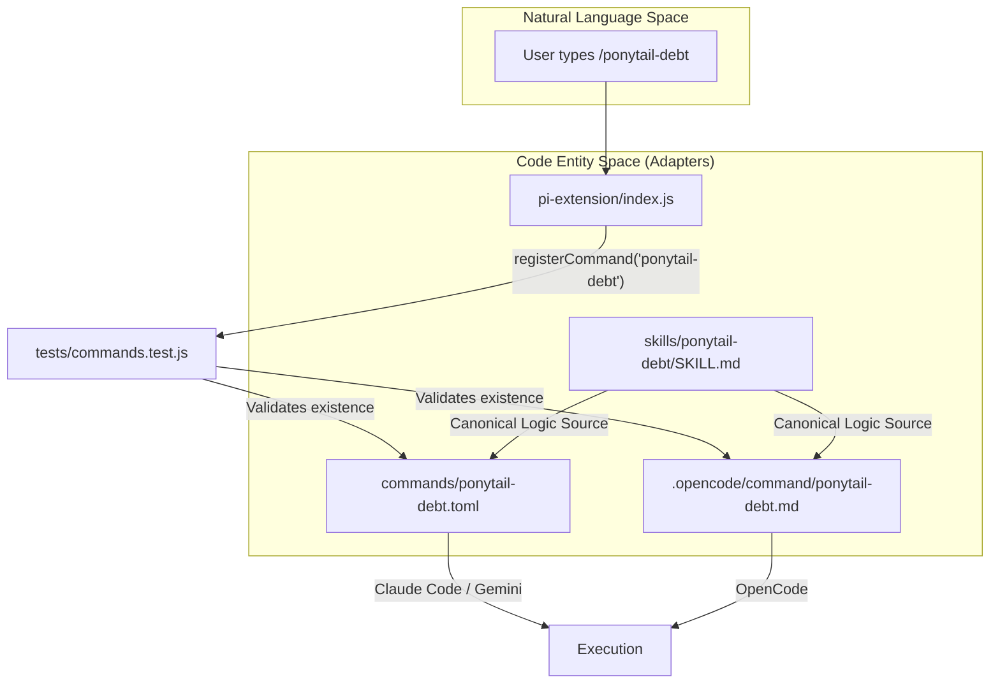
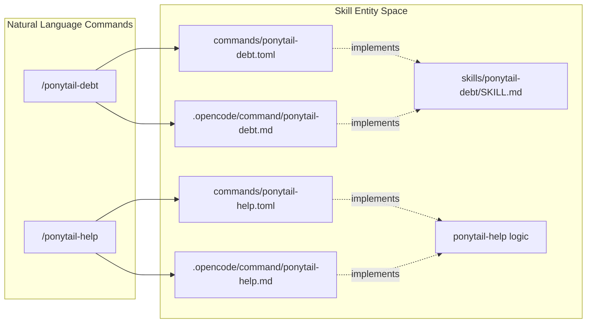

# Command Distribution (TOML & OpenCode MD)

<details>
<summary>Relevant source files</summary>

The following files were used as context for generating this wiki page:

- [.opencode/command/ponytail-debt.md](.opencode/command/ponytail-debt.md)
- [.opencode/command/ponytail-help.md](.opencode/command/ponytail-help.md)
- [.opencode/command/ponytail-review.md](.opencode/command/ponytail-review.md)
- [.opencode/command/ponytail.md](.opencode/command/ponytail.md)
- [commands/ponytail-debt.toml](commands/ponytail-debt.toml)
- [commands/ponytail-gain.toml](commands/ponytail-gain.toml)
- [commands/ponytail-help.toml](commands/ponytail-help.toml)
- [commands/ponytail-review.toml](commands/ponytail-review.toml)
- [commands/ponytail.toml](commands/ponytail.toml)
- [skills/ponytail-debt/SKILL.md](skills/ponytail-debt/SKILL.md)
- [tests/commands.test.js](tests/commands.test.js)

</details>


This page describes the distribution mechanism for Ponytail's skill set across file-based command interfaces. While some hosts use programmatic extensions, others like **Claude Code**, **Gemini CLI**, and **OpenCode** require static file definitions to register slash commands. Ponytail maintains a synchronized set of these files to ensure a consistent experience across all AI agent environments.

## Overview of Distribution Formats

Ponytail skills are exposed via two primary file formats to accommodate different agent host requirements:

1.  **TOML (`commands/*.toml`)**: Used by **Claude Code** and the **Gemini CLI**. These files define the command description and the system prompt (instruction) that the agent should follow when the command is invoked.
2.  **Markdown (`.opencode/command/*.md`)**: Used by **OpenCode**. These files use YAML frontmatter for metadata and the Markdown body for the command's core logic.

### Command Mapping Table

| Command | Purpose | Claude/Gemini File | OpenCode File |
| :--- | :--- | :--- | :--- |
| `/ponytail` | Switch intensity levels | `commands/ponytail.toml` | `.opencode/command/ponytail.md` |
| `/ponytail-review` | Over-engineering review | `commands/ponytail-review.toml` | `.opencode/command/ponytail-review.md` |
| `/ponytail-help` | Quick reference card | `commands/ponytail-help.toml` | `.opencode/command/ponytail-help.md` |
| `/ponytail-debt` | Harvest `ponytail:` comments | `commands/ponytail-debt.toml` | `.opencode/command/ponytail-debt.md` |
| `/ponytail-audit` | Whole-repo audit | `commands/ponytail-audit.toml` | `.opencode/command/ponytail-audit.md` |
| `/ponytail-gain` | Measured impact scoreboard | `commands/ponytail-gain.toml` | `.opencode/command/ponytail-gain.md` |

**Sources:**
- [tests/commands.test.js:2-6]()
- [commands/ponytail.toml:1-2]()
- [.opencode/command/ponytail.md:1-5]()

---

## Implementation Details

### Claude Code & Gemini CLI (TOML)
In the `commands/*.toml` format, the `prompt` field contains the specific instructions for the agent. For the main `/ponytail` command, it supports dynamic arguments via the `{{args}}` placeholder.

**Example: `commands/ponytail.toml`**
```toml
description = "Switch ponytail intensity level (lite/full/ultra/off)"
prompt = "Switch to ponytail {{args}} mode. If no level specified, use full. ..."
```
**Sources:**
- [commands/ponytail.toml:1-2]()
- [commands/ponytail-help.toml:1-2]()

### OpenCode (Markdown)
OpenCode utilizes a `.md` file structure where the description is stored in YAML frontmatter and the execution instructions reside in the body. It uses `$ARGUMENTS` for parameter passing.

**Example: `.opencode/command/ponytail.md`**
```markdown
---
description: Switch ponytail intensity level (lite/full/ultra/off)
---

Switch to ponytail $ARGUMENTS mode. ...
```
**Sources:**
- [.opencode/command/ponytail.md:1-5]()
- [.opencode/command/ponytail-debt.md:1-5]()

---

## Data Flow: Command Registration to File Execution

The following diagram illustrates how commands defined in the "Natural Language Space" (the user's intent) are mapped to "Code Entity Space" (the specific adapter files) across different host environments.

**Command Distribution Flow**

**Sources:**
- [tests/commands.test.js:15-17]()
- [pi-extension/index.js:1-100]() (referenced via [tests/commands.test.js:16]())
- [skills/ponytail-debt/SKILL.md:1-9]()

---

## The Drift Guard: `commands.test.js`

To prevent "command drift"—where a command is registered in the programmatic `pi-extension` but missing its corresponding file-based adapter—Ponytail uses a mandatory test suite in `tests/commands.test.js`.

### Key Functions and Logic
1.  **Command Extraction**: The test reads `pi-extension/index.js` and uses a regular expression to find all instances of `registerCommand`.
2.  **Validation Loop**: For every command name found, it asserts that:
    *   A `.toml` file exists in the `commands/` directory.
    *   A `.md` file exists in the `.opencode/command/` directory.

**Implementation in `tests/commands.test.js`**:
```javascript
const piSource = fs.readFileSync(path.join(root, 'pi-extension', 'index.js'), 'utf8');
const commands = [...piSource.matchAll(/registerCommand\(["']([\w-]+)["']/g)].map((m) => m[1]);

test('every registered command ships a Claude commands/*.toml', () => {
  for (const name of commands) {
    assert.ok(fs.existsSync(path.join(root, 'commands', `${name}.toml`)));
  }
});
```

**Sources:**
- [tests/commands.test.js:15-18]()
- [tests/commands.test.js:23-30]()
- [tests/commands.test.js:32-39]()

---

## Skill Logic Synchronization

While the adapter files provide the entry point for hosts, the core logic is derived from the canonical `skills/` directory.

**Logic Mapping: Natural Language to Skill Entities**


### Example: `ponytail-debt` Logic Distribution
The logic for harvesting debt involves grepping for `ponytail:` markers. This logic is defined in `skills/ponytail-debt/SKILL.md` and replicated in the distribution files.

*   **Logic Source**: `grep -rnE '(#|//) ?ponytail:' .` [skills/ponytail-debt/SKILL.md:20]()
*   **Claude Adapter**: `prompt = "Harvest every ponytail: comment... Grep the whole tree..."` [commands/ponytail-debt.toml:2]()
*   **OpenCode Adapter**: `Grep the whole tree for comment markers...` [.opencode/command/ponytail-debt.md:5]()

**Sources:**
- [skills/ponytail-debt/SKILL.md:15-23]()
- [commands/ponytail-debt.toml:1-3]()
- [.opencode/command/ponytail-debt.md:1-6]()
