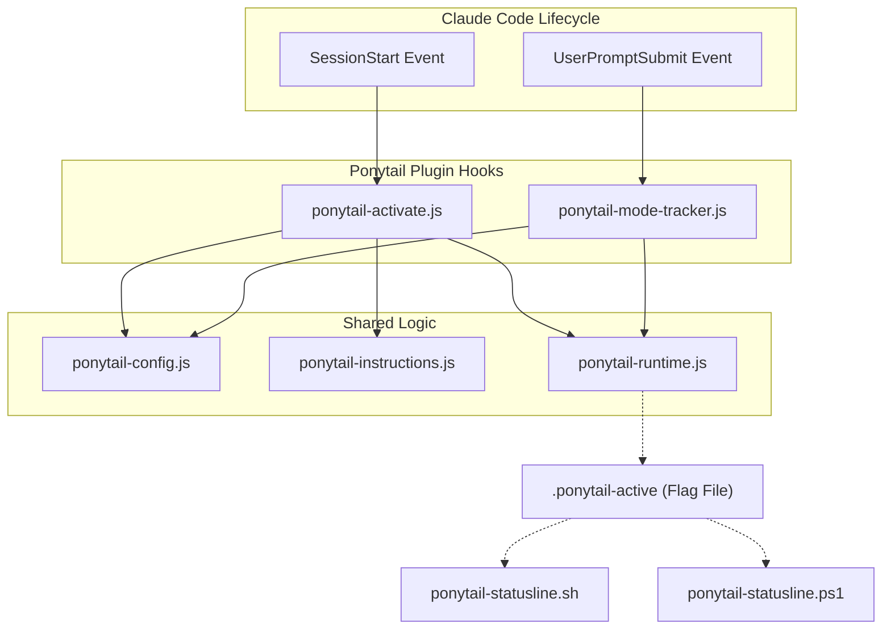
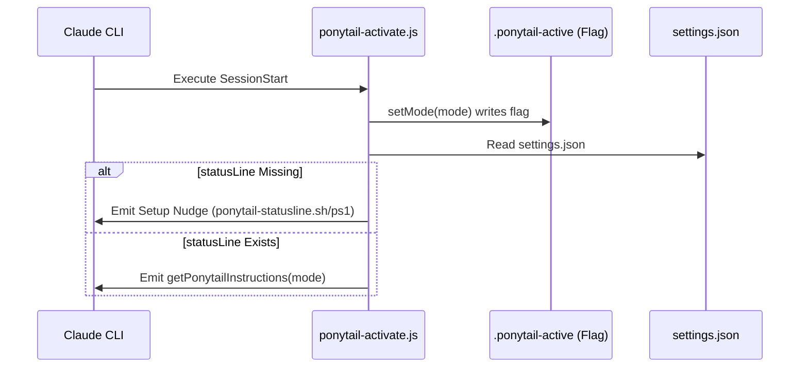

# Claude Code Plugin

Relevant source files

The following files were used as context for generating this wiki page:

- [.agents/plugins/marketplace.json](.agents/plugins/marketplace.json)
- [.claude-plugin/plugin.json](.claude-plugin/plugin.json)
- [.codex-plugin/plugin.json](.codex-plugin/plugin.json)
- [gemini-extension.json](gemini-extension.json)
- [hooks/ponytail-activate.js](hooks/ponytail-activate.js)
- [hooks/ponytail-config.js](hooks/ponytail-config.js)
- [hooks/ponytail-mode-tracker.js](hooks/ponytail-mode-tracker.js)
- [hooks/ponytail-statusline.ps1](hooks/ponytail-statusline.ps1)
- [hooks/ponytail-statusline.sh](hooks/ponytail-statusline.sh)
- [tests/hooks.test.js](tests/hooks.test.js)

The Claude Code plugin integration enables Ponytail to function as a first-class extension within the Claude Code CLI environment. It leverages lifecycle hooks to inject the Ponytail ruleset, track active modes across turns, and provide visual feedback via a statusline badge.

The plugin is architected to be lightweight, adhering to strict execution constraints to ensure the developer experience remains fluid.

### Plugin Architecture Overview

The integration bridges the gap between the user's natural language prompts and the underlying Ponytail ruleset by intercepting session events.

Sources: [.claude-plugin/plugin.json:1-10](), [hooks/ponytail-activate.js:1-19](), [hooks/ponytail-mode-tracker.js:1-6]()

---

### 3.1 Plugin Manifest & Lifecycle Hooks

The plugin's behavior is defined in `.claude-plugin/plugin.json` (and its Codex/marketplace equivalents). These manifests register Node.js scripts to specific lifecycle events:

*   **SessionStart**: Triggers `ponytail-activate.js`. This hook is responsible for initial state setup, writing the active mode flag, and injecting the Ponytail instructions into the session context via `getPonytailInstructions`. [hooks/ponytail-activate.js:42-42]()
*   **UserPromptSubmit**: Triggers `ponytail-mode-tracker.js`. This hook monitors user input for commands like `/ponytail off` or `/ponytail ultra` to dynamically update the session's intensity level by calling `setMode`. [hooks/ponytail-mode-tracker.js:35-35]()

The plugin also supports a `marketplace.json` format for broader agent distribution. [.agents/plugins/marketplace.json:1-21]()

For details, see [Plugin Manifest & Lifecycle Hooks](#3.1) (Child Page).

Sources: [.claude-plugin/plugin.json:1-10](), [hooks/ponytail-activate.js:1-7](), [hooks/ponytail-mode-tracker.js:1-4]()

---

### 3.2 Hook Internals: Runtime, Config & Instructions

The logic driving the hooks is modularized into three primary components:

| Module | Responsibility |
| :--- | :--- |
| `ponytail-runtime.js` | Manages the I/O for the state file (`.ponytail-active`) and handles environment detection (e.g., `isCodex`, `isCopilot`). [hooks/ponytail-activate.js:13-19]() |
| `ponytail-config.js` | Resolves the active mode (e.g., `lite`, `full`, `ultra`) based on `PONYTAIL_DEFAULT_MODE` or configuration files. [hooks/ponytail-config.js:4-10]() |
| `ponytail-instructions.js` | Filters and returns the specific Markdown ruleset corresponding to the active mode. [hooks/ponytail-activate.js:12-12]() |

These modules ensure that the "Natural Language Space" (user commands) is correctly mapped to the "Code Entity Space" (state files and filtered instruction strings).

For details, see [Hook Internals: Runtime, Config & Instructions](#3.2) (Child Page).

Sources: [hooks/ponytail-config.js:1-122](), [hooks/ponytail-activate.js:11-19](), [hooks/ponytail-activate.js:41-42]()

---

### 3.3 Statusline Integration

To provide immediate feedback on whether Ponytail is active, the plugin supports a custom statusline badge.

1.  **Flag File**: The `ponytail-activate.js` script calls `setMode(mode)` to write a hidden flag file at `$CLAUDE_CONFIG_DIR/.ponytail-active` (defaulting to `~/.claude/.ponytail-active`). [hooks/ponytail-activate.js:34-39]()
2.  **Statusline Scripts**: Platform-specific scripts (`ponytail-statusline.sh` for Unix and `ponytail-statusline.ps1` for Windows) read this flag file and output an ANSI-colored badge. [hooks/ponytail-statusline.sh:1-13](), [hooks/ponytail-statusline.ps1:1-21]()
3.  **Setup Nudge**: If the `statusLine` is not configured in `settings.json`, `ponytail-activate.js` detects this and appends a setup nudge to the agent's instructions, using `isShellSafe` to ensure the path is safe for shell embedding. [hooks/ponytail-activate.js:45-82]()

For details, see [Statusline Integration](#3.3) (Child Page).

Sources: [hooks/ponytail-activate.js:33-82](), [hooks/ponytail-statusline.sh:3-4](), [hooks/ponytail-statusline.ps1:2-3](), [hooks/ponytail-config.js:50-52]()
