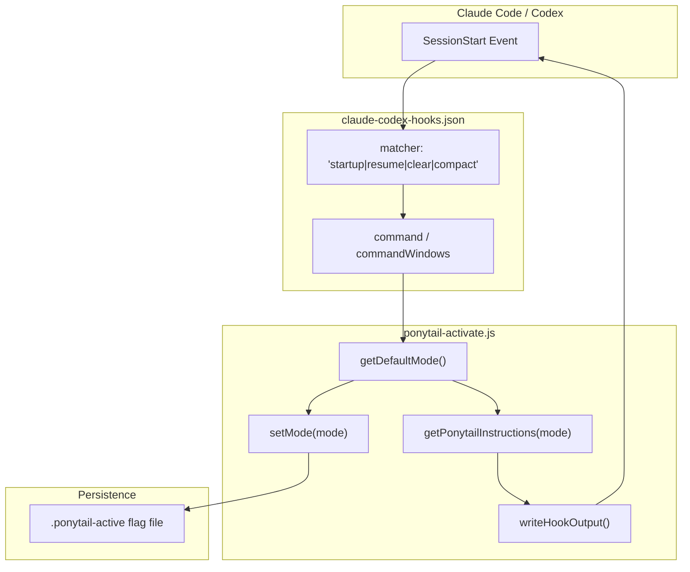
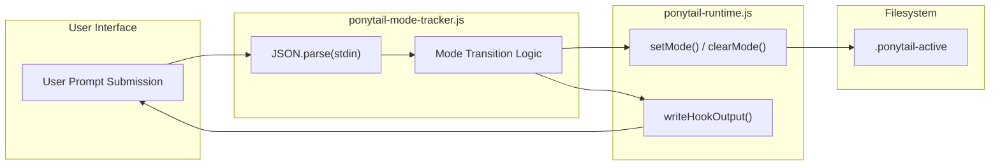

# Plugin Manifest & Lifecycle Hooks

Relevant source files

The following files were used as context for generating this wiki page:

- [.claude-plugin/marketplace.json](.claude-plugin/marketplace.json)
- [.claude-plugin/plugin.json](.claude-plugin/plugin.json)
- [.codex-plugin/plugin.json](.codex-plugin/plugin.json)
- [gemini-extension.json](gemini-extension.json)
- [hooks/claude-codex-hooks.json](hooks/claude-codex-hooks.json)
- [tests/gemini-extension.test.js](tests/gemini-extension.test.js)
- [tests/hooks-windows.test.js](tests/hooks-windows.test.js)

This page details the integration of Ponytail into Claude Code and Codex via plugin manifests and lifecycle hooks. It covers how the plugin initializes, tracks mode changes across user prompts, and provides feedback to the host agent.

## The Plugin Manifest

The core of the Claude Code integration is defined in `.claude-plugin/plugin.json`. This file registers the plugin's identity and attaches Node.js scripts to specific lifecycle events within the Claude Code environment.

### Manifest Structure
The manifest defines two primary hook points: `SessionStart` and `UserPromptSubmit`. Each hook is configured as a `command` type, executing a Node.js script with a strict 5-second timeout.

| Property | Description | Value/Constraint |
| :--- | :--- | :--- |
| `name` | Plugin identifier | `ponytail` [ .claude-plugin/plugin.json:2-2 ]() |
| `version` | Pinned semantic version | `4.7.0` [ .claude-plugin/plugin.json:3-3 ]() |
| `hooks` | Path to hook configuration | `./hooks/claude-codex-hooks.json` [ .claude-plugin/plugin.json:9-9 ]() |

### Shared Hook Configuration (`claude-codex-hooks.json`)
For Claude Code and Codex environments, Ponytail uses a shared `hooks/claude-codex-hooks.json` file. This manifest includes cross-platform command paths and specific session matchers (e.g., `startup`, `resume`, `clear`, `compact`) to ensure the activation hook runs reliably across different session states.

| Hook Event | Matcher | Script |
| :--- | :--- | :--- |
| `SessionStart` | `startup\|resume\|clear\|compact` | `ponytail-activate.js` [ hooks/claude-codex-hooks.json:3-15 ]() |
| `UserPromptSubmit` | N/A | `ponytail-mode-tracker.js` [ hooks/claude-codex-hooks.json:17-29 ]() |

**Sources:**
- [ .claude-plugin/plugin.json:1-10 ]()
- [ hooks/claude-codex-hooks.json:1-31 ]()
- [ .codex-plugin/plugin.json:1-32 ]()

---

## SessionStart Hook (`ponytail-activate.js`)

The `ponytail-activate.js` script is the entry point for the plugin. Its primary responsibility is to bootstrap the Ponytail environment when a new session begins.

### Implementation Details
1.  **Platform Compatibility**: The hook configuration uses shell logic to detect `node` availability and environment variables like `CLAUDE_PLUGIN_ROOT` (Unix) or `$env:CLAUDE_PLUGIN_ROOT` (Windows/PowerShell) to locate scripts [ hooks/claude-codex-hooks.json:9-10 ]().
2.  **Mode Resolution**: It determines the initial intensity level (lite, full, ultra, or off).
3.  **State Initialization**: If active, it updates the global state via a flag file.
4.  **Instruction Injection**: It fetches the relevant ruleset and emits it to the host agent as hidden context.
5.  **Statusline Nudge**: It checks for the existence of `statusLine` configuration in `~/.claude/settings.json`. If missing, it prompts the agent to help the user configure the statusline badge.

### Diagram: Session Activation Flow
This diagram maps the natural language "Session Start" event to the specific code entities involved in bootstrapping the plugin.

**Sources:**
- [ hooks/claude-codex-hooks.json:3-15 ]()
- [ tests/hooks-windows.test.js:33-41 ]()

---

## UserPromptSubmit Hook (`ponytail-mode-tracker.js`)

The `ponytail-mode-tracker.js` script acts as an observer for every message sent by the user. It intercepts the input to detect mode-switch commands before the LLM processes the prompt.

### Logic and Execution
*   **Trigger Detection**: The tracker scans user input for commands like `/ponytail` or intensity levels.
*   **Timeout Constraints**: Like all hooks, it must complete within 5 seconds [ hooks/claude-codex-hooks.json:24-24 ]().
*   **Platform Handling**: On Windows, it is invoked via PowerShell, requiring `$env:` syntax for environment variables to avoid path resolution failures [ tests/hooks-windows.test.js:2-6 ]().

### Diagram: Mode Tracking & State Updates
This diagram illustrates how user input flows through the tracker to update the persistent state.

**Sources:**
- [ hooks/claude-codex-hooks.json:17-30 ]()
- [ tests/hooks-windows.test.js:33-41 ]()

---

## Multi-Platform Manifests

Ponytail maintains multiple manifests to support different agent hosts while reusing the core logic.

### Gemini Extension (`gemini-extension.json`)
The Gemini adapter is a thin manifest that reuses `AGENTS.md` for context and `commands/*.toml` for skill registration [ tests/gemini-extension.test.js:2-7 ]().
*   **Pinned Version**: Must match other manifests (e.g., `.claude-plugin/plugin.json`) to prevent supply-chain issues [ tests/gemini-extension.test.js:17-24 ]().
*   **Context Injection**: Uses `contextFileName: "AGENTS.md"` to ensure rules load every session [ gemini-extension.json:5-5 ]().

### Codex Plugin (`.codex-plugin/plugin.json`)
The Codex manifest is more descriptive, including metadata for a marketplace interface:
*   **Capabilities**: Explicitly lists `Instructions` and `Lifecycle hooks` [ .codex-plugin/plugin.json:21-21 ]().
*   **Skills Path**: Points to the `./skills/` directory for discovery [ .codex-plugin/plugin.json:13-13 ]().
*   **Hook Redirection**: Like Claude Code, it points to `hooks/claude-codex-hooks.json` [ .codex-plugin/plugin.json:14-14 ]().

**Sources:**
- [ gemini-extension.json:1-6 ]()
- [ .codex-plugin/plugin.json:1-32 ]()
- [ tests/gemini-extension.test.js:58-68 ]()

---

## Reliability & Constraints

### Windows Regression Guard
To prevent regressions on Windows (Issue #19), all `commandWindows` entries in the hook manifest must use PowerShell `$env:VAR` syntax rather than `cmd.exe` `%VAR%` syntax [ tests/hooks-windows.test.js:33-41 ]().

### Version Alignment
A smoke test ensures that versions across `.claude-plugin/plugin.json`, `.codex-plugin/plugin.json`, `.github/plugin/plugin.json`, and `gemini-extension.json` remain synchronized [ tests/gemini-extension.test.js:58-68 ]().

**Sources:**
- [ tests/hooks-windows.test.js:1-12 ]()
- [ tests/gemini-extension.test.js:19-24 ]()
