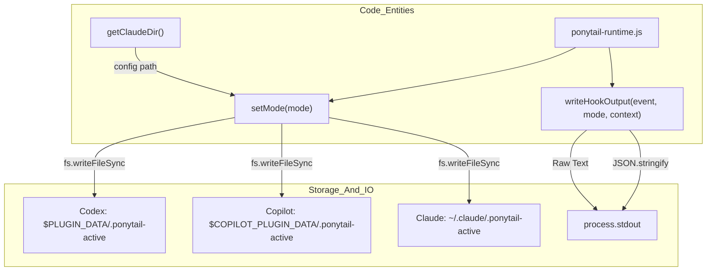
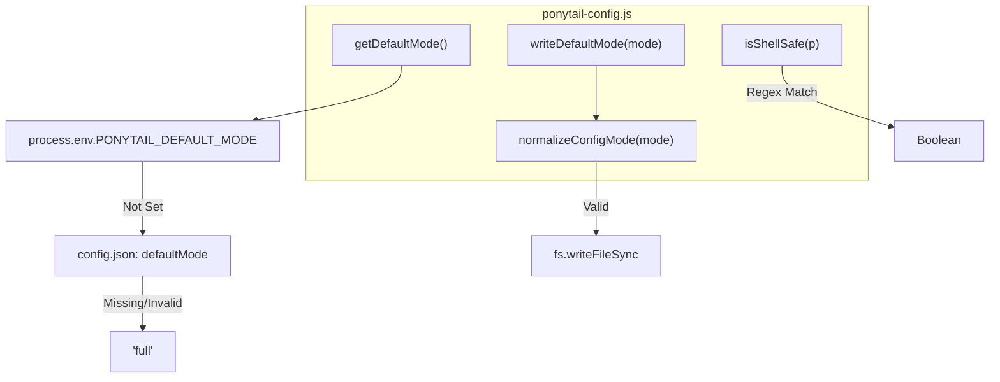
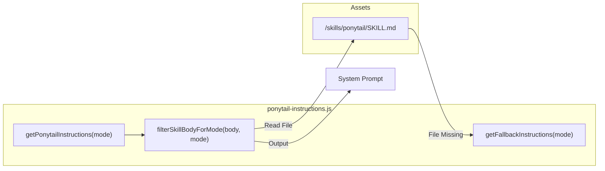

# Hook Internals: Runtime, Config & Instructions

Relevant source files

The following files were used as context for generating this wiki page:

- [.agents/plugins/marketplace.json](.agents/plugins/marketplace.json)
- [.github/plugin/marketplace.json](.github/plugin/marketplace.json)
- [hooks/copilot-hooks.json](hooks/copilot-hooks.json)
- [hooks/ponytail-config.js](hooks/ponytail-config.js)
- [hooks/ponytail-instructions.js](hooks/ponytail-instructions.js)
- [hooks/ponytail-mode-tracker.js](hooks/ponytail-mode-tracker.js)
- [hooks/ponytail-runtime.js](hooks/ponytail-runtime.js)
- [pi-extension/package.json](pi-extension/package.json)
- [pi-extension/test/helpers.test.js](pi-extension/test/helpers.test.js)
- [tests/copilot-plugin.test.js](tests/copilot-plugin.test.js)
- [tests/hooks.test.js](tests/hooks.test.js)

This page provides a deep technical dive into the Node.js modules that power the Ponytail hook system. These modules handle state persistence, cross-platform configuration resolution, and the dynamic filtering of instructions based on the active intensity level.

## Runtime State & Environment Detection

The `ponytail-runtime.js` module serves as the execution layer for hooks, managing how Ponytail detects its host environment (Claude Code, Codex, or Copilot) and how it persists the active session mode.

### Environment Detection
Ponytail distinguishes between standard environments, Codex, and Copilot by checking specific environment variables [[hooks/ponytail-runtime.js:6-7]](). This detection determines where the state file is stored and how output is communicated back to the host.

### State Persistence
The active mode is persisted in a file named `.ponytail-active`. The location varies by host:
*   **Codex**: Located within the directory specified by `PLUGIN_DATA` [[hooks/ponytail-runtime.js:10-10]]().
*   **Copilot**: Located within the directory specified by `COPILOT_PLUGIN_DATA` [[hooks/ponytail-runtime.js:11-11]]().
*   **Claude Code**: Located in the directory returned by `getClaudeDir()`, which respects `CLAUDE_CONFIG_DIR` or defaults to `~/.claude` [[hooks/ponytail-config.js:71-74]]().

The `setMode` function ensures the parent directory exists before writing the mode string to this file [[hooks/ponytail-runtime.js:15-18]]().

### Hook Output Protocol
Communication with the host agent occurs via `stdout`. The `writeHookOutput` function abstracts the protocol differences [[hooks/ponytail-runtime.js:24-43]]():

| Host | Output Format | Mechanism |
| :--- | :--- | :--- |
| **Claude Code** | Plain Text | Writes the raw context string directly to `stdout`. |
| **Codex** | JSON | Writes a JSON object containing `systemMessage` and `hookSpecificOutput`. |
| **Copilot** | JSON | Writes `additionalContext` on `SessionStart`; ignores other events. |

### Data Flow: Runtime State Management

Sources: [[hooks/ponytail-runtime.js:1-51]](), [[hooks/ponytail-config.js:71-74]]()

## Configuration Resolution Hierarchy

The `ponytail-config.js` module manages the resolution of the default mode and handles cross-platform pathing for user configurations.

### Mode Definitions
The system categorizes modes into two sets:
*   `VALID_MODES`: Includes all functional modes plus `review` [[hooks/ponytail-config.js:17-17]]().
*   `RUNTIME_MODES`: Only the intensity levels (`off`, `lite`, `full`, `ultra`) [[hooks/ponytail-config.js:18-18]]().

### Resolution Order
When determining the `defaultMode`, the `getDefaultMode()` function follows a strict hierarchy [[hooks/ponytail-config.js:76-96]]():
1.  **Environment Variable**: `PONYTAIL_DEFAULT_MODE`.
2.  **Config File**: The `defaultMode` field in the platform-specific `config.json`.
3.  **Hardcoded Fallback**: Defaults to `full` [[hooks/ponytail-config.js:16-16]]().

### Cross-Platform Config Paths
Ponytail adheres to platform standards for storing user configuration via `getConfigDir()` [[hooks/ponytail-config.js:54-65]]():

| Platform | Path |
| :--- | :--- |
| **XDG Override** | `$XDG_CONFIG_HOME/ponytail/` |
| **Windows** | `%APPDATA%\ponytail\` |
| **Linux / macOS** | `~/.config/ponytail/` |

### Security: Shell Safety
The `isShellSafe` function uses an allowlist regex to prevent shell injection when embedding paths in statusline scripts [[hooks/ponytail-config.js:50-52]](). This is verified by comprehensive tests against malicious path patterns [[tests/hooks.test.js:14-19]]().

### Configuration Logic Flow

Sources: [[hooks/ponytail-config.js:1-122]](), [[tests/hooks.test.js:14-19]]()

## Instruction Filtering & Injection

The `ponytail-instructions.js` module is responsible for constructing the system prompt instructions sent to the agent. It dynamically tailors the core `SKILL.md` content based on the active mode.

### Dynamic Filtering
The `filterSkillBodyForMode` function parses the markdown content of the core skill. It uses regex to identify intensity table rows and worked examples keyed by mode names (`lite`, `full`, `ultra`) [[hooks/ponytail-instructions.js:21-35]](). Lines that do not match the current `effectiveMode` are removed. Rules that contain colons but are not mode-specific (e.g., "No unrequested abstractions:") are preserved verbatim [[pi-extension/test/helpers.test.js:70-75]]().

### Instruction Retrieval
The primary entry point is `getPonytailInstructions(mode)` [[hooks/ponytail-instructions.js:71-86]]():
1.  **Normalization**: Resolves the mode using `normalizePersistedMode`.
2.  **Independent Modes**: If the mode is `review`, it returns a short pointer to the review skill [[hooks/ponytail-instructions.js:74-76]]().
3.  **Skill Loading**: Attempts to read `skills/ponytail/SKILL.md` [[hooks/ponytail-instructions.js:80-82]]().
4.  **Fallback**: If the skill file is missing, it calls `getFallbackInstructions()` to provide a hardcoded version of the "Lazy Senior Dev" persona and "The Ladder" [[hooks/ponytail-instructions.js:39-69]]().

### Instruction Assembly Pipeline

Sources: [[hooks/ponytail-instructions.js:1-92]](), [[pi-extension/test/helpers.test.js:57-85]]()
