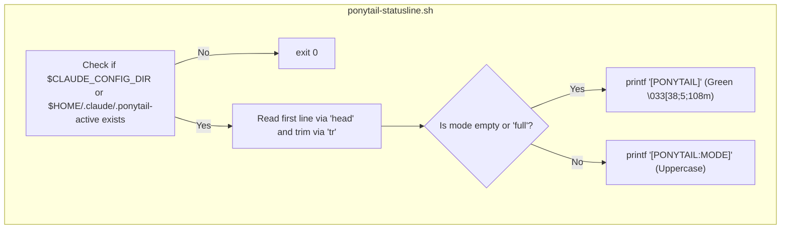
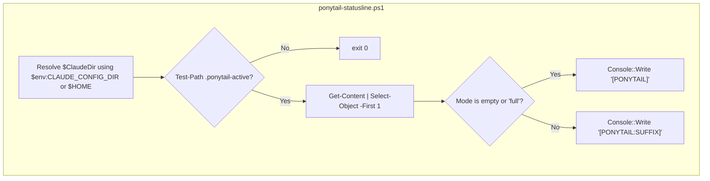

# Statusline Integration

<details>
<summary>Relevant source files</summary>

The following files were used as context for generating this wiki page:

- [.agents/plugins/marketplace.json](.agents/plugins/marketplace.json)
- [hooks/ponytail-activate.js](hooks/ponytail-activate.js)
- [hooks/ponytail-config.js](hooks/ponytail-config.js)
- [hooks/ponytail-mode-tracker.js](hooks/ponytail-mode-tracker.js)
- [hooks/ponytail-statusline.ps1](hooks/ponytail-statusline.ps1)
- [hooks/ponytail-statusline.sh](hooks/ponytail-statusline.sh)
- [tests/hooks.test.js](tests/hooks.test.js)

</details>


The Statusline Integration provides real-time visual feedback within the terminal, indicating whether Ponytail is active and which intensity mode is currently engaged. This is achieved through a decoupled architecture involving a filesystem flag, platform-specific shell scripts, and a configuration nudge mechanism within the Claude Code lifecycle.

## Architectural Overview

The integration relies on a "flag file" pattern to communicate state between the Node.js plugin runtime and the shell environment. Because the statusline in Claude Code executes as a separate shell command, it cannot directly access the plugin's memory space.

### Data Flow: Activation to Display

1.  **Activation**: When a Claude session starts, `ponytail-activate.js` determines the active mode via `getDefaultMode()` [hooks/ponytail-activate.js:24]().
2.  **Persistence**: The `setMode` function in `ponytail-runtime.js` writes the mode string to a hidden file named `.ponytail-active` [hooks/ponytail-activate.js:34-36]().
3.  **Execution**: The Claude terminal UI periodically executes the command defined in the `statusLine` setting of `~/.claude/settings.json`.
4.  **Detection**: The script (`ponytail-statusline.sh` or `ponytail-statusline.ps1`) checks for the existence of the flag file [hooks/ponytail-statusline.sh:4]()[hooks/ponytail-statusline.ps1:4-6]().
5.  **Rendering**: If present, the script reads the mode and prints a colorized ANSI badge (e.g., `[PONYTAIL:ULTRA]`) [hooks/ponytail-statusline.sh:11]()[hooks/ponytail-statusline.ps1:20]().

### Component Map

| Component | Code Entity | Role |
| :--- | :--- | :--- |
| **Flag File** | `.ponytail-active` | The source of truth for the current session's mode, located in the Claude config directory [hooks/ponytail-activate.js:5](). |
| **Activator** | `ponytail-activate.js` | Manages the creation and initial state of the flag during `SessionStart` [hooks/ponytail-activate.js:1-7](). |
| **Mode Tracker** | `ponytail-mode-tracker.js` | Updates the flag file when the user changes modes via `/ponytail` commands [hooks/ponytail-mode-tracker.js:34-45](). |
| **Unix Script** | `ponytail-statusline.sh` | Bash script for macOS/Linux statusline rendering [hooks/ponytail-statusline.sh:1](). |
| **Windows Script** | `ponytail-statusline.ps1` | PowerShell script for Windows statusline rendering [hooks/ponytail-statusline.ps1:1](). |
| **Nudge Logic** | `ponytail-activate.js` | Detects missing configuration and prompts the user [hooks/ponytail-activate.js:44-45](). |

**Sources:**
- [hooks/ponytail-activate.js:1-36]()
- [hooks/ponytail-mode-tracker.js:34-45]()
- [hooks/ponytail-statusline.sh:1-12]()
- [hooks/ponytail-statusline.ps1:1-21]()

## The Flag File Mechanism

The flag file is the bridge between the AI agent's internal state and the user's terminal interface.

### State Transitions

The lifecycle of the `.ponytail-active` file is managed by `ponytail-activate.js` and `ponytail-runtime.js`.

- **Creation**: On `SessionStart`, if the mode is not `off`, `setMode(mode)` is called [hooks/ponytail-activate.js:34-36]().
- **Content**: The file contains a single string representing the mode (e.g., `lite`, `full`, `ultra`).
- **Path Resolution**: The location is determined by `getClaudeDir()`, which respects the `CLAUDE_CONFIG_DIR` environment variable [hooks/ponytail-config.js:71-74]().
- **Cleanup**: If the mode is `off`, `clearMode()` is called, which removes the flag file [hooks/ponytail-activate.js:27-28]()[hooks/ponytail-mode-tracker.js:42-44]().

### Visual Feedback Logic
The statusline scripts apply specific formatting based on the content of the flag file:
- **Default/Full**: If the mode is `full` or empty, the badge is simplified to `[PONYTAIL]` [hooks/ponytail-statusline.sh:8-9]()[hooks/ponytail-statusline.ps1:16-17]().
- **Specific Modes**: For other modes, the badge includes a suffix (e.g., `[PONYTAIL:LITE]`) [hooks/ponytail-statusline.sh:11]()[hooks/ponytail-statusline.ps1:20]().
- **Coloring**: Both scripts use ANSI escape code `38;5;108m` (a muted green) to style the badge [hooks/ponytail-statusline.sh:9]()[hooks/ponytail-statusline.ps1:17]().

**Sources:**
- [hooks/ponytail-activate.js:24-39]()
- [hooks/ponytail-config.js:71-74]()
- [hooks/ponytail-statusline.sh:5-12]()
- [hooks/ponytail-statusline.ps1:14-21]()

## Statusline Scripts

### Unix (Bash) Implementation
The Bash script uses standard utilities (`head`, `tr`) to read and sanitize the mode string. It respects `CLAUDE_CONFIG_DIR` for flag lookup [hooks/ponytail-statusline.sh:3]().


**Sources:**
- [hooks/ponytail-statusline.sh:1-13]()

### Windows (PowerShell) Implementation
The PowerShell script performs identical logic using `Get-Content` and `.ToUpperInvariant()`.


**Sources:**
- [hooks/ponytail-statusline.ps1:1-21]()

## Setup Nudge Mechanism

Because Claude Code requires a manual entry in `settings.json` to enable the statusline, Ponytail includes an automated "nudge" to assist users with configuration.

### Configuration Detection
During `SessionStart`, `ponytail-activate.js` inspects the user's Claude settings file:
1.  Locates `settings.json` via `getClaudeDir()` [hooks/ponytail-activate.js:21-22]().
2.  Parses the JSON (stripping UTF-8 BOM if present) and checks for the presence of the `statusLine` key [hooks/ponytail-activate.js:46-53]().

### Path Safety and The Nudge Prompt
If the `statusLine` is missing, the script generates a setup instruction. To prevent shell injection vulnerabilities, `isShellSafe()` validates the plugin's installation path before embedding it in a command snippet [hooks/ponytail-activate.js:60]()[hooks/ponytail-config.js:50-52]().

- **Safe Paths**: The script provides a ready-to-copy JSON snippet including the platform-specific execution command [hooks/ponytail-activate.js:64-71]().
- **Unsafe Paths**: If the path contains metacharacters (e.g., `;`, `&`, `$`), the script instructs the user to configure the path manually for security [hooks/ponytail-activate.js:75-81]().

| Platform | Command Construction |
| :--- | :--- |
| **Windows** | `powershell -ExecutionPolicy Bypass -File "..."` [hooks/ponytail-activate.js:61-62]() |
| **Unix** | `bash "..."` [hooks/ponytail-activate.js:63]() |

**Sources:**
- [hooks/ponytail-activate.js:44-82]()
- [hooks/ponytail-config.js:50-52]()
- [tests/hooks.test.js:11-20]()

## Settings Configuration

To manually enable the integration, the following structure must be present in the Claude settings file (`~/.claude/settings.json`):

```json
{
  "statusLine": {
    "type": "command",
    "command": "bash \"/path/to/ponytail/hooks/ponytail-statusline.sh\""
  }
}
```

The `ponytail-activate.js` script handles the absolute path resolution and escaping automatically when generating the nudge [hooks/ponytail-activate.js:64-65]().

**Sources:**
- [hooks/ponytail-activate.js:64-65]()
