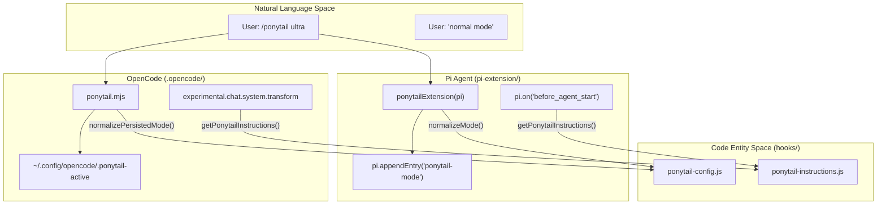

# Pi Agent & OpenCode Extensions

Relevant source files

The following files were used as context for generating this wiki page:

- [.opencode/plugins/ponytail.mjs](.opencode/plugins/ponytail.mjs)
- [opencode.json](opencode.json)
- [pi-extension/index.js](pi-extension/index.js)
- [pi-extension/test/extension.test.js](pi-extension/test/extension.test.js)
- [tests/opencode-plugin.test.js](tests/opencode-plugin.test.js)

This section covers the integration of Ponytail into the **Pi Agent** and **OpenCode** environments. Both integrations leverage the shared logic in the `hooks/` directory to provide a consistent "Lazy Senior Developer" experience across different host architectures. While the Pi extension operates within a structured event-driven API, the OpenCode plugin uses a hook-based transformation system to inject rules and manage state.

### System Integration Overview

The integrations bridge the host-specific APIs to the shared Ponytail core. They handle two primary responsibilities:
1.  **Instruction Injection**: Appending the Ponytail ruleset to the system prompt.
2.  **Mode Persistence**: Tracking whether the agent is in `lite`, `full`, `ultra`, or `off` mode across chat turns or sessions.

**Cross-Platform Integration Architecture**

Sources: [pi-extension/index.js:56-157](), [.opencode/plugins/ponytail.mjs:43-79](), [hooks/ponytail-config.js:1-15](), [hooks/ponytail-instructions.js:1-20]()

---

### Pi Agent Extension

The Pi Agent Extension (located in `pi-extension/`) provides a native integration for the Pi agent environment. It uses `pi.registerCommand` to expose the Ponytail interface and `pi.on` to hook into the session lifecycle.

*   **Command Registration**: Registers `/ponytail`, `/ponytail-review`, `/ponytail-help`, `/ponytail-audit`, `/ponytail-debt`, and `/ponytail-gain`.
*   **Session Persistence**: Uses `pi.appendEntry` with a `customType: "ponytail-mode"` to store the active mode directly in the conversation branch.
*   **Lifecycle Hooks**:
    *   `session_start`: Restores the mode from the conversation history using `resolveSessionMode`.
    *   `before_agent_start`: Injects the system prompt instructions.
    *   `input`: Monitors for deactivation phrases like "normal mode" via `isDeactivationCommand`.

For details, see [Pi Extension API & Command Registration](#4.1) and [Pi Extension Tests](#4.2).
Sources: [pi-extension/index.js:82-157](), [pi-extension/test/extension.test.js:57-113]()

---

### OpenCode Plugin

The OpenCode plugin (located in `.opencode/plugins/ponytail.mjs`) is an ESM-based server plugin that integrates Ponytail into the OpenCode development environment.

*   **Instruction Injection**: Uses the `experimental.chat.system.transform` hook to append the ruleset to every chat turn's system prompt.
*   **State Management**: Since OpenCode lacks a native session metadata store like Pi, the plugin persists the active mode to a local file at `~/.config/opencode/.ponytail-active`.
*   **Skill Discovery**: The `config` hook registers the `skills/` directory, allowing OpenCode to discover and execute Ponytail skills.
*   **Command Interception**: Uses `command.execute.before` to catch `/ponytail <mode>` calls and update the state file before the next chat turn.

For details, see [OpenCode Plugin](#4.3).
Sources: [.opencode/plugins/ponytail.mjs:51-78](), [opencode.json:1-4](), [tests/opencode-plugin.test.js:32-55]()

---

### Model Context Protocol (MCP) Server

The `ponytail-mcp/` directory contains a Model Context Protocol server. This allows any MCP-compatible host (like Claude Desktop or Kiro) to access Ponytail instructions as a tool or a prompt.

*   **Tools**: Provides `ponytail_instructions`, a read-only tool that returns the structured ruleset for a requested mode.
*   **Prompts**: Provides a `ponytail` prompt that users can invoke to wrap their session in Ponytail's constraints.
*   **Shared Logic**: Reuses `ponytail-config.js` for mode resolution, ensuring that an MCP-hosted agent follows the same hierarchy as a native plugin.

For details, see [MCP Server (ponytail-mcp)](#4.4).
Sources: [pi-extension/index.js:13-14]() (Shared hook usage pattern)

---

## Child Pages
*   [Pi Extension API & Command Registration](#4.1) — Details the `ponytailExtension(pi)` default export: `registerCommand` calls; `parsePonytailCommand` and `resolveSessionMode` helpers; and `before_agent_start` prompt injection.
*   [Pi Extension Tests](#4.2) — Covers the test suite for the Pi extension (`pi-extension/test/`) and how it verifies command delegation and session restoration.
*   [OpenCode Plugin](#4.3) — Documents the OpenCode plugin hooks, mode state storage in `~/.config/opencode/.ponytail-active`, and the `opencode-plugin.test.js` suite.
*   [MCP Server (ponytail-mcp)](#4.4) — Documents the Model Context Protocol server, the `ponytail_instructions` tool, and when to use MCP vs. native adapters.
