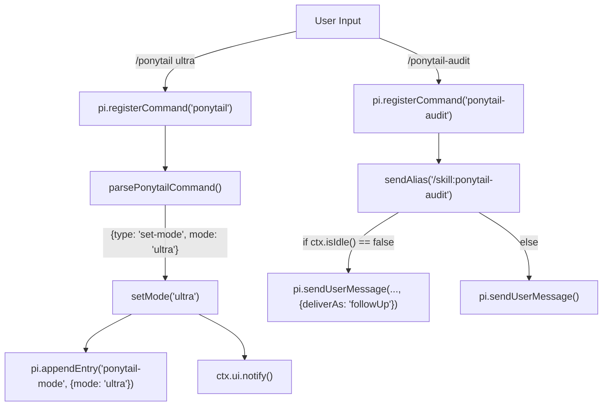
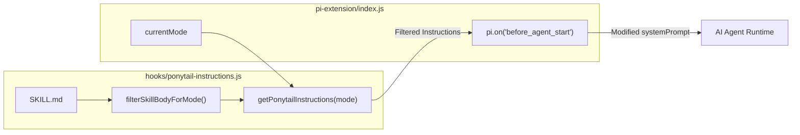

# Pi Extension API & Command Registration

Relevant source files

The following files were used as context for generating this wiki page:

- [hooks/ponytail-instructions.js](hooks/ponytail-instructions.js)
- [pi-extension/index.js](pi-extension/index.js)
- [pi-extension/package.json](pi-extension/package.json)
- [pi-extension/test/extension.test.js](pi-extension/test/extension.test.js)
- [pi-extension/test/helpers.test.js](pi-extension/test/helpers.test.js)

This page details the implementation of the Pi agent extension for Ponytail. The extension provides a native integration layer that registers slash commands, manages session-specific state, and performs system-prompt injection to enforce the Ponytail philosophy within the Pi environment.

## Overview of the Pi Extension

The Pi extension is defined in `pi-extension/index.js` and serves as the bridge between the Pi agent's lifecycle events and the shared Ponytail logic. It utilizes a default export function `ponytailExtension(pi)` which interacts with the Pi Extension API to register commands and listeners.

### Core Responsibilities
- **Command Registration**: Exposes `/ponytail`, `/ponytail-review`, `/ponytail-help`, `/ponytail-audit`, `/ponytail-debt`, and `/ponytail-gain` [pi-extension/index.js:82-136]().
- **Session Management**: Tracks the active mode across a conversation using `resolveSessionMode` [pi-extension/index.js:18-31]().
- **Instruction Injection**: Injects instructions into the agent's system prompt during the `before_agent_start` event [pi-extension/index.js:153-156]().
- **Natural Language Deactivation**: Monitors user input to detect deactivation phrases like "normal mode" [pi-extension/index.js:138-145]().

**Sources:**
- [pi-extension/index.js:56-157]()

---

## Command Registration & Parsing

The extension registers commands using `pi.registerCommand`. The logic for interpreting arguments passed to `/ponytail` is encapsulated in `parsePonytailCommand`.

### The `/ponytail` Command
This command allows users to change the current session mode, update the global default mode, or check the current status.

| Argument | Action | Implementation Detail |
| :--- | :--- | :--- |
| *None* | Toggles mode | Sets to `full` if current is `off`, else uses `fallback` [pi-extension/index.js:37-39](). |
| `status` | Reports state | Displays current and default modes via `ctx.ui.notify` [pi-extension/index.js:87-90](). |
| `default <mode>` | Updates config | Calls `writeDefaultMode` to persist a new global default [pi-extension/index.js:92-102](). |
| `<mode>` | Session change | Updates `currentMode` and appends a `ponytail-mode` entry [pi-extension/index.js:104-107](). |

### Utility Skills (Aliases)
The commands `/ponytail-review`, `/ponytail-audit`, `/ponytail-debt`, `/ponytail-gain`, and `/ponytail-help` are registered as aliases. They use `sendAlias` to dispatch a `/skill:<name>` message to the agent [pi-extension/index.js:69-80]().

### Helper Functions

#### `parsePonytailCommand(text, defaultMode)`
Normalizes input text and returns a command object (`type` and `mode`). It handles the logic for mapping user strings to validated modes via `normalizeMode` and `normalizeConfigMode` [pi-extension/index.js:33-52]().

#### `resolveSessionMode(entries, fallbackMode)`
Iterates through the session history (entries) from newest to oldest to find the last recorded `ponytail-mode` entry. This ensures that if a session is resumed, the agent remembers the user's last setting [pi-extension/index.js:18-31]().

### Command Mapping Diagram

The following diagram bridges the Natural Language commands entered by the user to the internal processing logic.

**Command Logic Flow**

**Sources:**
- [pi-extension/index.js:18-52]()
- [pi-extension/index.js:60-136]()

---

## System Prompt Injection

The extension enforces the "Lazy Senior Dev" persona by intercepting the agent's startup sequence. When the `before_agent_start` event fires, the extension retrieves the relevant instructions based on the `currentMode`.

### Prompt Assembly Logic
1.  **Check Activation**: If `currentMode` is `off`, the hook returns immediately without modification [pi-extension/index.js:154-154]().
2.  **Retrieve Instructions**: Calls `getPonytailInstructions(currentMode)` from the shared instructions module [pi-extension/index.js:155-155]().
3.  **Append to System**: Concatenates the existing system prompt with the Ponytail-specific ruleset [pi-extension/index.js:155-155]().

### Instruction Filtering
The `getPonytailInstructions` function reads the canonical `SKILL.md` and uses `filterSkillBodyForMode` to strip out rules and examples that do not apply to the current intensity level (`lite`, `full`, or `ultra`) [hooks/ponytail-instructions.js:11-37]().

**Prompt Injection Data Flow**

**Sources:**
- [pi-extension/index.js:153-156]()
- [hooks/ponytail-instructions.js:11-37]()
- [hooks/ponytail-instructions.js:71-86]()

---

## Lifecycle & Event Listeners

The extension manages state transitions through specific event listeners provided by the Pi API.

### Session Start
When a session begins, the extension initializes its configuration. It resolves the `configuredDefaultMode` using `getDefaultMode()` and then scans the session history via `resolveSessionMode` to set the `currentMode` [pi-extension/index.js:147-151]().

### Input Monitoring (Deactivation)
The extension listens to the `input` event to allow for natural language deactivation. If the user types a command recognized by `isDeactivationCommand` (e.g., "normal mode"), the extension automatically sets the mode to `off` [pi-extension/index.js:138-145](). It ignores inputs where the source is "extension" to avoid infinite loops [pi-extension/index.js:139-139]().

**Sources:**
- [pi-extension/index.js:138-151]()
- [pi-extension/test/extension.test.js:115-125]()
