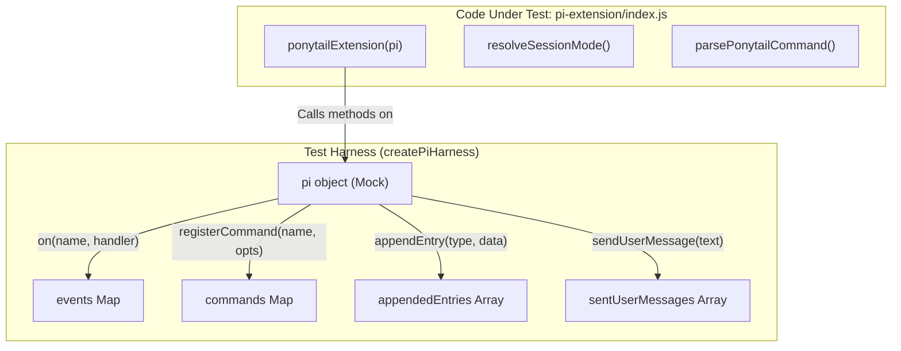
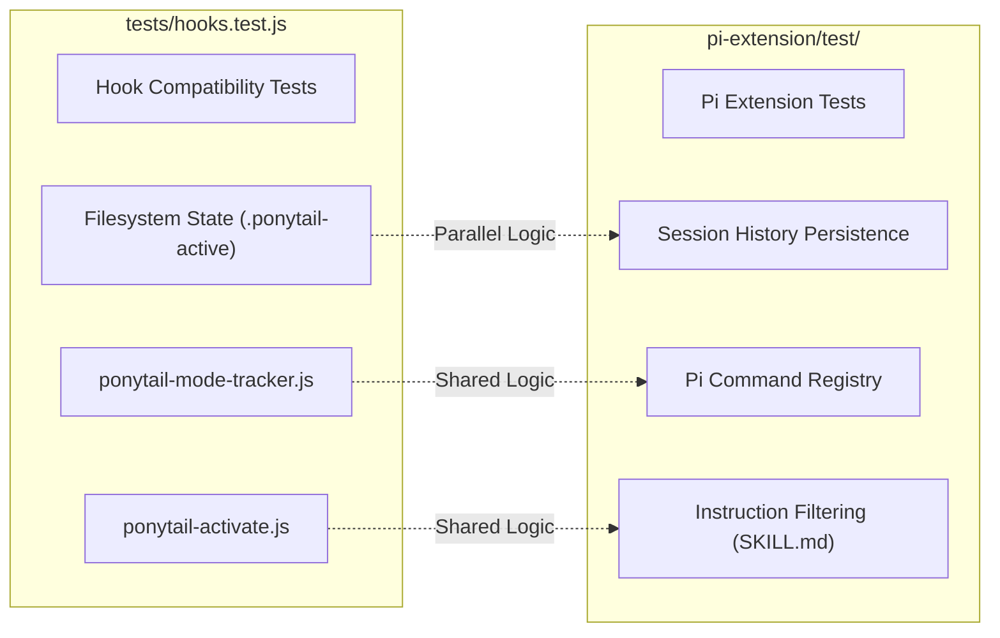

# Pi Extension Tests

Relevant source files

The following files were used as context for generating this wiki page:

- [hooks/ponytail-instructions.js](hooks/ponytail-instructions.js)
- [pi-extension/index.js](pi-extension/index.js)
- [pi-extension/package.json](pi-extension/package.json)
- [pi-extension/test/extension.test.js](pi-extension/test/extension.test.js)
- [pi-extension/test/helpers.test.js](pi-extension/test/helpers.test.js)

The Pi extension test suite ensures the robust integration of Ponytail within the Pi agent environment. It verifies command registration, session lifecycle management, state persistence via session history, and the correct filtering of instructions based on active intensity levels.

## Test Suite Architecture

The test suite is divided into two primary files within `pi-extension/test/`: `extension.test.js`, which mocks the Pi environment to test the extension's integration logic, and `helpers.test.js`, which focuses on pure utility functions and state management.

### Data Flow and Mocking Strategy

The suite uses a harness to simulate the Pi extension host. This allows for asserting that events are registered and that the extension correctly interacts with the session manager and UI.

**Pi Harness Components:**
| Component | Description |
| :--- | :--- |
| `events` | A `Map` storing registered event handlers (e.g., `session_start`, `before_agent_start`). |
| `commands` | A `Map` storing registered slash commands (e.g., `/ponytail`). |
| `appendedEntries` | An array capturing data sent to `pi.appendEntry` for session persistence. |
| `sentUserMessages` | An array capturing messages sent via `pi.sendUserMessage`. |

**Pi Extension Test Harness Structure**

Sources: [pi-extension/test/extension.test.js:9-32](), [pi-extension/index.js:56-157]()

## Integration Tests (`extension.test.js`)

This file verifies the high-level behavior of the extension when interacting with the Pi agent lifecycle.

### Command Registration
The test verifies that the full suite of Ponytail commands is registered upon extension initialization: `/ponytail`, `/ponytail-audit`, `/ponytail-debt`, `/ponytail-gain`, `/ponytail-help`, and `/ponytail-review` [pi-extension/test/extension.test.js:57-61]().

### Session Lifecycle and Persistence
Ponytail for Pi uses the `sessionManager` to persist the active mode across session resumes. 
*   **Mode Updates:** When `/ponytail <mode>` is called, the extension appends a custom entry of type `ponytail-mode` to the session history [pi-extension/test/extension.test.js:63-74]().
*   **Restoration:** Upon `session_start` (with reason `resume`), the extension retrieves entries and uses `resolveSessionMode` to restore the last active intensity level [pi-extension/test/extension.test.js:80-94]().

### Skill Delegation
The suite verifies that skill alias commands (like `/ponytail-review`) correctly delegate to the underlying Pi skill system by sending a user message in the format `/skill:<name>` [pi-extension/test/extension.test.js:96-113]().

### Instruction Injection
The `before_agent_start` event is tested to ensure that if a mode is active, the appropriate system instructions (including the intensity level) are injected into the agent's prompt [pi-extension/test/extension.test.js:75-78]().

### Deactivation Logic
The suite verifies that specific user input (e.g., "normal mode") triggers the deactivation of Ponytail, resulting in no instructions being injected in subsequent agent starts [pi-extension/test/extension.test.js:115-125](). It also confirms that conversational mentions of "normal mode" (e.g., "add a normal mode toggle") do not accidentally trigger deactivation [pi-extension/test/extension.test.js:127-137]().

Sources: [pi-extension/test/extension.test.js:1-138](), [pi-extension/index.js:138-156]()

## Helper Tests (`helpers.test.js`)

This file targets the logic-heavy utility functions exported by the Pi extension.

### Command Parsing
`parsePonytailCommand` is tested for various input scenarios:
*   **Bare Invocation:** Defaults to `full` if the current default is `off` [pi-extension/test/helpers.test.js:15-17]().
*   **Subcommands:** Correctly identifies `status` and `set-default` (e.g., `default lite`) [pi-extension/test/helpers.test.js:19-23]().

### Configuration Management
Tests for `readDefaultMode` and `writeDefaultMode` ensure that global defaults are correctly persisted to the filesystem using `XDG_CONFIG_HOME` logic [pi-extension/test/helpers.test.js:34-55]().

### Instruction Filtering
`filterSkillBodyForMode` is a critical function that prunes the Ponytail instructions to only include content relevant to the active mode. The test verifies that:
*   Rows in tables matching other intensity levels are removed [pi-extension/test/helpers.test.js:57-68]().
*   Example blocks tagged with other modes are stripped [pi-extension/test/helpers.test.js:65-66]().
*   **Regression Guard:** Rule bullets containing colons (e.g., "No unrequested abstractions:") are NOT mistaken for mode labels and are preserved [pi-extension/test/helpers.test.js:70-85]().

Sources: [pi-extension/test/helpers.test.js:1-86](), [hooks/ponytail-instructions.js:11-37]()

## Relationship to Shared Hook Tests

While the Pi extension tests focus on the Pi-specific API and session persistence, they relate to the global hook tests in `tests/hooks.test.js`.

**Comparison of Test Scopes**

The `tests/hooks.test.js` suite (documented in Section 7.2) verifies the Node.js scripts used by Claude Code and Codex. The Pi extension tests complement this by ensuring the same logic (mode resolution and instruction filtering) works within the unique constraints of the Pi Extension API, which relies on an in-memory session manager and `appendEntry` calls rather than purely on the filesystem for session-local state.

Sources: [pi-extension/test/extension.test.js:1-138](), [pi-extension/index.js:1-157]()
