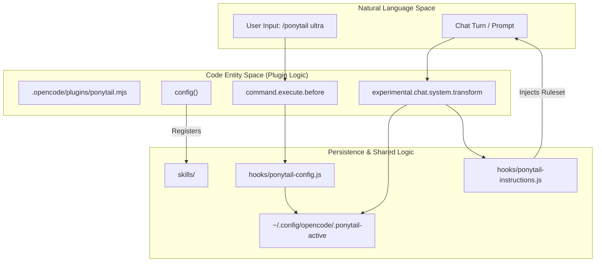
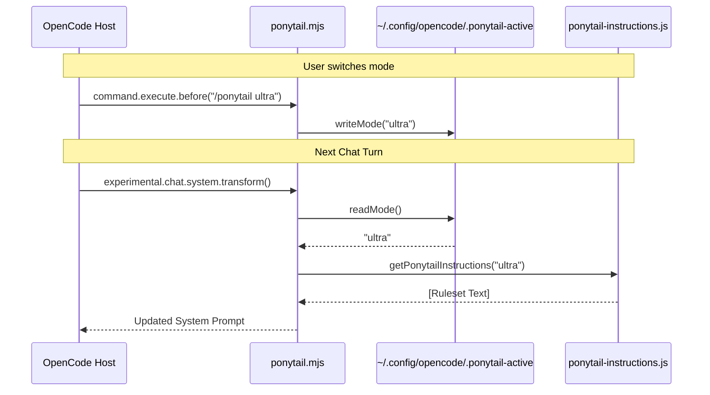

# OpenCode Plugin

Relevant source files

The following files were used as context for generating this wiki page:

- [.opencode/command/ponytail-review.md](.opencode/command/ponytail-review.md)
- [.opencode/command/ponytail.md](.opencode/command/ponytail.md)
- [.opencode/plugins/ponytail.mjs](.opencode/plugins/ponytail.mjs)
- [opencode.json](opencode.json)
- [tests/opencode-plugin.test.js](tests/opencode-plugin.test.js)

The OpenCode plugin provides a seamless integration of the Ponytail ruleset into the [OpenCode](https://opencode.ai) environment. It serves as a server-side plugin that manages state persistence for the active Ponytail mode and ensures that the appropriate instructions are injected into every chat interaction. By leveraging shared logic from the `hooks/` directory, it maintains parity with other supported hosts like Claude Code and Codex.

## Plugin Architecture

The plugin is implemented as an ES module located at [./.opencode/plugins/ponytail.mjs:1-80](). It interfaces with the OpenCode host through a set of lifecycle hooks and configuration overrides.

### Entry Point and Registration
The plugin is registered via the `opencode.json` manifest file [opencode.json:1-5](). OpenCode loads the default export from the `.mjs` file, which initializes the plugin hooks [./.opencode/plugins/ponytail.mjs:43-79]().

### Data Flow and Lifecycle Hooks
The plugin operates through three primary mechanisms:

1.  **Configuration (`config` hook)**: Registers the local `skills/` directory so that OpenCode can discover and execute Ponytail-specific commands like `/ponytail-review` [./.opencode/plugins/ponytail.mjs:52-58]().
2.  **System Transformation (`experimental.chat.system.transform`)**: Injects the Ponytail ruleset into the system prompt for every turn of the conversation, provided the mode is not set to `off` [./.opencode/plugins/ponytail.mjs:61-65]().
3.  **Command Interception (`command.execute.before`)**: Captures `/ponytail <level>` commands to update the persistent state before the next interaction occurs [./.opencode/plugins/ponytail.mjs:71-77]().

### State Management
Unlike other hosts that might use project-local flag files, the OpenCode plugin stores the active mode in the user's configuration directory to maintain session continuity. The state is stored at:
`~/.config/opencode/.ponytail-active` (or `$XDG_CONFIG_HOME/opencode/.ponytail-active`) [./.opencode/plugins/ponytail.mjs:24-28]().

| Function | Purpose |
| :--- | :--- |
| `readMode()` | Reads the mode from the state file, falling back to `getDefaultMode()` if the file is missing or invalid [./.opencode/plugins/ponytail.mjs:30-36](). |
| `writeMode(mode)` | Persists the selected mode (e.g., `lite`, `full`, `ultra`, `off`) to the filesystem [./.opencode/plugins/ponytail.mjs:38-41](). |

**Sources:** [./.opencode/plugins/ponytail.mjs:1-80](), [opencode.json:1-5]()

## Component Interaction Diagram

The following diagram illustrates how the OpenCode plugin bridges the Natural Language Space (user commands) to the Code Entity Space (instruction builders and state files).

**OpenCode Integration Flow**

**Sources:** [./.opencode/plugins/ponytail.mjs:20-28](), [./.opencode/plugins/ponytail.mjs:52-77](), [opencode.json:1-5]()

## Command Implementation

The plugin supports commands through markdown-based definitions that OpenCode parses. These files provide the metadata and initial instructions for the agent when a command is invoked.

*   **`/ponytail`**: Defined in [.opencode/command/ponytail.md:1-6](). It allows the user to switch intensity levels. The logic for persisting this change is handled by the `command.execute.before` hook in the plugin [./.opencode/plugins/ponytail.mjs:71-77]().
*   **`/ponytail-review`**: Defined in [.opencode/command/ponytail-review.md:1-6](). It triggers a specific review pass focused on identifying over-engineering and code that can be deleted.

**Sources:** [.opencode/command/ponytail.md:1-6](), [.opencode/command/ponytail-review.md:1-6](), [./.opencode/plugins/ponytail.mjs:71-77]()

## Implementation Details

### Instruction Injection
The plugin uses `getPonytailInstructions(mode)` from the shared `ponytail-instructions.js` module [./.opencode/plugins/ponytail.mjs:20](). This ensures that the "Lazy Senior Developer" ruleset remains consistent across all platforms. The injection happens dynamically every turn [./.opencode/plugins/ponytail.mjs:61-65]().

### Plugin Logic Flow
The following sequence diagram demonstrates the interaction between the OpenCode host and the Ponytail plugin during a mode switch and a subsequent prompt.

**Mode Switching and Injection Sequence**

**Sources:** [./.opencode/plugins/ponytail.mjs:30-41](), [./.opencode/plugins/ponytail.mjs:61-77]()

## Testing

The OpenCode plugin is validated using a dedicated test suite: `tests/opencode-plugin.test.js`. This suite uses a "smoke test" approach, mocking the OpenCode hook environment to verify behavior without requiring a live OpenCode process [tests/opencode-plugin.test.js:1-4]().

### Key Test Cases
*   **Default Injection**: Verifies that the ruleset is injected at the `full` level when no state file exists [tests/opencode-plugin.test.js:32-39]().
*   **Persistence**: Confirms that `/ponytail ultra` correctly writes to the state file and that subsequent transforms reflect the new level [tests/opencode-plugin.test.js:41-47]().
*   **Deactivation**: Ensures that `/ponytail off` stops all instruction injection [tests/opencode-plugin.test.js:49-55]().
*   **Isolation**: Checks that unrelated commands do not modify the Ponytail state [tests/opencode-plugin.test.js:57-62]().

The test suite uses a temporary directory for `XDG_CONFIG_HOME` to ensure isolation from the developer's actual configuration [tests/opencode-plugin.test.js:16-19]().

**Sources:** [tests/opencode-plugin.test.js:1-65]()
