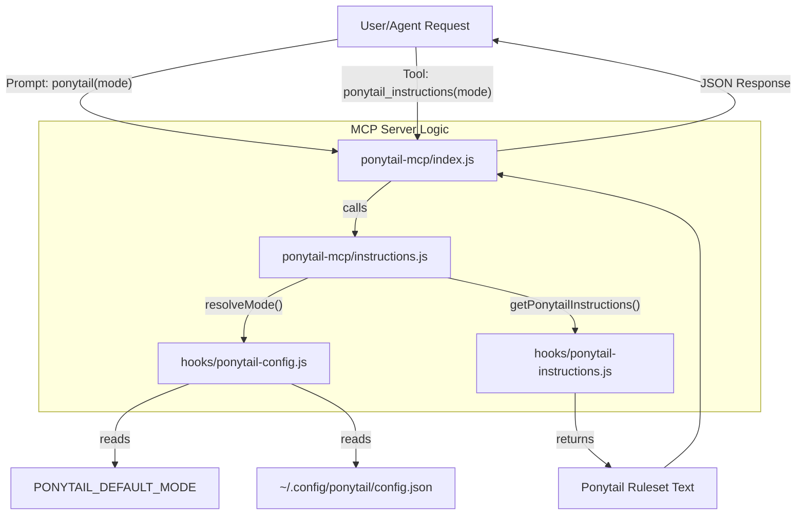
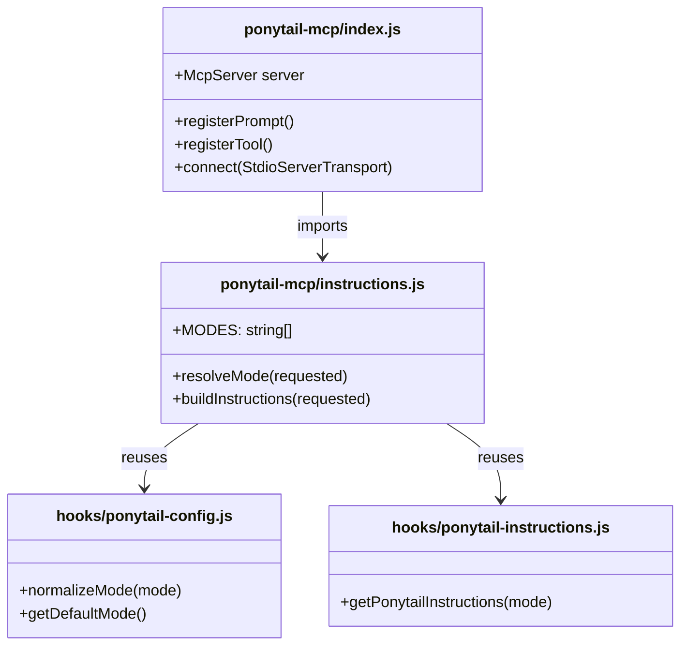

# MCP Server (ponytail-mcp)

Relevant source files

The following files were used as context for generating this wiki page:

- [ponytail-mcp/README.md](ponytail-mcp/README.md)
- [ponytail-mcp/index.js](ponytail-mcp/index.js)
- [ponytail-mcp/instructions.js](ponytail-mcp/instructions.js)
- [ponytail-mcp/package.json](ponytail-mcp/package.json)
- [ponytail-mcp/test/instructions.test.js](ponytail-mcp/test/instructions.test.js)

The `ponytail-mcp` package implements a Model Context Protocol (MCP) server that serves Ponytail's "lazy senior dev" instructions as both a prompt and a tool. It is designed for MCP-compliant hosts (like Claude Desktop or other IDE agents) where an "always-on" adapter is not available or where context is pulled explicitly through the prompt menu or tool execution [ponytail-mcp/README.md:1-11]().

## Purpose and Scope

The MCP server provides a clean integration point for hosts that lack a native system-prompt injection hook. It reuses the core logic from the Claude hooks and Pi extensions to ensure that the ruleset emitted is identical across all platforms [ponytail-mcp/instructions.js:1-3]().

### MCP vs. Always-On Adapters
Unlike the Claude Code plugin or OpenCode extensions which inject rules into every chat turn automatically, the MCP server is typically **user-invoked**. It is intended for:
1. **MCP-only hosts**: Environments where the only injection point is the prompt menu.
2. **Tool-based context**: Hosts that pull instructions via tool calls or code execution [ponytail-mcp/README.md:7-11]().

**Sources:** [ponytail-mcp/README.md:1-11](), [ponytail-mcp/index.js:1-5]().

---

## Technical Architecture

The server is built using the `@modelcontextprotocol/sdk` and communicates over a `StdioServerTransport` [ponytail-mcp/index.js:6-7, 48]().

### Data Flow: Natural Language to Code Entity

The following diagram illustrates how a user request for a specific Ponytail mode flows through the MCP server components to the shared instruction builder.

**Diagram: MCP Request Resolution**

**Sources:** [ponytail-mcp/index.js:19-46](), [ponytail-mcp/instructions.js:4-26](), [ponytail-mcp/README.md:21-22]().

---

## Exposed Capabilities

The server registers two primary interfaces: a prompt and a tool. Both accept an optional `mode` argument (`lite`, `full`, or `ultra`) [ponytail-mcp/index.js:14-17]().

### 1. The `ponytail` Prompt
A user-invoked prompt that returns the ruleset as a user message. This is the primary way for users to manually "activate" Ponytail in a session [ponytail-mcp/index.js:19-29]().

### 2. The `ponytail_instructions` Tool
A read-only tool that returns the ruleset text and a `structuredContent` object. This is designed for agents that are programmed to pull context via tool calls [ponytail-mcp/index.js:31-46]().

| Feature | Type | Output |
| :--- | :--- | :--- |
| `ponytail` | Prompt | `messages: [{ role: "user", content: { type: "text", text: rules } }]` |
| `ponytail_instructions` | Tool | `content` (text) and `structuredContent` (`{ mode, instructions }`) |

**Sources:** [ponytail-mcp/index.js:19-46](), [ponytail-mcp/README.md:13-19]().

---

## Implementation Details

### Mode Resolution
The server implements a strict resolution hierarchy for modes. It filters out internal modes like `off` or `review` that are not suitable for instruction serving via MCP [ponytail-mcp/instructions.js:10-15]().

The `resolveMode(requested)` function follows this logic:
1. **Normalize**: Uses `normalizeMode` from `ponytail-config.js` [ponytail-mcp/instructions.js:17]().
2. **Validate**: If the mode is valid and not `off`, it is used [ponytail-mcp/instructions.js:18]().
3. **Fallback**: If empty or invalid, it checks `getDefaultMode()` (which looks at `PONYTAIL_DEFAULT_MODE` and config files) [ponytail-mcp/instructions.js:20-21]().
4. **Hard Default**: Falls back to `full` if no other configuration is found [ponytail-mcp/instructions.js:21]().

### Component Interaction
The server logic is split to maintain testability without requiring the full MCP SDK in unit tests.

**Diagram: Component Dependencies**

**Sources:** [ponytail-mcp/instructions.js:4-27](), [ponytail-mcp/index.js:6-12]().

---

## Testing Suite

The server includes a test suite in `ponytail-mcp/test/instructions.test.js` that verifies the instruction selection logic in isolation from the MCP transport [ponytail-mcp/package.json:8]().

Key test cases include:
* **Valid Intensities**: Ensures `lite`, `full`, and `ultra` are passed through correctly [ponytail-mcp/test/instructions.test.js:6-8]().
* **Fallback Logic**: Verifies that `off`, `review`, or junk strings (e.g., "nonsense") correctly fall back to a valid served mode rather than returning empty instructions [ponytail-mcp/test/instructions.test.js:10-16]().
* **Instruction Integrity**: Checks that `buildInstructions` returns text containing the "PONYTAIL MODE ACTIVE" header and the correct mode tag [ponytail-mcp/test/instructions.test.js:18-22]().

**Sources:** [ponytail-mcp/test/instructions.test.js:1-23](), [ponytail-mcp/package.json:8]().
