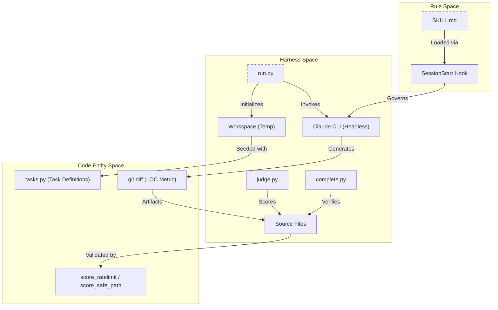
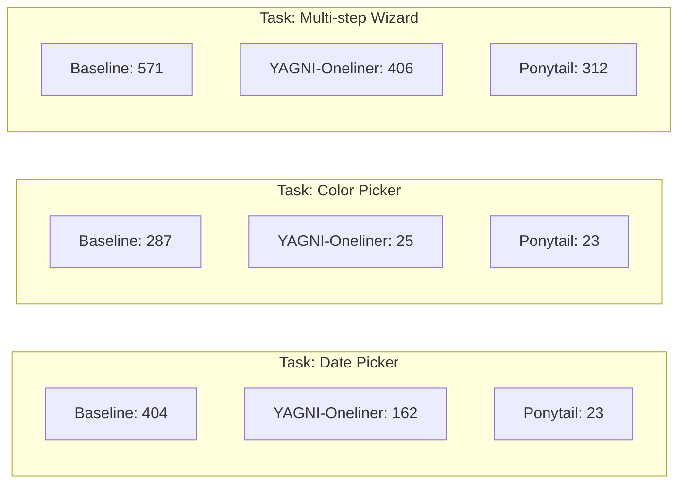

# Benchmarks & Performance Results

Relevant source files

The following files were used as context for generating this wiki page:

- [.gitignore](.gitignore)
- [benchmarks/README.md](benchmarks/README.md)
- [benchmarks/agentic/README.md](benchmarks/agentic/README.md)
- [benchmarks/agentic/complete.py](benchmarks/agentic/complete.py)
- [benchmarks/agentic/judge.py](benchmarks/agentic/judge.py)
- [benchmarks/agentic/run.py](benchmarks/agentic/run.py)
- [benchmarks/agentic/tasks.py](benchmarks/agentic/tasks.py)
- [benchmarks/benchmark-local.py](benchmarks/benchmark-local.py)
- [benchmarks/loc.js](benchmarks/loc.js)
- [benchmarks/results/2026-06-15-llama3.2-local.md](benchmarks/results/2026-06-15-llama3.2-local.md)
- [benchmarks/results/2026-06-17-agentic-safety.md](benchmarks/results/2026-06-17-agentic-safety.md)
- [benchmarks/results/2026-06-18-agentic.md](benchmarks/results/2026-06-18-agentic.md)

The Ponytail project uses a rigorous benchmarking harness to validate that its minimalism principles translate into measurable gains in code density, token efficiency, and developer velocity without sacrificing safety or correctness. Benchmarks are conducted using fresh agent instances across multiple "arms" (Control, Caveman, and Ponytail) to ensure a fair head-to-head comparison.

## Performance Overview

Across all benchmark versions, Ponytail consistently produces the leanest codebases. While early single-shot benchmarks showed massive 80–94% reductions [benchmarks/README.md:62](), more recent agentic evaluations on real-world repositories provide a more nuanced view: Ponytail cuts **60-94%** on features with an over-build trap (e.g., custom components vs. native platform inputs) while remaining **100% safe** against adversarial inputs [benchmarks/README.md:67-71]().

### Benchmark Architecture

The following diagram bridges the benchmarking harness logic with the code entities and rules being evaluated.

**Benchmark Lifecycle & Code Entities**

Sources: [benchmarks/agentic/run.py:4-24](), [benchmarks/agentic/tasks.py:1-22](), [benchmarks/agentic/judge.py:2-11](), [benchmarks/agentic/complete.py:4-14]()

### Summary Table: Median Results (Claude Models)
The single-shot benchmark compared Ponytail against a baseline (no skill) and the Caveman skill across five tasks (email, debounce, csv-sum, react-countdown, rate-limit).

| Metric | Baseline | Caveman | **Ponytail** |
| :--- | :---: | :---: | :---: |
| **Code (Lines) - Sonnet** | 693 | 120 | **44** |
| **Cost (USD) - Sonnet** | 0.137 | 0.046 | **0.035** |
| **Latency (Seconds) - Sonnet** | 124.1 | 34.7 | **20.1** |

Sources: [benchmarks/README.md:36-60]()

## Visualizing Agentic Performance

In real-world "Agentic" scenarios using `tiangolo/full-stack-fastapi-template`, Ponytail demonstrates its primary strength: substituting complex custom builds with native platform features.

**Source LOC Comparison (Agentic Real-Repo Tasks)**

Sources: [benchmarks/results/2026-06-18-agentic.md:83-90]()

## Study Areas

The benchmarking history is divided into three major phases: initial optimization, safety hardening, and the transition to agentic, real-world evaluation.

### [Caveman vs Ponytail (v1–v3) Study](#5.1)
This study focused on the "Skill-Read Tax" and the "Prose vs Code" trade-off. It documented how early versions of Ponytail struggled with long-winded explanations before the "Output Cap" was introduced to force brevity [benchmarks/README.md:90]().

For details, see [Caveman vs Ponytail (v1–v3) Study](#5.1).

### [v4 Hardening Benchmark (A–F Tasks)](#5.2)
The v4 benchmark introduced "Hardening Rules" (Test Reflex, Ceiling Comments, Robust Variant) to ensure that minimalism does not result in fragile or untested code. It verified that agents could be "lazy" about code volume while remaining "diligent" about correctness.

For details, see [v4 Hardening Benchmark (A–F Tasks)](#5.2).

### [Agentic Benchmark Suite](#5.3)
The current gold standard for Ponytail evaluation. It moves beyond single-shot prompts to real `Claude Code` sessions.
- **LOC Tier**: 12 feature tickets against a real FastAPI/React repo [benchmarks/agentic/README.md:44-47]().
- **Safety Tier**: 7 surgical tasks where the safety requirement is implicit (e.g., path traversal, SQL injection) [benchmarks/agentic/tasks.py:8-13]().
- **LLM Judges**: Uses `judge.py` and `complete.py` to audit over-engineering and task completeness [benchmarks/agentic/README.md:74-110]().

For details, see [Agentic Benchmark Suite](#5.3).

## Safety & Local Models

### The Safety Floor
A critical finding of the Agentic benchmark is that while simple prompts like "prefer one-liners" can reduce code size, they often drop safety guards (e.g., failing to handle malformed CSV rows). Ponytail maintains a **100% safety record** by providing a structured "Ladder" of decision-making that prioritizes correctness and security over raw line-count reduction [benchmarks/results/2026-06-18-agentic.md:122-132]().

### Local Model Performance
Benchmarks on local models (e.g., `llama3.2` via Ollama) show that Ponytail's effectiveness is tied to the model's instruction-following capabilities. On small models, the LOC signal is often lost in noise, and the increased system prompt can actually increase latency without a corresponding decrease in code volume [benchmarks/results/2026-06-15-llama3.2-local.md:34-45]().

Sources: [benchmarks/benchmark-local.py:1-11](), [benchmarks/results/2026-06-15-llama3.2-local.md:71-76]()
