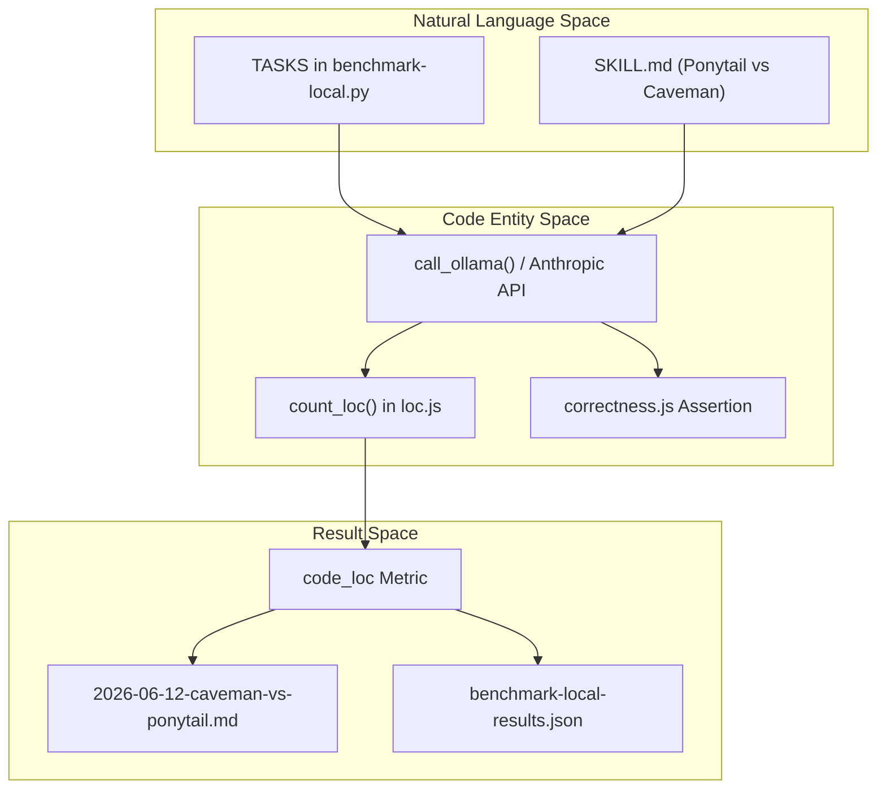
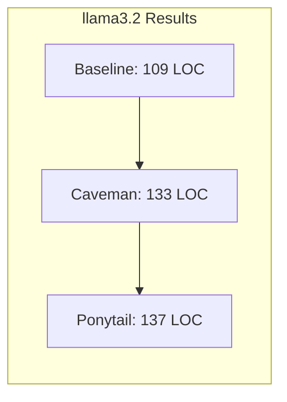
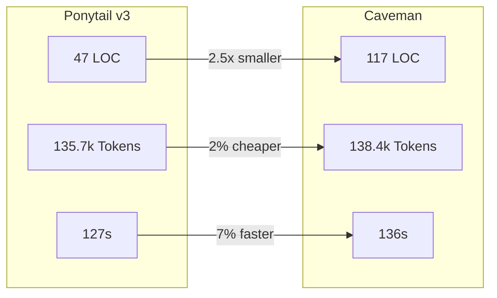

# Caveman vs Ponytail (v1–v3) Study

Relevant source files

The following files were used as context for generating this wiki page:

- [.env.example](.env.example)
- [.gitignore](.gitignore)
- [benchmarks/arms/baseline.js](benchmarks/arms/baseline.js)
- [benchmarks/arms/caveman-SKILL.md](benchmarks/arms/caveman-SKILL.md)
- [benchmarks/arms/caveman.js](benchmarks/arms/caveman.js)
- [benchmarks/arms/ponytail.js](benchmarks/arms/ponytail.js)
- [benchmarks/benchmark-local.py](benchmarks/benchmark-local.py)
- [benchmarks/loc.js](benchmarks/loc.js)
- [benchmarks/promptfooconfig.yaml](benchmarks/promptfooconfig.yaml)
- [benchmarks/prompts.json](benchmarks/prompts.json)
- [benchmarks/results/2026-06-12-caveman-vs-ponytail.md](benchmarks/results/2026-06-12-caveman-vs-ponytail.md)
- [benchmarks/results/2026-06-15-llama3.2-local.md](benchmarks/results/2026-06-15-llama3.2-local.md)
- [tests/correctness.test.js](tests/correctness.test.js)

This page documents the initial benchmark comparing the baseline agent performance against the "Caveman" skill and the iterative evolution of the Ponytail skill (v1 through v3). The study evaluates these configurations across five specific engineering tasks to measure code minimalism, token efficiency, and execution speed.

## Study Overview

The benchmark utilized a consistent methodology to ensure comparable results across different skill versions and configurations.

### Methodology
*   **Environment**: One fresh Claude Code subagent per task per configuration [benchmarks/results/2026-06-12-caveman-vs-ponytail.md:3-3]().
*   **Metrics**: Total tokens (including internal thinking), duration (wall time), and Lines of Code (LOC) from fenced blocks in the final deliverable [benchmarks/results/2026-06-12-caveman-vs-ponytail.md:3-5]().
*   **Tasks**:
    1.  `email`: Python email validation function [benchmarks/benchmark-local.py:23-23]().
    2.  `debounce`: Vanilla JavaScript search input debouncing [benchmarks/benchmark-local.py:24-24]().
    3.  `csv-sum`: Python CSV processing [benchmarks/benchmark-local.py:25-25]().
    4.  `react-countdown`: React component development [benchmarks/benchmark-local.py:26-26]().
    5.  `rate-limit`: FastAPI endpoint protection [benchmarks/benchmark-local.py:27-27]().

### Configuration (Arms)
The benchmark compares three distinct "arms":
*   **Baseline**: No specialized skills or instructions provided [benchmarks/arms/baseline.js:1-2]().
*   **Caveman**: Uses the full Caveman `SKILL.md` (MIT, by JuliusBrussee) as the system prompt [benchmarks/arms/caveman.js:4-7]().
*   **Ponytail**: Uses the repository's own `skills/ponytail/SKILL.md` as the system prompt [benchmarks/arms/ponytail.js:4-7]().

Sources: [benchmarks/benchmark-local.py:22-36](), [benchmarks/promptfooconfig.yaml:19-25]()

## Data Flow & System Mapping

The following diagram maps the benchmarking process from the natural language prompts to the specific code entities and output metrics.

**Benchmark Execution Flow**

Sources: [benchmarks/benchmark-local.py:55-78](), [benchmarks/loc.js:4-13](), [benchmarks/promptfooconfig.yaml:27-35]()

## Iterative Evolution (v1–v3)

### Ponytail v1: The Minimalism Prototype
The initial version focused heavily on reducing code output. While it succeeded in code reduction, it introduced significant "prose tax" where the agent spent saved tokens explaining why it didn't write more code.

| Task | Baseline (Tok/Time/LOC) | Caveman (Tok/Time/LOC) | Ponytail v1 (Tok/Time/LOC) |
| :--- | :--- | :--- | :--- |
| **Total** | **161,955 · 479s · ~293** | **138,410 · 136s · ~117** | **143,588 · 228s · ~53** |

**Findings (v1):**
*   **Code Minimalism**: Ponytail v1 produced 5.5x fewer lines than baseline and 2.2x fewer than Caveman [benchmarks/results/2026-06-12-caveman-vs-ponytail.md:20-20]().
*   **Deliberation Tax**: Ponytail was slower (228s vs 136s) because it "deliberated" about what not to build [benchmarks/results/2026-06-12-caveman-vs-ponytail.md:23-23]().
*   **Floor Effect**: On simple tasks like `csv-sum`, there is a ~3k token "skill-read tax" just to ingest the instructions [benchmarks/results/2026-06-12-caveman-vs-ponytail.md:24-25]().

Sources: [benchmarks/results/2026-06-12-caveman-vs-ponytail.md:9-25]()

### Ponytail v2: Anti-Deliberation
v2 introduced the "Ladder-is-a-reflex" clause and strict output caps to prevent the agent from writing long essays [benchmarks/results/2026-06-12-caveman-vs-ponytail.md:29-31]().

**Key v2 Changes:**
*   **Output Cap**: Limit to code plus ≤3 short lines of explanation [benchmarks/results/2026-06-12-caveman-vs-ponytail.md:29-30]().
*   **Ship-and-Question**: Never stall a task to ask "do you need X?"; ship the minimal version and mention the trigger for X [benchmarks/results/2026-06-12-caveman-vs-ponytail.md:31-31]().

**v2 Results:**
*   **Token Reduction**: −6,964 tokens (−4.8%) vs v1 [benchmarks/results/2026-06-12-caveman-vs-ponytail.md:40-40]().
*   **Speed Improvement**: −70s (−31%) vs v1 [benchmarks/results/2026-06-12-caveman-vs-ponytail.md:40-40]().

Sources: [benchmarks/results/2026-06-12-caveman-vs-ponytail.md:27-40]()

### Ponytail v3: Skill Compression
v3 focused on reducing the "read tax" by compressing the `SKILL.md` file itself from 115 lines to 95 lines without losing substance [benchmarks/results/2026-06-12-caveman-vs-ponytail.md:44-46]().

**Final v3 Performance vs Caveman:**
*   **Tokens**: −2,701 (−2.0%) [benchmarks/results/2026-06-12-caveman-vs-ponytail.md:55-55]().
*   **Wall Time**: −9s (−7%) [benchmarks/results/2026-06-12-caveman-vs-ponytail.md:55-55]().
*   **LOC**: 47 lines vs Caveman's 117 lines (2.5x reduction) [benchmarks/results/2026-06-12-caveman-vs-ponytail.md:61-61]().

Sources: [benchmarks/results/2026-06-12-caveman-vs-ponytail.md:42-56]()

## Local Model Variance (llama3.2)

When running the same benchmark against local models (e.g., llama3.2 3B), the results differ significantly from Claude.

**Comparison on llama3.2 (n=5, median)**

**Key Findings on Local Models:**
*   **Signal Loss**: On llama3.2, the LOC effect is inside the noise floor. Ponytail landed anywhere from 17% below baseline to 50% above it across runs [benchmarks/results/2026-06-15-llama3.2-local.md:34-39]().
*   **Instruction Following**: Smaller models (3B range) pay the instruction-following cost (slower wall time) without reliably converting it into less code [benchmarks/results/2026-06-15-llama3.2-local.md:47-50]().
*   **Correctness Guard**: The `benchmarks/correctness.js` logic (validated in `tests/correctness.test.js`) is critical here to ensure that while seeking minimalism, the agent doesn't ship broken code [tests/correctness.test.js:1-10]().

Sources: [benchmarks/results/2026-06-15-llama3.2-local.md:14-51](), [tests/correctness.test.js:16-180]()

## Final Verdict

The v3 study confirmed that the Ponytail philosophy effectively eliminates the degenerate cases found in baseline agents (e.g., a 190-line React dashboard for a simple timer) on high-reasoning models like Claude [benchmarks/results/2026-06-12-caveman-vs-ponytail.md:67-69]().

**Comparative Metrics (v3 vs Caveman on Claude)**

Sources: [benchmarks/results/2026-06-12-caveman-vs-ponytail.md:57-65]()

### Efficiency Notes
The study noted a ~3.6k token floor tax compared to the baseline on trivial tasks. This is primarily attributed to the manual reading of `SKILL.md` during the benchmark. In production environments, this tax is mitigated by automated rule injection [benchmarks/results/2026-06-12-caveman-vs-ponytail.md:69-71]().
